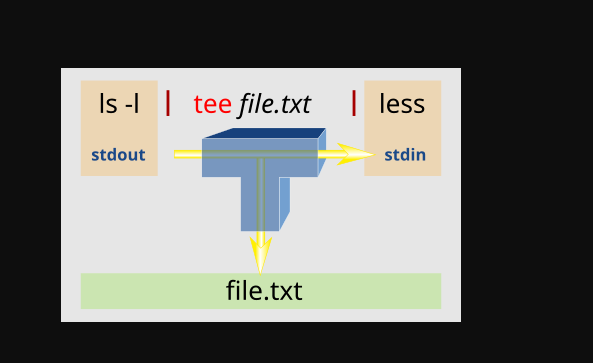

Piping part 1 - Piping Fundamental

imranshaikh@PUNELPT0516:~/Training_plan$ date
Mon Aug 18 11:13:32 AM IST 2025

imranshaikh@PUNELPT0516:~/Training_plan$ date
Mon Aug 18 11:13:32 AM IST 2025

cut command
cut < date.txt --delimiter " " --fields 1

imranshaikh@PUNELPT0516:~/Training_plan/Linux/Day_2/commands$ cut < date.txt --delimiter " " --fields 1
Mon

imranshaikh@PUNELPT0516:~/Training_plan/Linux/Day_2/commands$ date | cut  --delimiter " " --fields 1
Mon
imranshaikh@PUNELPT0516:~/Training_plan/Linux/Day_2/commands$ date | cut  --delimiter " " --fields 2
Aug
imranshaikh@PUNELPT0516:~/Training_plan/Linux/Day_2/commands$ date | cut  --delimiter " " --fields 3
18

imranshaikh@PUNELPT0516:~/Training_plan/Linux/Day_2/commands$ date | cut  --delimiter " " --fields 3 > today.txt
imranshaikh@PUNELPT0516:~/Training_plan/Linux/Day_2/commands$ cat today.txt 
18

imranshaikh@PUNELPT0516:~/Training_plan/Linux/Day_2/commands$ date | cut  > today.txt --delimiter " " --fields 1
imranshaikh@PUNELPT0516:~/Training_plan/Linux/Day_2/commands$ cat today.txt 
Mon

imranshaikh@PUNELPT0516:~/Training_plan/Linux/Day_2/commands$ date >> date.txt | cut  --delimiter " " --fields 1
imranshaikh@PUNELPT0516:~/Training_plan/Linux/Day_2/commands$ cat date.txt 
Mon Aug 18 11:14:13 AM IST 2025
Mon Aug 18 11:34:47 AM IST 2025

Piping-Part2-Tree command

date | tee fulldate.txt | cut --delimiter=" " --field=1
Mon
imranshaikh@PUNELPT0516:~/Training_plan/Linux/Day_2/commands$ cat fulldate.txt 
Mon Aug 18 11:44:44 AM IST 2025

date | tee fulldate.txt | cut --delimiter=" " --field=1 > today.t
xt
imranshaikh@PUNELPT0516:~/Training_plan/Linux/Day_2/commands$ cat today.txt 
Mon

Piping - Part3 -Xargs Command

date | xargs echo 
Mon Aug 18 11:50:11 AM IST 2025

date | xargs echo "hello"
hello Mon Aug 18 11:50:35 AM IST 2025

date | cut --delimiter=" " --field=1 | echo  (# this will not work)

date | cut --delimiter=" " --field=1 | xargs echo 
Mon

vi deleteme.txt 
imranshaikh@PUNELPT0516:~/Training_plan/Linux/Day_2/commands$ cat deleteme.txt 
fulldate.txt
today.txt
imranshaikh@PUNELPT0516:~/Training_plan/Linux/Day_2/commands$ cat deleteme.txt | rm
rm: missing operand
Try 'rm --help' for more information.

cat deleteme.txt | xargs rm

Aliases

summary

Assignment
task 1
ls -l /etc/ > /home/imranshaikh/Training_plan/Linux/Day_2/commands/file1.txt
ls -l /run/ > /home/imranshaikh/Training_plan/Linux/Day_2/commands/file2.txt
cat file1.txt file2.txt | tee unsorted.txt | sort -r > reversed.txt

Task 1

ls /etc > file1.txt 

ls /run > file2.txt 

Task 2

cat file1.txt file2.txt | tee unsorted.txt | sort -r > reversed.txt 

How long it Took You to Complete The Assignment in Minutes (estimate)

Are you racing me, or what? ;)

+++++++++++++++++++++++++++++++++++++++++++++++++++++++++++++++++++++++++++++++++++++++++++++++++++++_________________________________________________________________________________________
Section 4 Mastery Level 3: Mastering Linux File system

Navigation the file system Part-1
pwd
ls
man ls
ls -F > list.txt
ls -l (long Form format full detail)
ls -lh
cd

Navigation the file system Part-2
cd
ls -a

Navigation the file system Part-3
cd /
. and ..
absolute path relatie path

tab auto completion

File Extensions in Linux

file image-1.png 
image-1.png: PNG image data, 963 x 363, 8-bit/color RGBA, non-interlaced

Wild-Cards
* ? []
*
ls *
ls *.txt
ls ?.txt

ls file[01234567890].txt
ls file*.txt 
ls file?.txt we can use this
ls file[0-9].txt
ls file[a-z].txt
ls file[0-9][A-Z][a-z].txt

Creating Files and Folder Part -1

touch file1.txt
echo "hello" > file1.txt

mkdir folder
mkdir ~/picture/folder
mkdir -p abc/folder/one

Creating Files and Folder Part -2

mkdir {jan,feb,march,april,may,june,july,august,sept,nov,dec}_{2017,2018,2019,2020,2021,2022}
mkdir {jan,feb,march,april,may,june,july,august,sept,nov,dec}_{2017..2022}

touch {jan,feb,march,april,may,june,july,august,sept,nov,dec}_{2017..2022}/file1{1..50}
ls {jan,feb,march,april,may,june,july,august,sept,nov,dec}_{2017..2022}/file1{1..50}

touch file{A..D}.txt
touch file{A,B,C,D}.txt

Deleteing FIles and FOlders Part 1

rm DOcuments/Deleteme
rm file1.txt Documents/file2.txt Downloads/file3.txt

rm file*
rm *2*

rm *.jpg
rm *.txt

rm *[2,3]*

Deleteing FIles and FOlders Part 2

rm -r delfolder/

mkdir -p delfolder/deleteme{1,2,3}
rm delfolder
rm: cannot remove 'delfolder/': Is a directory
rm -r delfolder/

mkdir -p delfolder/deleteme{1,2,3}
touch delfolder/deletme{1,2,3}/file{1,2,3}
rm -r delfolder/

rm -ri * delfolder

mkdir -p delfolder/folder{1..3}
touch delfolder/folder{1,2}/file{1..10}
rmdir delfolder/*
rmdir: failed to remove 'delfolder/deleteme1': Directory not empty
rmdir: failed to remove 'delfolder/deleteme2': Directory not empty
rmdir: failed to remove 'delfolder/deleteme3': Directory not empty
rmdir: failed to remove 'delfolder/folder1': Directory not empty
rmdir: failed to remove 'delfolder/folder2': Directory not empty

Copying Files and Folders

echo "Hello Everyone you hey you" > filea.txt
cp filea.txt /home/imranshaikh/Training_plan/Linux/Day_2/
cp filea.txt fileb.txt
cp filea.txt fileb.txt filec.txt destination/

rm file*
cp destination/* . 
ls -a

recusrsvely copy files which are inside folder
cp -r 

Moving + Renaming files and Folders
using commandline

mv oldname of the file to rename as a new file
mv filea.txt filed.txt
mv oldfolder/ newfolder

mv newfolder/* .
mv file* newfolder/
mv newfolder/ ~/Documents/
mv ~Documents/newfolder/ ./jackpot

Editing Files using Nano - Part1

nano diary.txt

cat diary.txt 
Hello !! My name is Imran

how are you doing??

The Locate command - Part 1

locate *.conf (Linux seraches case sensitive)
locate *.CONF (dosent gives any result)

locate -i --limit 3 *.conf
/etc/adduser.conf
/etc/apg.conf
/etc/appstream.conf

locate -i --limit 10 *.conf
/etc/adduser.conf
/etc/apg.conf
/etc/appstream.conf
/etc/brltty.conf
/etc/ca-certificates.conf
/etc/debconf.conf
/etc/deluser.conf
/etc/e2scrub.conf
/etc/fprintd.conf

locate --follow *.conf