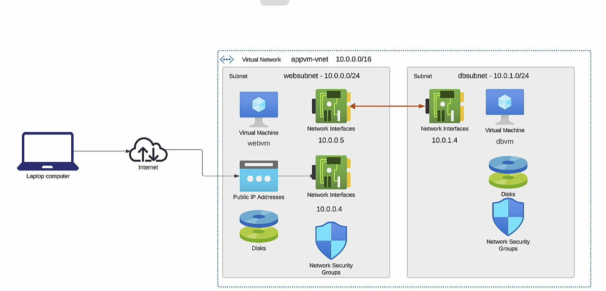
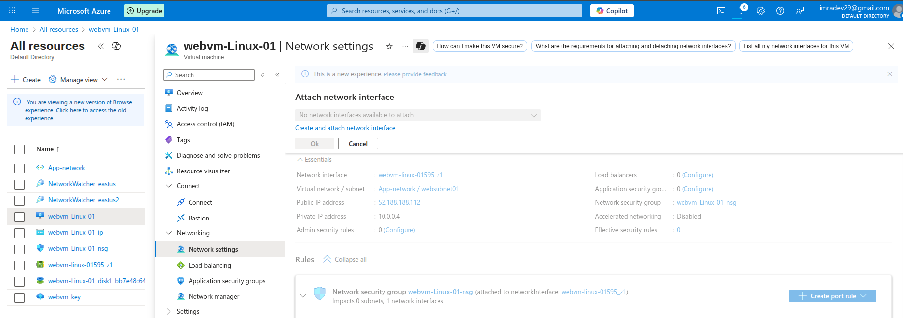
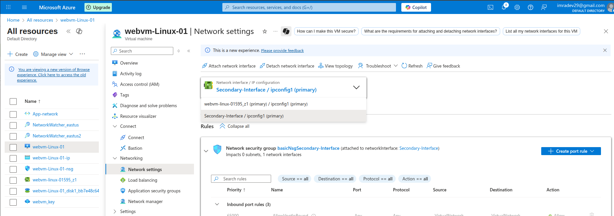

### Adding 2ndary n/w interface

1st One netwrok interface for having or accepting traffic from the Inetrnet
2nd the other interface forwarding traffic to the machine in the network

To Attach an Network Interface to the runnning VM it is not possible it shoulb b ein stop state then we can attach an network Interface to the VM

Secondary Network Interface Attached to VM
