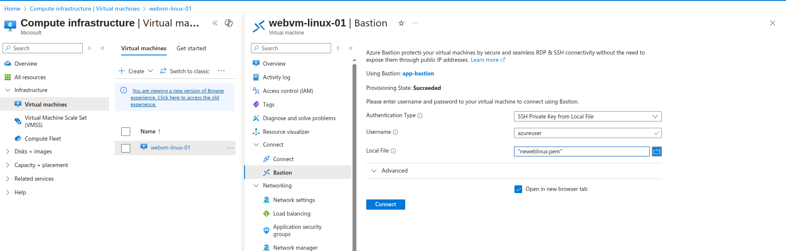

# Azure Bastion - Secure VM Access

## What is Azure Bastion?
Azure Bastion is a fully managed PaaS service that provides secure and seamless RDP/SSH connectivity to virtual machines directly through the Azure portal over TLS.

## Key Benefits
- **No Public IP needed** on VMs
- **No VPN or ExpressRoute** required
- **Browser-based access** through Azure Portal
- **Secure connectivity** over TLS (port 443)
- **No agent installation** required

---

## Lab Setup

### Current Environment
- **Resource Group**: Azure_RG
- **Region**: East US
- **VNet**: App-network (10.0.0.0/16)
- **Existing VMs**: webvm-Linux-01

---

## Step 1: Create Bastion Subnet

### Subnet Requirements
Azure Bastion requires a dedicated subnet named **AzureBastionSubnet**

1. Navigate to App-network → Subnets
2. Click "Add subnet"
3. **Configuration**:
   - **Name**: `AzureBastionSubnet` (exact name required)
   - **Address Range**: `10.0.2.0/26` (minimum /26 required)


---

## Step 2: Create Azure Bastion Host

### Bastion Host Creation
1. Navigate to Azure Portal → Search "Bastion"
2. Click "Create"
3. **Basic Configuration**:
   - **Name**: `app-bastion`
   - **Region**: `East US`
   - **Tier**: `Basic`
   - **Virtual Network**: `App-network`
   - **Subnet**: `AzureBastionSubnet`


---

## Step 3: Connect via Azure Bastion

1. Before that need to Disacociate Public-ip of Vm webvm-linux-01


### SSH Connection to Linux VM
1. Navigate to webvm-Linux-01
2. Click "Connect" → "Bastion"
3. **Authentication**:
   - **Username**: `azureuser`
   - **Authentication Type**: SSH Private Key or Password Local



### Successful Connection


---

## Architecture Overview

### Network Diagram
```
App-network (10.0.0.0/16)
├── web-subnet (10.0.0.0/24)
│   └── webvm-Linux-01 (Private IP only)
├── AzureBastionSubnet (10.0.2.0/26)
│   └── Azure Bastion Host
```

## Security Benefits
- ✅ No Public IP exposure on VMs
- ✅ Centralized access control
- ✅ All connections logged
- ✅ Browser-based secure access

**Lab Status**: ✅ **COMPLETED** - Azure Bastion secure access implemented