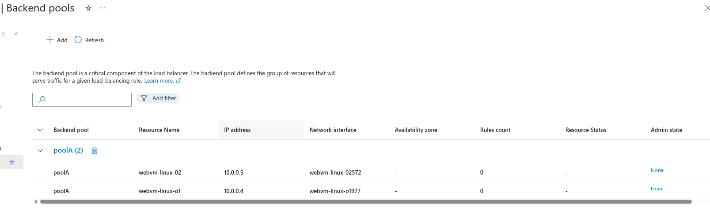

# Azure Load Balancer with Availability Set

## What is Azure Load Balancer?
Azure Load Balancer distributes incoming network traffic across multiple virtual machines to ensure high availability and reliability.

## Types of Load Balancers

### 1. Public Load Balancer
- **Purpose**: Routes internet traffic to VMs
- **Frontend**: Public IP address
- **Use Case**: Web applications, public services
- **Example**: Internet → Load Balancer → Backend VMs

### 2. Internal Load Balancer
- **Purpose**: Routes traffic within VNet
- **Frontend**: Private IP address
- **Use Case**: Multi-tier applications, database clusters
- **Example**: Web Tier → Internal LB → App Tier

## Load Balancer SKUs

### Basic SKU
- **Features**: Basic load balancing
- **SLA**: No SLA
- **Availability Zones**: Not supported
- **Health Probes**: HTTP, TCP
- **Cost**: Free

### Standard SKU
- **Features**: Advanced load balancing
- **SLA**: 99.99% availability
- **Availability Zones**: Supported
- **Health Probes**: HTTP, HTTPS, TCP
- **Cost**: Pay per rule and data processed

## Key Components

### Frontend IP Configuration
- **Public LB**: Public IP address
- **Internal LB**: Private IP from subnet
- **Multiple IPs**: Support for multiple frontend IPs

### Backend Pool
- **VMs**: Collection of virtual machines
- **NICs**: Network interfaces of VMs
- **IP Configurations**: Specific IP configs

### Health Probes
- **Purpose**: Monitor backend VM health
- **Protocols**: HTTP, HTTPS, TCP
- **Frequency**: Configurable intervals
- **Thresholds**: Healthy/unhealthy thresholds

### Load Balancing Rules
- **Port Mapping**: Frontend port → Backend port
- **Protocol**: TCP or UDP
- **Distribution**: Hash-based or source IP affinity
- **Session Persistence**: None, Client IP, Client IP and Protocol

## Distribution Methods

### 1. Hash-based (5-tuple)
- **Default**: Source IP, Source Port, Destination IP, Destination Port, Protocol
- **Behavior**: Even distribution across backends
- **Use Case**: Stateless applications

### 2. Source IP Affinity (2-tuple)
- **Sticky Sessions**: Same client → Same backend
- **Hash**: Source IP + Destination IP
- **Use Case**: Applications requiring session persistence

### 3. Source IP and Protocol (3-tuple)
- **Hash**: Source IP + Destination IP + Protocol
- **Balance**: Between distribution and affinity
- **Use Case**: Mixed workloads

## Important Key Points

### ✅ **High Availability**
- **SLA**: Up to 99.99% with Standard SKU
- **Fault Tolerance**: Automatic failover to healthy VMs
- **Health Monitoring**: Continuous health probe monitoring

### ✅ **Scalability**
- **Backend Pool**: Add/remove VMs dynamically
- **Auto-scaling**: Integrate with VM Scale Sets
- **Performance**: Handle millions of flows

### ✅ **Security**
- **NSG Integration**: Works with Network Security Groups
- **Private Access**: Internal load balancer for private traffic
- **DDoS Protection**: Built-in DDoS protection

### ✅ **Monitoring**
- **Metrics**: Health probe status, data path availability
- **Logs**: Diagnostic logs for troubleshooting
- **Alerts**: Proactive monitoring and alerting

### ⚠️ **Limitations**
- **Layer 4**: Operates at transport layer (TCP/UDP)
- **No SSL Termination**: Cannot terminate SSL/TLS
- **No Content-based Routing**: Cannot route based on URL/headers
- **Regional**: Cannot load balance across regions

---

## Lab Infrastructure Setup
```
app-network (10.0.0.0/16)
├── websubnet (10.0.0.0/24)
│   ├── webvm-linux-01 (10.0.0.4) [Availability Set: app-set]
│   └── webvm-linux-02 (10.0.0.5) [Availability Set: app-set]
```

## Lab Goal
Create load balancer with Availability Set for 99.95% SLA

---

## Step 1: Create Availability Set

### Configuration:
- **Name**: `app-set`
- **Resource Group**: `app-grp`
- **Region**: `East US`


---

## Step 2: Create VMs in Availability Set

### webvm-linux-01:
- **Availability Set**: `app-set`
- **Subnet**: `websubnet (10.0.0.0/24)`
- **Image**: `Ubuntu Server 20.04 LTS`


### webvm-linux-02:
- **Availability Set**: `app-set`
- **Subnet**: `websubnet (10.0.0.0/24)`
- **Image**: `Ubuntu Server 20.04 LTS`


---

## Step 3: Install Nginx

### On webvm-linux-01:
```bash
sudo apt update && sudo apt install nginx -y
sudo systemctl start nginx && sudo systemctl enable nginx
echo "<h1>Web Server 1 - webvm-linux-01</h1><p>Availability Set: app-set</p>" | sudo tee /var/www/html/index.html
```


### On webvm-linux-02:
```bash
sudo apt update && sudo apt install nginx -y
sudo systemctl start nginx && sudo systemctl enable nginx
echo "<h1>Web Server 2 - webvm-linux-02</h1><p>Availability Set: app-set</p>" | sudo tee /var/www/html/index.html
```


---

## Step 4: Create Load Balancer

### Configuration:
- **Name**: `app-balancer`
- **Type**: `Public`
- **SKU**: `Standard`
- **Frontend IP**: Create new public IP

---

## Step 5: Configure Backend Pool

### Backend Pool:
- **Name**: `poolA`
- **VMs**: webvm-linux-01, webvm-linux-02
- **Disaciated both VM's public ip**



---

## Step 6: Health Probe

### Configuration:
- **Name**: `probeA`
- **Protocol**: `HTTP`
- **Port**: `80`
- **Path**: `/`


---

## Step 7: Load Balancing Rule

### Configuration:
- **Name**: `balancer-rule`
- **Port**: `80`
- **Backend Pool**: `poolA`
- **Health Probe**: `probeA`


---

## Step 8: Configure Network Security Group

### Create and Configure app-nsg
1. Navigate to Network Security Groups → Create
2. **Configuration**:
   - **Name**: `app-nsg`
   - **Resource Group**: `Azure_RG`
   - **Region**: `East US`

### Add Inbound Security Rules
3. Navigate to app-nsg → Inbound security rules
4. **SSH Rule**:
   - **Name**: `Allow-SSH-MyIP`
   - **Priority**: `100`
   - **Source**: `IP Addresses`
   - **Source IP**: `YOUR_PUBLIC_IP/32`
   - **Destination**: `IP Addresses`
   - **Destination IPs**: `10.0.0.4,10.0.0.5`
   - **Service**: `SSH (22)`
   - **Action**: `Allow`

5. **HTTP Rule**:
   - **Name**: `Allow-HTTP-Any`
   - **Priority**: `110`
   - **Source**: `Any`
   - **Destination**: `IP Addresses`
   - **Destination IPs**: `10.0.0.4,10.0.0.5`
   - **Service**: `HTTP (80)`
   - **Action**: `Allow`

### Associate NSG with Subnet
6. Navigate to app-nsg → Subnets
7. Click "Associate"
8. **Configuration**:
   - **Virtual Network**: `app-network`
   - **Subnet**: `websubnet`

---

## Step 9: Test Load Balancing

### Test Commands:
```bash
curl http://68.220.10.45/
# Should alternate between:
# "Web Server 1 - webvm-linux-01"
# "Web Server 2 - webvm-linux-02"
```


---

## Step 10: Test High Availability

### Fault Tolerance Test:
1. Stop webvm-linux-01
2. All traffic routes to webvm-linux-02
3. Start webvm-linux-01, stop webvm-linux-02
4. All traffic routes to webvm-linux-01


---

## Availability Set Benefits

### SLA Comparison:
- **Single VM**: 99.9% SLA
- **Availability Set**: 99.95% SLA
- **Availability Zones**: 99.99% SLA

### Protection:
- **Fault Domains**: Different physical hardware
- **Update Domains**: Staggered maintenance windows

---

## Lab Results

### Successfully Demonstrated:
- ✅ **Availability Set**: Created with 2 fault domains
- ✅ **Load Balancer**: Distributed traffic evenly
- ✅ **High Availability**: Automatic failover working
- ✅ **Health Monitoring**: Probes detecting failures
- ✅ **99.95% SLA**: Achieved with proper configuration

**Lab Status**: ✅ **COMPLETED** - Load Balancer with Availability Set implemented