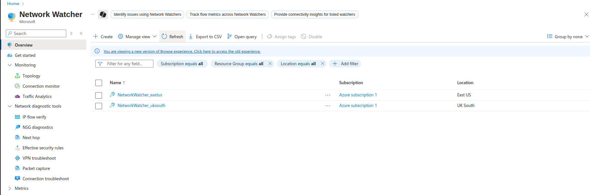
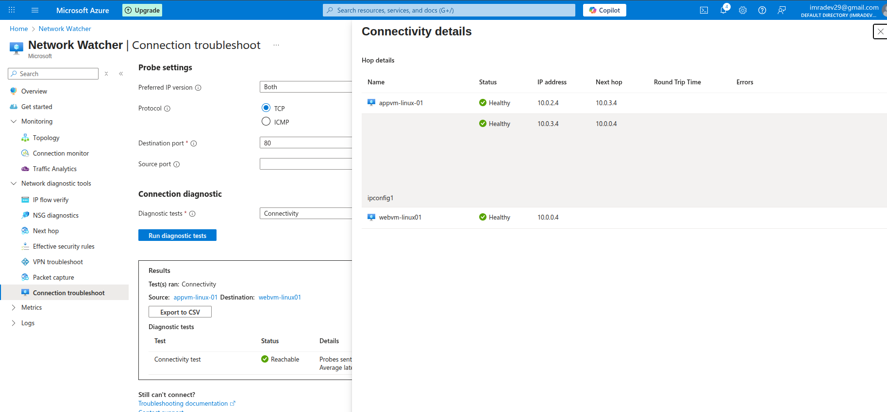
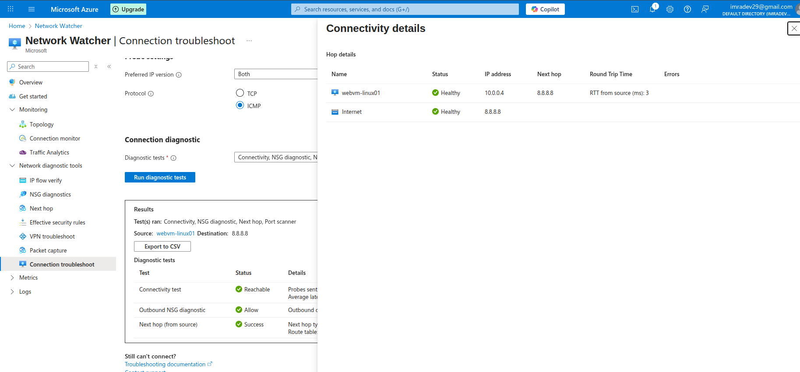
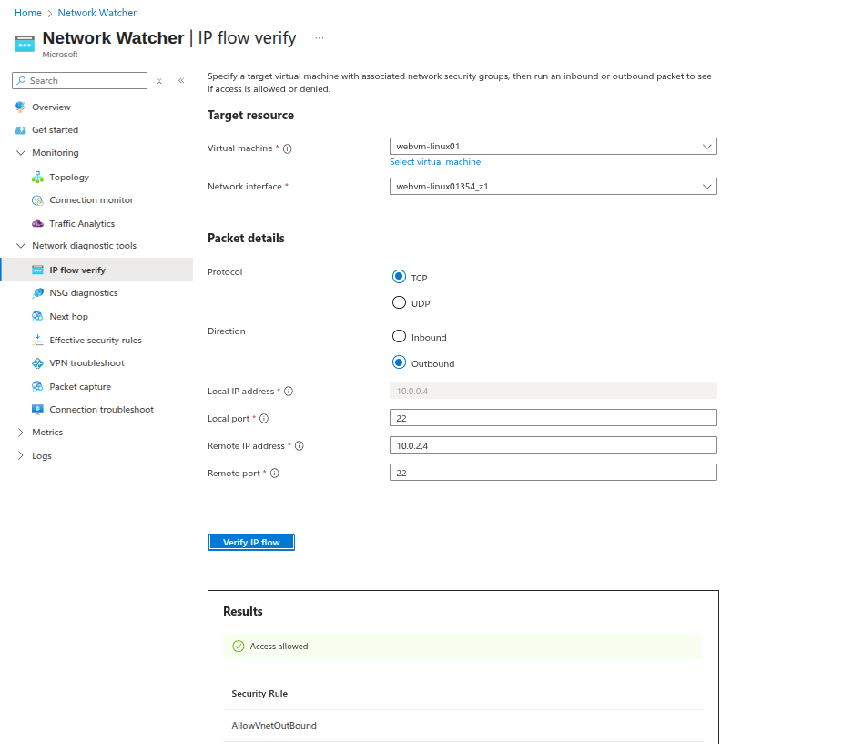
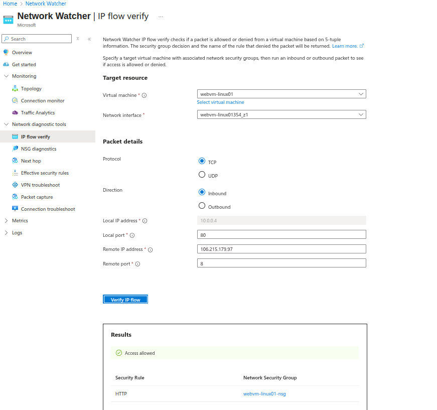
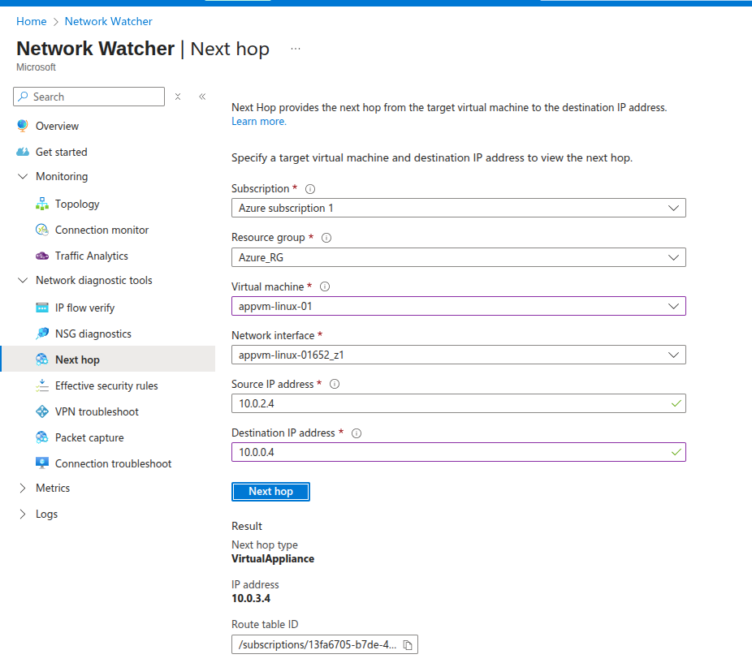
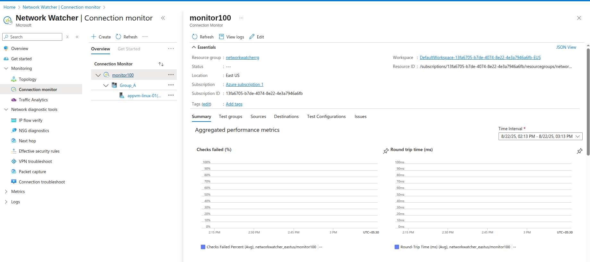
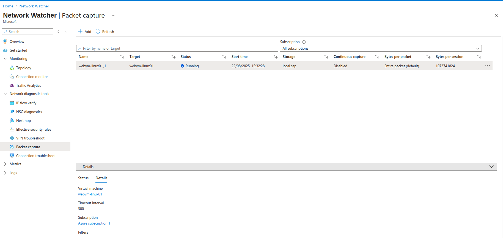
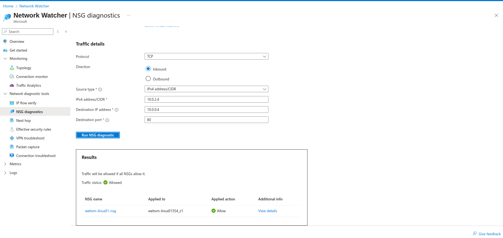
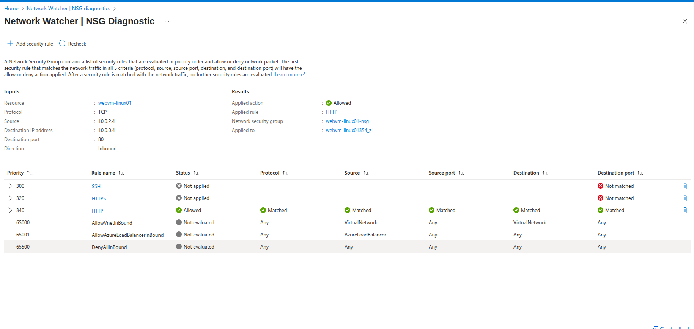

# Network Watcher - Connection Troubleshoot

## What is Network Watcher?
Network Watcher provides tools to monitor, diagnose, and gain insights into your Azure network. Connection Troubleshoot helps diagnose connectivity issues between Azure resources.

## Key Features
- **Connection Troubleshoot**: Test connectivity between VMs
- **IP Flow Verify**: Check if traffic is allowed/denied
- **Next Hop**: Show routing path for traffic
- **Security Group View**: View effective NSG rules
- **Packet Capture**: Capture network traffic

---

## Lab Environment

### Current Setup
```
app-network (10.0.0.0/16)
├── websubnet01 (10.0.0.0/24) → webvm-linux-01 (10.0.0.4)
├── AzureBastionSubnet (10.0.1.0/26) → Azure Bastion
├── appsubnet (10.0.2.0/24) → appvm-linux-01 (10.0.2.4)
└── centralsubnet01 (10.0.3.0/24) → centralisedvm-linux-01 (10.0.3.4)
```

---

## Step 1: Enable Network Watcher

### Check Network Watcher Status
1. Navigate to Azure Portal → Network Watcher
2. Verify Network Watcher is enabled for East US region
3. If not enabled, click "Enable Network Watcher"



---

## Step 2: Connection Troubleshoot - VM to VM

### Test 1: app to webvm (Should Work)
1. Navigate to Network Watcher → Connection troubleshoot
2. **Source Configuration**:
   - **Resource Type**: Virtual machine
   - **Virtual Machine**: appvm-linux-01
   - **Source Port**: 22
3. **Destination Configuration**:
   - **Resource Type**: Virtual machine
   - **Virtual Machine**: webvm-linux-01
   - **Destination Port**: 80
4. Click "Check"



### Result Analysis
- **Status**: Reachable/Unreachable
- **Latency**: Connection time in ms
- **Hops**: Network path taken
- **Issues**: Any blocking rules or routing problems


---

## Step 3: Connection Troubleshoot - VM to Internet

### Test 2: webvm to Internet (Should Work)
1. **Source Configuration**:
   - **Virtual Machine**: webvm-linux-01
   - **Source Port**: 80
2. **Destination Configuration**:
   - **Resource Type**: Specify manually
   - **URI or IP**: 8.8.8.8
   - **Destination Port**: 53
3. Click "Check"



---


## Step 4: IP Flow Verify

### Verify Traffic Flow
1. Navigate to Network Watcher → IP flow verify
2. **Configuration**:
   - **Virtual Machine**: webvm-linux-01
   - **Network Interface**: webvm-linux-01-nic
   - **Direction**: Outbound
   - **Protocol**: TCP
   - **Local IP**: 10.0.0.4
   - **Local Port**: 22
   - **Remote IP**: 10.0.2.4
   - **Remote Port**: 22
3. Click "Check"



## OR

### Verify Traffic Flow
1. Navigate to Network Watcher → IP flow verify
2. **Configuration**:
   - **Virtual Machine**: webvm-linux-01
   - **Network Interface**: webvm-linux-01-nic
   - **Direction**: Inbound
   - **Protocol**: TCP
   - **Local IP**: 10.0.0.4
   - **Local Port**: 80
   - **Remote IP**: 106.215.179.97
   - **Remote Port**: *
3. Click "Check"



### Results
- **Access**: Allowed/Denied
- **Rule Name**: Which NSG rule applied
- **Priority**: Rule priority number

---

## Step 5: Next Hop Analysis

### Check Routing Path
#### Request are reaching the destination via intended path
1. Navigate to Network Watcher → Next hop
2. **Configuration**:
   - **Virtual Machine**: appvm-linux-01
   - **Network Interface**: appvm-linux-01-nic
   - **Source IP**: 10.0.2.4
   - **Destination IP**: 10.0.0.4
3. Click "Check"



### Results
- **Next Hop Type**: VnetLocal, Internet, VirtualAppliance, etc.
- **Next Hop IP**: IP address of next hop
- **Route Table**: Which route table applied

### Connection Monitor

---


## Packet Capture (Advanced)

### Capture Network Traffic
1. Navigate to Network Watcher → Packet capture
2. **Configuration**:
   - **Virtual Machine**: webvm-linux-01
   - **Capture Name**: webvm-capture-01
   - **Storage Account**: Select storage account/local file storage
   - **Time Limit**: 300 seconds
   - **Bytes per Packet**: 0 (unlimited)
   - **Bytes per Session**: 1073741824 (1GB)



### Analyze Captured Traffic
1. Download capture file (.cap)
2. Open in Wireshark for detailed analysis
3. Filter by protocols, IPs, ports


### Network Watcher - NSG Diagnostic
It helps to understand if traffic is being allowed or denied based on Networking Security Groups. It also gives details on the evaluation of rules.
1. Navigate to Network Watcher → NSG Diagnostic tools
2. **Source Configuration**:
   - **Resource Type**: Virtual machine
   - **Virtual Machine**: webvm-linux-01
   - **Traffic Details**:
       **Protocol**: TCP
       **Direction**: Inbound
       **Source Type**: IPV4 address
       **IPv4 address/CIDR**: appvm-linux-01 (Private IP) 10.0.2.4
       **Destination IP addres**: webvm-linux-01 (Private Ip) 10.0.0.4

4. Click "Check"





---

## Network Watcher Pricing

### Cost Considerations
- **Connection Troubleshoot**: ~$0.50 per check
- **IP Flow Verify**: ~$0.50 per check
- **Next Hop**: ~$0.50 per check
- **Packet Capture**: Storage costs for captured data
- **Security Group View**: Free

---

## Best Practices

### 1. Systematic Troubleshooting
- Start with Connection Troubleshoot
- Use IP Flow Verify for specific traffic
- Check Next Hop for routing issues
- Use Packet Capture for complex issues

### 2. Documentation
- Document test results
- Save troubleshooting steps
- Create runbooks for common issues

### 3. Proactive Monitoring
- Set up regular connectivity tests
- Monitor critical paths
- Alert on connectivity failures

---


### Key Learning Points:
1. **Systematic Approach**: Use multiple tools for complete diagnosis
2. **Layer Analysis**: Check routing, security, and connectivity separately
3. **Bidirectional Testing**: Test both directions of communication
4. **Documentation**: Record findings for future reference

**Lab Status**: ✅ **COMPLETED** - Network Watcher troubleshooting tools mastered