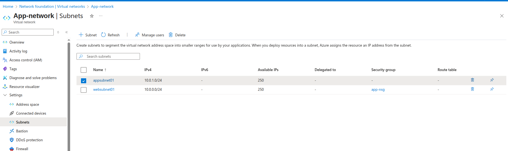
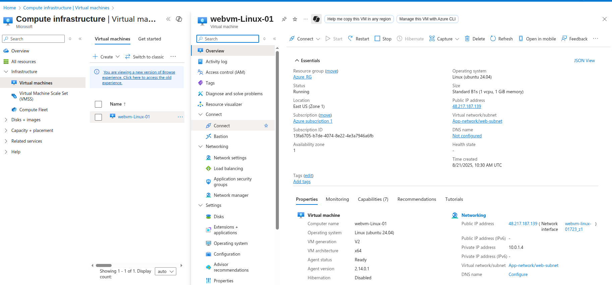
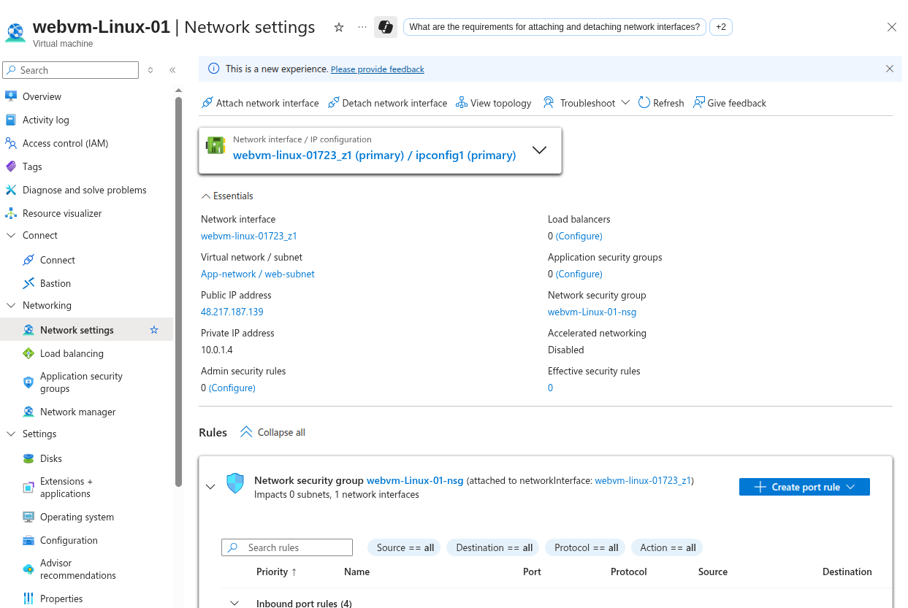
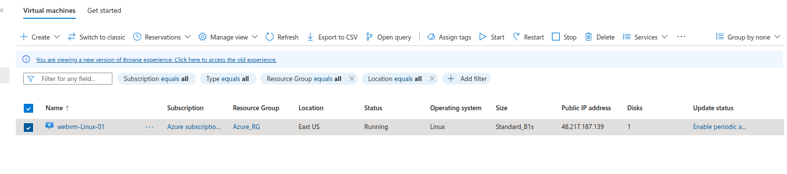
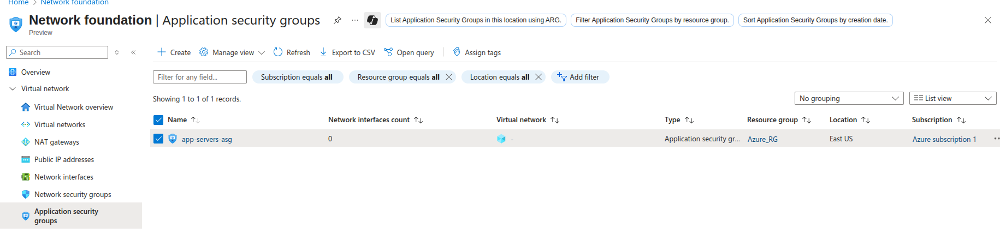
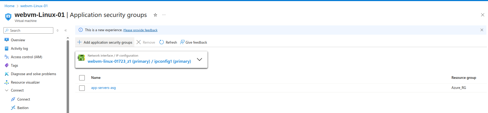
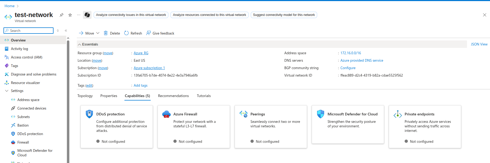
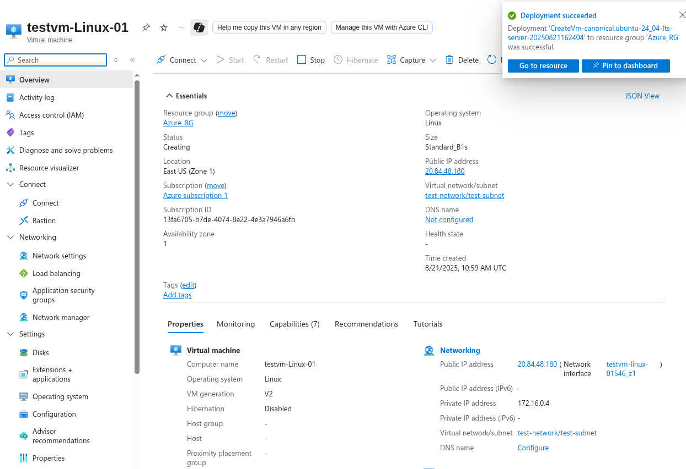

# ASG Cross-Network Lab - Built From Scratch

## Lab Objective
Create complete infrastructure from scratch to test Application Security Group functionality across different networks.

---

## Infrastructure Built

### Step 1: Virtual Network Creation
**Created**: App-network
- **Region**: East US
- **Address Space**: 10.0.0.0/16
- **Subnet**: web-subnet (10.0.1.0/24)

### Step 2: Virtual Machine Deployment
**Created**: webvm-Linux-01
- **Region**: East US (Zone 1)
- **Image**: Linux (Ubuntu 24.04)
- **Size**: Standard B1s (1 vCPU, 1 GiB memory)
- **Network**: App-network/web-subnet
- **Public IP**: 48.217.187.139

**Network Configuration**:

**VM Deployment Complete**:

---

## Step 3: Application Security Group Setup

### Creating ASG
**Created**: web-servers-asg
- **Region**: East US
- **Purpose**: Group web tier VMs

### Attaching ASG to VM
1. Navigate to webvm-Linux-01 → Networking
2. Click Network Interface
3. Go to Application Security Groups
4. Associate with web-servers-asg

**ASG Association Complete**:

---

## Step 4: Create Second Network for Cross-Network Testing

### New VNet Creation
**Creating**: test-network
- **Region**: East US (same region)
- **Address Space**: 172.16.0.0/16
- **Subnet**: test-subnet (172.16.0.0/24)

### Second VM Creation
**Creating**: testvm-Linux-01
- **Region**: East US
- **Network**: test-network/test-subnet
- **Image**: Ubuntu 24.04
- **Size**: Standard B1s

---

## Not Possible due to its created in another network
