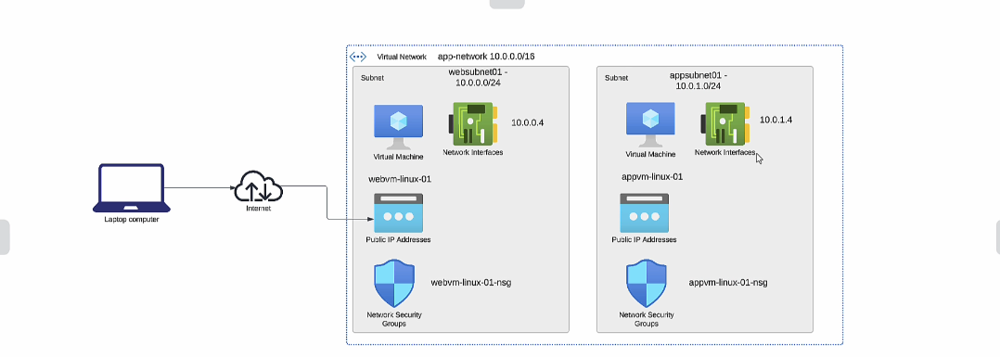
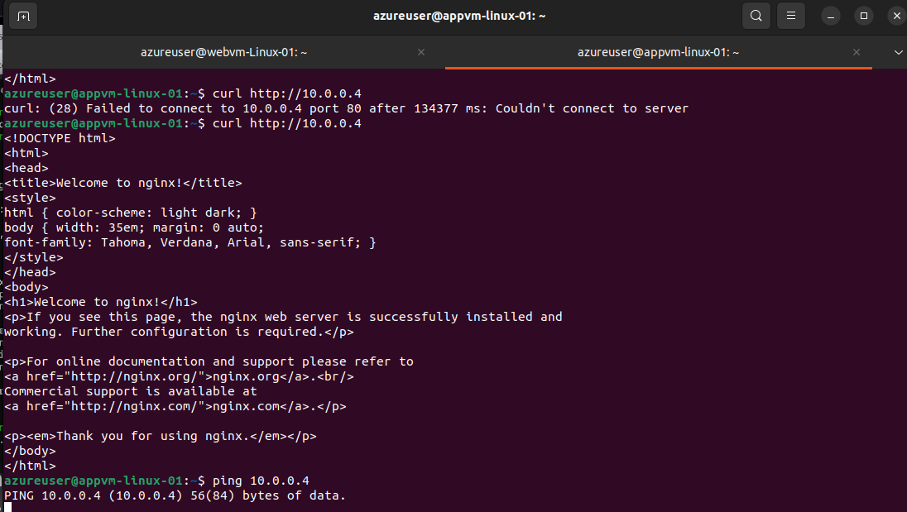

# Network Security Group

* This is used to filter Network Traffic between Azure Resources in and Azure Virtual Network
* Filter Inbound (Incoming) and Outbound (outgoing) traffic to Allow or Deny

#### Default Security Group Rules

#### Added Custom as well as http service in the inbound rule and tested

* After Adding Service as HTTP it was able to reache

* After Adding the custom rule it was not able to reached due to high priority which was set at 200

#### Addind My Ip address and Private Ip to test the SG rule

### Network Sg - Access to other Machines
* Deploying new Subnet - appsubnet01
* Deploying new VM(appvm-linux-01) -on the new Subnet

* webvm-linux-01 Sg
  
* appvm-linux-01 sg 
 

* Made changes to Webvm-linux-01 Sg and tested the connections.
* Below is the terminal of appvn-linux-01
    

### To Allow ping request ICMP

* Tested Before applying changes to N/W rule

* After applying changes to the rule.

#### Also we can add one NSG to mutiple VM's
 * we can associate this to Network Interface or either Subnet 
