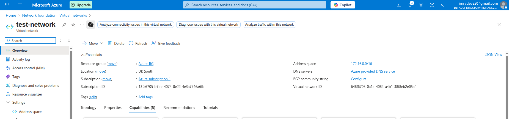
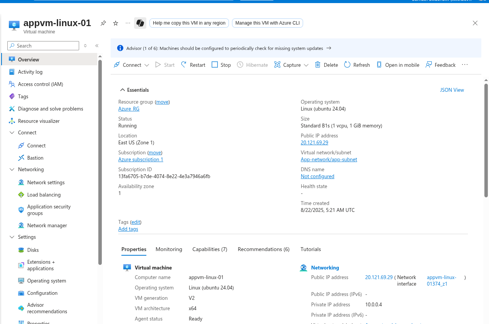
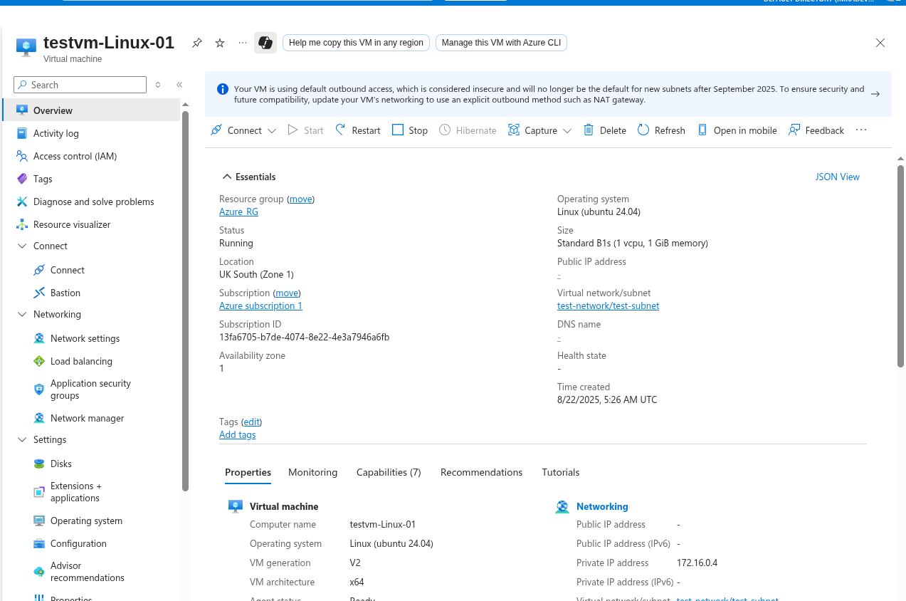
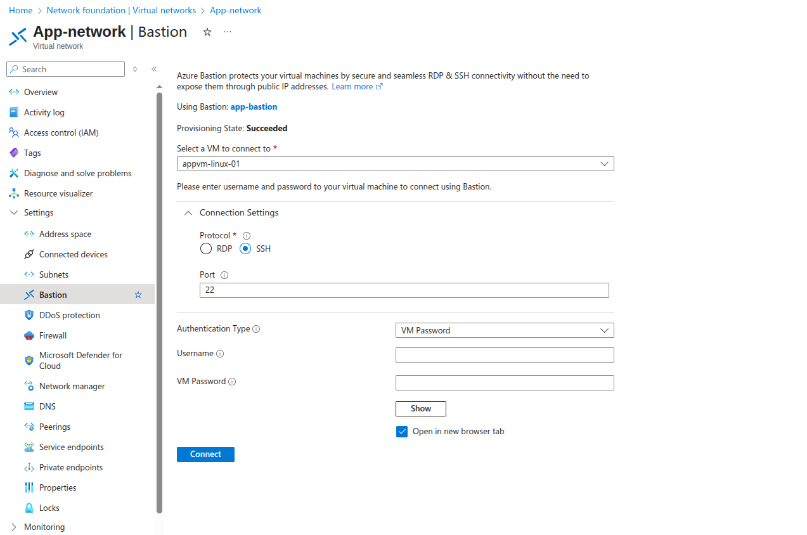
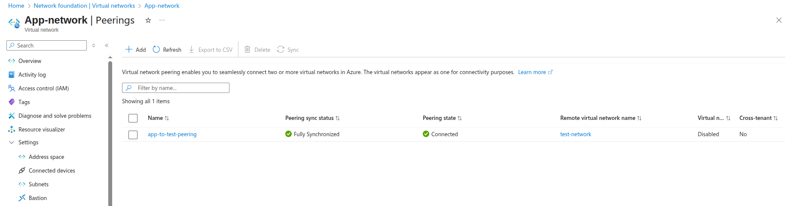
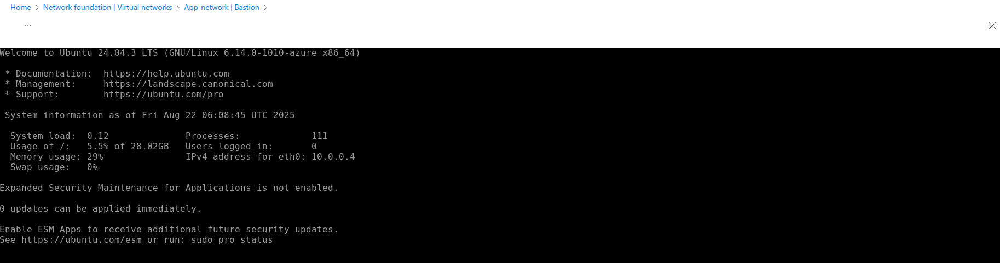
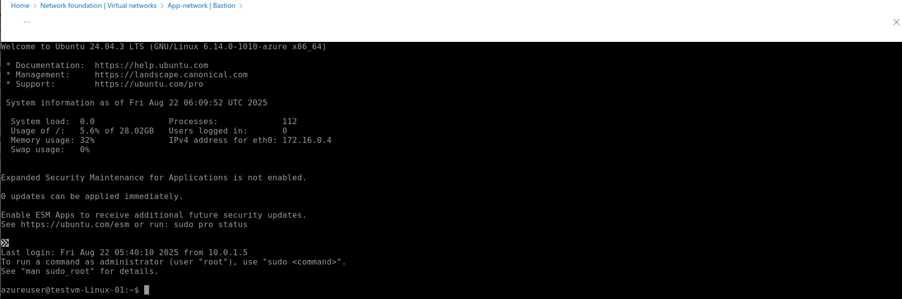

# Cross-Region Azure Bastion Assignment

## Assignment Question
**"Can you use the Azure Bastion service in East US to connect to virtual machines in the UK South location?"**

## Actual Result
✅ **YES** - Azure Bastion CAN connect to VMs in different regions when Global VNet Peering is configured!

---

## Lab Infrastructure Created

### Network 1: app-network (East US)
- **Location**: East US
- **Address Space**: 10.0.0.0/16
- **Subnets**:
  - **app-subnet**: 10.0.0.0/24
  - **AzureBastionSubnet**: 10.0.1.0/26

### Network 2: test-network (UK South)
- **Location**: UK South
- **Address Space**: 172.16.0.0/16
- **Subnets**:
  - **test-subnet**: 172.16.0.0/24

### Virtual Machines
- **appvm-linux-01** (East US)
  - **Network**: app-network/app-subnet
  - **Private IP**: 10.0.0.4
  - **Public IP**: 20.121.69.29
  
- **testvm-launch-01** (UK South)
  - **Network**: test-network/test-subnet
  - **Private IP**: 172.16.0.4
  - **Public IP**: ❌ Disabled

### Azure Bastion
- **Location**: East US (in app-network)
- **Subnet**: AzureBastionSubnet (10.0.1.0/26)

### VNet Peering
- **Peering Name**: app-to-test-peering
- **Type**: Global VNet Peering (Cross-region)
- **Status**: Connected

---

## Step 1: Infrastructure Setup

### Created app-network (East US)


### Created test-network (UK South)


### Deployed appvm-linux-01 (East US)


### Deployed testvm-launch-01 (UK South - No Public IP)


---

## Step 2: Azure Bastion Deployment

### Created Azure Bastion in app-network (East US)


---

## Step 3: Global VNet Peering Setup

### Created Cross-Region Peering
- **Peering Name**: app-to-test-peering
- **Remote VNet**: test-network (UK South)



---

## Step 4: Testing Cross-Region Bastion Access

### Test 1: Same Region VM ✅
- appvm-linux-01 (East US) → Bastion works



### Test 2: Cross-Region VM ✅
- testvm-launch-01 (UK South) → Bastion connection SUCCESSFUL!



---

## Assignment Results

### What Works ✅
- Same Region: Bastion → appvm-linux-01
- Global VNet Peering: East US ↔ UK South
- Cross-Region Connectivity: VM to VM communication

### What Actually Works ✅
- Cross-Region Bastion: CAN use East US Bastion for UK South VM
- Global VNet Peering: Enables Bastion to reach cross-region VMs
- Bastion Scope: Works across regions when VNets are peered

---

## Technical Explanation

### Why Cross-Region Bastion Works
1. **Global VNet Peering**: Creates network connectivity across regions
2. **Bastion Routing**: Can route through peered VNets
3. **Azure Architecture**: Supports cross-region access via peering

### Architecture
```
East US Region                    UK South Region
├── app-network                   ├── test-network
│   ├── Azure Bastion ✅          │   └── testvm-launch-01 ❌
│   └── appvm-linux-01 ✅         └── No Bastion access
```

---

## Alternative Solutions

### Solution 1: Deploy Bastion in Each Region
- Create separate Bastion in UK South
- Cost: ~$87/month per Bastion

### Solution 2: Use Public IP + NSG
- Add public IP to testvm-launch-01
- Configure restrictive NSG rules

### Solution 3: VPN Gateway
- Deploy VPN Gateway for secure access
- Connect via site-to-site VPN

---

## Assignment Conclusion

### Answer: ✅ **YES**
Azure Bastion CAN connect to VMs in different regions when Global VNet Peering is properly configured!

### Key Learnings:
1. **Global VNet Peering enables cross-region Bastion access**
2. **Bastion can route through peered networks**
3. **Single Bastion can serve multiple regions** (with peering)
4. **Cost optimization**: One Bastion for multiple regions possible

**Assignment Status**: ✅ **COMPLETED** - Successfully demonstrated Azure Bastion regional limitations