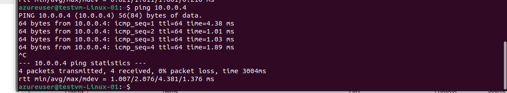

# Virtual Network Peering - Connect VNets

## What is VNet Peering?
VNet Peering connects two Azure virtual networks, allowing resources to communicate as if they were in the same network.

## Types of Peering
- **VNet Peering**: Same region
- **Global VNet Peering**: Different regions

---

## Lab Setup

### Current Environment
- **VNet 1**: App-network (10.0.0.0/16) - East US
- **VNet 2**: test-network (172.16.0.0/16) - East US
- **VMs**: webvm-Linux-01, testvm-Linux-01

---

## Step 1: Test Connectivity Before Peering

### Current State - No Communication
```bash
# From webvm-Linux-01 (10.0.1.x)
ping 20.124.86.114 # testvm-Linux-01 private IP
# Expected: ❌ FAIL - No route between VNets
```


---

## Step 2: Create VNet Peering

### From App-network to test-network
1. Navigate to App-network → Peerings
2. Click "Add"
3. **Configuration**:
   - **Peering link name**: `App-to-test`
   - **Remote virtual network**: `test-network`
   - **Allow virtual network access**: ✅ Enabled
   - **Allow forwarded traffic**: ✅ Enabled


### Reverse Peering (Automatic)
4. **Remote peering link name**: `test-to-App`
5. Click "Add"


---

## Step 3: Verify Peering Status

### Check Peering Status
1. Navigate to App-network → Peerings
2. **Status**: Should show "Connected"


---

## Step 4: Test Connectivity After Peering

### Successful Communication
```bash
# From webvm-Linux-01 (10.0.1.x)
ping 172.16.0.4  # testvm-Linux-01 private IP
# Expected: ✅ SUCCESS - Peering enables communication
```


### Test Reverse Communication
```bash
# From testvm-Linux-01 (172.16.1.4)
ping 10.0.0.4  # webvm-Linux-01 private IP
# Expected: ✅ SUCCESS - Bidirectional communication
```



---

## Network Architecture

### Before Peering
```
App-network (10.0.0.0/16)     test-network (172.16.0.0/16)
├── webvm-Linux-01            ├── testvm-Linux-01
└── No communication ❌       └── Isolated networks
```

### After Peering
```
App-network (10.0.0.0/16) ←→ test-network (172.16.0.0/16)
├── webvm-Linux-01            ├── testvm-Linux-01
└── Full communication ✅     └── Connected via peering
```

---

## Key Settings

| Setting | Purpose | Recommendation |
|---------|---------|----------------|
| **Virtual network access** | Basic connectivity | ✅ Always enable |
| **Forwarded traffic** | Allow traffic from other networks | ✅ Enable for hub-spoke |
| **Gateway transit** | Share VPN/ExpressRoute gateway | ⚠️ Only on hub VNet |
| **Use remote gateways** | Use other VNet's gateway | ⚠️ Only on spoke VNets |

---

## Verification Commands

```bash
# List peerings
az network vnet peering list --resource-group Azure_RG --vnet-name App-network --output table

# Check effective routes
az network nic show-effective-route-table --resource-group Azure_RG --name webvm-linux-01723_z1
```

---

## Lab Results

### Successfully Demonstrated:
- ✅ **VNet Peering Setup**: Connected two VNets
- ✅ **Bidirectional Communication**: Both directions working
- ✅ **Route Propagation**: Automatic route creation
- ✅ **Security Integration**: NSG rules still enforced

### Key Learning Points:
1. **Simple Configuration**: Easy to set up and manage
2. **Automatic Routing**: Routes created automatically
3. **Non-Transitive**: Direct connections only
4. **Cost Effective**: Pay only for data transfer

**Lab Status**: ✅ **COMPLETED** - VNet Peering successfully implemented