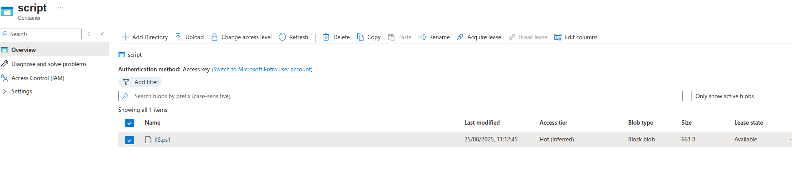
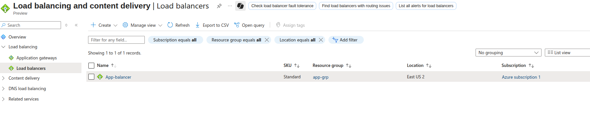
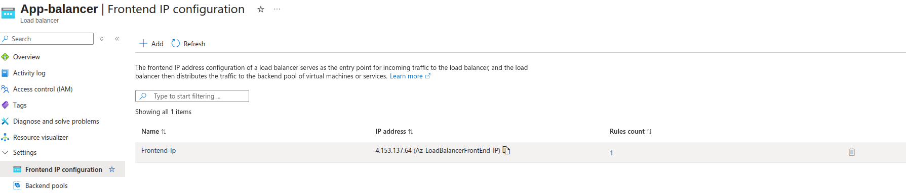
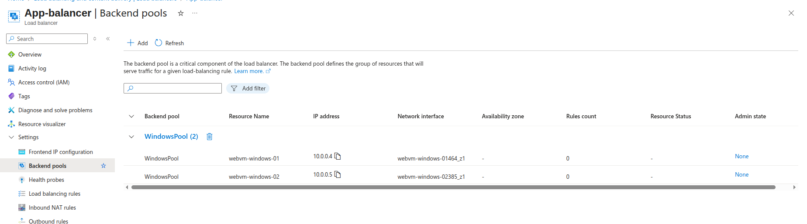
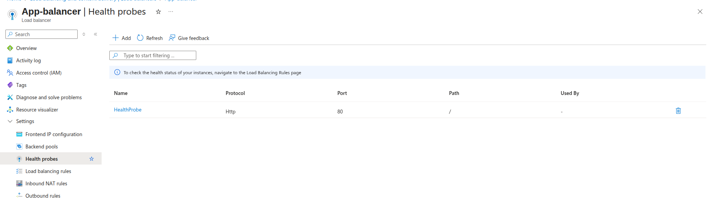
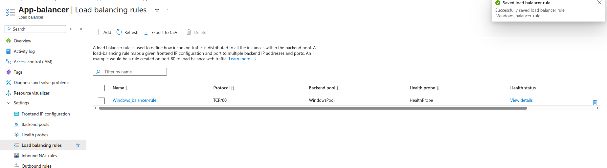
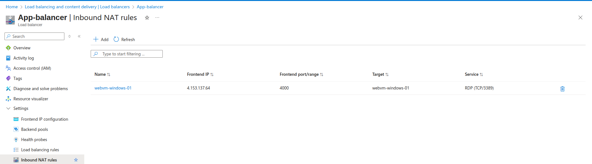
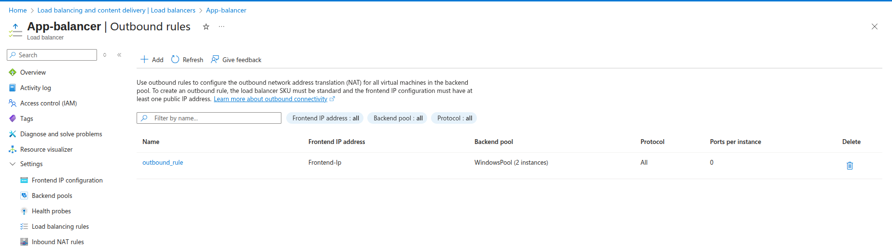

# Azure Load Balancer Standard SKU Implementation

## Lab Infrastructure

### Windows VMs Created
- **webvm-windows-01**: 10.0.0.4
- **webvm-windows-02**: 10.0.0.5
- **Custom Script**: PowerShell script from Azure Storage
- **Load Balancer**: Standard SKU with full configuration

---

## Step 1: Windows VMs with Custom Script Extension

### VM Configuration
- **Names**: webvm-windows-01, webvm-windows-02
- **Private IPs**: 10.0.0.4, 10.0.0.5
- **OS**: Windows Server 2019/2022
- **Subnet**: websubnet (10.0.0.0/24)

### PowerShell Custom Script
```powershell
# Script stored in Azure Storage
# Installs IIS and creates custom web pages
Install-WindowsFeature -name Web-Server -IncludeManagementTools
Set-Content -Path "C:\inetpub\wwwroot\index.html" -Value "<h1>Web Server - $env:COMPUTERNAME</h1>"
```



---

## Step 2: Standard SKU Load Balancer

### Load Balancer Configuration
- **Name**: `App-balancer`
- **SKU**: `Standard`
- **Type**: `Public`
- **Region**: `East US`



---

## Step 3: Frontend IP Configuration

### Frontend IP
- **Name**: `frontend-windows`
- **Public IP**: Standard SKU, Static
- **Availability Zone**: Zone-redundant



---

## Step 4: Backend Pool

### Backend Pool Configuration
- **Name**: `windowsPool`
- **VMs Added**:
  - webvm-windows-01 (10.0.0.4)
  - webvm-windows-02 (10.0.0.5)



---

## Step 5: Health Probe

### HTTP Health Probe
- **Name**: `HealthProbe`
- **Protocol**: `HTTP`
- **Port**: `80`
- **Path**: `/`
- **Interval**: `15` seconds
- **Unhealthy threshold**: `2`



---

## Step 6: Load Balancing Rule

### HTTP Load Balancing Rule
- **Name**: `windows_balancer-rule`
- **Frontend IP**: `frontend-windows`
- **Protocol**: `TCP`
- **Port**: `80`
- **Backend Port**: `80`
- **Backend Pool**: `backend-windows-pool`
- **Health Probe**: `probe-http-windows`



---

## Step 7: Inbound NAT Rules

### RDP NAT Rules
1. **webvm-windows-01 RDP**:
   - **Name**: `rdp-webvm-01`
   - **Frontend Port**: `3391`
   - **Backend Port**: `3389`
   - **Target VM**: webvm-windows-01

2. **webvm-windows-02 RDP**:
   - **Name**: `rdp-webvm-02`
   - **Frontend Port**: `3392`
   - **Backend Port**: `3389`
   - **Target VM**: webvm-windows-02



---

## Step 8: Outbound Rules

### Outbound Rule Configuration
- **Name**: `outbound_rule`
- **Frontend IP**: `frontend-windows`
- **Protocol**: `All`
- **Backend Pool**: `backend-windows-pool`
- **Port Allocation**: `Manual`
- **Outbound Ports**: `1024` per instance



---

## Step 9: Testing Implementation

### Load Balancing Test
```bash
# Test HTTP load balancing
curl http://LOAD_BALANCER_PUBLIC_IP
# Should alternate between:
# "Web Server - WEBVM-WINDOWS-01"
# "Web Server - WEBVM-WINDOWS-02"
```

### RDP Access Test
```bash
# RDP to webvm-windows-01
mstsc /v:LOAD_BALANCER_PUBLIC_IP:4000

---

## Architecture Overview

### Traffic Flow
```
Internet
├── HTTP (Port 80) → Load Balancer → Both Windows VMs
├── RDP (Port 3391) → Load Balancer → webvm-windows-01:3389
├── RDP (Port 3392) → Load Balancer → webvm-windows-02:3389
└── Outbound → Load Balancer → Internet (SNAT)
```

### Port Mapping
| Frontend Port | Backend VM | Backend Port | Purpose |
|---------------|------------|--------------|---------|
| 80 | Both VMs | 80 | HTTP Load Balancing |
| 3391 | webvm-windows-01 | 3389 | Direct RDP Access |
| 3392 | webvm-windows-02 | 3389 | Direct RDP Access |

---

## Standard SKU Features Implemented

### ✅ **Implemented Features**
- **Standard SKU**: Enterprise-grade load balancer
- **Zone Redundancy**: Zone-redundant public IP
- **Multiple Rules**: Load balancing + NAT rules
- **Outbound Rules**: Explicit outbound connectivity
- **Health Probes**: HTTP health monitoring
- **Security**: Secure by default configuration

### ✅ **Windows-Specific Features**
- **IIS Integration**: Custom PowerShell script deployment
- **RDP Access**: Direct RDP via NAT rules
- **Windows Health Checks**: HTTP-based health probes
- **Custom Web Pages**: VM identification via hostname

---


**Implementation Status**: ✅ **COMPLETED** - Standard SKU Load Balancer with Windows VMs fully operational