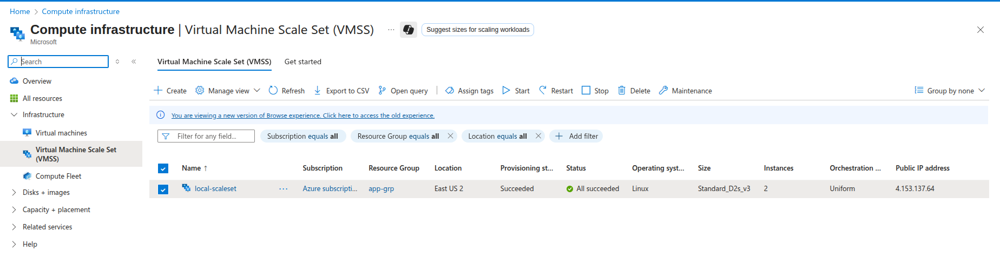
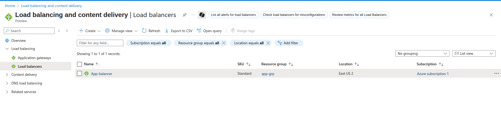
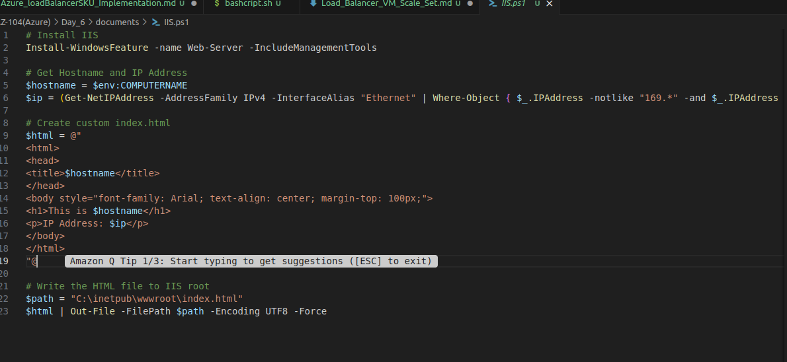
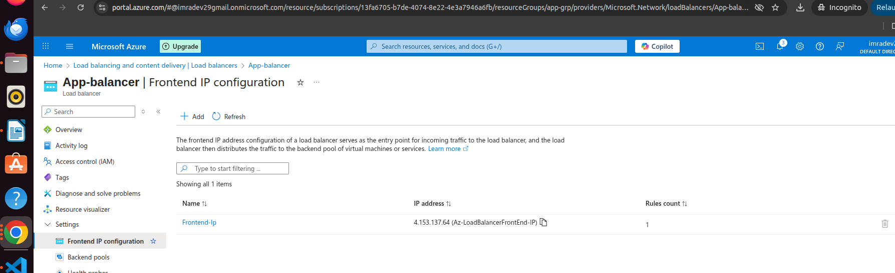

# Azure Load Balancer with VM Scale Set - Standard SKU

## What is VM Scale Set?
VM Scale Set allows you to deploy and manage identical VMs that automatically scale based on demand.

## Benefits
- **Auto-scaling**: Scale out/in based on metrics
- **High Availability**: VMs across fault domains
- **Simplified Management**: Single configuration
- **Cost Optimization**: Scale down during low demand

---

## Lab Architecture

```
app-network (10.0.0.0/16)
├── websubnet (10.0.0.0/24)
│   └── VM Scale Set (2-10 instances)
└── Standard Load Balancer
    ├── Frontend IP (Zone-redundant)
    ├── Backend Pool (Scale Set)
    └── Auto-scaling Rules
```

---

## Step 1: Create VM Scale Set

### Configuration:
- **Name**: `local-scaleset
- **Region**: `East US`
- **Zones**: `1, 2, 3`
- **Image**: `Windows Server 2022`
- **Size**: `Standard_B2s`


---

## Step 2: Network Configuration

### Settings:
- **VNet**: `app-network`
- **Subnet**: `websubnet`
- **Load Balancer**: `create-new`
- **LB Name**: `App-balancer`



---

## Step 3: Custom Script Extension

### PowerShell Script:
```powershell
Install-WindowsFeature -name Web-Server -IncludeManagementTools
$instanceId = (Invoke-RestMethod -Uri "http://169.254.169.254/metadata/instance/compute/name?api-version=2021-02-01" -Headers @{"Metadata"="true"})
Set-Content -Path "C:\inetpub\wwwroot\index.html" -Value "<h1>VM Scale Set Instance: $instanceId</h1>"
```



---

## Step 4: Auto-scaling Configuration

### Scale Rules:
- **Scale-out**: CPU > 70% for 5 min → +1 instance
- **Scale-in**: CPU < 30% for 5 min → -1 instance
- **Limits**: Min 2, Max 10, Default 2


---

## Step 5: Load Balancer Features

### Components:
- **Frontend IP**: Zone-redundant public IP
- **Backend Pool**: Scale set instances
- **Health Probe**: HTTP port 80
- **NAT Pool**: RDP ports 50000-50099
- **Outbound Rules**: SNAT configuration



---

## Step 6: Testing

### Load Balancing Test:
```bash
curl http://LOAD_BALANCER_PUBLIC_IP
# Shows different instances:
# "VM Scale Set Instance: vmss-web-standard_0"
# "VM Scale Set Instance: vmss-web-standard_1"
```

### Auto-scaling Test:
- Generate CPU load > 70%
- Watch new instances added
- Verify load balancing across all instances

---

## Architecture Benefits

### 1. Automatic Scaling
- **Elastic**: Responds to demand
- **Cost-effective**: Pay for what you use
- **Performance**: Maintains response times

### 2. High Availability
- **Zone Distribution**: Across availability zones
- **Fault Tolerance**: Automatic replacement
- **Load Distribution**: Even traffic spread

### 3. Simplified Management
- **Single Configuration**: Manage as one unit
- **Consistent Deployment**: Same config everywhere
- **Centralized Updates**: Update all at once

---

## Traffic Flow

```
Internet → Load Balancer → VM Scale Set Instances
├── HTTP (80) → All healthy instances
├── RDP (50000-50099) → Specific instances
└── Outbound → SNAT through LB
```

---

## Monitoring Metrics

### Scale Set Metrics:
- **Percentage CPU**: Scaling trigger
- **Instance Count**: Current scale
- **Network In/Out**: Traffic volume

### Load Balancer Metrics:
- **Data Path Availability**: Overall health
- **Health Probe Status**: Instance health
- **SNAT Connections**: Outbound usage

---

## Best Practices

### 1. Scaling Configuration
- Conservative thresholds
- Appropriate cool-down periods
- Realistic min/max limits

### 2. Load Balancer Integration
- Application-specific health probes
- Stateless application design
- Proper outbound rules

### 3. Cost Optimization
- Right-size VM instances
- Optimize scaling thresholds
- Use scheduled scaling

---

## Lab Results

### Successfully Implemented:
- ✅ **VM Scale Set**: Auto-scaling instances
- ✅ **Standard Load Balancer**: Enterprise features
- ✅ **Auto-scaling**: CPU-based policies
- ✅ **Health Monitoring**: HTTP probes
- ✅ **NAT Pool**: RDP access
- ✅ **Zone Distribution**: High availability

**Lab Status**: ✅ **COMPLETED** - Load Balancer with VM Scale Set operational