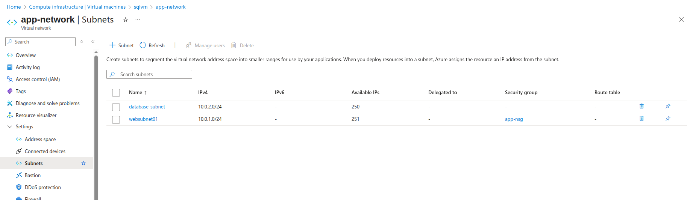
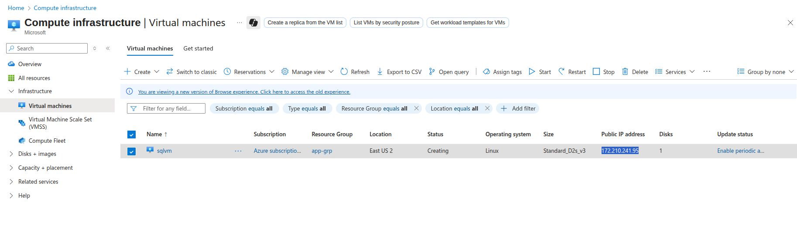
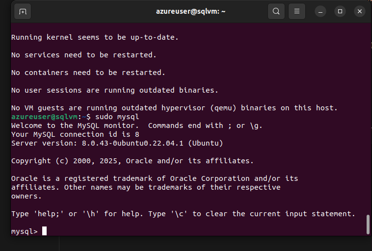
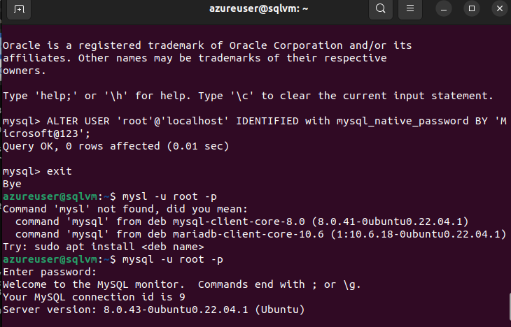

# Day 7: Azure Web App Service with Virtual Network Integration

## What is Azure Web App Service?

Azure Web App Service is a fully managed platform-as-a-service (PaaS) offering that enables you to build, deploy, and scale web applications quickly. It supports multiple programming languages including .NET, Java, Node.js, Python, and PHP.

### Key Features:
- **Fully Managed**: No infrastructure management required
- **Auto-scaling**: Automatically scales based on demand
- **Built-in Security**: SSL certificates, authentication, and authorization
- **DevOps Integration**: CI/CD pipelines with GitHub, Azure DevOps
- **Multiple Deployment Slots**: Blue-green deployments
- **Custom Domains**: Support for custom domain names

## Virtual Network Integration Overview

Virtual Network Integration allows your web app to access resources in your Azure Virtual Network securely. This enables:
- Secure communication with databases and other services
- Private connectivity without exposing services to the internet
- Network-level security controls
- Compliance with enterprise networking requirements

## Manual Setup Approach

### Step 1: Create Virtual Network

1. **Navigate to Virtual Networks**
   - Search "Virtual networks" in the search bar
   - Click "+ Create"

2. **Configure Basic Settings**
   - **Subscription**: Your subscription
   - **Resource group**: `app-grp`
   - **Name**: `vnet-webapp-demo`
   - **Region**: `East US`

3. **Configure IP Addresses**
   - **IPv4 address space**: `10.0.0.0/16`
   - **Add Subnets**:
     - **Subnet 1**:
       - Name: `websubnet01`
       - Address range: `10.0.1.0/24`
       - Delegate to: `Microsoft.Web/serverFarms`
     - **Subnet 2**:
       - Name: `database-subnet`
       - Address range: `10.0.2.0/24`
      

4. **Review and Create**
   - Click "Review + Create" → "Create"

### Step 2: Create Ubuntu VM with SQL Server

1. **Navigate to Virtual Machines**
   - Search "Virtual machines" in Azure Portal
   - Click "+ Create" → "Azure virtual machine"

2. **Configure VM Basics**
   - **Subscription**: Your subscription
   - **Resource group**: `app-grp`
   - **VM name**: `sqlvm`
   - **Region**: `East US`
   - **Image**: `Ubuntu Server 20.04 LTS`
   - **Size**: `Standard_B2s` (2 vcpus, 4 GB RAM)
   - **Authentication**: SSH public key
   - **Username**: `azureuser`

3. **Configure Networking**
   - **Virtual network**: `app-network`
   - **Subnet**: `database-subnet`
   - **Public IP**: None (for security)
   - **NIC network security group**: Basic
   - **Public inbound ports**: None

4. **Review and Create VM**

5. **Install SQL Server on Ubuntu**
   ```bash
   # Connect via Bastion or jump box
   # Import Microsoft GPG key
   wget -qO- https://packages.microsoft.com/keys/microsoft.asc | sudo apt-key add -
   
   # Add SQL Server repository
   sudo add-apt-repository "$(wget -qO- https://packages.microsoft.com/config/ubuntu/20.04/mssql-server-2019.list)"
   
   # Install SQL Server
   sudo apt-get update
   sudo apt-get install -y mysql-server
   
   # Configure SQL Server
   sudo /opt/mssql/bin/mssql-conf setup
   # Choose: 2) Developer (free)
   # Accept license: Yes
   # Set SA password: admin1234@
   
   # Install SQL Server command-line tools
   curl https://packages.microsoft.com/config/ubuntu/20.04/prod.list | sudo tee /etc/apt/sources.list.d/msprod.list
   sudo apt-get update
   sudo apt-get install mssql-tools unixodbc-dev
   
   # Add tools to PATH
   echo 'export PATH="$PATH:/opt/mssql-tools/bin"' >> ~/.bashrc
   source ~/.bashrc
   
   # Create database
   sqlcmd -S localhost -U SA -P 'admin1234@'
   CREATE DATABASE WebAppDB;
   GO
   USE WebAppDB;
   GO
   CREATE TABLE Users (Id INT IDENTITY(1,1) PRIMARY KEY, Name NVARCHAR(100), Email NVARCHAR(100));
   GO
   EXIT
   ```



### Step 3: Create App Service Plan

1. **Navigate to App Service Plans**
   - Search "App Service plans" in Azure Portal
   - Click "+ Create"

2. **Configure Plan**
   - **Subscription**: Your subscription
   - **Resource group**: `app-grp`
   - **Name**: `asp-webapp-demo`
   - **Operating System**: `Windows`
   - **Region**: `East US`
   - **Pricing tier**: `Standard S1`

3. **Create the Plan**

### Step 4: Create Web App

1. **Navigate to App Services**
   - Search "App Services" in Azure Portal
   - Click "+ Create" → "Web App"

2. **Configure Web App**
   - **Subscription**: Your subscription
   - **Resource group**: `app-grp`
   - **Name**: `webapp-demo-[unique]`
   - **Publish**: `Code`
   - **Runtime stack**: `.NET 6 (LTS)`
   - **Operating System**: `Windows`
   - **Region**: `East US`
   - **App Service Plan**: `asp-webapp-demo`

3. **Create Web App**

### Step 5: Configure VNet Integration

1. **Navigate to Your Web App**
   - Go to the created web app
   - In the left menu, find "Networking"

2. **Configure VNet Integration**
   - Click "VNet integration"
   - Click "+ Add VNet"
   - **Virtual network**: `vnet-webapp-demo`
   - **Subnet**: `websubnet01`
   - Click "OK"

### Step 6: Configure Database Connection

1. **Get VM Private IP**
   - Go to your Ubuntu VM
   - Note the private IP address (e.g., `10.0.2.4`)

2. **Configure Web App Connection**
   - Go to your Web App
   - Navigate to "Configuration" → "Connection strings"
   - Click "+ New connection string"
   - **Name**: `DefaultConnection`
   - **Value**: `Server=10.0.2.4,1433;Database=WebAppDB;User Id=SA;Password=admin1234@;TrustServerCertificate=true;`
   - **Type**: `SQLServer`
   - Click "OK" → "Save"

## Verification Steps

### Test VNet Integration

1. **Check VNet Integration Status**
   - Go to Web App → Networking → VNet integration
   - Verify status shows "Connected"

2. **Test Database Connectivity**
   - Use Kudu console or deploy a test application
   - Verify database connection works

### Security Verification

1. **Verify VM Network Security**
   - Go to VM → Networking
   - Confirm no public IP assigned
   - Verify NSG rules block external access

2. **Test Database Connectivity**
   - From VM: `sqlcmd -S localhost -U SA -P 'admin1234@'`
   - From Web App: Test connection through VNet
   - External access should be blocked

## Architecture Diagram

```
Internet
    ↓
[Azure Load Balancer]
    ↓
[Web App Service] ←→ [VNet Integration]
    ↓                      ↓
[websubnet01]       [database-subnet]
    ↓                      ↓
[App Service Plan]  [Ubuntu VM]
                           ↓
                    [SQL Server 2019]
```

## Best Practices

### Security
- Use VMs without public IPs for databases
- Configure NSGs to restrict access
- Use strong passwords and SQL authentication
- Implement network security groups (NSGs)
- Consider Azure Bastion for VM access

### Performance
- Place resources in the same region
- Use appropriate App Service Plan tiers
- Configure connection pooling
- Monitor application performance

### Cost Optimization
- Use appropriate pricing tiers
- Implement auto-scaling rules
- Monitor resource utilization
- Use reserved instances for predictable workloads

## Troubleshooting Common Issues

### VNet Integration Not Working
- Verify subnet delegation is set to `Microsoft.Web/serverFarms`
- Check subnet has available IP addresses
- Ensure App Service Plan supports VNet integration

### Database Connection Issues
- Verify VM is running and SQL Server service is active
- Check connection string format and VM private IP
- Confirm NSG rules allow port 1433
- Test connectivity: `telnet <vm-private-ip> 1433`
- Verify SQL Server is listening on all interfaces

### Performance Issues
- Monitor App Service metrics
- Check VM CPU/memory usage
- Verify network latency
- Review application logs

## Next Steps

1. **Deploy Sample Application**
   - Create a simple web application
   - Test database connectivity
   - Verify VNet integration works

2. **Implement Monitoring**
   - Set up Application Insights
   - Configure alerts and dashboards
   - Monitor performance metrics

3. **Security Hardening**
   - Implement authentication
   - Configure SSL certificates
   - Set up network security groups

4. **Automation**
   - Create ARM/Bicep templates
   - Set up CI/CD pipelines
   - Implement infrastructure as code

