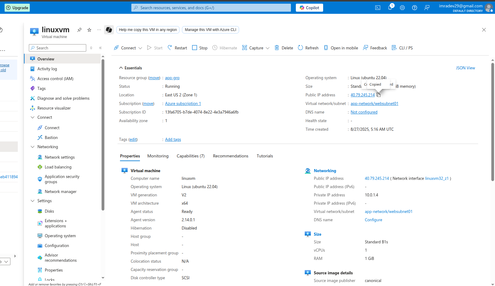
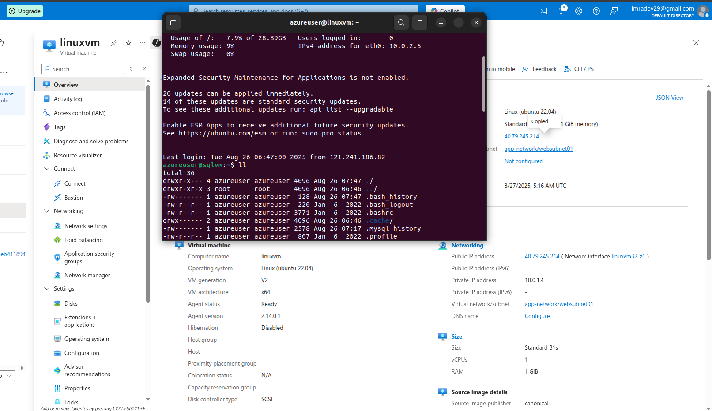
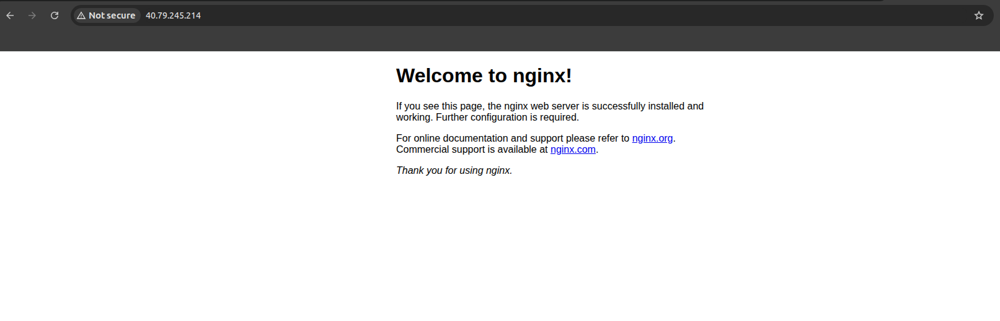

# Lab 1: Creating Linux VM and Installing Nginx Web Server

## Lab Overview
This lab covers creating a Linux Virtual Machine in Azure, establishing SSH connection, and installing Nginx web server.

## Prerequisites
- Azure subscription with appropriate permissions
- SSH client (Terminal, PuTTY, or Azure Cloud Shell)
- Basic understanding of Linux administration

## Lab Objectives
- Create Linux Virtual Machine in Azure
- Configure network security group for SSH access
- Connect to VM using SSH
- Install and configure Nginx web server
- Verify web server functionality

## Step-by-Step Instructions

### Step 1: Create Linux Virtual Machine

1. **Navigate to Azure Portal**
   - Go to [portal.azure.com](https://portal.azure.com)
   - Sign in with your Azure credentials

2. **Create Virtual Machine**
   - Click "Create a resource" → "Virtual machine"
   - Fill in basic details:
     - **Subscription**: Select your subscription
     - **Resource group**: Create new or select existing
     - **Virtual machine name**: `linux-vm`
     - **Region**: Choose appropriate region
     - **Image**: `Ubuntu Server 20.04 LTS`
     - **Size**: `Standard_B2s` (2 vcpus, 4 GB RAM)

3. **Configure Administrator Account**
   - **Authentication type**: SSH public key
   - **Username**: `azureuser`
   - **SSH public key source**: Generate new key pair
   - **Key pair name**: `linux-vm-key`

4. **Inbound Port Rules**
   - Select "Allow selected ports"
   - **Select inbound ports**: `SSH (22)`

5. **Review and Create**
   - Click "Review + create"
   - Download private key when prompted
   - Click "Create"



### Step 2: Connect to Linux Virtual Machine via SSH

1. **Get Connection Information**
   - Go to VM overview page
   - Note the public IP address

2. **Connect via SSH**
   - **Using Azure Cloud Shell**:
     ```bash
     ssh -i ~/linux-vm-key.pem azureuser@[VM_PUBLIC_IP]
     ```
   - **Using local terminal**:
     ```bash
     chmod 600 linux-vm-key.pem
     ssh -i linux-vm-key.pem azureuser@[VM_PUBLIC_IP]
     ```

3. **Accept Host Key**
   - Type "yes" when prompted about host authenticity
   - You should see Ubuntu command prompt



### Step 3: Install and Configure Nginx Web Server

1. **Update Package Repository**
   ```bash
   sudo apt update
   ```

2. **Install Nginx**
   ```bash
   sudo apt install nginx -y
   ```

3. **Start and Enable Nginx**
   ```bash
   sudo systemctl start nginx
   sudo systemctl enable nginx
   ```

4. **Check Nginx Status**
   ```bash
   sudo systemctl status nginx
   ```


### Step 4: Configure Azure Network Security Group for HTTP

1. **Add HTTP Rule**
   - Go to VM → Networking
   - Click "Add inbound port rule"
   - **Service**: HTTP
   - **Port ranges**: 80
   - **Protocol**: TCP
   - **Action**: Allow
   - **Priority**: 1010
   - **Name**: `Allow-HTTP`
   - Click "Add"

### Step 5: Verify Nginx Web Server

1. **Test External Access**
   - Open browser and navigate to `http://[VM_PUBLIC_IP]`
   - Should see Nginx default welcome page



## Verification Steps

### Connectivity Tests
- [ ] SSH connection successful
- [ ] Linux terminal accessible
- [ ] Internet connectivity from VM

### Nginx Installation Tests
- [ ] Nginx installed successfully
- [ ] Nginx service running and enabled
- [ ] Default website responds locally
- [ ] Default website accessible from internet
- [ ] HTTP traffic allowed through firewall

## Key Learnings

### Azure VM Creation
- SSH key authentication is more secure than passwords
- Network security groups control inbound/outbound traffic
- VM sizing affects performance and cost

### Linux Administration
- Package management with apt (Ubuntu/Debian)
- Systemctl for service management
- UFW firewall configuration
- File permissions for SSH keys (chmod 600)

### Nginx Web Server
- Lightweight and high-performance web server
- Easy installation and configuration
- Default configuration serves static content
- Configuration files located in /etc/nginx/

## Troubleshooting

