created windows Vm with name as appvm
publicip: 20.85.126.79

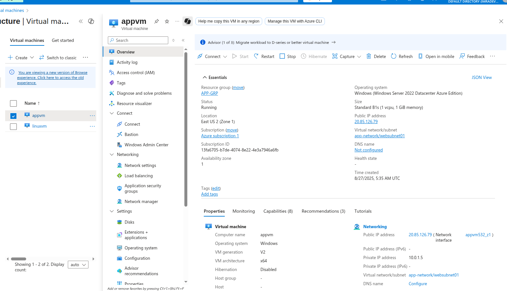

connected through RDP with remmina
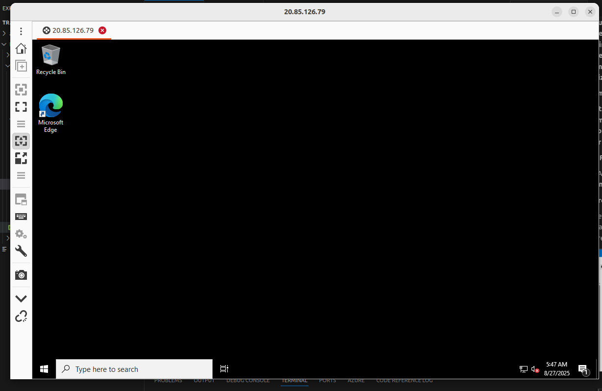

right now i was having disk size as Standard B1s (1 vcpu, 1 GiB memory) increased to Standard_B2ms

Before
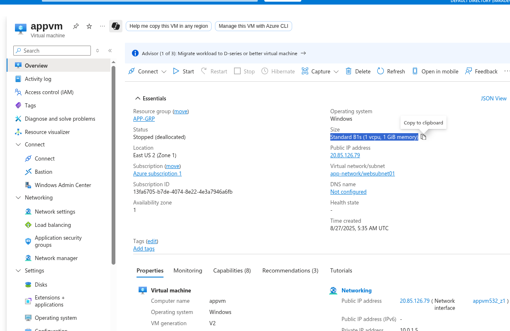

# Log in to Azure
az login

# Stop VM before resize (safer option)
az vm deallocate --resource-group app-grp --name appvm

# Resize VM
az vm resize --resource-group app-grp --name appvm --size Standard_B2ms

# Start VM again
az vm start --resource-group app-grp --name appvm

After changes applied
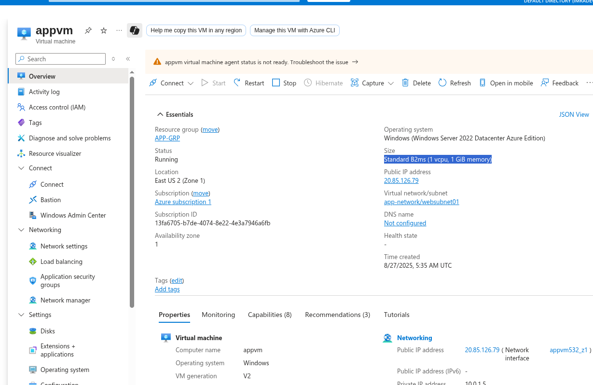

Azure windows Virtual Machine Disk capacity
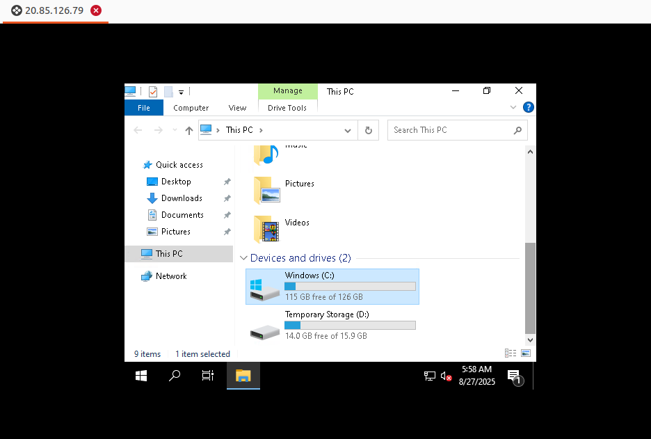

Types of Different Disks
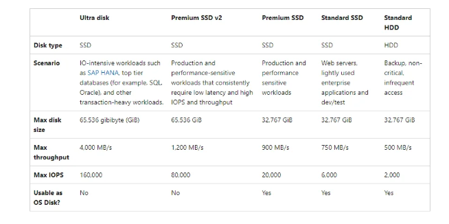

created Additional datadisk with name as "datadisk01"
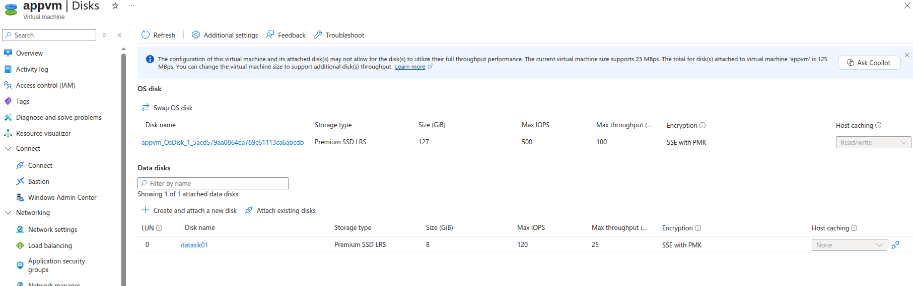

Mount volume on windows Virtual Machine
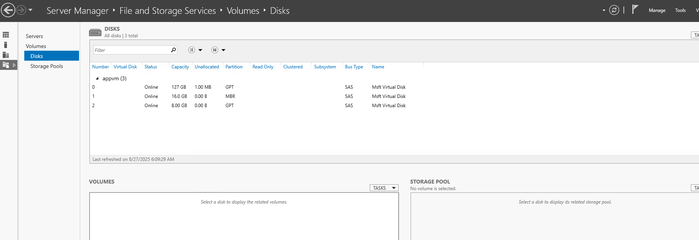
After Mounting
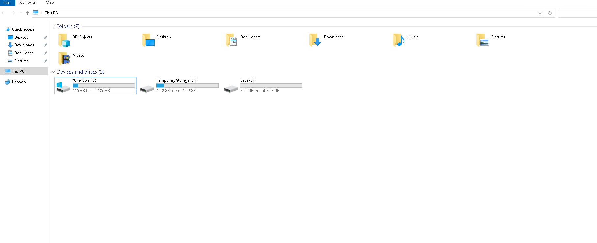

What happen when we stop the machine??
before that created an two file 
one in D drive which is temprorary storage with a name as data.txt
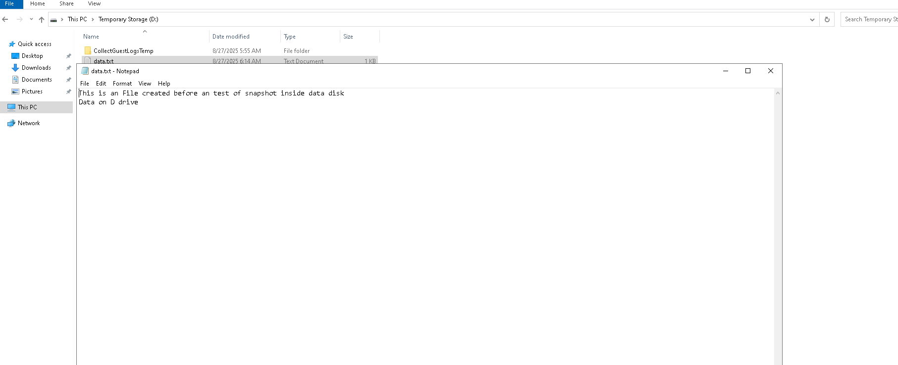
another in e drive "data" with a name as testfile
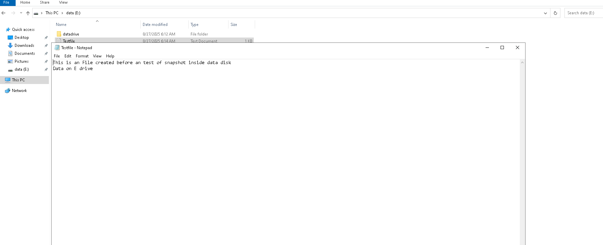
once we stop the VM and restarted it the file which is stored in D drive which is temprorary strogae the file is been deleted
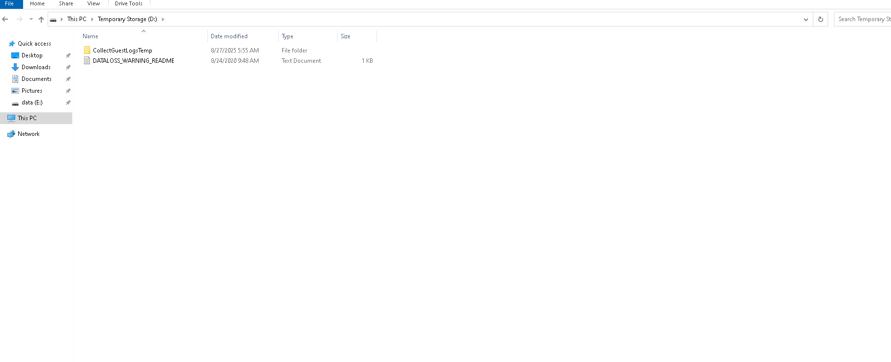

Data Disk Snapshot
Creating a new disk from the snapshot (Point in time copy of you data)
1st we will create a snapshot of "datadisk01" with named as "disk01-snapshot"
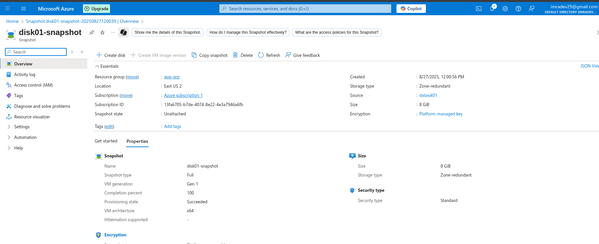
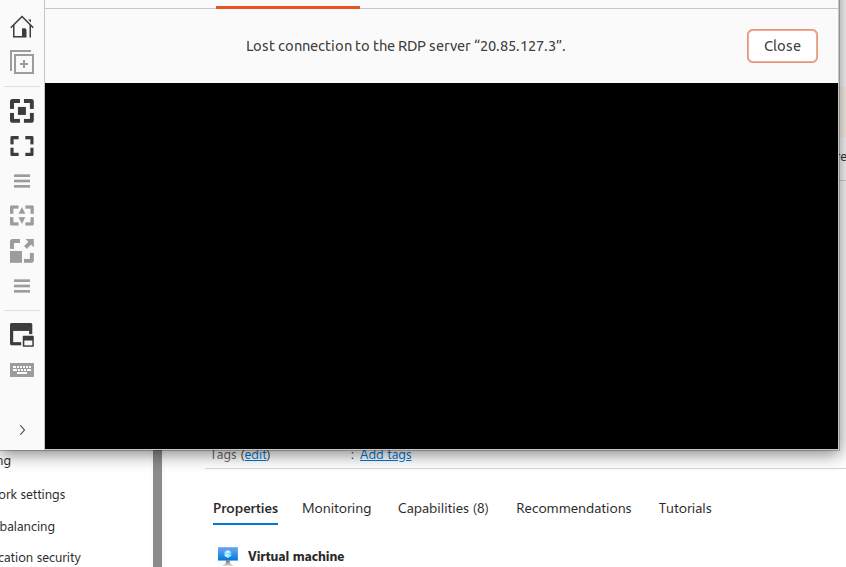

and then from the snapshot we created an Disk and attached it to the new VM
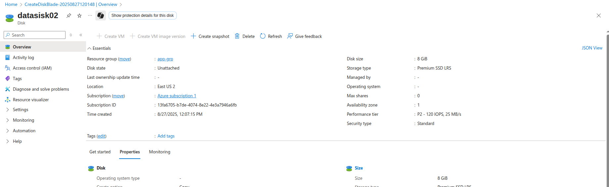
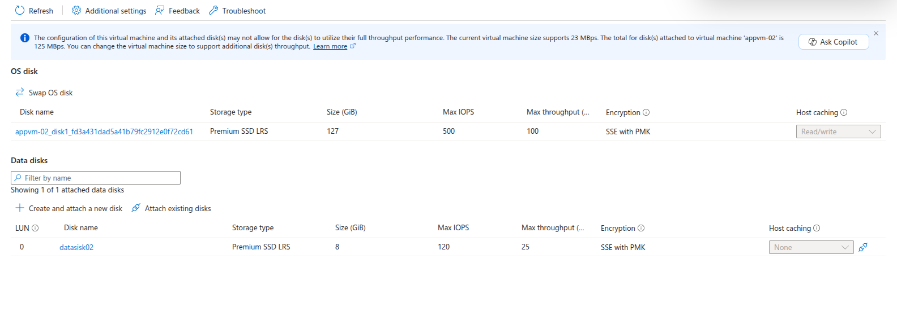

Attaching An existing Disk from virtual machine "appvm" to virtual machine "appvm-02"

Yes we can attach the existing disk to another VM

