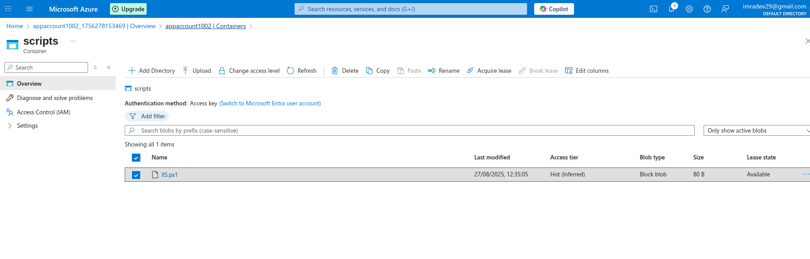
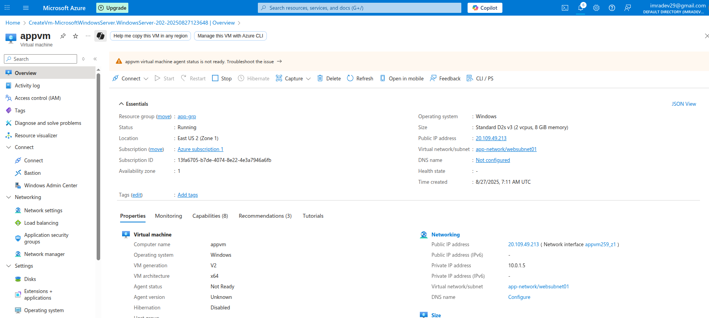
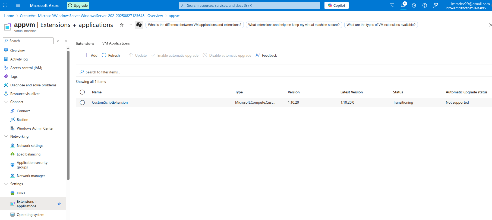
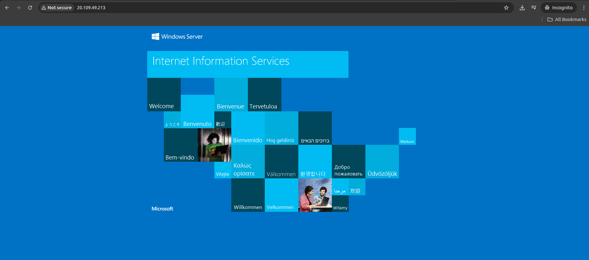
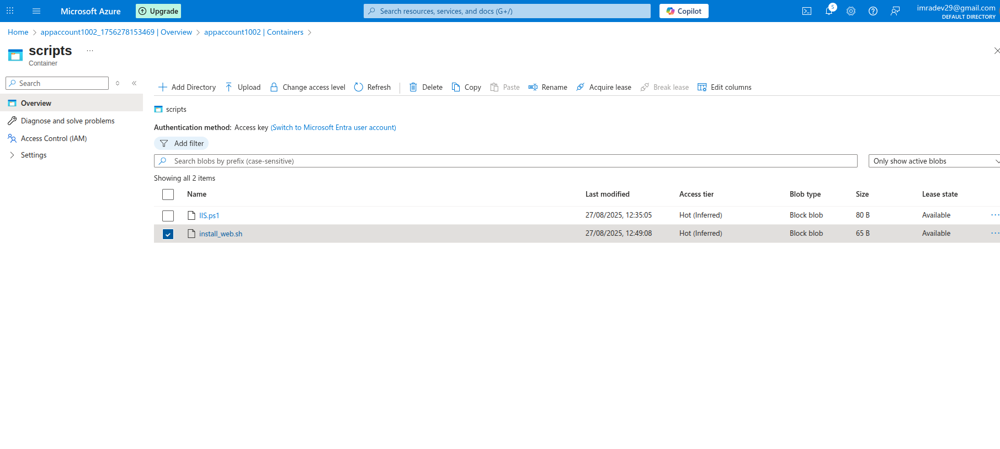
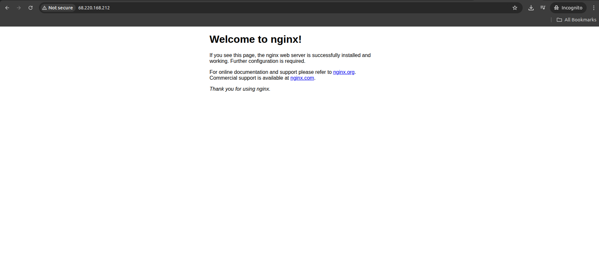

Custom scripts Extensions
This features can be used to download and run scripts on Azure Virtual Machines

Created an storage account with name as "appaccount1002"
under Data storage > Containers > created an container named as "Scripts" uploaded an custom script "IIS.ps1"

Created an Virtual Machine of windows named as "appvm" with public ip as : 20.109.49.213

under EXtensions+Application

in the similar way tried for LinuxVm
Uploaded custom script on strage account
and while creating Linux VM custom script execution given path of the script and created

Result of the nginx through server
