creating an Availability Sets
Created linuxvm-01 and linuxvm-02 on the same appset availability set
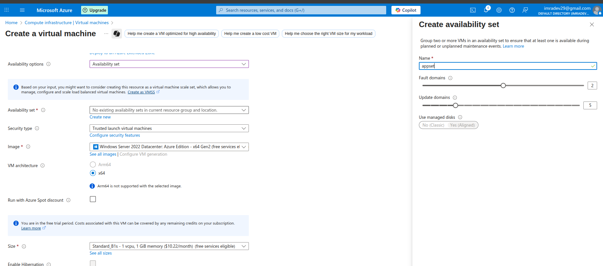
Created

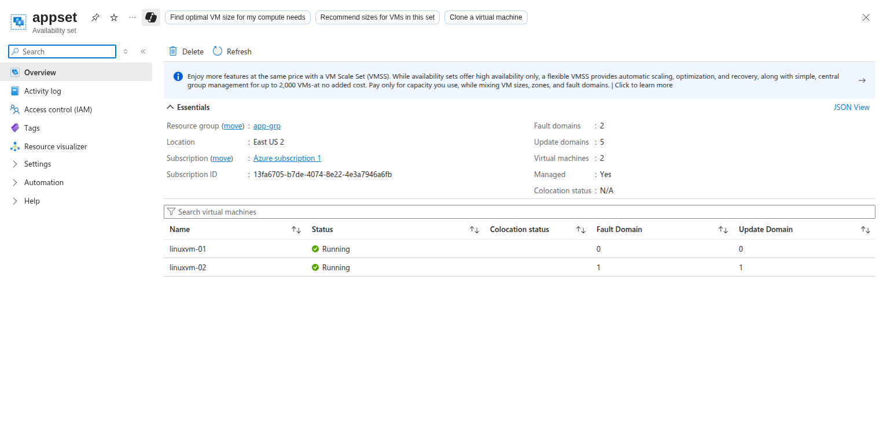

Availibility Zones
what is meant by AZ ?
This features help provides better availability for your application by protecting them from datacenter failures.

Each Availability zone is a unique physical location in an Azure region.

Each zone comprises of one or more data centers that has independent power, cooling, and networking

Hence the physical separation of the Availability Zones helps protect applications against data center failures

Using Availability Zones, you can be guaranteed an availability of 99.99% for your virtual machines. You need to ensure that you have 2 or more virtual machines running across multiple availability zones.

Azure Virtual Machine Scale sets

Creted Scale Set with name as "appset01"
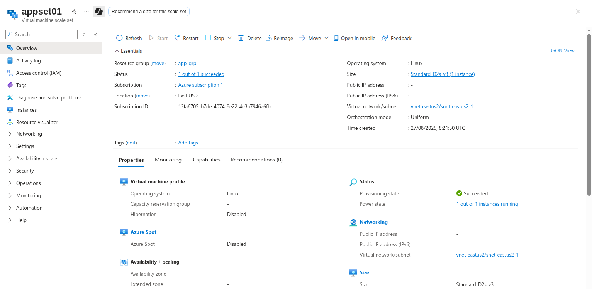

under the Scale set 
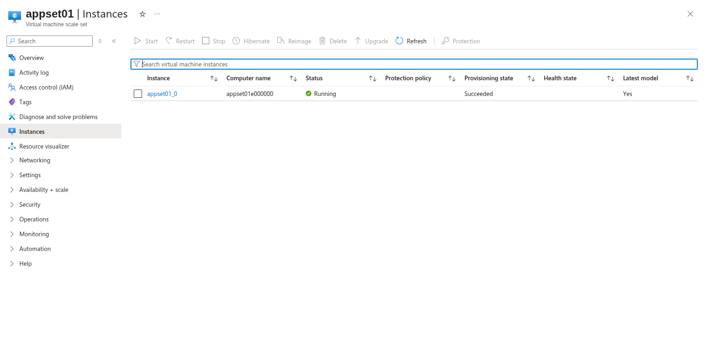

Setting Scalling COnditions

two Types:
1st: Mannual Scale
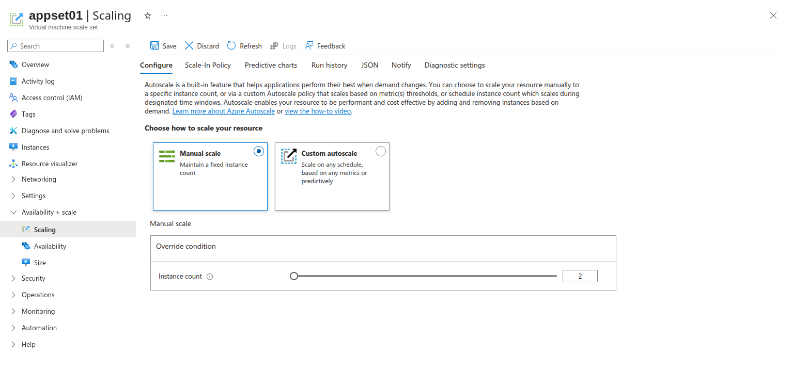
2nd: Custome AutoScale based on Metrics and Threshold
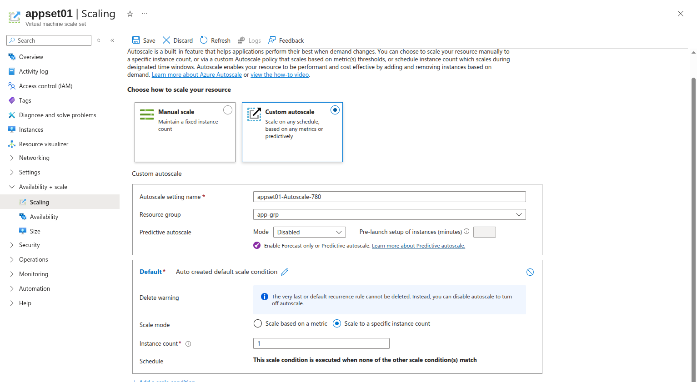
We can also add an Scale rule
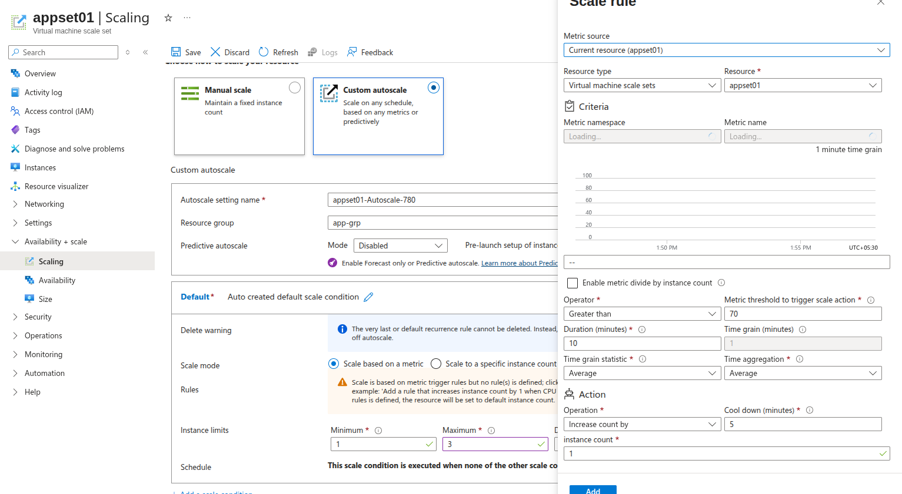

Install stress to give stress to the VM into the terminal
sudo stress --cpu 1000
Increasing by one
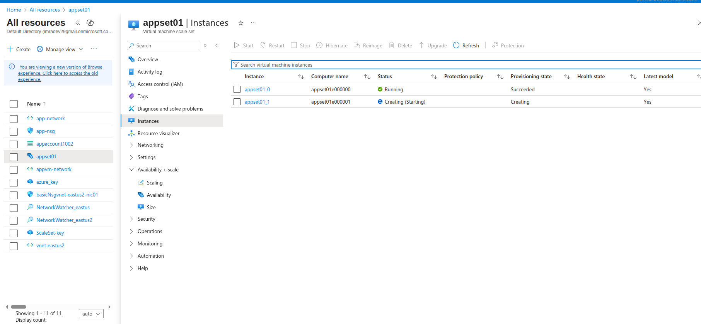
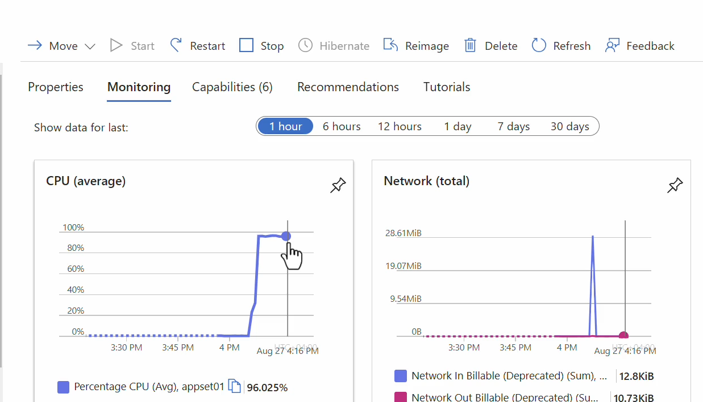

Creating Virtual Machine Scale Sets - Custom Script
uploaded Cutom Script to Storage account
IIIS.ps1
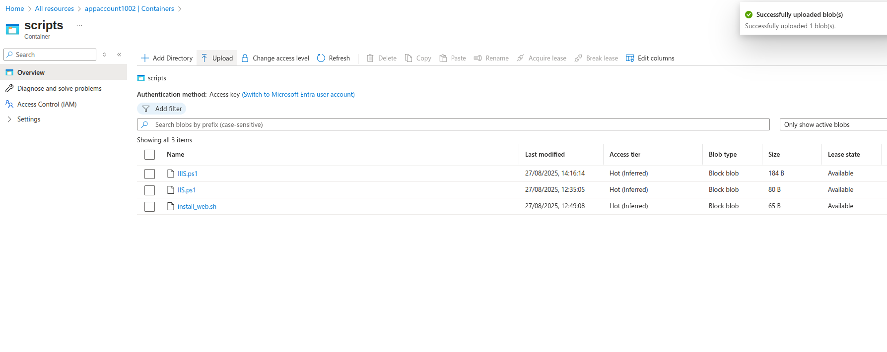
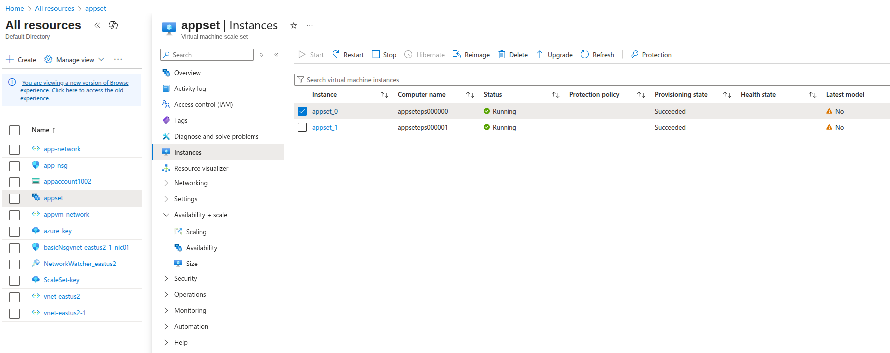

Created through windows

Virtual Scale Set
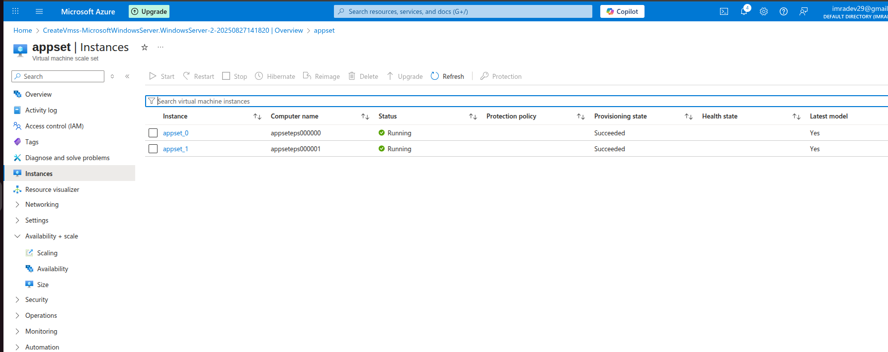

VM: appset_0
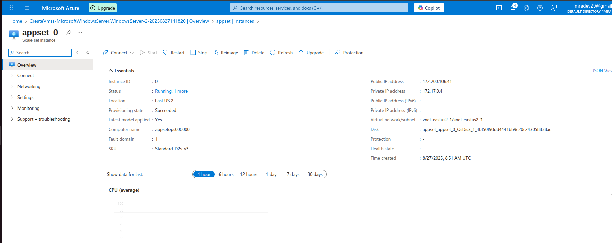
Vm: appset-1
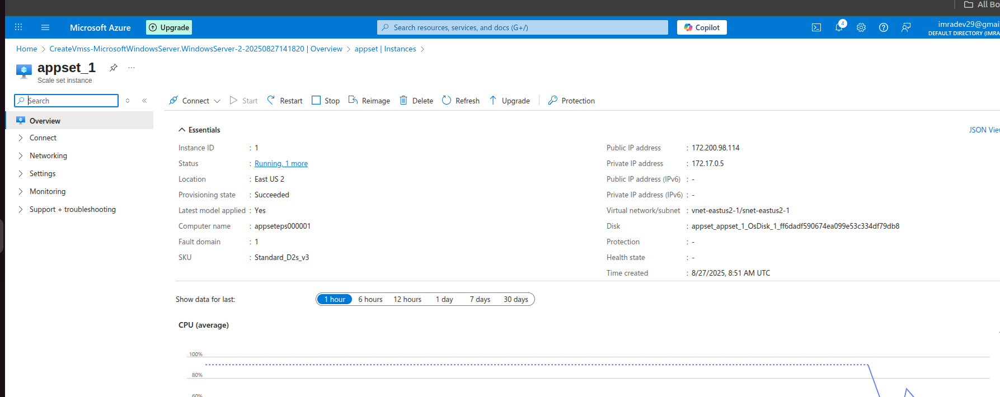

Extension+Applications
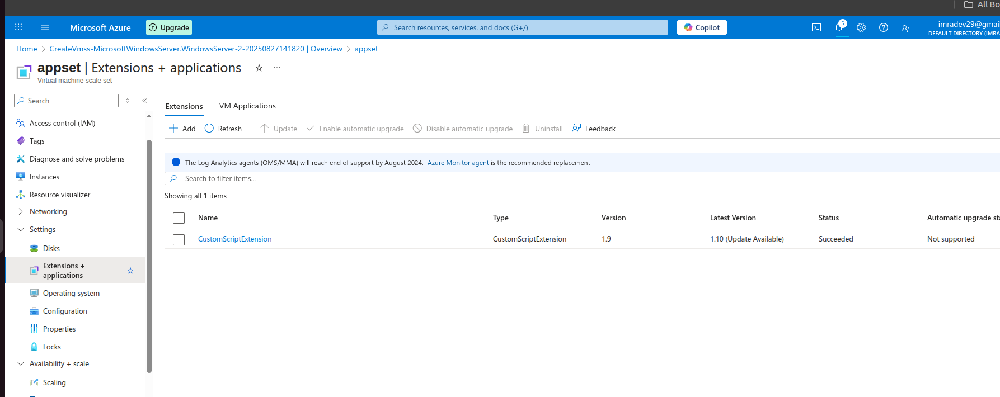

Result server
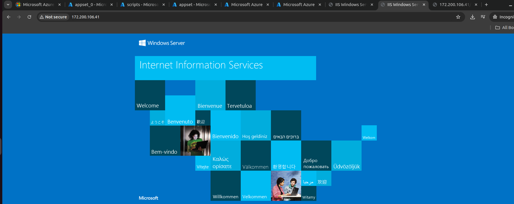
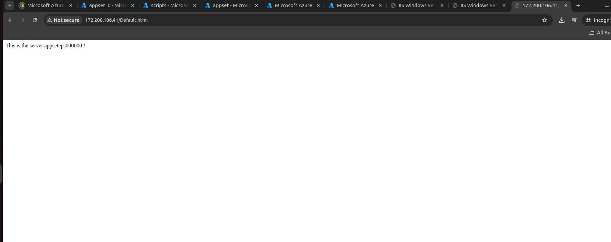
