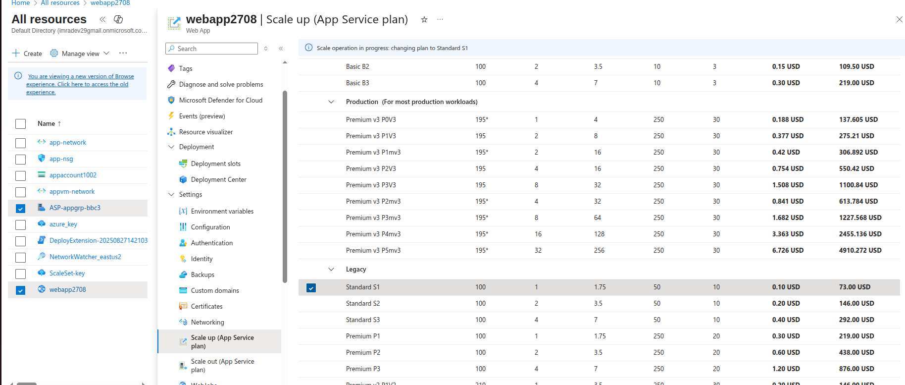
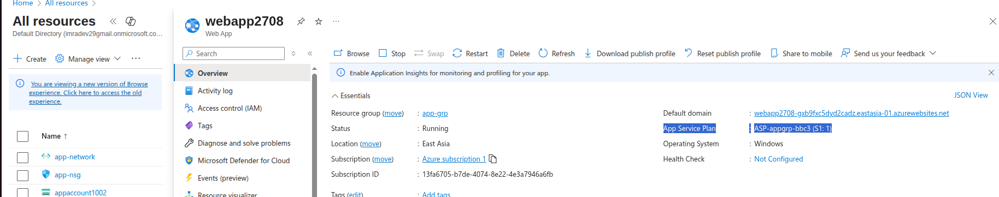

Azure Web App

it will reate two services:
App Service and another is app-service pplan

Making changes to the .net application
go to Webapp > under Development Tool > App Service Editor preview

After adding Default.html

App Service Plan Pricing:
https://portal.azure.com/#view/WebsitesExtension/ScaleSpecPicker.ReactView/id/%2Fsubscriptions%2F13fa6705-b7de-4074-8e22-4e3a7946a6fb%2FresourceGroups%2Fapp-grp%2Fproviders%2FMicrosoft.Web%2Fserverfarms%2FASP-appgrp-bbc3

We can create another webapp under the same App Service Plan i.e. "ASP-appgrp-bbc3" in the same region

Azure Web App Deployments Slots
For this for the free account we need to scale up (App Service Plan)
in our case we have scaled to Standatrd S1

upgraded to new service plan

Under Deployment > Deployment Slots
Create an Slot
here we will have "production" slot and new slot "Stagging"

edit the add Default.html page for the stagging from development tool
<h1>This is a web Application --version 1<h1>

Then we can perform swapinh between production and stagging slot

After swapping when i hit the main webbapp url it will give us latest upadet

AutoScaling For Web Apps
Scale Out(App Service Plan)
Scale Out method:
1st Manual: here based on traffic it will Automaticaly Increasing and if Traffic is low it will Automatically will decreased
2nd Rule Based:
there we have again Manual Scale and Custom Autoscale based on the Metrics

