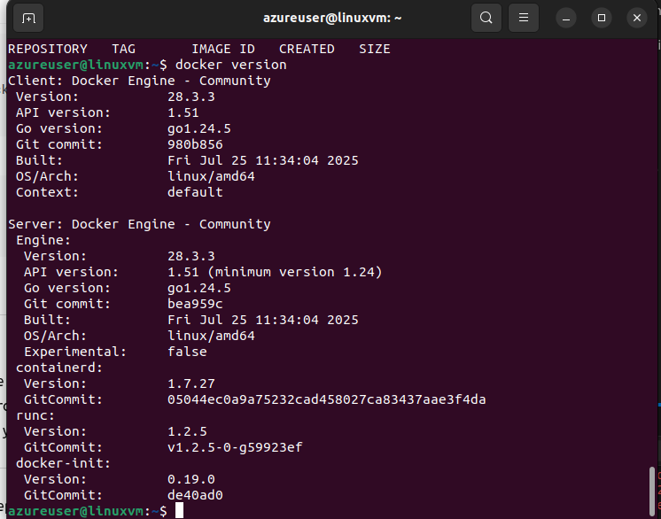
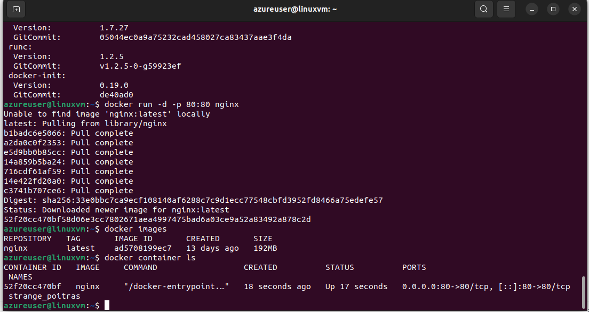
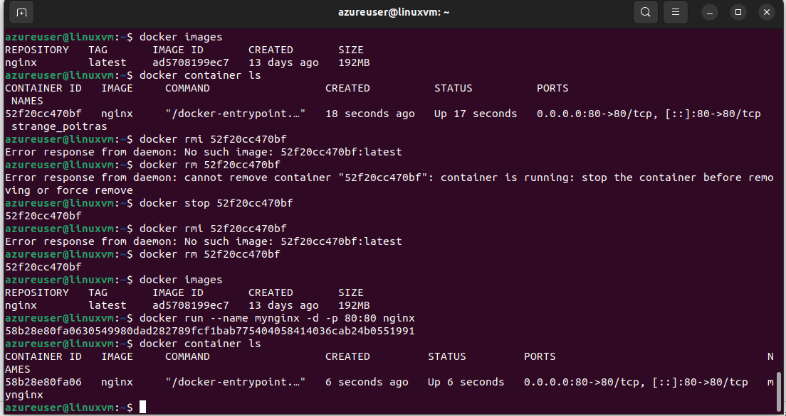
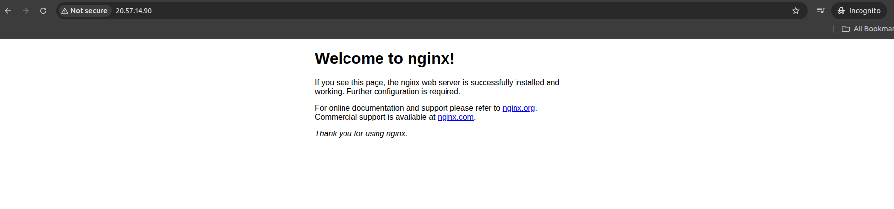
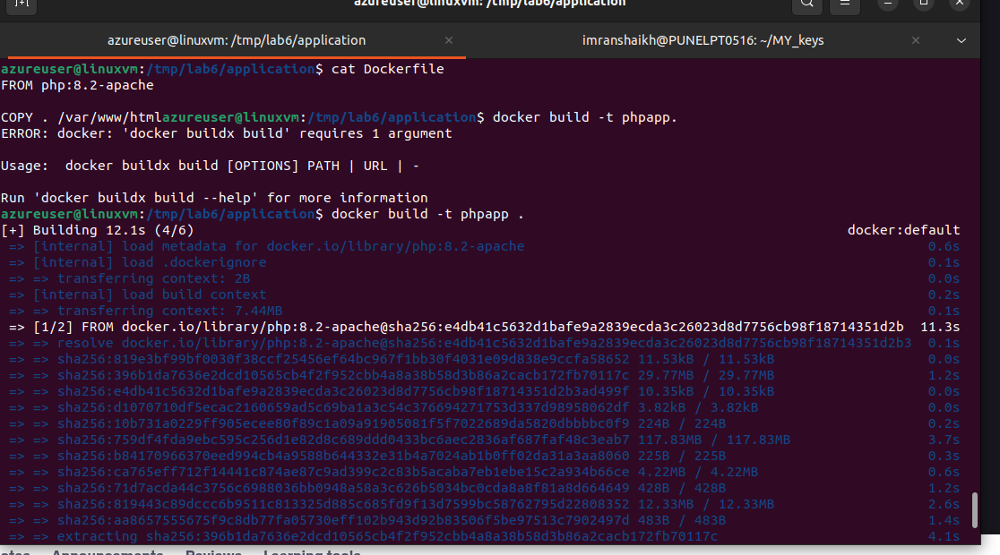
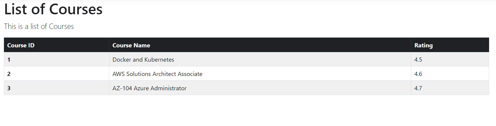

The needs for Containers

Deploying Docker on VM

Installation Steps:
1. Download and run the script
curl -fsSL https://get.docker.com -o get-docker.sh

sudo sh get-docker.sh

2. Verify installation
docker --version
sudo docker run hello-world

3. (Optional) Run Docker without sudo
sudo usermod -aG docker $USER
newgrp docker

Now you can run:

docker ps

and then running the NGINX container on the Linux VM

Copied Application.zip in my local
from local copied to VM
scp -i <key-name> -r /home/imranshaikh/Trainingplan/training_plan/2AZ-104\(Azure\)/Day_8/lab6/ azureuser@20.57.14.90:/tmp/

docker images
REPOSITORY   TAG       IMAGE ID       CREATED          SIZE
phpapp       latest    2abb4a4aea87   45 seconds ago   507MB
nginx        latest    ad5708199ec7   13 days ago      192MB
azureuser@linuxvm:/tmp/lab6/application$ docker run --name myphpapp -d -p 80:80 phpapp
6e546ab9188b9f30208666fc6f228f1f6be6b439edc50364a775f2f2ecc06488
azureuser@linuxvm:/tmp/lab6/application$ docker ps
CONTAINER ID   IMAGE     COMMAND                  CREATED         STATUS         PORTS                                 NAMES
6e546ab9188b   phpapp    "docker-php-entrypoi…"   3 seconds ago   Up 3 seconds   0.0.0.0:80->80/tcp, [::]:80->80/tcp   myphpapp

docker login appegisry.azurecr.io -u appegisry -p ***********

Azure Container Apps - Resources
Azure Container Apps - Resources
The following commands can be used as a reference for the prior chapter

1. We first need to create the Azure Container App environment

az containerapp env create --name "phpapp-env" --resource-group "app-grp" --location "North Europe"

2. Then we can create the Azure Container app

az containerapp create --name "phpapp-service" --resource-group "app-grp" --environment "phpapp-env" --image "appregistry34000.azurecr.io/phpapp" --target-port 80 --ingress 'external' --registry-server appregistry34000.azurecr.io --query properties.configuration.ingress.fqdn

