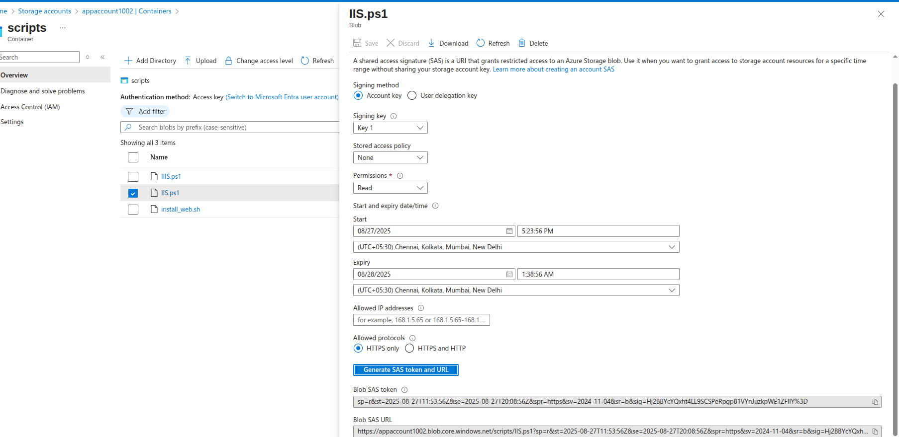

Storage Accounts

Different types of storage accounts
https://learn.microsoft.com/en-us/azure/storage/common/storage-account-overview

🔹 Types of Azure Storage Accounts
1. General-purpose v2 (GPv2) ✅ (Most commonly used)

Supports: Blobs, Files, Queues, Tables, Disks.

Performance tiers: Standard (HDD) or Premium (SSD).

Access tiers for blobs: Hot, Cool, Archive.

Recommended for most scenarios (new deployments).

Use cases: Web apps, VM disks, backups, logs, big data.

2. General-purpose v1 (GPv1) ❌ (Legacy)

Supports the same services as GPv2 (blobs, files, queues, tables).

Older pricing model (cheaper for some workloads but lacks features like access tiers).

Not recommended for new workloads — GPv2 replaces this.

3. Blob Storage Account 🗂️ (Legacy, replaced by GPv2)

Specialized for block blobs and append blobs.

Supports Hot and Cool tiers.

Archive tier is available only in GPv2, so Blob storage accounts are rarely used today.

Best for unstructured object storage (images, videos, logs).

4. BlockBlobStorage (Premium SSD-backed)

High-performance storage for block blobs.

Uses premium performance tier (SSD).

Low latency, high throughput.

Use cases: Big data analytics, media processing, transaction-heavy workloads.

5. FileStorage (Premium only)

Optimized for Azure Files (managed file shares, SMB/NFS).

Uses premium SSD performance only.

Use cases: Enterprise file shares, lift-and-shift of on-prem file servers.

6. Premium Page Blobs (Unmanaged disks — legacy)

Rarely used directly anymore.

Used mainly for page blobs (VM disks).

Today, VM disks are usually provisioned through Managed Disks, not raw page blobs.

🔹 Performance Tiers

Standard → HDD-based (cheaper, good for backup, less IOPS).

Premium → SSD-based (faster, low latency, high IOPS).

🔹 Blob Access Tiers (for cost optimization in GPv2 & Blob Storage)

Hot → Frequently accessed data.

Cool → Infrequently accessed, at least 30 days retention.

Archive → Very rarely accessed, at least 180 days retention (retrieval cost applies).

✅ Quick Summary (Best Choice)

For most workloads → General Purpose v2 (GPv2).

For high-performance blob storage → BlockBlobStorage.

For premium file shares → FileStorage.

Avoid GPv1 & Blob Storage (legacy, replaced by GPv2).

Created an Storage account with named "appaccount1002"

 Inside it there is an Scripts folder in which three files are stored
 

 Allowing access through 

 
 
 with this we can give access through anonymus access

 USing Access Keys
 With this Access keys it gives completely access to Azure Blob storage to completely delete, upload and make changes to it

 

 Shared Access Signatures - Blob Level
 under the blob level to the file
 we can generate SAS token and can do ass the following permissions on the blob.
 also we can limit the Token as start and end date/time
 we can add following Ip address to access

 we can generate the token
 
 it will give us Blob SAS token and Blob SAS URL

 Shared Access Signatures: container level
 at container level
 In the same way we can generate access token at container level
 

 Shared Access Signature - Storage Level
 

