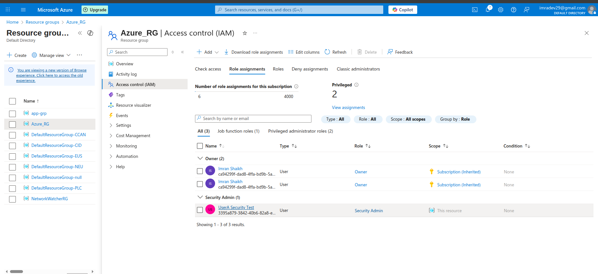
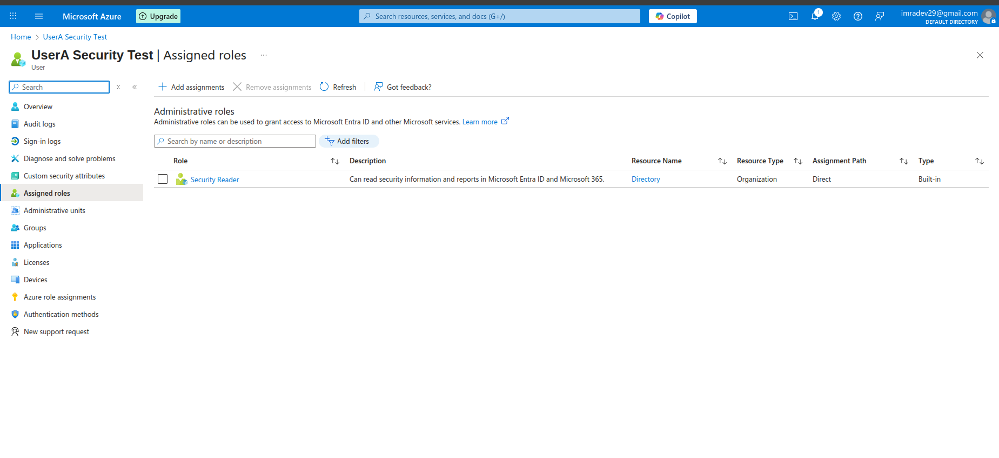

# Assignment: RBAC Security Roles and Permissions Analysis

## Assignment Overview
This assignment demonstrates the practical implementation of Azure RBAC (Role-Based Access Control) and Microsoft Entra ID roles, specifically analyzing the permissions and limitations of Security Admin and Security Reader roles.

## Assignment Scenario
**UserA** has been assigned the following roles:
1. **Security Admin** - RBAC role at the resource group level
2. **Security Reader** - Microsoft Entra ID role

## Role Assignments Implementation

### Step 1: Create Test User (UserA)

1. **Navigate to Microsoft Entra ID**
   - Go to Azure Portal → Microsoft Entra ID
   - Click "Users" → "+ New user" → "Create new user"

2. **Configure UserA**
   - **User principal name**: `usera@[yourdomain].onmicrosoft.com`
   - **Display name**: `UserA Security Test`
   - **First name**: `UserA`
   - **Last name**: `Security`
   - **Job title**: `Security Analyst`
   - Click "Create"


### Step 2: Assign Security Admin Role at Resource Group Level

1. **Navigate to Resource Group**
   - Go to Resource Groups → Select target resource group (e.g., `Azure-RG`)
   - Click "Access control (IAM)"

2. **Assign Security Admin Role**
   - Click "+ Add" → "Add role assignment"
   - **Role**: Security Admin
   - **Assign access to**: User, group, or service principal
   - **Select**: UserA Security Test
   - Click "Save"

3. **Verify Assignment**
   - Go to "Role assignments" tab
   - Confirm Security Admin role is assigned to UserA at resource group scope



### Step 3: Assign Security Reader Role in Microsoft Entra ID

1. **Navigate to Microsoft Entra ID Roles**
   - Go to Microsoft Entra ID → "Roles and administrators"
   - Search for "Security Reader" role
   - Click on "Security Reader"

2. **Add Assignment**
   - Click "+ Add assignments"
   - Search and select "UserA Security Test"
   - Click "Add"

3. **Verify Assignment**
   - Confirm UserA appears in the Security Reader role assignments
   - Note the assignment scope is at directory level



## Role Permissions Analysis

### Security Admin Role (RBAC - Resource Group Level)

#### Permissions Included:
- **Microsoft.Security/**: Full access to security-related resources
- **Microsoft.Network/networkSecurityGroups/**: Read, write, delete NSGs
- **Microsoft.Network/virtualNetworks/**: Limited network operations
- **Microsoft.Authorization/roleAssignments/**: Read role assignments
- **Microsoft.Resources/**: Read resource group and resources

#### Key Actions Allowed:
- Create and manage Network Security Groups
- Configure security policies and recommendations
- Manage security assessments and alerts
- Read virtual network configurations
- View resource group contents

### Security Reader Role (Entra ID - Directory Level)

#### Permissions Included:
- **Read security information**: Security reports, alerts, policies
- **Read directory objects**: Limited read access to directory
- **Read sign-in logs**: Access to authentication logs
- **Read audit logs**: View directory audit information

#### Key Actions Allowed:
- View security reports and dashboards
- Read security policies and configurations
- Access sign-in and audit logs
- View directory objects (read-only)

#### Key Restrictions:
- **Cannot create users**: No write permissions to directory
- **Cannot modify security settings**: Read-only access
- **Cannot manage groups**: No group management permissions

## Task Analysis: Can UserA Perform These Tasks?

### Task 1: Create a Virtual Network

**Answer: NO**

**Analysis:**
- **Security Admin role** at resource group level does NOT include virtual network creation permissions
- Required permission: `Microsoft.Network/virtualNetworks/write`
- Security Admin role focuses on security resources, not general networking
- UserA would need **Network Contributor** or **Contributor** role for VNet creation

**Test Verification:**
```bash
# UserA attempting to create VNet will receive:
# Error: "The client 'usera@domain.com' with object id 'xxx' does not have authorization 
# to perform action 'Microsoft.Network/virtualNetworks/write'"
```

*Screenshot: VNet creation attempt - Access denied*

### Task 2: Create a Network Security Group

**Answer: YES**

**Analysis:**
- **Security Admin role** explicitly includes NSG management permissions
- Required permission: `Microsoft.Network/networkSecurityGroups/write` ✓
- This is a core security resource that Security Admin can manage
- UserA can create, modify, and delete NSGs within the assigned resource group

**Test Verification:**
```bash
# UserA can successfully:
# 1. Create new NSG
# 2. Configure security rules
# 3. Associate NSG with subnets/NICs
# 4. Modify existing NSG rules
```


### Task 3: Create a New User in Microsoft Entra ID

**Answer: NO**

**Analysis:**
- **Security Reader role** in Entra ID provides READ-ONLY access
- Required permission: `microsoft.directory/users/create` (NOT included)
- Security Reader can only view users, not create or modify them
- UserA would need **User Administrator** or **Global Administrator** role for user creation

**Test Verification:**
```bash
# UserA attempting to create user will see:
# - No "New user" button visible in UI
# - If accessed via API: "Insufficient privileges to complete the operation"
```

*Screenshot: User creation attempt - Insufficient privileges*

## Detailed Permission Matrix

| Task | Required Permission | Security Admin (RG) | Security Reader (Entra ID) | Result |
|------|-------------------|-------------------|-------------------------|---------|
| Create VNet | `Microsoft.Network/virtualNetworks/write` | No | No | **NO** |
| Create NSG | `Microsoft.Network/networkSecurityGroups/write` | Yes | No | **YES** |
| Create User | `microsoft.directory/users/create` | No | No | **NO** |
| Read Security Logs | `microsoft.directory/auditLogs/allProperties/read` | No | Yes | **YES** |
| Modify NSG Rules | `Microsoft.Network/networkSecurityGroups/securityRules/write` | Yes | No | **YES** |
| View Users | `microsoft.directory/users/standard/read` | No | Yes | **YES** |

## Practical Testing Steps

### Test 1: Virtual Network Creation
1. Sign in as UserA
2. Navigate to Virtual Networks
3. Attempt to create new VNet
4. **Expected Result**: Access denied error

### Test 2: Network Security Group Creation
1. Sign in as UserA
2. Navigate to Network Security Groups
3. Create new NSG in assigned resource group
4. **Expected Result**: Successful creation

### Test 3: User Creation in Entra ID
1. Sign in as UserA
2. Navigate to Microsoft Entra ID → Users
3. Attempt to create new user
4. **Expected Result**: No create button or access denied

## Security Implications

### Principle of Least Privilege
- UserA has minimal required permissions for security tasks
- Cannot perform actions outside security domain
- Reduces risk of accidental or malicious changes

### Separation of Duties
- Security management separated from user management
- Network security separated from network infrastructure
- Audit trail maintained for all actions

### Compliance Benefits
- Clear role boundaries support compliance requirements
- Audit logs show exactly what UserA can and cannot do
- Role assignments can be reviewed and certified

## Recommendations

### For Enhanced Security Management
1. **Add Network Contributor** at resource group level if VNet management needed
2. **Consider Security Administrator** (Entra ID role) for broader security permissions
3. **Implement Privileged Identity Management** for just-in-time access

### For User Management
1. **Assign User Administrator** role if user creation required
2. **Use Groups** for bulk user management permissions
3. **Implement approval workflows** for sensitive operations

## Conclusion

**UserA with Security Admin (RBAC) and Security Reader (Entra ID) roles can do:**
-  Create and manage Network Security Groups
-  View security reports and logs
-  Configure security policies within assigned resource group

**UserA cannot:**
-  Create Virtual Networks (requires Network Contributor)
-  Create users in Microsoft Entra ID (requires User Administrator)
-  Modify directory-level security settings (read-only access)

This role combination provides focused security management capabilities while maintaining proper separation of duties and adhering to the principle of least privilege.
