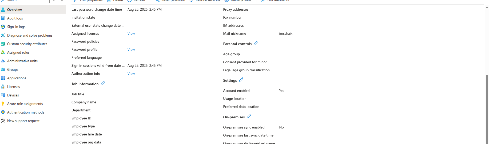
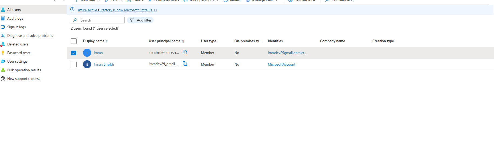
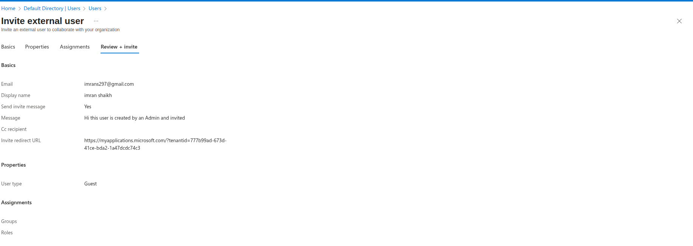

# Lab 1: Creating Users in Microsoft Entra ID

## Lab Overview
This lab covers creating and managing users in Microsoft Entra ID (formerly Azure Active Directory), configuring user properties, and understanding user management fundamentals.

## Prerequisites
- Azure subscription with appropriate permissions
- Global Administrator or User Administrator role in Entra ID
- Azure Portal access
- Understanding of identity and access management concepts

## Lab Objectives
- Create new users in Microsoft Entra ID
- Configure user properties and profiles
- Manage user authentication methods
- Understand different user types and creation methods
- Test user sign-in and access

## Step-by-Step Instructions

### Step 1: Access Microsoft Entra ID

1. **Navigate to Azure Portal**
   - Go to [portal.azure.com](https://portal.azure.com)
   - Sign in with your Azure credentials

2. **Access Microsoft Entra ID**
   - Search for "Microsoft Entra ID" in the search bar
   - Click on "Microsoft Entra ID" service
   - You'll see the Entra ID overview dashboard

*Screenshot: Microsoft Entra ID dashboard*

### Step 2: Create Internal User

1. **Navigate to Users**
   - In Entra ID, click "Users" in the left menu
   - Click "All users" to see existing users
   - Click "+ New user" → "Create new user"

2. **Configure User Identity**
   - **User principal name**: `imr.shaik@[yourdomain].onmicrosoft.com`
   - **Mail nickname**: `
imradev29gmail.onmicrosoft.com`
   - **Display name**: `Imran`
   - **Password**: 
     - Select "Auto-generate password"
     - Check "Show password" and copy it for later use

3. **Configure Properties**
   - **First name**: `Imran`
   - **Last name**: ``
   - **Job title**: `Software Developer`
   - **Department**: `IT`
   - **Usage location**: Select your country

4. **Configure Assignments**
   - **Groups**: Leave empty for now
   - **Roles**: Leave as default (User role)

5. **Create User**
   - Click "Create"
   - Note the temporary password provided

### Step 3: Create External User (Guest)

1. **Create Guest User**
   - Click "+ New user" → "Invite external user"
   - **Email address**: Enter external email (e.g., personal Gmail)
   - **Display name**: `Jane Smith (Guest)`
   - **Personal message**: `Welcome to our organization`

2. **Configure Guest Properties**
   - **Groups**: Leave empty
   - **Roles**: Leave as default (Guest role)

3. **Send Invitation**
   - Click "Invite"
   - The external user will receive an email invitation

### Step 6: Test User Access

1. **Test New User Sign-in**
   - Open incognito/private browser window
   - Go to [portal.azure.com](https://portal.azure.com)
   - Sign in with new user credentials:
     - Username: `john.doe@[yourdomain].onmicrosoft.com`
     - Password: [temporary password]

2. **Complete First Sign-in**
   - User will be prompted to change password
   - Set new password following policy requirements
   - Complete any additional security setup

3. **Verify Access**
   - Confirm user can access Azure Portal
   - Check available services and permissions
   - Note any access restrictions

## Key Learnings

### User Types in Entra ID
- **Internal Users**: Users created directly in your Entra ID tenant
- **External Users (Guests)**: Users from other organizations invited to collaborate
- **Synchronized Users**: Users synchronized from on-premises Active Directory

### User Management Best Practices
- **Naming Conventions**: Use consistent naming patterns
- **Temporary Passwords**: Always require password change on first sign-in
- **Profile Completeness**: Maintain complete user profiles
- **Regular Reviews**: Periodically review user accounts and permissions

## Troubleshooting

### Common Issues and Solutions

#### User Creation Fails
- **Issue**: Cannot create user due to licensing limits
- **Solution**:
  - Check available licenses in tenant
  - Remove unused user accounts
  - Purchase additional licenses if needed

#### Guest User Cannot Accept Invitation
- **Issue**: External user doesn't receive or cannot accept invitation
- **Solution**:
  - Check email spam/junk folders
  - Verify external email address is correct
  - Resend invitation from Entra ID portal

#### User Cannot Sign In
- **Issue**: User receives sign-in errors
- **Solution**:
  - Verify account is not blocked
  - Check password policy compliance
  - Ensure user has appropriate licenses

## Next Steps
- Configure Multi-Factor Authentication for users
- Implement Conditional Access policies
- Set up role-based access control
- Configure Privileged Identity Management

## Resource Cleanup
When lab is complete:
1. Delete test users created during lab
2. Remove test groups
3. Clean up any test licenses assigned
4. Review and remove any test configurations

