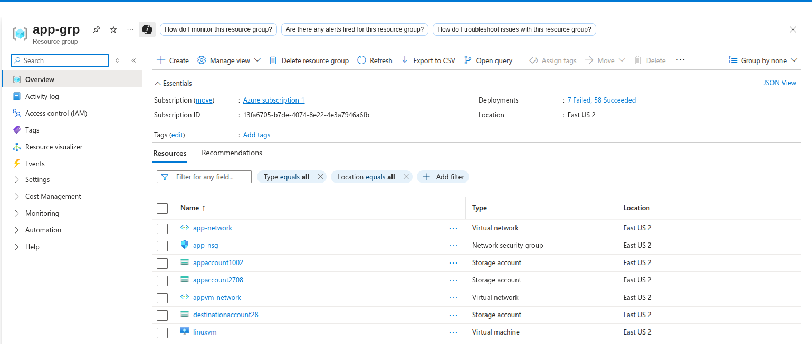
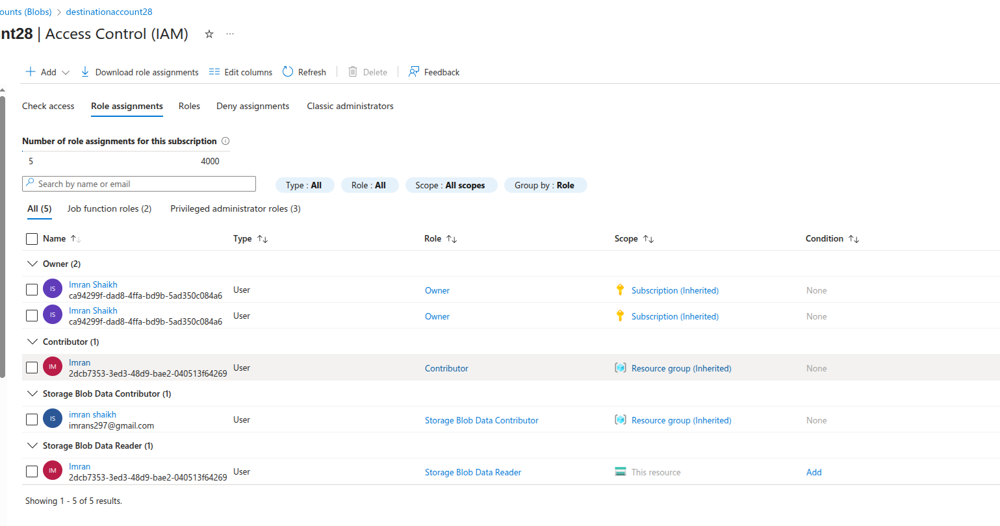

# Lab 2: Role-Based Access Control (RBAC) - Resource Level and Resource Group Assignments

## Lab Overview
This lab covers implementing Azure Role-Based Access Control (RBAC) at different scopes including resource level, resource group level, and subscription level. You'll learn to assign built-in roles like Contributor and understand access management fundamentals.

## Prerequisites
- Azure subscription with Owner or User Access Administrator permissions
- Microsoft Entra ID with users created (from Lab 1)
- Understanding of Azure resource hierarchy
- Access to Azure Portal

## Lab Objectives
- Understand Azure RBAC concepts and scope hierarchy
- Assign roles at different levels (subscription, resource group, resource)
- Configure Contributor role and other built-in roles
- Test and verify role assignments
- Monitor and audit role-based access

## RBAC Fundamentals

### Azure RBAC Components
- **Security Principal**: Who gets access (user, group, service principal)
- **Role Definition**: What actions are allowed (permissions)
- **Scope**: Where the access applies (subscription, resource group, resource)
- **Role Assignment**: Combines security principal + role + scope

### Scope Hierarchy
```
Management Group
└── Subscription
    └── Resource Group
        └── Resource
```

### Common Built-in Roles
- **Owner**: Full access including access management
- **Contributor**: Full access except access management
- **Reader**: Read-only access
- **User Access Administrator**: Manage user access only

## Step-by-Step Instructions

### Step 1: Prepare Test Environment

1. **Create Test Resource Group**
   - Go to Azure Portal
   - Click "Resource groups" → "+ Create"
   - **Resource group name**: `app-grp`
   - **Region**: Choose appropriate region
   - Click "Review + create" → "Create"

2. **Create Test Resources**
   - In `rg-rbac-test`, create:
     - Storage account: `rbacteststorage[uniqueid]`
     - Virtual network: `vnet-rbac-test`
   - These will be used for testing different access levels



### Step 2: Subscription-Level Role Assignment

1. **Navigate to Subscription**
   - Go to "Subscriptions" in Azure Portal
   - Select your subscription
   - Click "Access control (IAM)"

2. **Assign Reader Role at Subscription Level**
   - Click "+ Add" → "Add role assignment"
   - **Role**: Reader
   - **Assign access to**: User, group, or service principal
   - **Select**: Choose user created in Lab 1 (e.g., John Doe)
   - Click "Save"

3. **Verify Assignment**
   - Go to "Role assignments" tab
   - Filter by user name
   - Verify Reader role is assigned at subscription scope


### Step 3: Resource Group-Level Role Assignment

1. **Navigate to Resource Group**
   - Go to `app-grp` resource group
   - Click "Access control (IAM)"

2. **Assign Contributor Role**
   - Click "+ Add" → "Add role assignment"
   - **Role**: Contributor
   - **Assign access to**: User, group, or service principal
   - **Select**: Choose another user (e.g., Alice Johnson from bulk creation)
   - Click "Save"

3. **Assign Storage Blob Data Contributor**
   - Click "+ Add" → "Add role assignment"
   - **Role**: Storage Blob Data Contributor
   - **Select**: Choose another user (e.g., Bob Wilson)
   - Click "Save"

4. **View Effective Permissions**
   - Click "Check access"
   - Enter user name to see effective permissions
   - Review inherited and direct assignments


### Step 4: Resource-Level Role Assignment

1. **Navigate to Storage Account**
   - Go to the created storage account
   - Click "Access control (IAM)"

2. **Assign Storage Blob Data Reader**
   - Click "+ Add" → "Add role assignment"
   - **Role**: Storage Blob Data Reader
   - **Select**: Choose a user (e.g., Carol Davis)
   - Click "Save"

3. **Assign Virtual Machine Contributor to VNet**
   - Go to the virtual network resource
   - Click "Access control (IAM)"
   - Click "+ Add" → "Add role assignment"
   - **Role**: Network Contributor
   - **Select**: Choose a user
   - Click "Save"


### Step 5: Create Custom Role (Optional)

1. **Navigate to Subscription IAM**
   - Go to subscription → "Access control (IAM)"
   - Click "Roles" tab
   - Click "+ Add" → "Add custom role"

2. **Define Custom Role**
   - **Custom role name**: `Storage Account Manager`
   - **Description**: `Can manage storage accounts but not delete them`
   - **Baseline permissions**: Start from a role (Contributor)

3. **Configure Permissions**
   - **Actions**: 
     - `Microsoft.Storage/storageAccounts/*`
     - `Microsoft.Resources/subscriptions/resourceGroups/read`
   - **NotActions**:
     - `Microsoft.Storage/storageAccounts/delete`

4. **Set Assignable Scopes**
   - Add subscription or resource group scope
   - Click "Create"


## Key Learnings

### RBAC Scope Hierarchy
- **Inheritance**: Permissions flow down the hierarchy
- **Least Privilege**: Assign minimum required permissions
- **Scope Selection**: Choose appropriate scope for each assignment
- **Role Granularity**: Use specific roles rather than broad permissions

### Built-in Role Comparison
| Role | Scope | Permissions | Use Case |
|------|-------|-------------|----------|
| Owner | All levels | Full access + access management | Resource owners, admins |
| Contributor | All levels | Full access except access management | Developers, operators |
| Reader | All levels | Read-only access | Auditors, viewers |
| User Access Administrator | All levels | Manage access only | Security teams |

### Security Best Practices
- **Regular Reviews**: Conduct periodic access reviews
- **Just-in-Time Access**: Use PIM for privileged roles
- **Conditional Access**: Add additional security controls
- **Monitoring**: Continuously monitor access patterns

## Troubleshooting

### Common Issues and Solutions

#### Role Assignment Not Taking Effect
- **Issue**: User still cannot access resource after role assignment
- **Solution**:
  - Wait 5-10 minutes for propagation
  - Have user sign out and sign back in
  - Check for conflicting deny assignments
  - Verify role assignment scope is correct

#### Cannot Assign Roles
- **Issue**: "Access denied" when trying to assign roles
- **Solution**:
  - Verify you have Owner or User Access Administrator role
  - Check if there are deny assignments blocking the action
  - Ensure you're at the correct scope level
  - Contact subscription administrator

#### Inherited Permissions Not Working
- **Issue**: User should have access through inheritance but doesn't
- **Solution**:
  - Check parent scope role assignments
  - Verify no explicit deny assignments
  - Review conditional access policies
  - Check resource-specific permissions

#### Custom Role Issues
- **Issue**: Custom role not working as expected
- **Solution**:
  - Review action and notAction definitions
  - Check assignable scopes
  - Verify resource provider permissions
  - Test with built-in role first

## Use Cases and Scenarios

### Development Teams
- **Developers**: Contributor role on development resource groups
- **DevOps Engineers**: Broader access across multiple resource groups
- **Testers**: Reader access to production, Contributor to test environments

### Operations Teams
- **System Administrators**: Owner role on infrastructure resource groups
- **Database Administrators**: SQL DB Contributor on database resources
- **Network Administrators**: Network Contributor on networking resources

### Business Users
- **Finance Team**: Cost Management Reader for billing information
- **Compliance Team**: Reader access for audit purposes
- **Project Managers**: Reader access to project-specific resource groups

## Best Practices

### Role Assignment Strategy
- **Use Groups**: Assign roles to groups rather than individual users
- **Least Privilege**: Start with minimal permissions and add as needed
- **Regular Reviews**: Implement quarterly access reviews
- **Documentation**: Document business justification for each assignment

### Security Considerations
- **Privileged Roles**: Use PIM for high-privilege assignments
- **Emergency Access**: Maintain break-glass accounts
- **Monitoring**: Set up alerts for privilege escalation
- **Conditional Access**: Add additional security controls

### Operational Excellence
- **Automation**: Use ARM templates or scripts for consistent assignments
- **Standardization**: Create standard role assignment patterns
- **Training**: Train teams on RBAC principles
- **Governance**: Implement approval workflows for sensitive roles

## Next Steps
- Implement Privileged Identity Management (PIM)
- Configure Conditional Access policies
- Set up automated access reviews
- Implement Azure Policy for governance
- Configure monitoring and alerting
- Integrate with on-premises identity systems

## Resource Cleanup
When lab is complete:
1. Remove all test role assignments
2. Delete test users and groups
3. Delete test resource group and resources
4. Remove custom roles if created
5. Clean up conditional access policies
