# Lab 1: Azure Monitor - Alerts and Activity Log

## Lab Overview
This lab covers the fundamentals of Azure Monitor, focusing on creating alerts and monitoring activity logs. You'll learn to set up basic monitoring, configure alert rules, and understand activity log monitoring.

## Prerequisites
- Azure subscription with appropriate permissions
- Azure Portal access
- Basic understanding of Azure resources
- At least one Azure resource (VM, storage account, etc.) for monitoring

## Lab Objectives
- Understand Azure Monitor fundamentals
- Create and configure alert rules
- Set up activity log alerts
- Configure action groups for notifications
- Test and verify alert functionality
- Monitor and analyze activity logs

## Step-by-Step Instructions

### Step 1: Access Azure Monitor

1. **Navigate to Azure Monitor**
   - Go to Azure Portal
   - Search for "Monitor" in the search bar
   - Click on "Monitor" service
   - Explore the Monitor overview dashboard

2. **Understand Monitor Components**
   - **Metrics**: Performance data from resources
   - **Logs**: Detailed event and diagnostic data
   - **Alerts**: Notifications based on conditions
   - **Activity Log**: Subscription-level events

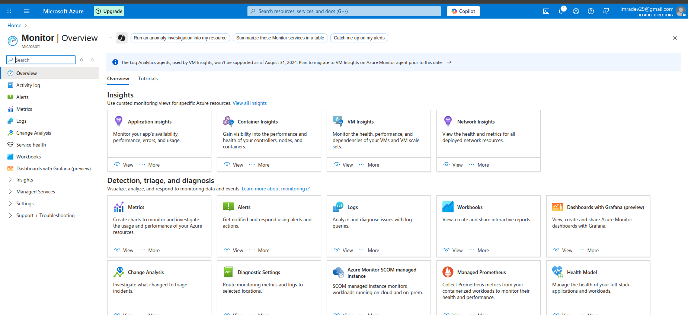

### Step 2: Create Action Group

1. **Navigate to Action Groups**
   - In Azure Monitor, click "Alerts"
   - Click "Action groups"
   - Click "+ Create action group"

2. **Configure Basic Settings**
   - **Subscription**: Select your subscription
   - **Resource group**: Create new `app-grp`
   - **Action group name**: `NotifyAdmins`
   - **Display name**: `NotifyAdmins`

3. **Configure Notifications**
   - Click "Notifications" tab
   - **Notification type**: Email/SMS/Push/Voice
   - **Name**: `SMS`
   - **Email**: `Enter you Number`
   - Click "OK"

4. **Configure Actions (Optional)**
   - Click "Actions" tab
   - **Action type**: Webhook, Logic App, Function, etc.
   - For now, leave empty
   - Click "Review + create"
   - Click "Create"

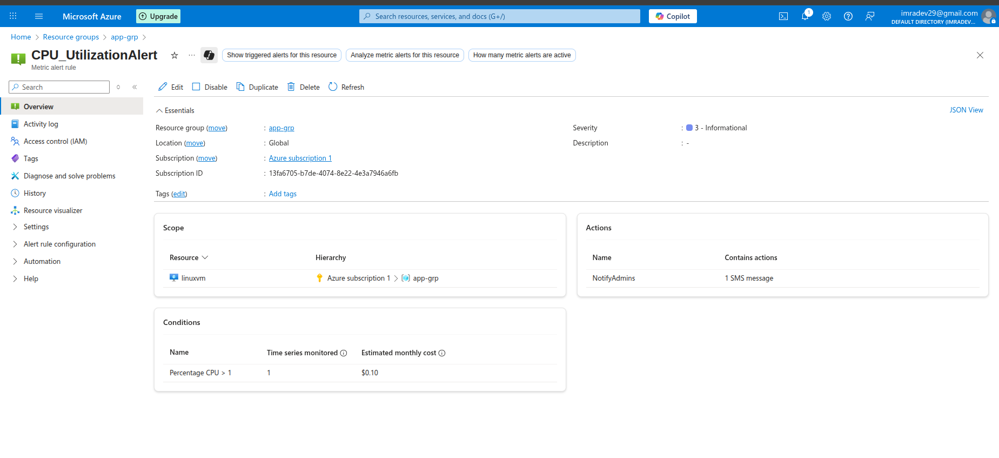

### Step 3: Create Metric Alert

1. **Create New Alert Rule**
   - Go to Monitor → "Alerts"
   - Click "+ Create" → "Alert rule"

2. **Select Resource**
   - Click "Select resource"
   - Choose a resource to monitor (e.g., Virtual Machine)
   - Click "Done"

3. **Configure Condition**
   - Click "Add condition"
   - **Signal type**: Metrics
   - **Signal name**: Select "Percentage CPU" (for VM)
   - **Threshold**: Static
   - **Operator**: Greater than
   - **Threshold value**: 1
   - **Aggregation granularity**: 5 minutes
   - **Frequency of evaluation**: Every 1 minute
   - Click "Done"

4. **Configure Actions**
   - Click "Add action groups"
   - Select the created action group `NotifyAdmins`
   - Click "Select"

5. **Configure Alert Details**
   - **Alert rule name**: `CPU_UtilizationAlert`
   - **Description**: `Alert when CPU usage exceeds 80%`
   - **Severity**: 3 - Informational
   - **Enable upon creation**: Yes
   - Click "Create alert rule"

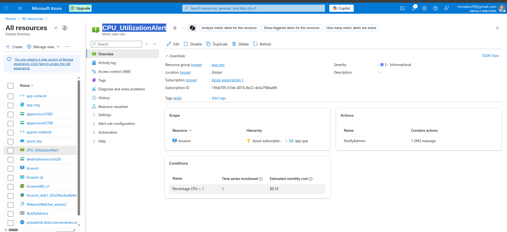

### Step 4: Create Activity Log Alert

1. **Create Activity Log Alert**
   - Go to Monitor → "Alerts"
   - Click "+ Create" → "Alert rule"

2. **Select Scope**
   - Click "Select resource"
   - **Resource type**: Subscription
   - Select your subscription
   - Click "Done"

3. **Configure Condition**
   - Click "Add condition"
   - **Signal type**: Activity Log
   - **Signal name**: "Create or Update Virtual Machine"
   - **Event level**: All selected
   - **Status**: All selected
   - **Event initiated by**: Leave empty (all users)
   - Click "Done"

4. **Configure Actions**
   - Add the same action group `NotifyAdmins`

5. **Configure Alert Details**
   - **Alert rule name**: `VM Creation Alert`
   - **Description**: `Alert when VM is created or updated`
   - **Severity**: 3 - Informational
   - Click "Create alert rule"

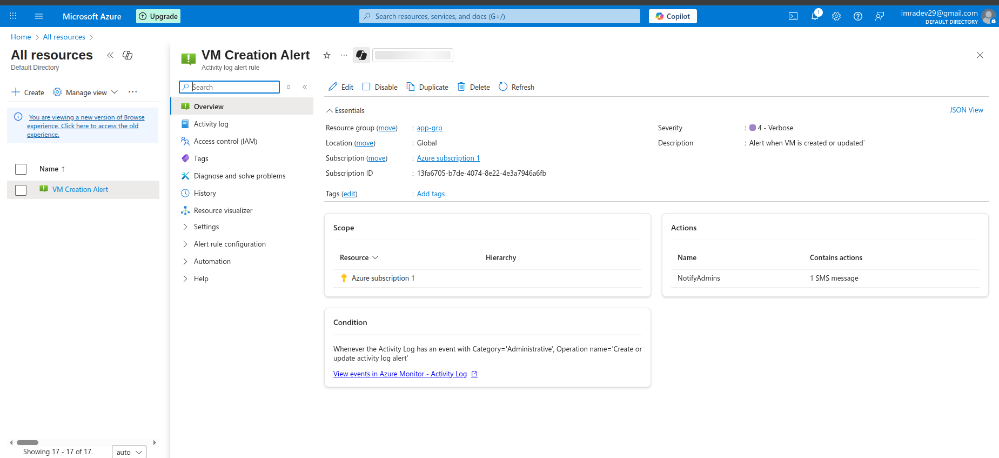   

### Step 5: Create Resource Health Alert

1. **Create Resource Health Alert**
   - Click "+ Create" → "Alert rule"
   - Select a specific resource (e.g., VM)

2. **Configure Condition**
   - Click "Add condition"
   - **Signal type**: Activity Log
   - **Signal name**: "Resource Health"
   - **Event level**: All selected
   - **Status**: All selected
   - **Current resource status**: Unavailable, Degraded
   - **Previous resource status**: Available
   - Click "Done"

3. **Configure Alert Details**
   - **Alert rule name**: `Resource Health Alert`
   - **Description**: `Alert when resource becomes unavailable`
   - **Severity**: 1 - Critical
   - Click "Create alert rule"

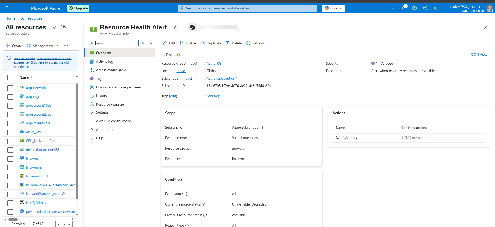

### Step 6: Test Alert Functionality

1. **Test Metric Alert**
   - If monitoring a VM, create high CPU load:
     ```bash
     # For Linux VM
     stress --cpu 4 --timeout 300s
     
     # For Windows VM (PowerShell)
     while($true) { Get-Process }
     ```
   - Wait for alert to trigger (may take 5-10 minutes)

2. **Test Activity Log Alert**
   - Create or modify a VM in your subscription
   - Check if activity log alert triggers
   - Verify email notification received

3. **Verify Alert Status**
   - Go to Monitor → "Alerts"
   - Check "Alert instances" for triggered alerts
   - Review alert details and timeline

  ### Recieving Alert On Mobile as i have notified as SMS

### Step 7: Monitor Activity Log

1. **Access Activity Log**
   - Go to Monitor → "Activity log"
   - Review recent activities in your subscription

2. **Filter Activity Log**
   - **Timespan**: Last 24 hours
   - **Resource group**: Select specific resource group
   - **Resource**: Select specific resource
   - **Operation**: Filter by operation type
   - **Status**: Success, Failed, etc.

3. **Analyze Activity Log Entries**
   - Click on specific log entries
   - Review detailed information:
     - Who performed the action
     - When it was performed
     - What resource was affected
     - Operation status and details

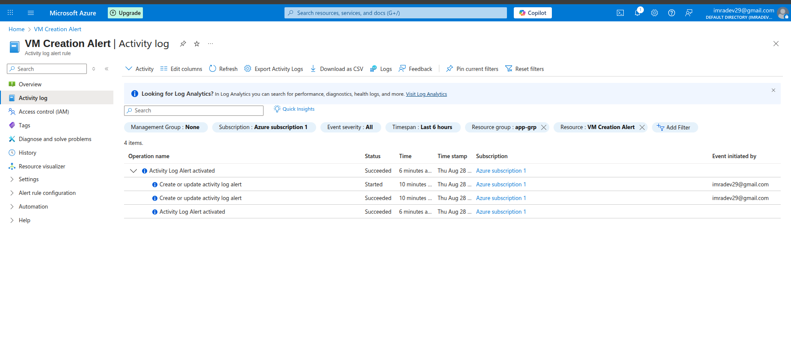
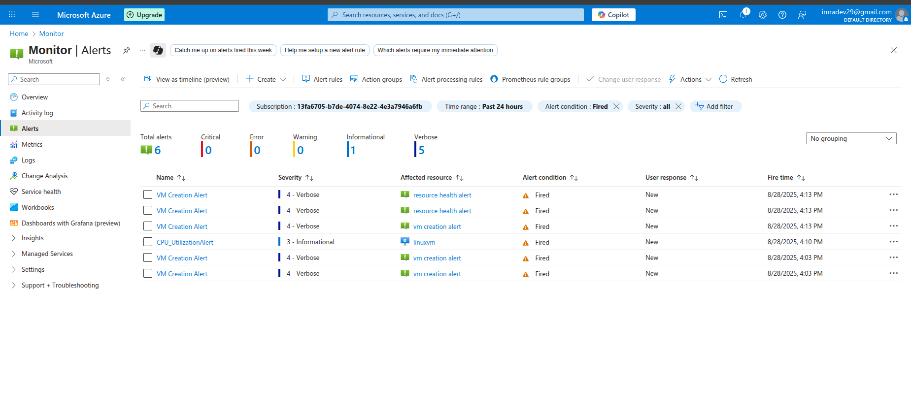

### Step 8: Create Custom Activity Log Query

1. **Access Log Analytics**
   - Go to Monitor → "Logs"
   - If prompted, create Log Analytics workspace

2. **Query Activity Log**
   ```kusto
   AzureActivity
   | where TimeGenerated > ago(24h)
   | where OperationNameValue contains "Microsoft.Compute/virtualMachines"
   | project TimeGenerated, Caller, OperationNameValue, ActivityStatusValue, ResourceGroup
   | order by TimeGenerated desc
   ```

3. **Save Query**
   - Click "Save"
   - **Name**: `VM Operations Last 24h`
   - **Category**: Custom
   - Click "Save"

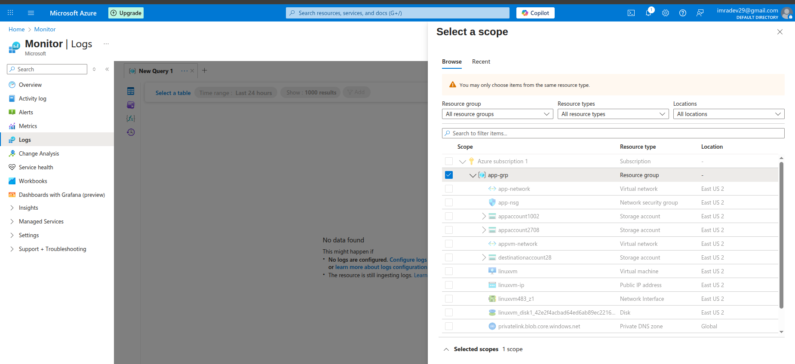

### Step 9: Configure Alert Processing Rules

1. **Create Alert Processing Rule**
   - Go to Monitor → "Alert processing rules"
   - Click "+ Create"

2. **Configure Scope**
   - **Resource group**: Select resource group
   - **Resource type**: All or specific types
   - Click "Next"

3. **Configure Rule Settings**
   - **Rule type**: Suppress notifications
   - **Apply rule on**: Specific action groups
   - **Action groups**: Select action group
   - **Suppression schedule**: Define maintenance windows
   - Click "Next"

4. **Configure Details**
   - **Rule name**: `Maintenance Window Suppression`
   - **Description**: `Suppress alerts during maintenance`
   - Click "Create"

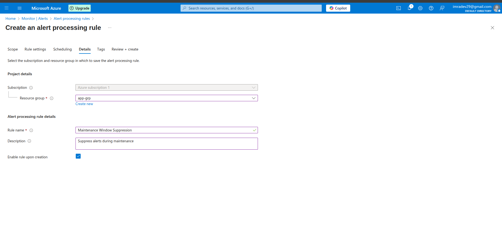
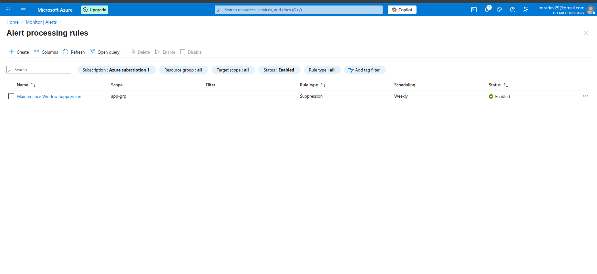

### Step 10: Monitor Alert Performance

1. **Review Alert Summary**
   - Go to Monitor → "Alerts"
   - Review alert summary dashboard
   - Check alert trends and patterns

2. **Analyze Alert History**
   - Click on specific alerts
   - Review alert timeline
   - Check resolution status
   - Analyze alert frequency
   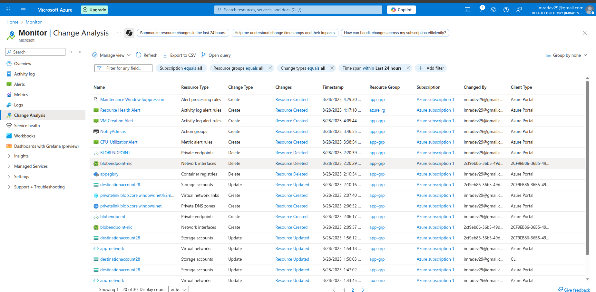

3. **Optimize Alert Rules**
   - Review false positive alerts
   - Adjust thresholds if needed
   - Modify evaluation frequency
   - Update action groups as required


## Verification Steps

### Alert Configuration Tests
- [ ] Action group created with email notification
- [ ] Metric alert created for CPU usage
- [ ] Activity log alert created for VM operations
- [ ] Resource health alert configured
- [ ] All alerts enabled and active

### Alert Functionality Tests
- [ ] Metric alert triggers when threshold exceeded
- [ ] Email notifications received
- [ ] Activity log alert triggers on resource changes
- [ ] Alert status updates correctly
- [ ] Alert processing rules working

### Monitoring Tests
- [ ] Activity log accessible and filterable
- [ ] Log Analytics queries working
- [ ] Custom queries saved and reusable
- [ ] Alert history available
- [ ] Performance metrics visible

## Key Learnings

### Azure Monitor Components
- **Metrics**: Real-time performance data
- **Logs**: Detailed diagnostic information
- **Alerts**: Proactive notifications
- **Activity Log**: Audit trail of operations

### Alert Types
- **Metric Alerts**: Based on performance metrics
- **Activity Log Alerts**: Based on administrative operations
- **Resource Health Alerts**: Based on resource availability
- **Log Search Alerts**: Based on log query results

### Best Practices
- **Meaningful Thresholds**: Set realistic alert thresholds
- **Appropriate Severity**: Use correct severity levels
- **Action Groups**: Organize notifications effectively
- **Alert Suppression**: Use processing rules for maintenance

## Troubleshooting

### Common Issues and Solutions

#### Alerts Not Triggering
- **Issue**: Alert rule created but not firing
- **Solution**:
  - Check alert rule is enabled
  - Verify threshold values are appropriate
  - Ensure evaluation frequency is correct
  - Check resource is generating metrics

#### Email Notifications Not Received
- **Issue**: Alerts trigger but no email received
- **Solution**:
  - Check email address in action group
  - Verify email not in spam folder
  - Confirm action group is linked to alert rule
  - Test action group independently

#### Activity Log Alerts Not Working
- **Issue**: Activity log alerts not triggering
- **Solution**:
  - Verify alert scope includes target resources
  - Check activity log signal configuration
  - Ensure operations are occurring in scope
  - Review alert rule conditions

#### High Alert Volume
- **Issue**: Too many alert notifications
- **Solution**:
  - Adjust alert thresholds
  - Implement alert processing rules
  - Use alert grouping
  - Review alert logic and conditions

## Use Cases and Scenarios

### Infrastructure Monitoring
- **Server Performance**: CPU, memory, disk usage alerts
- **Network Issues**: Connectivity and bandwidth alerts
- **Storage Capacity**: Disk space and IOPS alerts
- **Service Availability**: Uptime and health monitoring

### Security Monitoring
- **Administrative Actions**: Track privileged operations
- **Resource Changes**: Monitor configuration changes
- **Access Patterns**: Unusual access attempts
- **Compliance**: Audit trail maintenance

### Cost Management
- **Resource Creation**: Track new resource deployment
- **Usage Spikes**: Monitor unexpected usage increases
- **Budget Alerts**: Cost threshold notifications
- **Resource Optimization**: Identify underutilized resources

## Best Practices

### Alert Design
- **Clear Naming**: Use descriptive alert names
- **Appropriate Severity**: Match severity to business impact
- **Actionable Alerts**: Ensure alerts require action
- **Documentation**: Document alert purpose and response

### Notification Management
- **Role-Based**: Send alerts to appropriate teams
- **Escalation**: Implement escalation procedures
- **Suppression**: Use maintenance windows
- **Testing**: Regularly test notification channels

### Performance Optimization
- **Threshold Tuning**: Regularly review and adjust
- **Frequency**: Balance responsiveness with noise
- **Aggregation**: Use appropriate time windows
- **Filtering**: Reduce false positives

## Next Steps
- Configure Log Analytics workspace
- Implement Application Insights
- Set up custom dashboards
- Configure automated responses
- Integrate with ITSM tools
- Implement advanced alerting scenarios

## Resource Cleanup
When lab is complete:
1. Delete all alert rules
2. Delete action groups
3. Delete resource group
4. Remove any test resources created
5. Verify no ongoing charges
