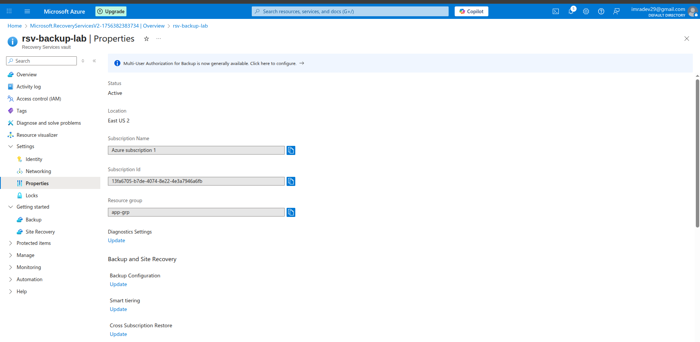
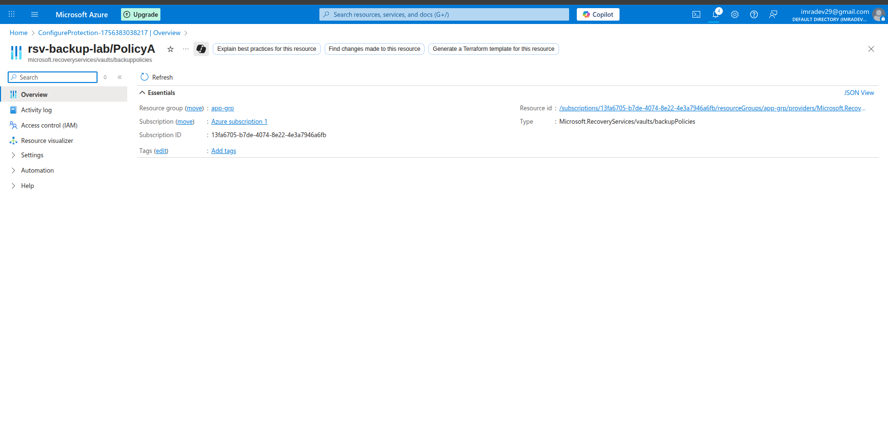
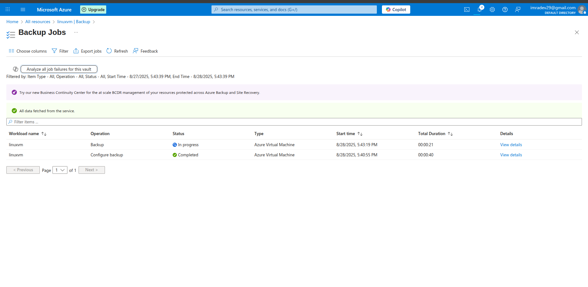
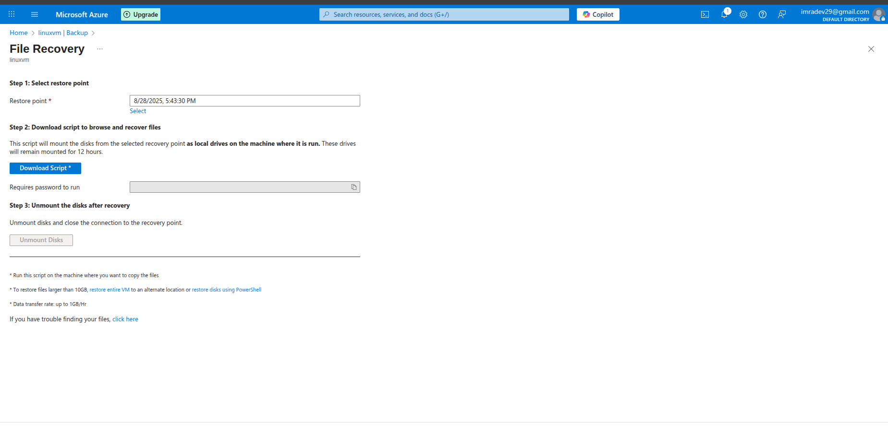

# Lab 2: Azure VM Backup, File Restore, and VM Restore

## Lab Overview
This lab covers comprehensive Azure Backup scenarios including VM backup configuration, file-level restore operations, and complete VM restore procedures using Azure Recovery Services Vault.

## Prerequisites
- Azure subscription with appropriate permissions
- Azure Portal access
- At least one Azure VM for backup testing
- Understanding of backup and recovery concepts

## Lab Objectives
- Create and configure Recovery Services Vault
- Set up Azure VM backup policies
- Perform VM backup operations
- Execute file-level restore from backup
- Perform complete VM restore
- Monitor and manage backup operations

## Step-by-Step Instructions

### Step 1: Create Recovery Services Vault

1. **Navigate to Recovery Services**
   - Go to Azure Portal
   - Search for "Recovery Services vaults"
   - Click "+ Create"

2. **Configure Vault Settings**
   - **Subscription**: Select your subscription
   - **Resource group**: Create new `app-grp`
   - **Vault name**: `rsv-backup-lab`
   - **Region**: Same as your VMs
   - Click "Review + create"
   - Click "Create"

3. **Configure Vault Properties**
   - Go to created vault
   - Click "Properties" under Settings
   - **Backup Configuration**: 
     - Storage replication type: Geo-redundant storage (GRS)
   - **Security Settings**:
     - Soft Delete: Enabled
     - Cross Region Restore: Enabled (if available)
   - Click "Save"



### Step 2: Create Backup Policy

1. **Access Backup Policies**
   - In Recovery Services Vault
   - Click "Backup policies" under Manage
   - Click "+ Add"

2. **Configure VM Backup Policy**
   - **Policy type**: Azure Virtual Machine
   - **Policy name**: `PolicyA`
   - **Backup schedule**:
     - Frequency: Daily
     - Time: 2:00 AM
     - Timezone: Your local timezone
   - **Retention range**:
     - Daily backup retention: 30 days
     - Weekly backup retention: 12 weeks (Sunday)
     - Monthly backup retention: 12 months (First Sunday)
     - Yearly backup retention: 5 years (First Sunday of January)
   - Click "Create"

3. **Create Additional Policy**
   - Create another policy: `PolicyA`
   - **Frequency**: Weekly (Sunday)
   - **Retention**: Customize as needed
   - Click "Create"



### Step 3: Configure VM Backup

1. **Start Backup Configuration**
   - In Recovery Services Vault
   - Click "Backup" under Getting Started
   - **Where is your workload running?**: Azure
   - **What do you want to backup?**: Virtual machine
   - Click "Backup"

2. **Select Backup Policy**
   - **Backup policy**: Select `PolicyA`
   - Click "Add" to select VMs

3. **Select Virtual Machines**
   - Choose VMs to backup (select at least one)
   - Click "OK"
   - Click "Enable backup"

4. **Verify Backup Configuration**
   - Go to "Backup items" under Protected items
   - Verify VMs appear in the list
   - Check backup status



### Step 4: Trigger Initial Backup

1. **Start Backup Now**
   - Go to "Backup items" → "Azure Virtual Machine"
   - Click on your VM
   - Click "Backup now"
   - **Retain backup till**: Select date (e.g., 30 days from now)
   - Click "OK"

2. **Monitor Backup Progress**
   - Go to "Backup jobs" under Monitoring and Reports
   - Monitor backup job progress
   - Wait for backup to complete (may take 20-60 minutes)

3. **Verify Backup Completion**
   - Check job status shows "Completed"
   - Go to VM backup item
   - Verify recovery points are created


### Step 5: File-Level Restore

1. **Access File Recovery**
   - Go to "Backup items" → "Azure Virtual Machine"
   - Click on your VM
   - Click "File Recovery"

2. **Select Recovery Point**
   - Choose a recovery point from available list
   - Click "Download Executable"
   - **For Windows**: Download .exe file
   - **For Linux**: Download Python script

3. **Run Recovery Script**
   - **On Windows VM**:
     ```powershell
     # Download and run the executable
     # Follow on-screen instructions
     # Script will mount backup as drive letters
     ```
   - **On Linux VM**:
     ```bash
     # Make script executable
     chmod +x recovery_script.py
     
     # Run script with sudo
     sudo python recovery_script.py
     
     # Follow prompts to mount backup
     ```
     

4. **Browse and Restore Files**
   - Navigate to mounted backup drive/directory
   - Copy required files to desired location
   - **Example restoration**:
     ```bash
     # Copy specific files
     cp /backup_mount/home/user/important_file.txt /home/user/restored_file.txt
     
     # Copy entire directory
     cp -r /backup_mount/var/www/html /var/www/html_restored
     ```

5. **Unmount and Cleanup**
   - After file recovery, unmount the backup
   - **Windows**: Use Disk Management to detach
   - **Linux**: 
     ```bash
     sudo umount /backup_mount
     ```

### Step 6: Complete VM Restore

1. **Initiate VM Restore**
   - Go to "Backup items" → "Azure Virtual Machine"
   - Click on your VM
   - Click "Restore VM"

2. **Select Restore Point**
   - Choose recovery point for restore
   - Click "OK"

3. **Configure Restore Options**
   - **Restore Type**: 
     - **Create new**: Create new VM from backup
     - **Replace existing**: Replace current VM (use carefully)
   - **Virtual machine name**: `vm-restored-test`
   - **Resource group**: Select or create new
   - **Virtual network**: Select VNet
   - **Subnet**: Select subnet
   - **Storage account**: Select for staging

4. **Advanced Restore Configuration**
   - **Restore configuration**: 
     - Create new VM
     - Restore disks only
     - Cross Region Restore (if enabled)
   - **Managed Disks**: Enable if original VM uses managed disks
   - **Availability Set**: Configure if needed

5. **Start Restore Process**
   - Review all settings
   - Click "Restore"
   - Monitor restore job progress


### Step 7: Cross-Region Restore (If Available)

1. **Access Cross-Region Restore**
   - In Recovery Services Vault
   - Click "Backup items"
   - Switch to "Secondary Region" tab
   - Select VM backup item

2. **Configure Cross-Region Restore**
   - Click "Restore VM"
   - Select recovery point
   - **Restore Type**: Create new
   - **Region**: Secondary region
   - Configure VM settings for secondary region

3. **Monitor Cross-Region Restore**
   - Check restore job in secondary region
   - Verify VM creation in target region


### Step 8: Monitor and Manage Backups

1. **Backup Dashboard**
   - Go to Recovery Services Vault overview
   - Review backup summary
   - Check backup health status
   - Monitor storage consumption

2. **Backup Reports**
   - Go to "Backup Reports" under Monitoring and Reports
   - Configure Log Analytics workspace if needed
   - View backup compliance reports
   - Analyze backup trends

3. **Backup Alerts**
   - Go to "Backup Alerts" under Monitoring and Reports
   - Review any backup failures or warnings
   - Configure alert notifications
   - Set up email notifications for backup issues


### Step 9: Test Restored VM

1. **Verify Restored VM**
   - Go to Virtual Machines
   - Find restored VM
   - Check VM status and configuration
   - Verify network connectivity

2. **Test VM Functionality**
   - Connect to restored VM (RDP/SSH)
   - Verify applications and services
   - Check data integrity
   - Test network connectivity

3. **Compare with Original**
   - Compare restored VM with original
   - Verify all data is present
   - Check system configuration
   - Validate application functionality


### Step 10: Backup Management and Optimization

1. **Modify Backup Policy**
   - Go to "Backup policies"
   - Select existing policy
   - Click "Modify"
   - Update retention settings
   - Change backup frequency if needed
   - Save changes

2. **Stop Backup (If Needed)**
   - Go to "Backup items"
   - Select VM
   - Click "Stop backup"
   - Choose option:
     - Retain backup data
     - Delete backup data
   - Confirm action

3. **Backup Cost Optimization**
   - Review backup storage consumption
   - Analyze retention requirements
   - Consider policy adjustments
   - Monitor backup costs in Cost Management


## Key Learnings

### Azure Backup Components
- **Recovery Services Vault**: Central backup management
- **Backup Policies**: Define schedule and retention
- **Recovery Points**: Point-in-time backup snapshots
- **Backup Items**: Protected resources

### Backup Types
- **File-Level Restore**: Granular file recovery
- **VM Restore**: Complete virtual machine recovery
- **Cross-Region Restore**: Disaster recovery capability
- **Instant Restore**: Fast recovery from snapshots

### Best Practices
- **Regular Testing**: Test restore procedures regularly
- **Retention Planning**: Balance cost and compliance needs
- **Monitoring**: Continuous backup health monitoring
- **Documentation**: Document restore procedures

## Troubleshooting

### Common Issues and Solutions

#### Backup Failures
- **Issue**: VM backup fails consistently
- **Solution**:
  - Check VM agent status and update
  - Verify sufficient storage space
  - Check network connectivity
  - Review backup policy settings

#### File Recovery Issues
- **Issue**: Cannot mount backup for file recovery
- **Solution**:
  - Ensure VM has internet connectivity
  - Check firewall settings
  - Verify script execution permissions
  - Try different recovery point

#### VM Restore Failures
- **Issue**: VM restore operation fails
- **Solution**:
  - Check target resource group permissions
  - Verify storage account accessibility
  - Ensure sufficient quota in target region
  - Review network configuration requirements

#### Performance Issues
- **Issue**: Backup or restore operations are slow
- **Solution**:
  - Check VM performance during backup
  - Verify network bandwidth
  - Consider backup window timing
  - Review storage account performance

## Use Cases and Scenarios

### Disaster Recovery
- **Regional Outage**: Cross-region restore capability
- **Data Center Failure**: Complete VM recovery
- **Ransomware Protection**: Clean backup restoration
- **Hardware Failure**: Quick VM replacement

### Data Protection
- **Accidental Deletion**: File-level recovery
- **Configuration Errors**: System state restoration
- **Application Issues**: Point-in-time recovery
- **Compliance**: Long-term data retention

### Business Continuity
- **Planned Maintenance**: Backup before changes
- **Testing Environments**: Create test VMs from backups
- **Migration**: Move VMs between regions
- **Scaling**: Restore VMs in different sizes

## Best Practices

### Backup Strategy
- **Regular Schedules**: Consistent backup timing
- **Retention Policies**: Align with business requirements
- **Testing**: Regular restore testing
- **Documentation**: Maintain recovery procedures

### Security Considerations
- **Access Control**: Limit backup management access
- **Encryption**: Ensure backup encryption
- **Monitoring**: Track backup access and changes
- **Compliance**: Meet regulatory requirements

### Cost Optimization
- **Policy Tuning**: Optimize retention periods
- **Storage Tiers**: Use appropriate storage types
- **Monitoring**: Track backup costs
- **Cleanup**: Remove unnecessary backups

## Next Steps
- Implement Azure Site Recovery for full DR
- Configure backup for other Azure services
- Set up automated backup testing
- Integrate with monitoring and alerting
- Implement backup governance policies
- Explore Azure Backup Center for centralized management
