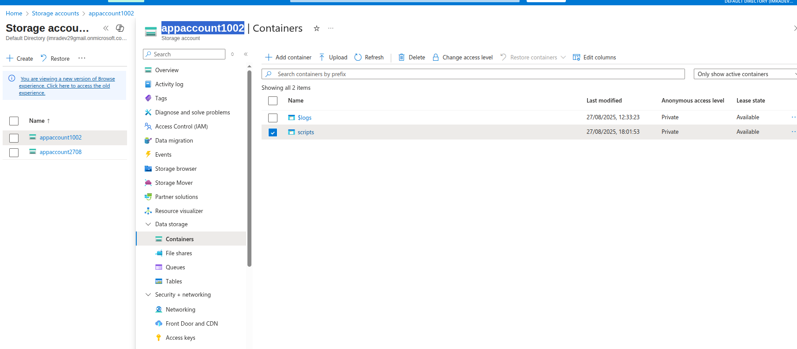
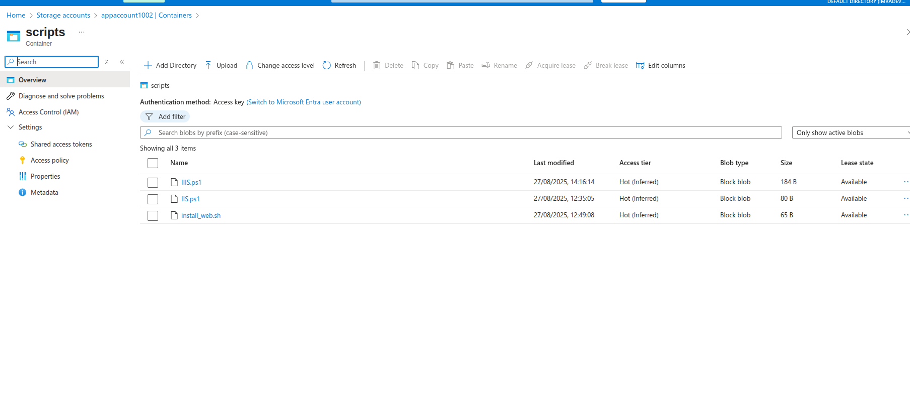
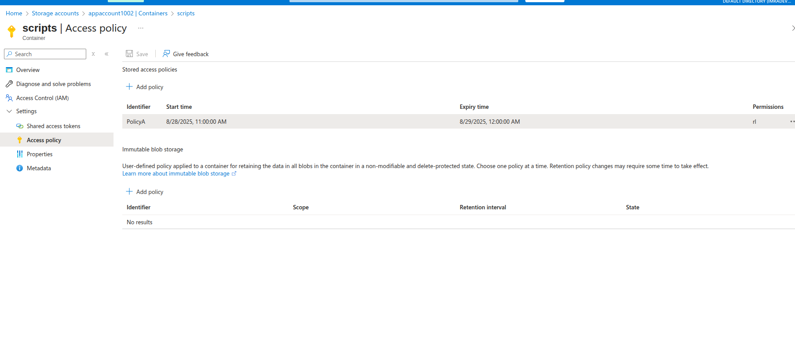
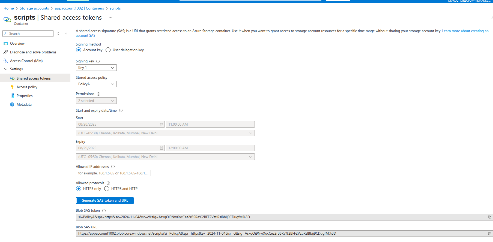
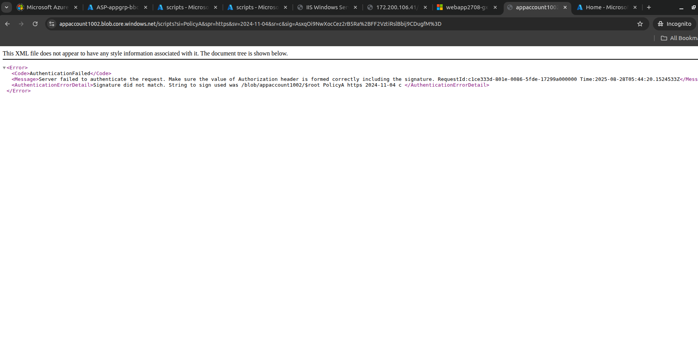
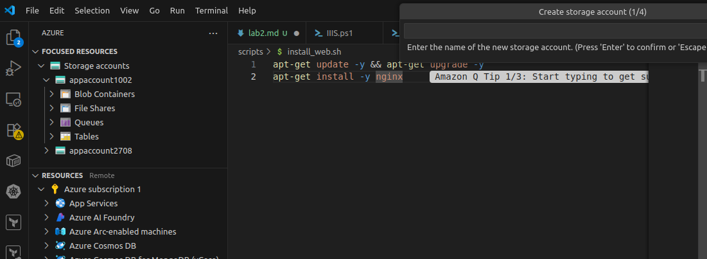

# Lab 1: Azure Storage Account - Stored Access Policies

## Lab Overview
This lab covers creating Azure Storage Account, configuring containers, implementing Stored Access Policies, and managing secure access to blob storage with hands-on practice.

## Prerequisites
- Azure subscription with appropriate permissions
- Azure Portal access
- Basic understanding of cloud storage concepts
- Web browser for testing access

## Lab Objectives
- Create Azure Storage Account
- Configure blob containers
- Implement Stored Access Policies
- Generate and manage SAS tokens
- Test secure access to storage resources
- Monitor and manage access permissions

## Step-by-Step Instructions

### Step 1: Create Azure Storage Account

1. **Navigate to Azure Portal**
   - Go to [portal.azure.com](https://portal.azure.com)
   - Sign in with your Azure credentials

2. **Create Storage Account**
   - Click "Create a resource" → "Storage account"
   - Fill in basic details:
     - **Subscription**: Select your subscription
     - **Resource group**: Create new `app-grp`
     - **Storage account name**: `appaccount1002` (must be globally unique)
     - **Region**: Choose appropriate region
     - **Performance**: Standard
     - **Redundancy**: Locally-redundant storage (LRS)

3. **Advanced Settings**
   - **Security**: Enable secure transfer required
   - **Access tier**: Hot
   - **Blob public access**: Disabled

4. **Review and Create**
   - Click "Review + create"
   - Verify configuration
   - Click "Create"

### Step 2: Create Blob Containers

1. **Navigate to Storage Account**
   - Go to created storage account
   - Click "Containers" under Data storage

2. **Create Container 1**
   - Click "+ Container"
   - **Name**: `scripts`
   - **Public access level**: Private (no anonymous access)
   - Click "Create"

### Step 3: Upload Sample Files

1. **Upload to Documents Container**
   - Click on `scripts` container
   - Click "Upload"
   - Select sample document files (PDF, DOCX, TXT)
   - Click "Upload"

2. **Upload to Images Container**
   - Click on `files` container
   - Click "Upload"
   - Select sample image files (JPG, PNG)
   - Click "Upload"

### Step 4: Create Stored Access Policy

1. **Navigate to Access Policy**
   - Go to storage account
   - Click "Access keys" to view account keys
   - Go to "Containers" → Select `Scripts` container
   - Click "Access policy"

2. **Create Stored Access Policy**
   - Click "+ Add policy"
   - **Identifier**: `ReadOnlyPolicy`
   - **Permissions**: Read, List
   - **Start time**: Current date/time
   - **Expiry time**: 30 days from now
   - Click "OK"

2. **Save Policies**
   - Click "Save" to apply policies

### Step 5: Generate SAS Tokens Using Stored Access Policies

1. **Generate SAS for Read-Only Access**
   - Go to `Scripts` container
   - Select a file
   - Click "Generate SAS"
   - **Permissions**: Use stored access policy
   - **Stored access policy**: Select `ReadOnlyPolicy`
   - **Start time**: Current time
   - **Expiry time**: Will use policy expiry
   - Click "Generate SAS token and URL"
   - Copy the SAS URL

2. **Generate SAS for Read-Write Access**
   - Select another file in `documents` container
   - Click "Generate SAS"
   - **Stored access policy**: Select `ReadWritePolicy`
   - Click "Generate SAS token and URL"
   - Copy the SAS URL

### Step 6: Test Access with SAS Tokens

1. **Test Read-Only Access**
   - Open new browser tab/incognito window
   - Paste the read-only SAS URL
   - Verify file can be downloaded
   - Try to modify (should fail)

2. **Test Read-Write Access**
   - Open new browser tab
   - Paste the read-write SAS URL
   - Verify file can be accessed
   - Test upload capabilities (if applicable)

3. **Test Public Container Access**
   - Get public URL of file in `public-files` container
   - Access without SAS token
   - Verify anonymous access works

### Azure Storage Account
- **Blob Storage**: Object storage for unstructured data
- **Access Tiers**: Hot, Cool, Archive for cost optimization
- **Redundancy Options**: LRS, GRS, ZRS for data protection
- **Security**: Multiple layers of access control

### Stored Access Policies
- **Centralized Management**: Control access from one location
- **Revocation**: Instantly revoke access by deleting policy
- **Flexibility**: Different policies for different use cases
- **Time-bound Access**: Automatic expiry of permissions

### SAS Tokens
- **Granular Permissions**: Specific operations allowed
- **Time-limited**: Automatic expiry for security
- **Protocol Restrictions**: HTTPS-only for secure access
- **IP Restrictions**: Limit access to specific networks

## Troubleshooting

### Common Issues and Solutions

#### Cannot Access Storage Account
- **Issue**: Access denied or not found
- **Solution**:
  - Verify storage account name is correct
  - Check resource group and subscription
  - Ensure account exists and is not deleted

#### SAS Token Not Working
- **Issue**: Access denied with valid SAS token
- **Solution**:
  - Check token expiry time
  - Verify permissions match required operations
  - Ensure stored access policy still exists
  - Check for clock skew (time differences)

#### Files Not Uploading
- **Issue**: Upload fails or times out
- **Solution**:
  - Check file size limits
  - Verify write permissions in SAS token
  - Ensure container exists
  - Check network connectivity

#### Public Access Not Working
- **Issue**: Cannot access public container anonymously
- **Solution**:
  - Verify container public access level
  - Check storage account allows blob public access
  - Ensure correct URL format
  - Clear browser cache

## Security Best Practices

### Access Control
- **Principle of Least Privilege**: Grant minimum required permissions
- **Time-bound Access**: Use expiry times for all SAS tokens
- **Regular Review**: Periodically review and rotate access keys
- **Monitor Usage**: Track access patterns and anomalies

### Network Security
- **HTTPS Only**: Always use secure protocols
- **IP Restrictions**: Limit access to known IP ranges
- **Private Endpoints**: Use for internal access
- **Firewall Rules**: Configure storage account firewall

### Data Protection
- **Encryption**: Enable encryption at rest and in transit
- **Backup**: Implement backup strategies
- **Versioning**: Enable blob versioning for data recovery
- **Soft Delete**: Enable soft delete for accidental deletion protection

## Next Steps
- Implement Azure Storage lifecycle management
- Configure storage account firewall rules
- Set up storage analytics and monitoring
- Explore Azure Storage encryption options
- Implement cross-origin resource sharing (CORS)
- Configure storage account networking

## Resource Cleanup
When lab is complete:
1. Delete all containers and their contents
2. Delete stored access policies
3. Delete storage account
4. Delete resource group `rg-storage-lab`
5. Verify no ongoing charges

