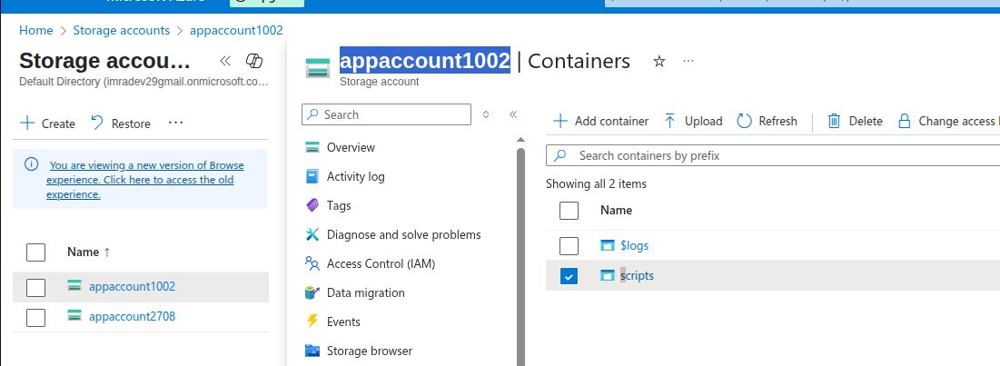
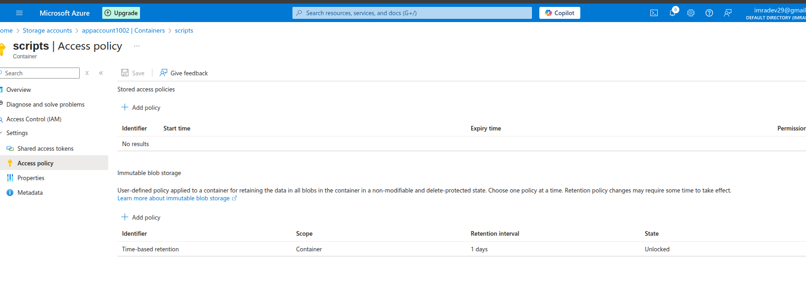
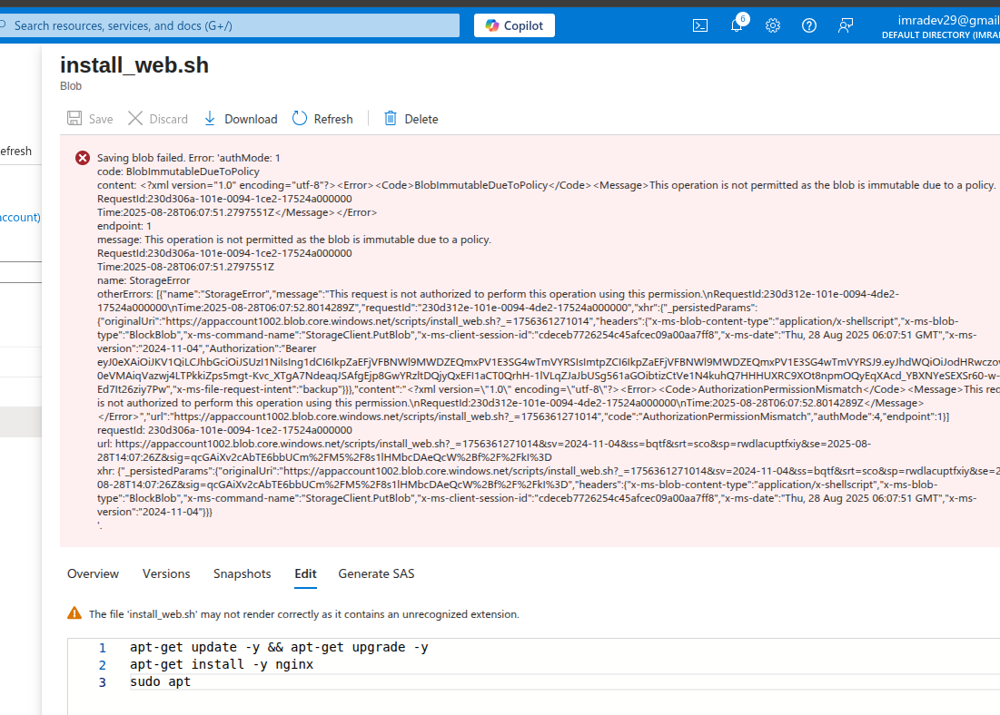

# Lab 2: Azure Blob Storage - Immutable Blob Storage

## Lab Overview
This lab covers implementing immutable blob storage in Azure, configuring time-based retention policies, legal holds, and understanding WORM (Write Once, Read Many) compliance for data protection.

## Prerequisites
- Azure subscription with appropriate permissions
- Azure Portal access
- Existing storage account or ability to create new one
- Understanding of compliance and data retention requirements

## Lab Objectives
- Configure immutable blob storage
- Implement time-based retention policies
- Apply and manage legal holds
- Test immutability features
- Understand compliance scenarios
- Monitor and manage immutable storage

## Step-by-Step Instructions

### Step 1: Create Storage Account with Immutable Support

1. **Navigate to Azure Portal**
   - Go to [portal.azure.com](https://portal.azure.com)
   - Sign in with your Azure credentials

2. **Create Storage Account**
   - Click "Create a resource" → "Storage account"
   - Fill in basic details:
     - **Subscription**: Select your subscription
     - **Resource group**: Create new `app-grp`
     - **Storage account name**: `appaccount1002`
     - **Region**: Choose appropriate region
     - **Performance**: Standard
     - **Redundancy**: Geo-redundant storage (GRS)

3. **Advanced Settings**
   - **Security**: Enable secure transfer required
   - **Access tier**: Hot
   - **Blob public access**: Disabled
   - **Versioning**: Enabled
   - **Change feed**: Enabled

4. **Data Protection**
   - **Enable soft delete for blobs**: 7 days
   - **Enable soft delete for containers**: 7 days
   - **Enable versioning**: Yes

### Step 2: Create Container for Immutable Storage

1. **Navigate to Storage Account**
   - Go to created storage account
   - Click "Containers" under Data storage

2. **Create Immutable Container**
   - Click "+ Container"
   - **Name**: `Scripts`
   - **Public access level**: Private
   - Click "Create"

3. **Create Additional Containers**
   - Create container: `Scripts`
   - Create container: `financial-data`

### Step 3: Configure Time-Based Retention Policy

1. **Access Container Settings**
   - Click on `Scripts` container
   - Click "Access policy" in the left menu

2. **Add Time-Based Retention Policy**
   - Click "Add policy" under Immutable blob storage
   - **Policy type**: Time-based retention
   - **Retention period**: 1 days
   - **Retention period unit**: Days
   - Click "OK"

3. **Lock the Policy (Optional)**
   - For production: Click "Lock policy"
   - **Warning**: Locked policies cannot be deleted or shortened
   - For lab: Leave unlocked for testing

### Step 5: Test Immutability Features

1. **Attempt to Delete File**
   - Select an uploaded file
   - Click "Delete"
   - Observe the error message about retention policy
   - Confirm deletion is blocked

2. **Attempt to Modify File**
   - Try to upload a file with the same name
   - Observe that overwrite is blocked
   - Confirm immutability is enforced

3. **Check File Properties**
   - Click on a file
   - View "Properties"
   - Note the "Delete after" date
   - Verify retention period calculation

### Step 6: Monitor and Audit Immutable Storage

1. **View Container Metrics**
   - Go to storage account
   - Click "Insights" under Monitoring
   - Review blob storage metrics
   - Check access patterns

2. **Audit Access Attempts**
   - Enable diagnostic settings
   - Configure logging for storage operations
   - Review logs for deletion attempts
   - Monitor compliance violations

3. **Generate Compliance Report**
   - Document retention policies
   - List files under protection
   - Record policy effective dates
   - Note any exceptions or holds

## Key Learnings

### Immutable Blob Storage
- **WORM Compliance**: Write Once, Read Many for regulatory requirements
- **Time-Based Retention**: Automatic protection for specified periods
- **Legal Holds**: Indefinite protection for legal proceedings
- **Policy Hierarchy**: Legal holds override time-based retention

### Compliance Benefits
- **Regulatory Compliance**: Meet SEC, FINRA, HIPAA requirements
- **Data Integrity**: Prevent accidental or malicious deletion
- **Audit Trail**: Complete record of access attempts
- **Cost Optimization**: Reduce compliance infrastructure costs

### Policy Management
- **Locked vs Unlocked**: Production policies should be locked
- **Extension Allowed**: Retention periods can be extended
- **Shortening Restricted**: Locked policies cannot be shortened
- **Legal Hold Priority**: Overrides all other policies

## Troubleshooting

### Common Issues and Solutions

#### Cannot Delete Files
- **Issue**: Files cannot be deleted even after retention period
- **Solution**:
  - Check for active legal holds
  - Verify retention period has actually expired
  - Ensure no overlapping policies
  - Check container-level policies

#### Policy Configuration Errors
- **Issue**: Cannot apply retention policy
- **Solution**:
  - Verify container is empty when applying first policy
  - Check storage account supports immutable storage
  - Ensure proper permissions (Storage Blob Data Contributor)
  - Verify policy parameters are valid

#### Legal Hold Issues
- **Issue**: Cannot remove legal hold
- **Solution**:
  - Verify proper permissions
  - Check legal hold identifier is correct
  - Ensure no dependent legal processes
  - Contact legal team for approval

#### Compliance Reporting Problems
- **Issue**: Cannot generate compliance reports
- **Solution**:
  - Enable diagnostic logging
  - Configure proper log retention
  - Use Azure Monitor for reporting
  - Export logs to external systems if needed

## Use Cases and Scenarios

### Financial Services
- **Trading Records**: SEC requires 7-year retention
- **Customer Communications**: FINRA compliance
- **Audit Documentation**: Immutable audit trails
- **Risk Management**: Protected risk assessments

### Healthcare
- **Patient Records**: HIPAA compliance requirements
- **Medical Images**: Long-term retention needs
- **Research Data**: Clinical trial documentation
- **Insurance Claims**: Fraud prevention

### Legal Industry
- **Case Documents**: Litigation hold requirements
- **Contract Archives**: Long-term legal protection
- **Evidence Storage**: Chain of custody maintenance
- **Regulatory Filings**: Compliance documentation

## Best Practices

### Policy Design
- **Start Unlocked**: Test policies before locking
- **Gradual Rollout**: Implement in phases
- **Document Policies**: Maintain policy documentation
- **Regular Review**: Periodic policy assessment

### Security Considerations
- **Access Control**: Limit who can modify policies
- **Monitoring**: Continuous compliance monitoring
- **Backup Strategy**: Immutable backups for disaster recovery
- **Encryption**: Encrypt sensitive immutable data

### Cost Management
- **Lifecycle Policies**: Automatic tier transitions
- **Storage Optimization**: Choose appropriate redundancy
- **Monitoring Usage**: Track storage consumption
- **Archive Strategy**: Move old data to archive tier

## Next Steps
- Implement automated compliance reporting
- Configure lifecycle management policies
- Set up cross-region replication for immutable data
- Integrate with Azure Policy for governance
- Explore Azure Purview for data cataloging
- Implement automated legal hold workflows

## Resource Cleanup
When lab is complete:
1. Remove all legal holds
2. Wait for retention periods to expire (or delete unlocked policies)
3. Delete all containers and files
4. Delete storage account
5. Delete resource group `app-grp`
6. Verify no ongoing charges
