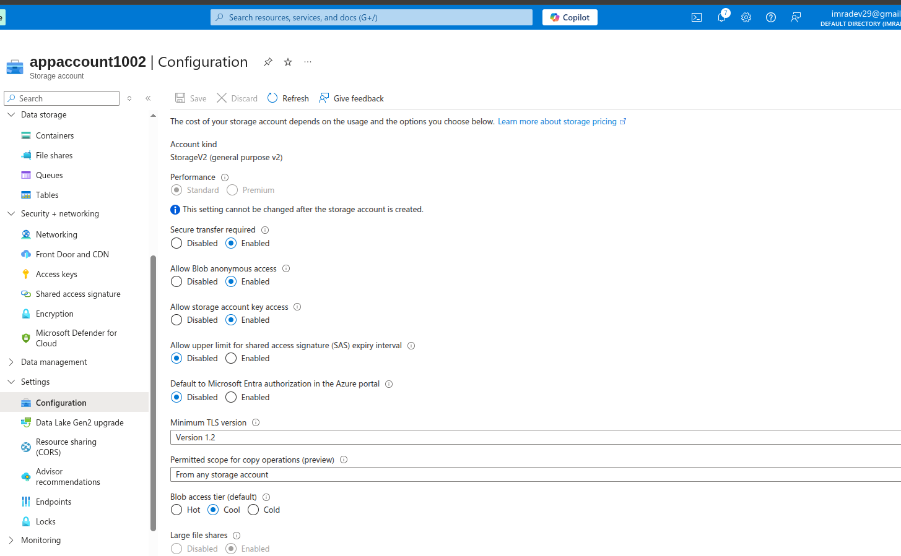
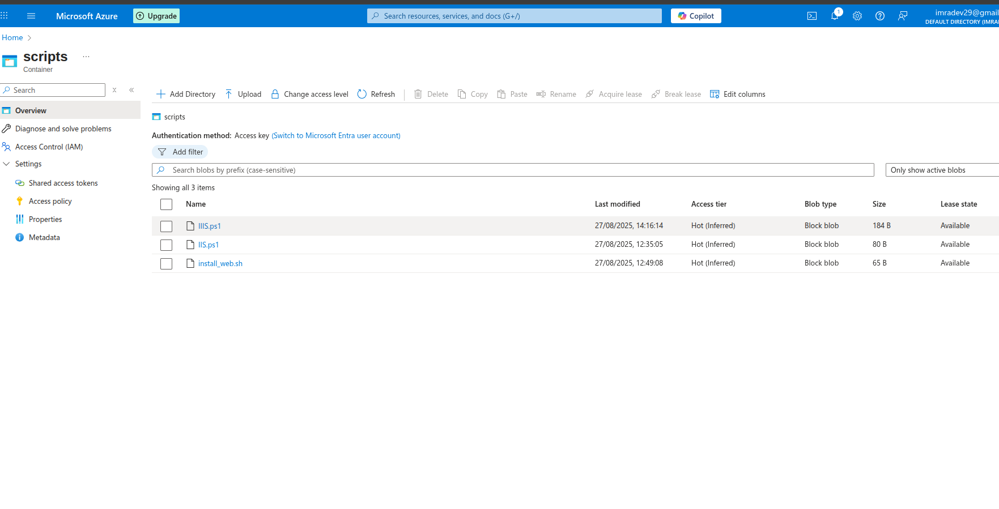
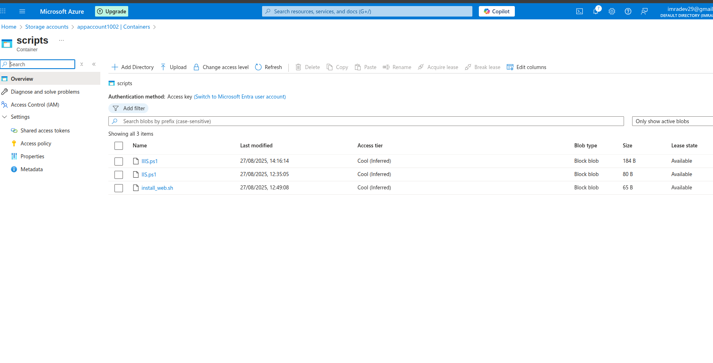
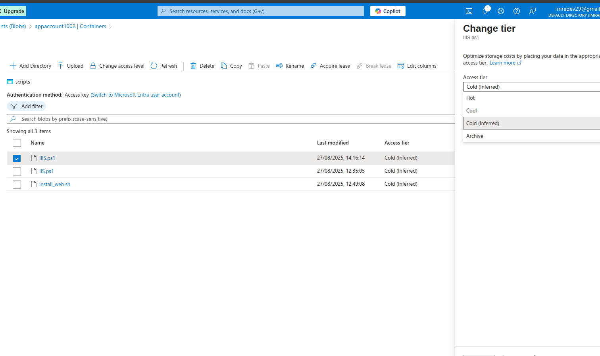
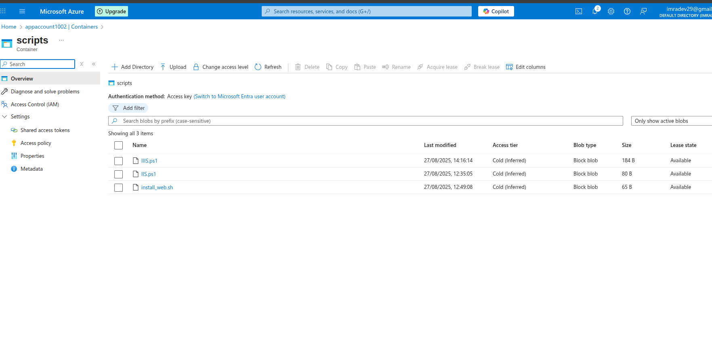
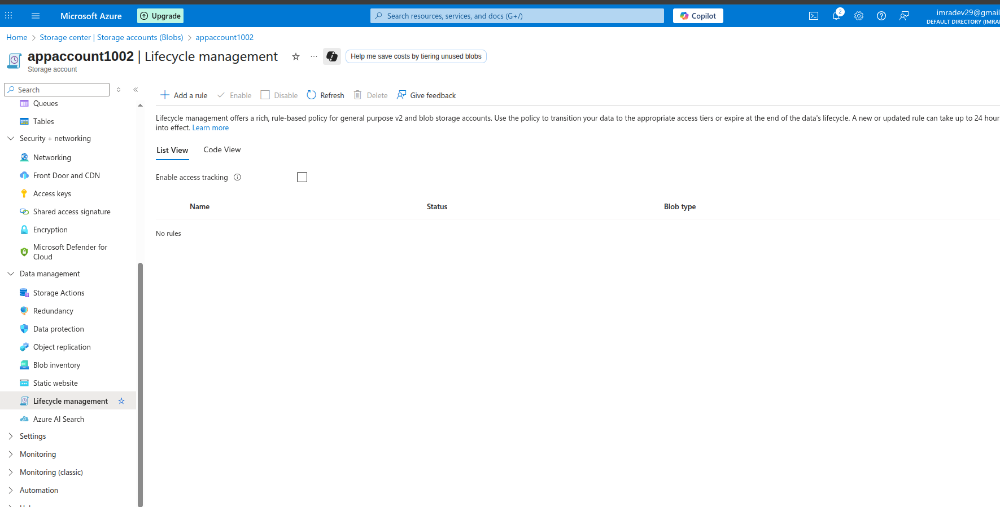
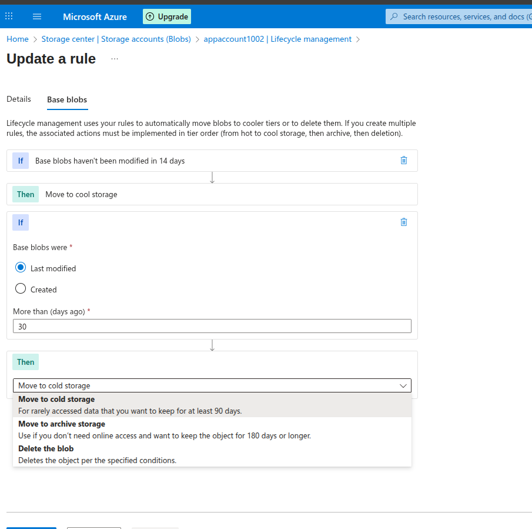
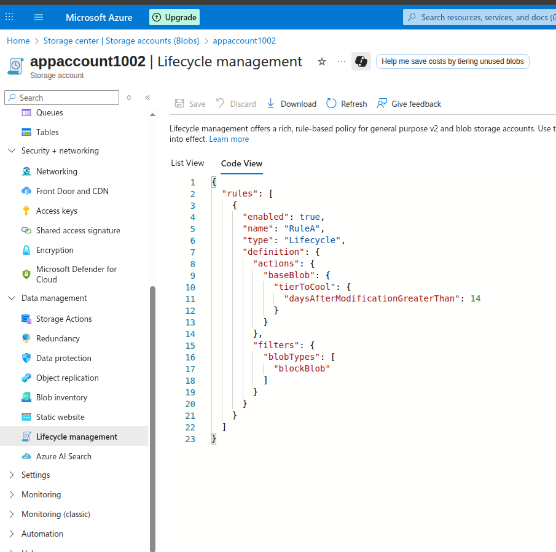

# Lab 3: Azure Storage Accounts - Access Tiers

## Lab Overview
This lab covers understanding and implementing Azure Blob Storage access tiers (Hot, Cool, Archive) for cost optimization, configuring lifecycle management policies, and managing data transitions between tiers.

## Prerequisites
- Azure subscription with appropriate permissions
- Azure Portal access
- Basic understanding of storage cost optimization
- Sample files of various sizes for testing

## Lab Objectives
- Understand different Azure storage access tiers
- Configure blob access tiers manually
- Implement lifecycle management policies
- Monitor storage costs and access patterns
- Test data retrieval from different tiers
- Optimize storage costs through tier management

## Step-by-Step Instructions

### Step 1: Create Storage Account for Access Tier Testing

1. **Navigate to Azure Portal**
   - Go to [portal.azure.com](https://portal.azure.com)
   - Sign in with your Azure credentials

2. **Create Storage Account**
   - Click "Create a resource" → "Storage account"
   - Fill in basic details:
     - **Subscription**: Select your subscription
     - **Resource group**: Create new `app-grp`
     - **Storage account name**: `appaccount1002`
     - **Region**: Choose appropriate region
     - **Performance**: Standard
     - **Redundancy**: Locally-redundant storage (LRS)

3. **Configure Access Tier**
   - **Access tier**: Hot (default for new storage account)
   - **Advanced settings**: Keep defaults
   - Click "Review + create"
   - Click "Create"

### Step 2: Upload Files to Test Access Tiers

1. **Upload Active Data**
   - Click on `Scripts` container
   - Upload sample files (documents, images, videos)
   - Note: These files will stay in Hot tier

   

2. **Upload Backup Data**
   - Click on `Scripts` container
   - Upload backup files, old documents
   - These will be moved to Cool tier

3. **Upload Archive Data**
   - Click on `Scripts` container
   - Upload old files, compliance documents
   - These will be moved to Archive tier

   

4. **Upload Archive Data**
   - Click on `Scripts` container
   - Upload old files, compliance documents
   - These will be moved to Cold tier

### 3 LifeCycle Policy

1. **Create Lifecycle Rule**
   - Click "Add a rule"
   - **Rule name**: `RuleA`
   - **Rule scope**: Apply to all blobs
   - Click "Next"

2. **Configure Base Blobs Rules**
   - **If base blobs were**:
     - Last modified more than 30 days ago → Move to Cool storage
     - Last modified more than 90 days ago → Move to Archive storage
     - Last modified more than 365 days ago → Delete blob
   - Click "Next"

3. **Configure Blob Versions (if enabled)**
   - **If blob versions were**:
     - Created more than 30 days ago → Move to Cool storage
     - Created more than 90 days ago → Delete version
   - Click "Next"

4. **Review and Create**
   - Review policy settings
   - Click "Add" to create the rule

Json View of LifeCyclePolicy

### Step 4: Monitor Storage Costs and Usage

1. **View Storage Metrics**
   - Go to storage account
   - Click "Insights" under Monitoring
   - Review storage capacity by tier
   - Analyze access patterns

2. **Cost Analysis**
   - Go to "Cost Management + Billing"
   - Filter by storage account
   - Compare costs across different tiers
   - Identify optimization opportunities

3. **Set Up Cost Alerts**
   - Create budget alerts for storage costs
   - Configure notifications for unusual spending
   - Monitor tier transition costs

*Screenshot: Storage insights dashboard*
*Screenshot: Cost analysis by access tier*

## Key Learnings

### Access Tiers Overview
- **Hot Tier**: Frequently accessed data, highest storage cost, lowest access cost
- **Cool Tier**: Infrequently accessed data, lower storage cost, higher access cost
- **Archive Tier**: Rarely accessed data, lowest storage cost, highest access cost, retrieval latency

### Cost Optimization
- **Storage Costs**: Archive < Cool < Hot
- **Access Costs**: Hot < Cool < Archive
- **Retrieval Time**: Hot (immediate) < Cool (immediate) < Archive (hours)
- **Minimum Storage Duration**: Hot (none), Cool (30 days), Archive (180 days)

### Lifecycle Management
- **Automated Transitions**: Reduce manual management overhead
- **Policy-Based**: Rules based on age, access patterns, file types
- **Cost Savings**: Automatic optimization without user intervention
- **Compliance**: Automated retention and deletion policies

## Troubleshooting

### Common Issues and Solutions

#### Files Not Transitioning Automatically
- **Issue**: Lifecycle policies not executing
- **Solution**:
  - Verify policy is enabled and saved
  - Check policy filters and conditions
  - Wait for daily policy execution cycle
  - Review activity logs for errors

#### High Retrieval Costs
- **Issue**: Unexpected charges for data retrieval
- **Solution**:
  - Monitor access patterns before archiving
  - Use Cool tier for frequently accessed old data
  - Implement proper data classification
  - Set up cost alerts and budgets

#### Slow Archive Retrieval
- **Issue**: Archive data taking too long to retrieve
- **Solution**:
  - Use High priority rehydration for urgent needs
  - Plan ahead for archive data access
  - Consider Cool tier for semi-active data
  - Implement predictive rehydration

#### Policy Conflicts
- **Issue**: Multiple policies affecting same data
- **Solution**:
  - Review policy precedence rules
  - Use specific filters to avoid conflicts
  - Test policies with small datasets first
  - Document policy interactions

## Use Cases and Scenarios

### Data Archival
- **Compliance Data**: Long-term retention at low cost
- **Backup Files**: Infrequent access, cost optimization
- **Historical Records**: Archive tier for old documents
- **Media Files**: Tier based on access frequency

### Cost Optimization
- **Development Environments**: Cool tier for non-production data
- **Log Files**: Automatic archival of old logs
- **Seasonal Data**: Tier based on business cycles
- **Backup Strategies**: Tiered backup retention

### Hybrid Scenarios
- **Active Archives**: Cool tier for searchable archives
- **Disaster Recovery**: Archive tier for long-term DR copies
- **Data Lakes**: Tiered storage for analytics workloads
- **Content Distribution**: Hot tier for active content

## Best Practices

### Tier Selection Strategy
- **Analyze Access Patterns**: Understand data usage before tiering
- **Consider Total Cost**: Include access and transaction costs
- **Plan for Growth**: Design scalable tiering strategies
- **Regular Review**: Periodically assess and adjust policies

### Lifecycle Policy Design
- **Start Conservative**: Begin with longer retention periods
- **Use Filters**: Apply policies to specific data types
- **Test Thoroughly**: Validate policies with test data
- **Monitor Execution**: Track policy performance and costs

### Performance Considerations
- **Rehydration Planning**: Plan ahead for archive access
- **Batch Operations**: Group tier changes for efficiency
- **Access Optimization**: Keep frequently accessed data in Hot tier
- **Monitoring**: Continuous monitoring of access patterns

## Next Steps
- Implement Azure Storage Analytics for detailed insights
- Configure cross-region replication with tiered storage
- Explore Azure Data Factory for automated data movement
- Integrate with Azure Purview for data governance
- Set up automated reporting for storage optimization
- Implement predictive analytics for access patterns

## Resource Cleanup
When lab is complete:
1. Delete all lifecycle management policies
2. Delete all containers and files
3. Delete storage account
4. Delete resource group `app-grp`
5. Verify no ongoing charges

