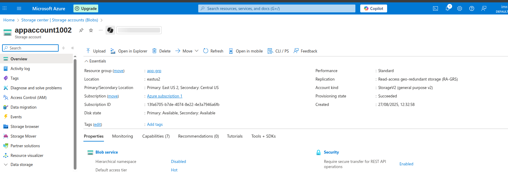

# Lab 4: Azure Storage - Object Replication

## Lab Overview
This lab covers implementing Azure Blob Storage object replication for data redundancy, disaster recovery, and geographic distribution. You'll configure cross-region replication policies and monitor replication status.

## Prerequisites
- Azure subscription with appropriate permissions
- Azure Portal access
- Two different Azure regions available
- Understanding of data replication concepts
- Storage accounts in different regions

## Lab Objectives
- Create source and destination storage accounts
- Configure object replication policies
- Test replication functionality
- Monitor replication status and metrics
- Implement failover scenarios
- Understand replication limitations and best practices

## Step-by-Step Instructions

### Step 1: Create Source Storage Account

1. **Navigate to Azure Portal**
   - Go to [portal.azure.com](https://portal.azure.com)
   - Sign in with your Azure credentials

2. **Create Source Storage Account**
   - Click "Create a resource" → "Storage account"
   - Fill in basic details:
     - **Subscription**: Select your subscription
     - **Resource group**: Create new `app-grp`
     - **Storage account name**: `appaccount1002`
     - **Region**: `East US` (primary region)
     - **Performance**: Standard
     - **Redundancy**: Locally-redundant storage (LRS)

3. **Configure Advanced Settings**
   - **Blob versioning**: Enabled (required for replication)
   - **Change feed**: Enabled (required for replication)
   - **Access tier**: Hot
   - Click "Review + create"
   - Click "Create"

### Step 2: Create Destination Storage Account

1. **Create Destination Storage Account**
   - Click "Create a resource" → "Storage account"
   - Fill in basic details:
     - **Subscription**: Select your subscription
     - **Resource group**: Use existing `app-grp`
     - **Storage account name**: `destinationaccount28`
     - **Region**: `East US 2` 
     - **Performance**: Standard
     - **Redundancy**: Locally-redundant storage (LRS)

### Step 3: Create Containers in Both Storage Accounts

1. **Create Containers in Source Storage**
   - Go to source storage account
   - Click "Containers" under Data storage
   - Create containers:
     - `Scripts`

2. **Create Containers in Destination Storage**
   - Go to destination storage account
   - Click "Containers" under Data storage
   - Create matching containers:
     - `Scripts`

### Step 4: Configure Object Replication Policy

1. **Navigate to Object Replication**
   - Go to source storage account
   - Click "Object replication" under Data management
   - Click "Create replication rules"

2. **Configure Replication Policy**
   - **Destination storage account**: Select destination storage account
   - **Policy name**: `CrossRegionReplication`
   - Click "Next"

3. **Configure Replication Rules**
   - **Rule 1**:
     - **Rule name**: `replicationruleA`
     - **Source container**: `documents`
     - **Destination container**: `documents`
     - **Prefix filter**: Leave empty (replicate all)
   

4. **Review and Create**
   - Review replication policy settings
   - Click "Create"

### Step 5: Upload Test Files to Source Storage

1. **Upload Documents**
   - Go to source storage → `Scripts` container
   - Upload various document files (PDF, DOCX, TXT)
   - Note upload timestamps

### Step 6: Monitor Replication Status

1. **Check Replication Status**
   - Go to source storage account
   - Click "Object replication" under Data management
   - View replication policy status
   - Check individual rule status

2. **Verify Files in Destination**
   - Go to destination storage account
   - Check each container for replicated files
   - Verify only `prod/` images were replicated
   - Compare file timestamps and properties

### Step 7: Test Failover Scenarios

1. **Simulate Source Storage Unavailability**
   - Temporarily restrict access to source storage
   - Test application failover to destination storage
   - Verify data accessibility from destination

2. **Test Read Operations from Destination**
   - Configure applications to read from destination
   - Verify data integrity and completeness
   - Test performance from destination region

3. **Plan Failback Procedures**
   - Document steps to restore primary operations
   - Test reverse replication setup
   - Verify data synchronization procedures

### Step 8: Optimize Replication Performance

1. **Analyze Replication Patterns**
   - Review replication logs and metrics
   - Identify slow-replicating file types
   - Monitor bandwidth utilization

2. **Optimize Replication Rules**
   - Refine prefix filters for better performance
   - Adjust replication scope based on requirements
   - Consider multiple smaller rules vs. few large rules

3. **Monitor Costs**
   - Track replication-related costs
   - Monitor cross-region data transfer charges
   - Optimize for cost vs. performance requirements

## Key Learnings

### Object Replication Concepts
- **Asynchronous Replication**: Changes replicate with some delay
- **Policy-Based**: Rules define what and how to replicate
- **Cross-Region**: Replication across different Azure regions
- **Versioning Required**: Source and destination must have versioning enabled

### Replication Benefits
- **Disaster Recovery**: Data available in multiple regions
- **Performance**: Serve data from geographically closer locations
- **Compliance**: Meet data residency requirements
- **Load Distribution**: Distribute read operations across regions

### Limitations and Considerations
- **One-Way Replication**: Changes flow from source to destination only
- **Eventual Consistency**: Replication is asynchronous
- **Cost Impact**: Cross-region data transfer charges apply
- **Blob Types**: Only block blobs support replication

## Troubleshooting

### Common Issues and Solutions

#### Replication Not Working
- **Issue**: Files not replicating to destination
- **Solution**:
  - Verify blob versioning enabled on both accounts
  - Check change feed is enabled
  - Ensure replication policy is active
  - Verify container names match exactly

#### Slow Replication Performance
- **Issue**: Long delays in replication
- **Solution**:
  - Check cross-region network connectivity
  - Monitor source storage account load
  - Verify destination storage account capacity
  - Consider breaking large files into smaller chunks

#### Partial File Replication
- **Issue**: Some files replicate, others don't
- **Solution**:
  - Check prefix filters in replication rules
  - Verify file types are supported (block blobs only)
  - Check for file naming conflicts
  - Review replication logs for errors

#### High Replication Costs
- **Issue**: Unexpected charges for replication
- **Solution**:
  - Monitor cross-region data transfer costs
  - Optimize prefix filters to reduce scope
  - Consider replication frequency requirements
  - Implement lifecycle policies for cost optimization

## Use Cases and Scenarios

### Disaster Recovery
- **Business Continuity**: Maintain operations during outages
- **Data Protection**: Protect against regional disasters
- **RTO/RPO Requirements**: Meet recovery time objectives
- **Automated Failover**: Implement automatic failover mechanisms

### Global Applications
- **Content Distribution**: Serve content from multiple regions
- **Performance Optimization**: Reduce latency for global users
- **Compliance**: Meet data residency requirements
- **Load Balancing**: Distribute read operations geographically

### Backup and Archival
- **Cross-Region Backups**: Maintain backups in different regions
- **Compliance Archives**: Replicate compliance data for regulations
- **Data Preservation**: Long-term data preservation strategies
- **Version Control**: Maintain historical versions across regions

## Best Practices

### Replication Strategy
- **Plan Carefully**: Design replication strategy before implementation
- **Test Thoroughly**: Test all scenarios before production deployment
- **Monitor Continuously**: Implement comprehensive monitoring
- **Document Procedures**: Maintain clear operational procedures

### Performance Optimization
- **Use Prefix Filters**: Replicate only necessary data
- **Monitor Bandwidth**: Track cross-region data transfer
- **Optimize File Sizes**: Consider file size impact on replication
- **Batch Operations**: Group related operations for efficiency

### Security Considerations
- **Access Control**: Secure both source and destination accounts
- **Encryption**: Ensure data encryption in transit and at rest
- **Network Security**: Use private endpoints where possible
- **Audit Logging**: Enable comprehensive audit logging

## Next Steps
- Implement automated failover mechanisms
- Configure bi-directional replication (if needed)
- Integrate with Azure Site Recovery
- Set up cross-region load balancing
- Implement data governance policies
- Explore Azure Storage Mover for large-scale migrations
