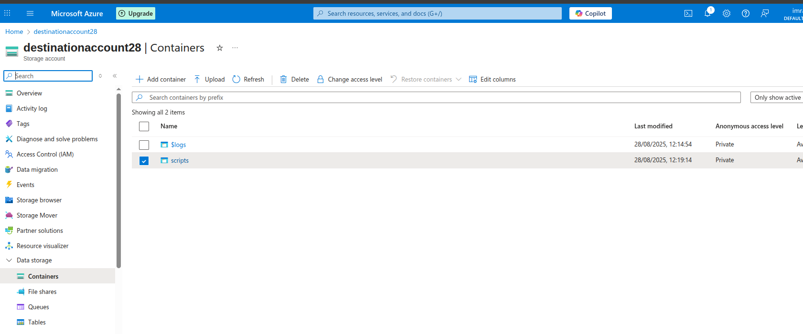
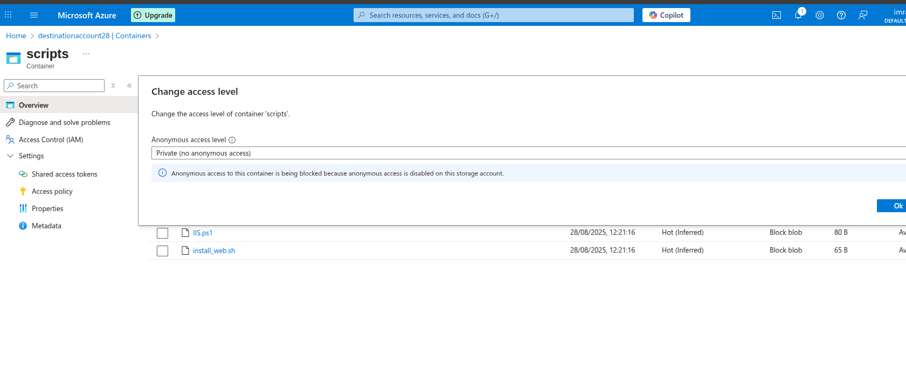
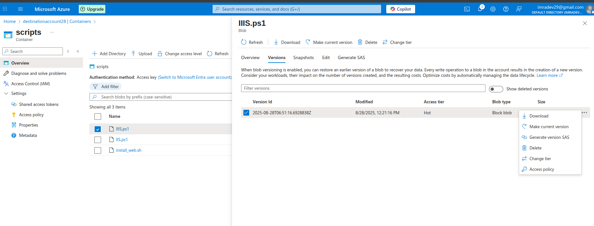
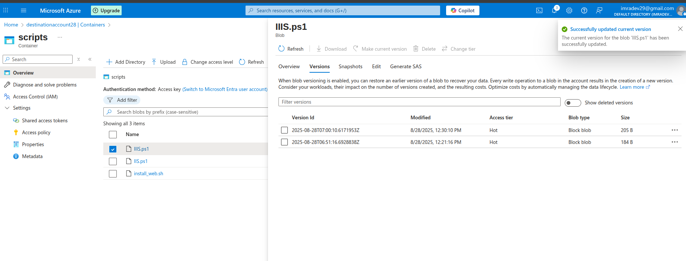

# Lab 5: Azure Blob Storage - Blob Versioning

## Lab Overview
This lab covers implementing Azure Blob Storage versioning for data protection, version management, and recovery scenarios. You'll configure blob versioning, manage versions, and understand version lifecycle policies.

## Prerequisites
- Azure subscription with appropriate permissions
- Azure Portal access
- Basic understanding of version control concepts
- Sample files for testing version scenarios

## Lab Objectives
- Enable blob versioning on storage account
- Upload and modify files to create versions
- Manage blob versions and access historical data
- Configure version lifecycle policies
- Test version recovery scenarios
- Monitor versioning costs and storage usage

## Step-by-Step Instructions

### Step 1: Create Storage Account with Versioning

1. **Navigate to Azure Portal**
   - Go to [portal.azure.com](https://portal.azure.com)
   - Sign in with your Azure credentials

2. **Create Storage Account**
   - Click "Create a resource" → "Storage account"
   - Fill in basic details:
     - **Subscription**: Select your subscription
     - **Resource group**: Create new `app-grp`
     - **Storage account name**: `destinationaccount28`
     - **Region**: Choose appropriate region
     - **Performance**: Standard
     - **Redundancy**: Locally-redundant storage (LRS)

3. **Configure Data Protection**
   - Go to "Data protection" tab
   - **Enable versioning for blobs**: Yes
   - **Enable soft delete for blobs**: 7 days
   - **Enable soft delete for containers**: 7 days
   - **Enable change feed**: Yes (optional, for auditing)
   - Click "Review + create"
   - Click "Create"

### Step 2: Create Containers for Version Testing

1. **Navigate to Storage Account**
   - Go to created storage account
   - Click "Containers" under Data storage

2. **Create Test Containers**
   - Create container: `scripts`
   - All with private access level

### In configure 
Enable Versioning
### Step : we can Access and Download Previous Versions

which version we need we can mark it as current version

## Key Learnings

### Blob Versioning Concepts
- **Automatic Versioning**: Every blob modification creates a new version
- **Version Immutability**: Previous versions cannot be modified
- **Current Version**: Latest version is the default accessible version
- **Version ID**: Unique identifier for each version

### Version Benefits
- **Data Protection**: Protection against accidental deletion/modification
- **Change Tracking**: Complete history of file changes
- **Point-in-Time Recovery**: Restore to any previous state
- **Compliance**: Meet regulatory requirements for data retention

### Cost Considerations
- **Storage Multiplication**: Each version consumes storage space
- **Transaction Costs**: Version operations incur transaction charges
- **Lifecycle Management**: Automated cleanup reduces costs
- **Access Patterns**: Frequent versioning increases costs

## Troubleshooting

### Common Issues and Solutions

#### Versioning Not Working
- **Issue**: File modifications don't create versions
- **Solution**:
  - Verify versioning is enabled on storage account
  - Check that you're uploading to the same blob name
  - Ensure proper permissions for version creation
  - Verify blob type supports versioning (block blobs)

#### Cannot Access Previous Versions
- **Issue**: Previous versions not visible or accessible
- **Solution**:
  - Check blob versioning is enabled
  - Verify proper permissions (Storage Blob Data Reader)
  - Use correct API version in SDK calls
  - Check if versions were deleted by lifecycle policy

#### High Storage Costs
- **Issue**: Unexpected high storage costs due to versioning
- **Solution**:
  - Implement lifecycle policies for version cleanup
  - Monitor version creation frequency
  - Set up cost alerts and budgets
  - Consider version retention requirements

#### Version Recovery Failures
- **Issue**: Cannot recover deleted or overwritten files
- **Solution**:
  - Check soft delete settings and retention period
  - Verify version history before deletion
  - Use proper recovery procedures
  - Check for lifecycle policy conflicts

## Use Cases and Scenarios

### Document Management
- **Contract Versioning**: Track changes to legal documents
- **Policy Updates**: Maintain history of policy changes
- **Collaborative Editing**: Multiple users editing shared documents
- **Audit Trails**: Complete change history for compliance

### Software Development
- **Code Versioning**: Track changes to configuration files
- **Asset Management**: Version control for web assets
- **Deployment Artifacts**: Maintain deployment history
- **Rollback Capabilities**: Quick rollback to previous versions

### Data Protection
- **Accidental Changes**: Protection against user errors
- **Malicious Modifications**: Recovery from security incidents
- **System Failures**: Recovery from application bugs
- **Compliance Requirements**: Meet regulatory data retention needs

## Best Practices

### Version Management Strategy
- **Retention Policies**: Define how long to keep versions
- **Lifecycle Automation**: Implement automated version cleanup
- **Access Control**: Secure version access appropriately
- **Monitoring**: Track version usage and costs

### Performance Optimization
- **Selective Versioning**: Enable only where needed
- **Lifecycle Policies**: Automate old version cleanup
- **Access Patterns**: Optimize for common access scenarios
- **Storage Tiers**: Move old versions to cheaper tiers

### Security Considerations
- **Version Access Control**: Secure historical data access
- **Audit Logging**: Track version access and modifications
- **Encryption**: Ensure versions are encrypted
- **Compliance**: Meet regulatory version retention requirements

## Next Steps
- Implement automated version management workflows
- Integrate versioning with backup strategies
- Set up version-aware monitoring and alerting
- Explore integration with Azure DevOps for CI/CD
- Implement custom version management applications
- Configure cross-region version replication
