# Lab 6: Azure Storage - Firewall, Network Settings, Service Endpoints, and Private Endpoints

## Lab Overview
This lab covers implementing Azure Storage network security through firewall rules, service endpoints, and private endpoints for secure and controlled access to storage resources.

## Prerequisites
- Azure subscription with appropriate permissions
- Azure Portal access
- Virtual network and subnet creation permissions
- Understanding of network security concepts
- VM or test environment for connectivity testing

## Lab Objectives
- Configure Azure Storage firewall rules
- Implement service endpoints for storage access
- Create and configure private endpoints
- Test network connectivity scenarios
- Monitor and troubleshoot network access
- Understand security implications of each approach

## Step-by-Step Instructions

### Step 1: Create Storage Account for Network Security Testing

1. **Navigate to Azure Portal**
   - Go to [portal.azure.com](https://portal.azure.com)
   - Sign in with your Azure credentials

2. **Create Storage Account**
   - Click "Create a resource" → "Storage account"
   - Fill in basic details:
     - **Subscription**: Select your subscription
     - **Resource group**: Create new `app-grp`
     - **Storage account name**: `appaccount1002`
     - **Region**: Choose appropriate region
     - **Performance**: Standard
     - **Redundancy**: Locally-redundant storage (LRS)

3. **Configure Networking**
   - Go to "Networking" tab
   - **Network access**: Enable from all networks (we'll restrict this later)
   - Click "Review + create"
   - Click "Create"

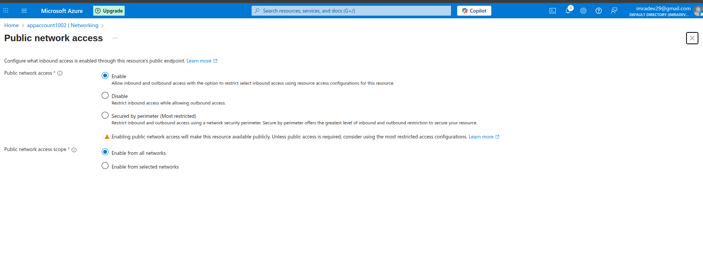

### Step 2: Create Virtual Network Infrastructure

1. **Create Virtual Network**
   - Click "Create a resource" → "Virtual network"
   - Fill in details:
     - **Subscription**: Select your subscription
     - **Resource group**: Use existing `app=grp`
     - **Name**: `app-network`
     - **Region**: Same as storage account
     - **IPv4 address space**: `10.0.0.0/16`

2. **Configure Subnets**
   - **Subnet 1**:
     - Name: `websubnet01`
     - Address range: `10.0.1.0/24`

3. **Create Virtual Network**
   - Click "Review + create"
   - Click "Create"

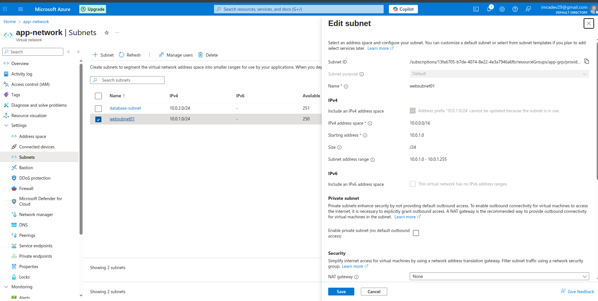

### Step 3: Create Test Virtual Machine

1. **Create VM for Testing**
   - Click "Create a resource" → "Virtual machine"
   - Fill in basic details:
     - **Resource group**: `app-grp`
     - **VM name**: `Linuxvm`
     - **Region**: Same as VNet
     - **Image**: `Ubuntu Server 20.04 LTS`
     - **Size**: `Standard_B2s`
     - **Authentication**: SSH public key
     - **Username**: `azureuser`

2. **Configure Networking**
   - **Virtual network**: `vnet-storage-security`
   - **Subnet**: `subnet-vms`
   - **Public IP**: 20.57.14.90
   - **NIC network security group**: Basic
   - **Public inbound ports**: SSH (22)

3. **Create VM**
   - Click "Review + create"
   - Click "Create"

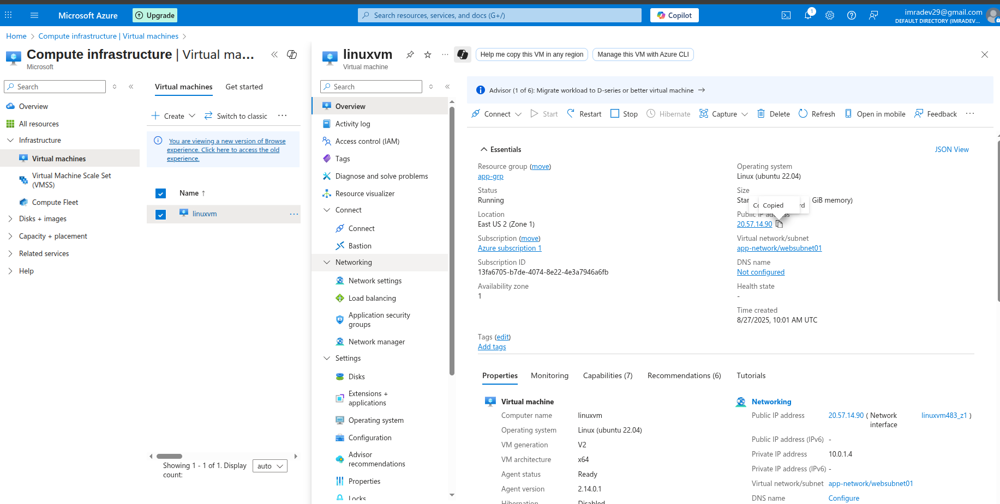

### Step 4: Configure Storage Account Firewall Rules

1. **Access Storage Account Networking**
   - Go to storage account
   - Click "Networking" under Security + networking

2. **Configure Firewall Rules**
   - **Public network access**: Enabled from selected virtual networks and IP addresses
   - **Add your client IP address**: Click to add current IP
   - **Add IP address range**: Add additional IP ranges if needed
     - Example: `203.0.113.0/24` (replace with your organization's IP range)

3. **Configure Exceptions**
   - **Allow Azure services on the trusted services list**: Checked
   - **Allow read access to storage logging**: Checked
   - **Allow read access to storage metrics**: Checked

4. **Save Configuration**
   - Click "Save"
   - Wait for configuration to apply

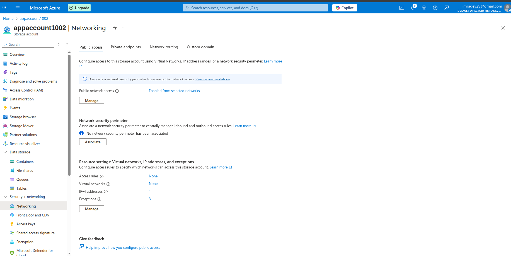


### Step 5: Test Firewall Rules

1. **Test from Allowed IP**
   - From your current location (allowed IP)
   - Try to access storage account via portal
   - Upload a test file to verify access

2. **Test from VM (Should Fail)**
   - SSH to the test VM
   - Try to access storage using Azure CLI:
     ```bash
     # Install Azure CLI
     curl -sL https://aka.ms/InstallAzureCLIDeb | sudo bash
     
     # Try to list containers (should fail)
     az storage container list --account-name [storage-account-name]
     ```
   - Verify access is denied

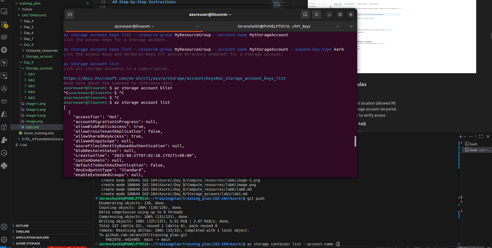

### Step 6: Configure Service Endpoints

1. **Enable Service Endpoint on Subnet**
   - Go to `vnet-storage-security`
   - Click "Subnets"
   - Select `subnet-service-endpoints`
   - Click "Service endpoints"
   - **Services**: Select `Microsoft.Storage`
   - Click "Save"

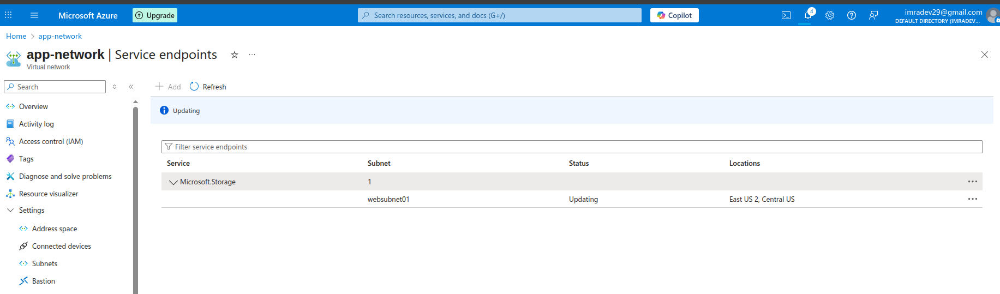

2. **Add Virtual Network to Storage Firewall**
   - Go to storage account → Networking
   - Under "Virtual networks" section
   - Click "Add existing virtual network"
   - **Virtual network**: `vnet-storage-security`
   - **Subnets**: Select `websubnet01`
   - Click "Add"
   - Click "Save"

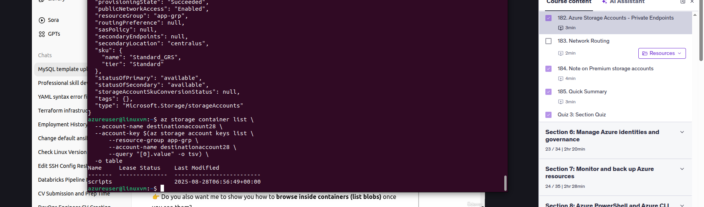

### Step 7: Test Service Endpoint Access

1. **Create VM in Service Endpoint Subnet**
   - Create another VM: `vm-service-endpoint-test`
   - Place in `subnet-service-endpoints`
   - Use same configuration as previous VM

2. **Test Access from Service Endpoint VM**
   - SSH to the new VM
   - Install Azure CLI
   - Configure authentication:
     ```bash
     az login --use-device-code
     ```
   - Test storage access:
     ```bash
     az storage container list --account-name [storage-account-name]
     ```
   - Verify access is allowed


### Step 8: Configure Private Endpoint

1. **Create Private Endpoint**
   - Go to storage account
   - Click "Networking" → "Private endpoint connections"
   - Click "Private endpoint"
   - Fill in details:
     - **Resource group**: `app-grp`
     - **Name**: `blobendpoint`
     - **Region**: Same as storage account

2. **Configure Resource**
   - **Target sub-resource**: `blob`
   - **Connection method**: Connect to Azure resource in my directory
   - **Resource**: Select your storage account

3. **Configure Networking**
   - **Virtual network**: `vapp-network`
   - **Subnet**: `websubnet01`
   - **Private IP configuration**: Dynamically allocate IP address

4. **Configure DNS**
   - **Integrate with private DNS zone**: Yes
   - **Private DNS zone**: Create new `privatelink.blob.core.windows.net`

5. **Create Private Endpoint**
   - Click "Review + create"
   - Click "Create"

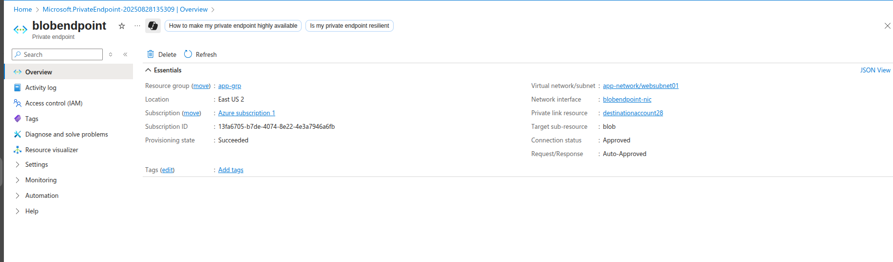
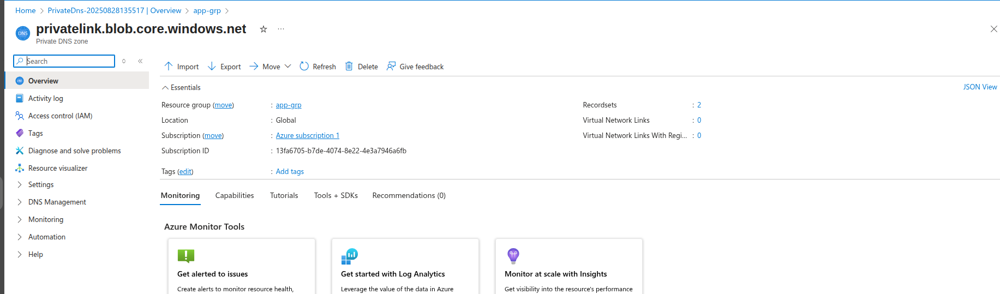

### Step 9: Test Private Endpoint Access

1. **Verify Private Endpoint**
   - Go to storage account → Networking → Private endpoint connections
   - Verify connection status is "Approved"
   - Note the private IP address assigned

2. **Test DNS Resolution**
   - SSH to VM in private endpoint subnet
   - Test DNS resolution:
     ```bash
     nslookup [storage-account-name].blob.core.windows.net
     ```
   - Verify it resolves to private IP address
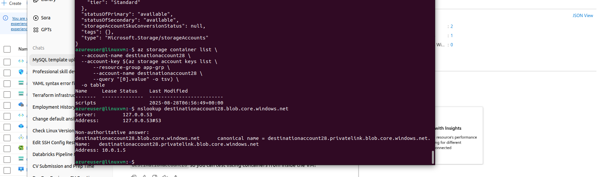
3. **Test Storage Access**
   - From VM in private endpoint subnet
   - Test storage access using private endpoint:
     ```bash
     az storage container list --account-name [storage-account-name]
     ```
   - Verify access works through private network

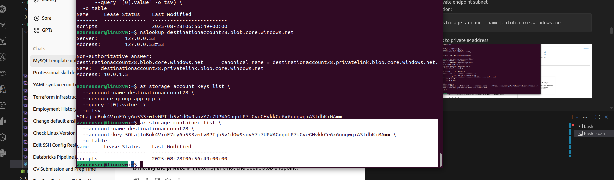*


## Key Learnings

### Network Security Options
- **Firewall Rules**: IP-based access control for public endpoints
- **Service Endpoints**: Secure access from VNet through Azure backbone
- **Private Endpoints**: Private IP addresses for storage in your VNet
- **Network Policies**: Granular control over network access

### Security Benefits
- **Defense in Depth**: Multiple layers of network security
- **Zero Trust**: Verify every connection attempt
- **Network Isolation**: Keep traffic within private networks
- **Compliance**: Meet regulatory network security requirements

### Performance Considerations
- **Service Endpoints**: Lower latency than internet routing
- **Private Endpoints**: Consistent private network performance
- **DNS Resolution**: Proper DNS configuration critical for performance
- **Network Topology**: Hub-and-spoke vs. mesh considerations

## Troubleshooting

### Common Issues and Solutions

#### Cannot Access Storage After Firewall Configuration
- **Issue**: Access denied after enabling firewall
- **Solution**:
  - Verify your IP address is in allowed list
  - Check VNet rules are correctly configured
  - Ensure trusted services exceptions are enabled
  - Wait for configuration propagation (up to 5 minutes)

#### Service Endpoint Not Working
- **Issue**: Access still blocked from service endpoint subnet
- **Solution**:
  - Verify service endpoint enabled on subnet
  - Check VNet rule added to storage firewall
  - Ensure VM is in correct subnet
  - Verify no NSG rules blocking traffic

#### Private Endpoint DNS Issues
- **Issue**: Storage account resolves to public IP instead of private
- **Solution**:
  - Check private DNS zone integration
  - Verify DNS zone linked to VNet
  - Clear DNS cache on client
  - Check custom DNS server configuration

#### Mixed Access Scenarios
- **Issue**: Inconsistent access from different locations
- **Solution**:
  - Review all firewall rules and exceptions
  - Check public access settings
  - Verify private endpoint status
  - Test from each network location separately

