Upload Sample data into the storage account "adlsvinoworld"
create 2 separate container with named as "landing" and "raw"
upload the sampledata.zip into the container landing
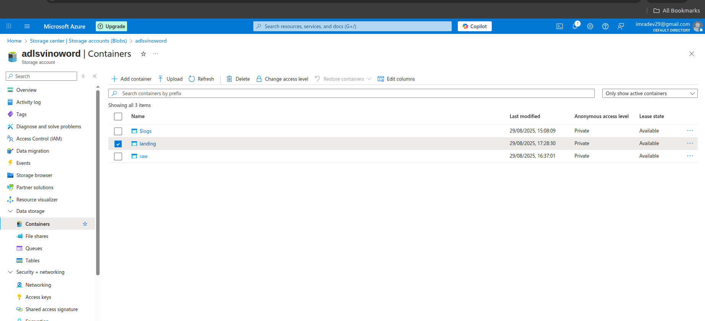
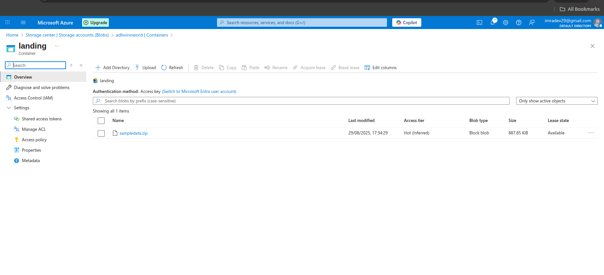

In ADF choose Built in copy task select Run once now
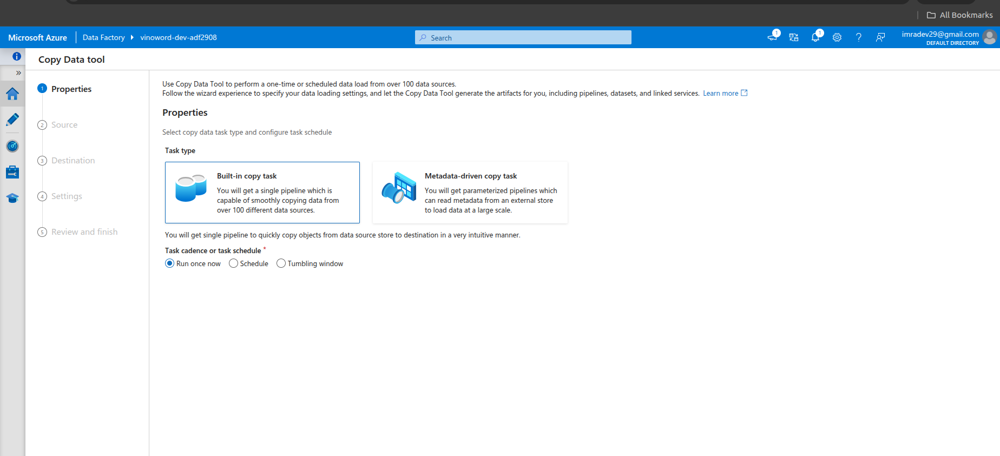

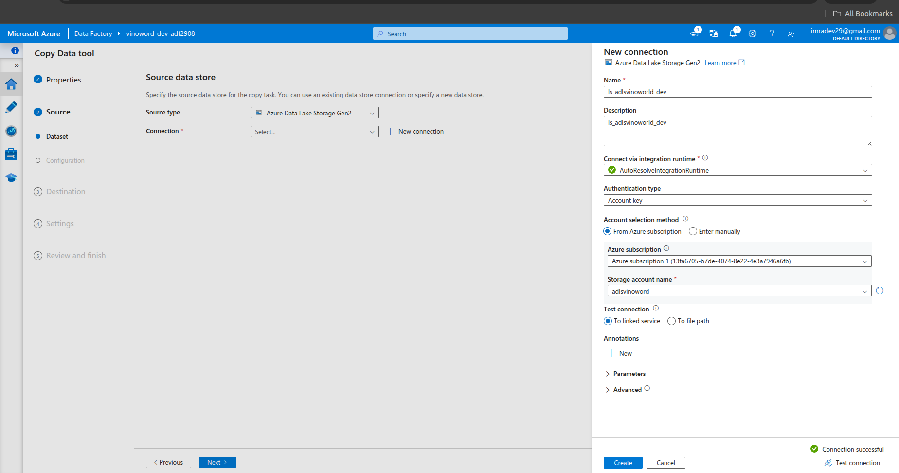
Test connection and then create
under files and folder choose storage account and container
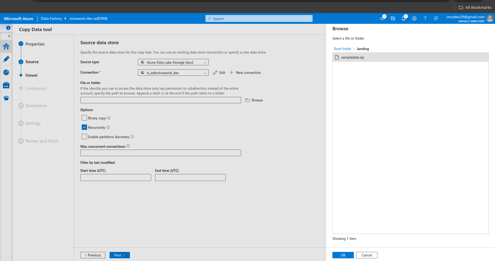

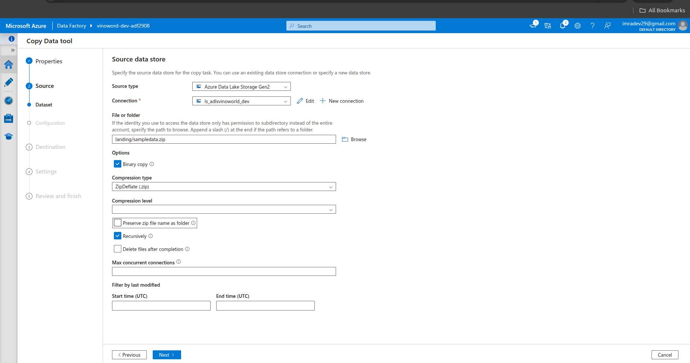

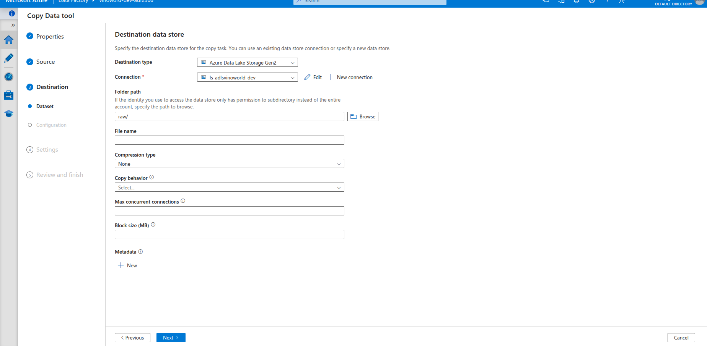

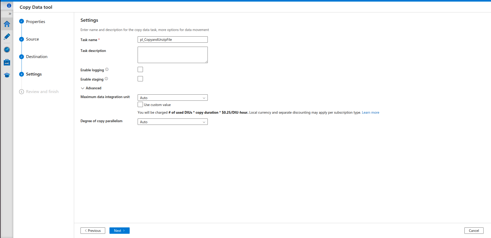

Monitor the Pipeline and see activiy and details of the pipeline
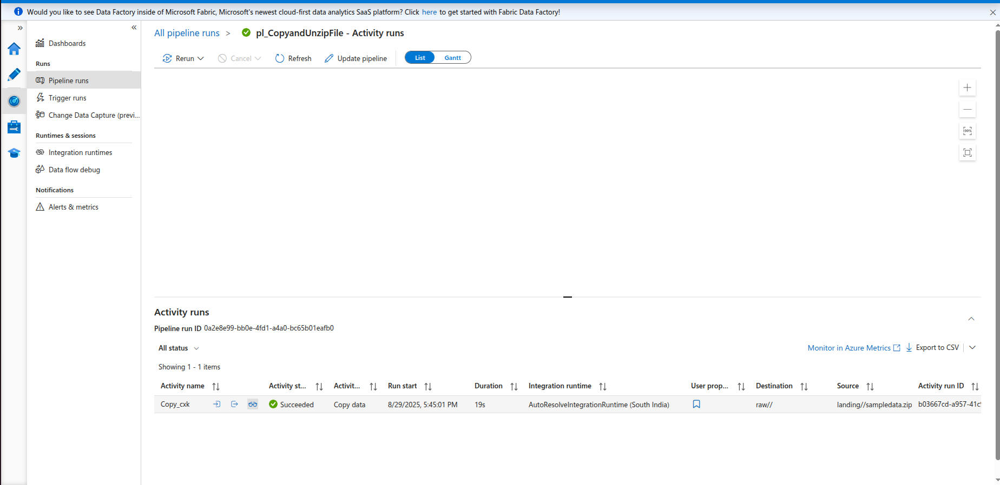
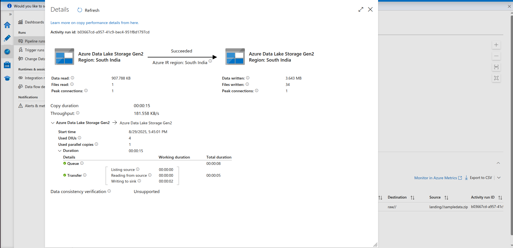

under the storage account "" under the container "raw"
we can see the zip files are been unzip we have folders along with the source file
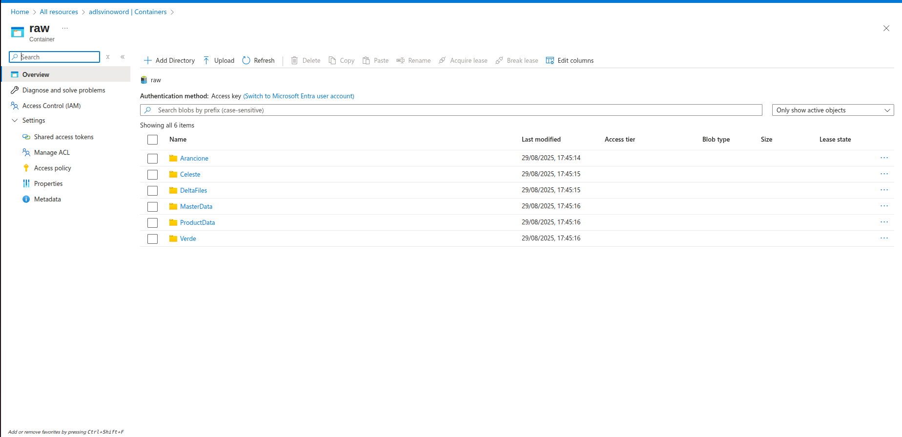
