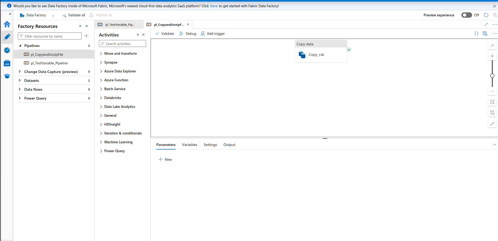
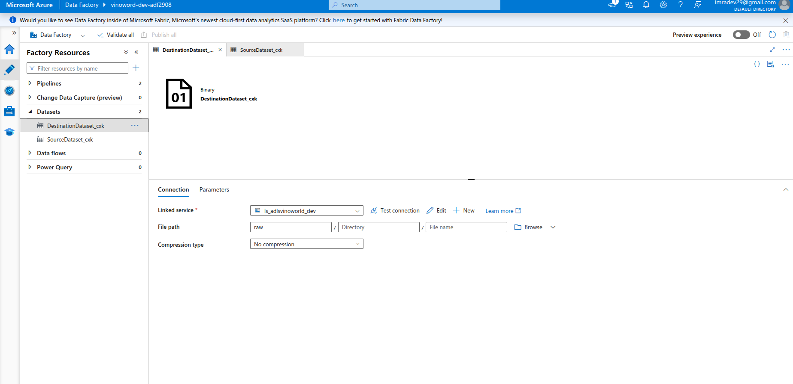
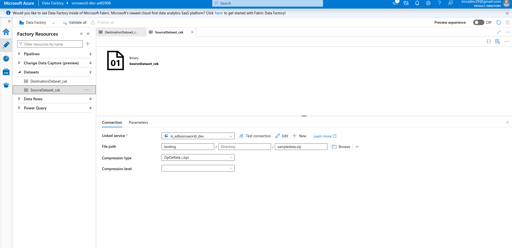
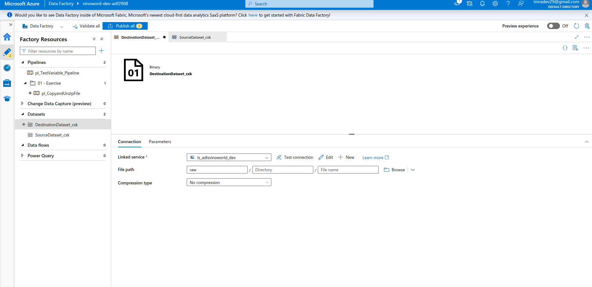
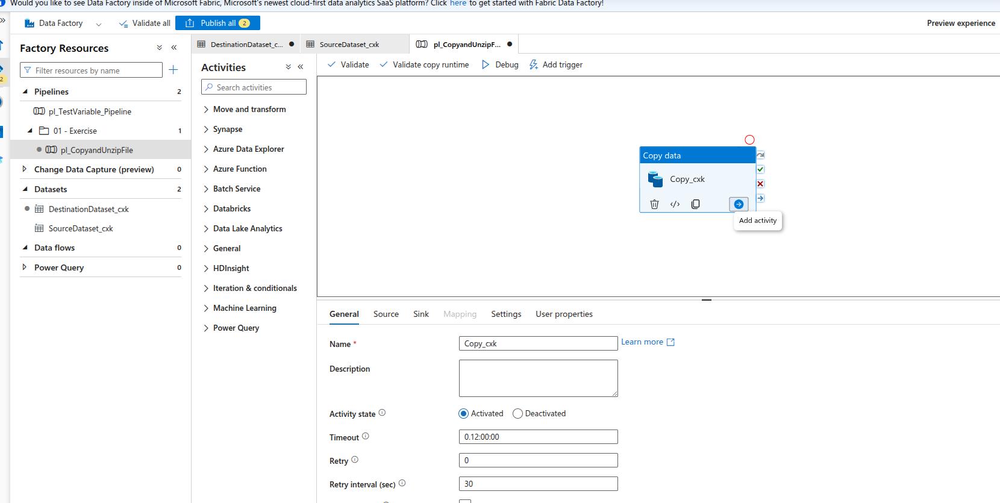
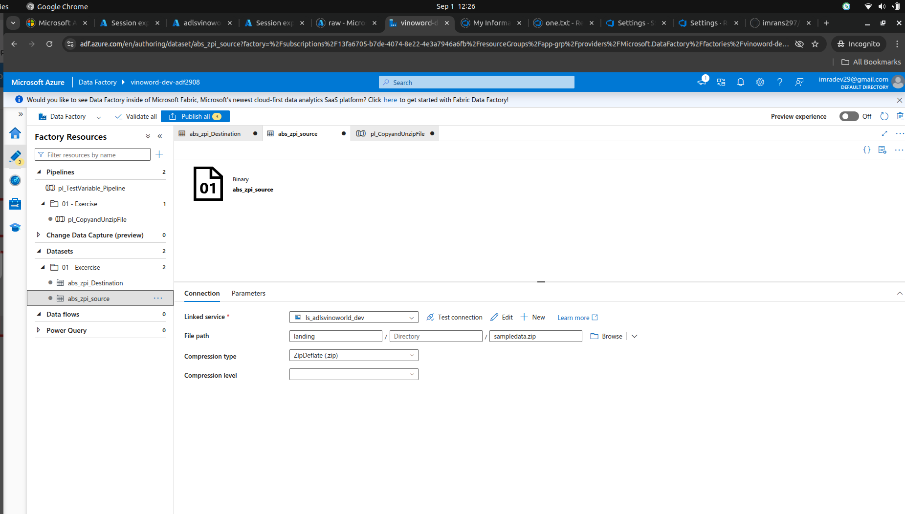
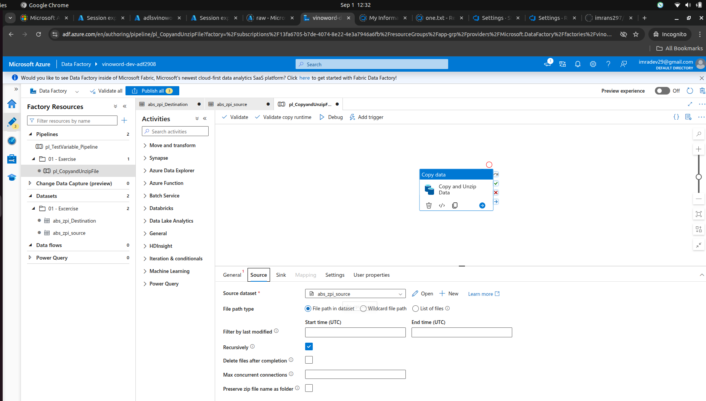
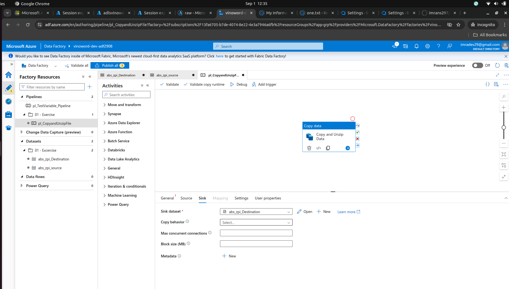
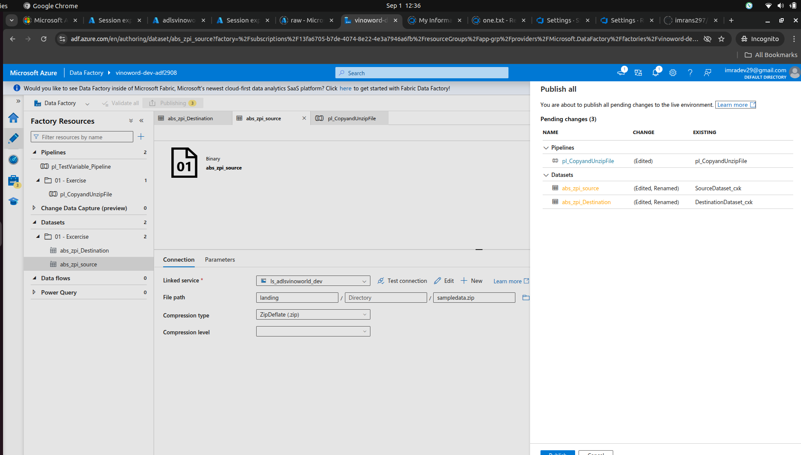

Organize the Data Pipeline
go ont to ADF click on "Pencil" Icon

Created New Folder - 01 Excersie and moved the Pipeline into it

Select on the middle (Copu Data)

Renamed Pipeline and Moved into newliy 01- Excersie Folder under Data set

now if we check the pipeline it is points to the source data set

Similarly if we click on "SINK tab" it is points to destination data set

click on Publish all Button which data sets are pending

whit this Publish we completed our Data Factory 1st Pipeline

