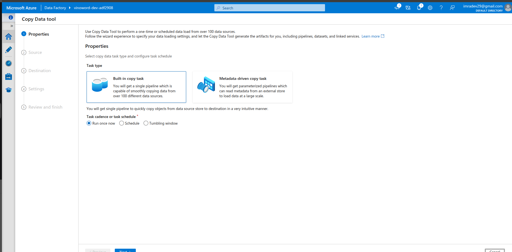
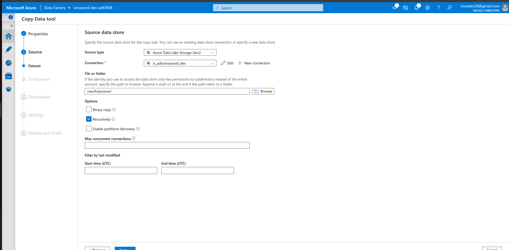
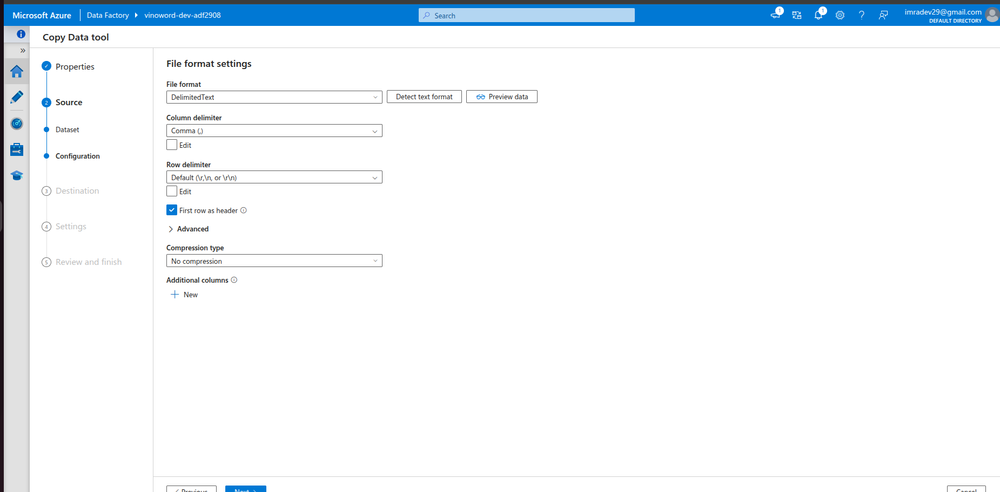
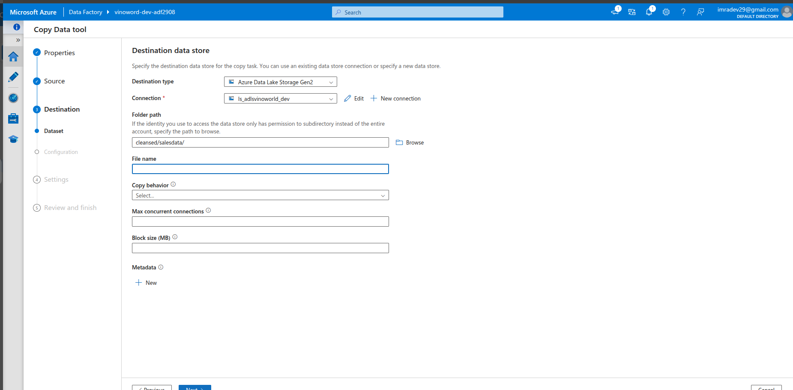
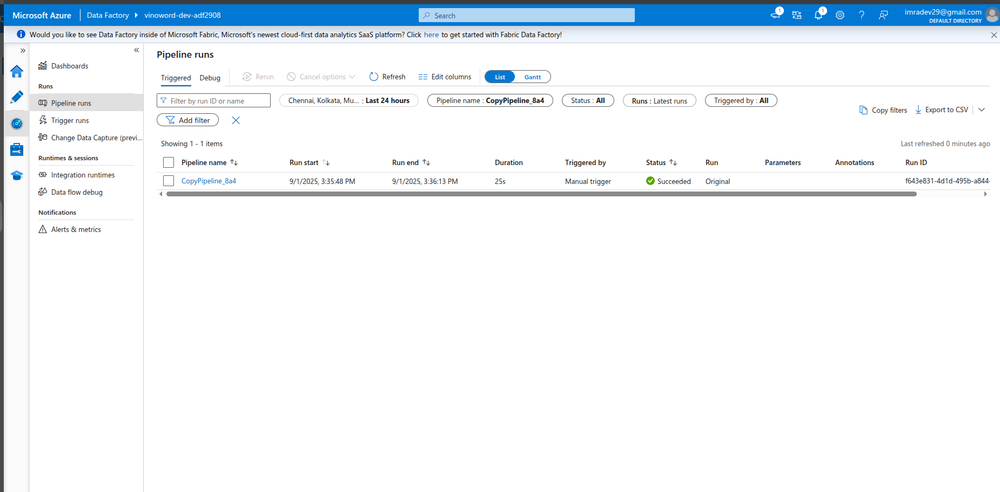
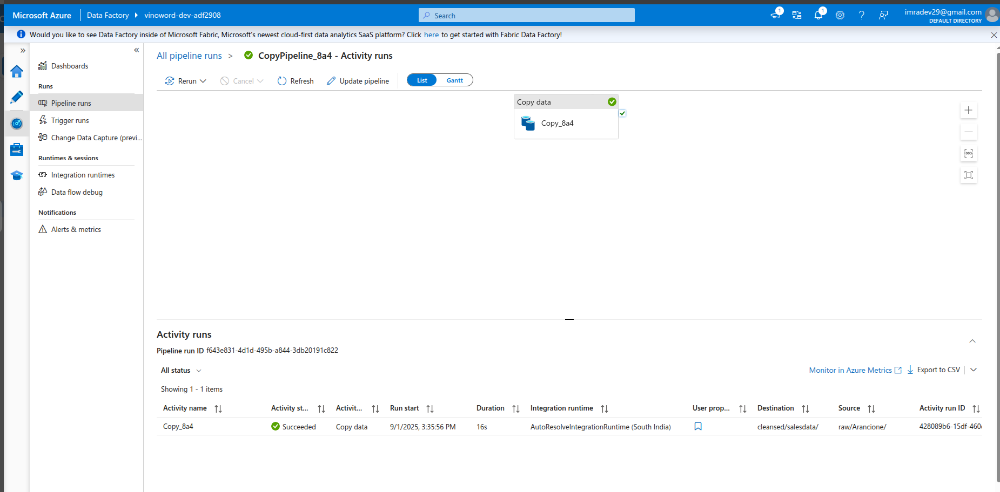
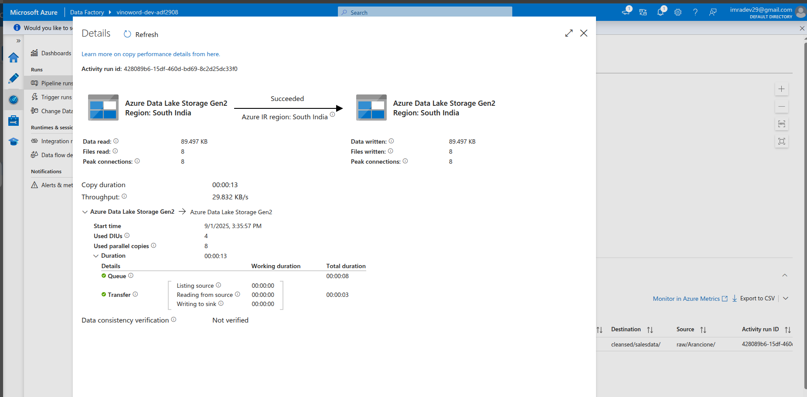
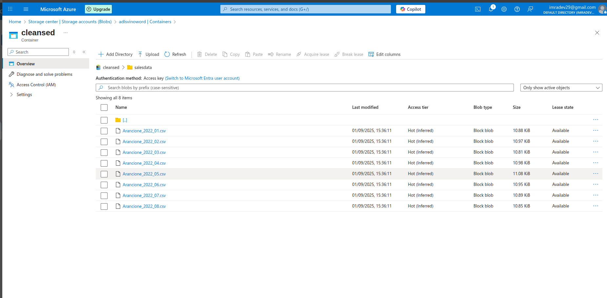
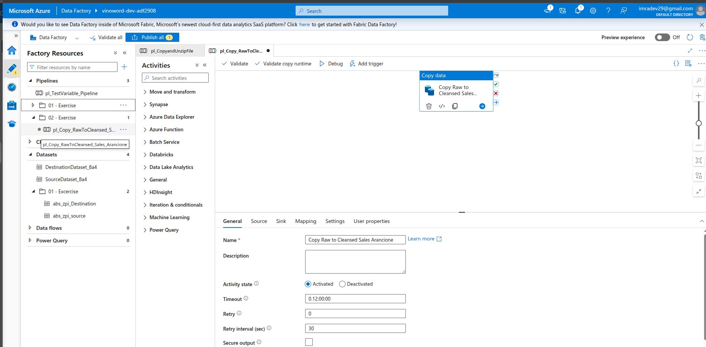
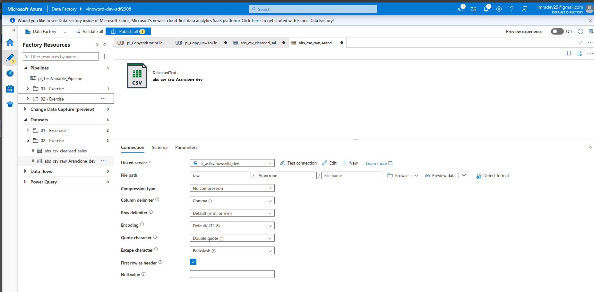

Create an Container with name "Cleansed"
created a new folder salesdata

so here our new pipeline will copy files from Raw into the cleansed container

Go to ADF clicked on Ingest type

Newly created Pipeline can be monitored

we can see the Data is copied into another container

Organising the Pipeline and renaming it

