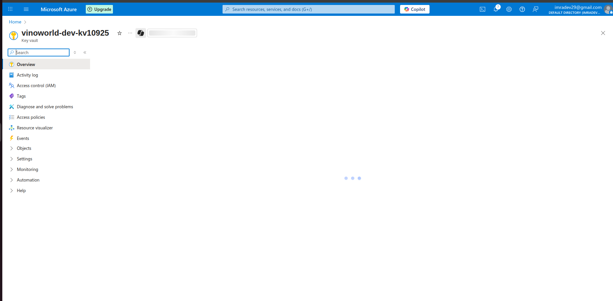
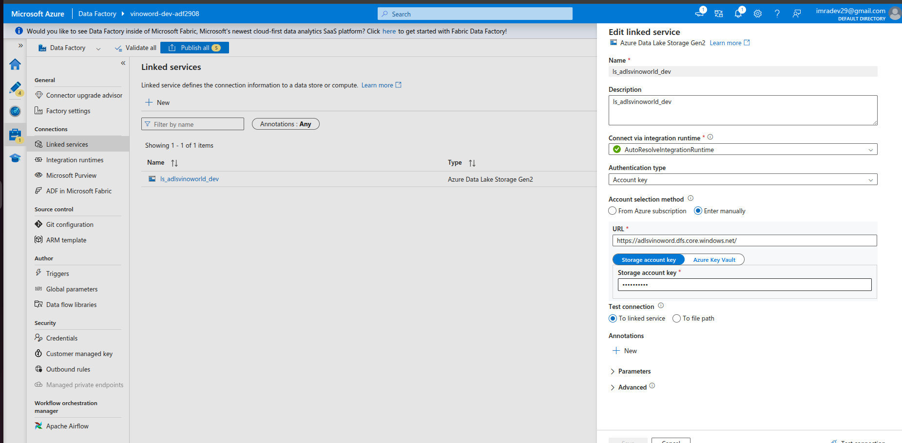
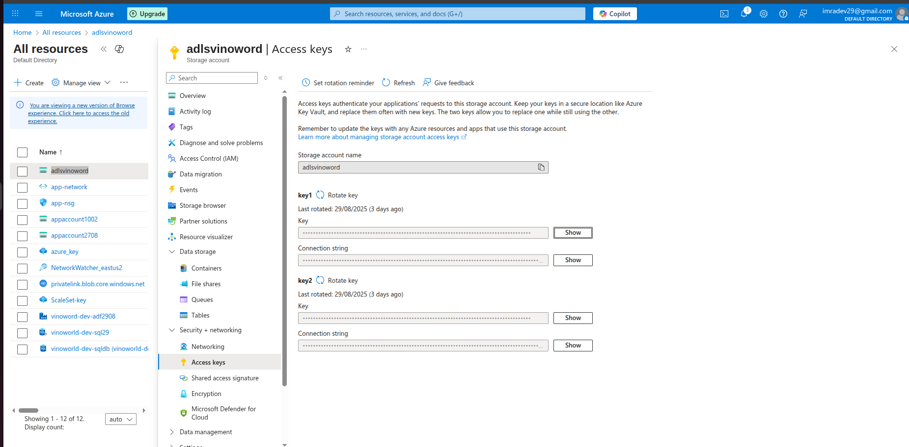
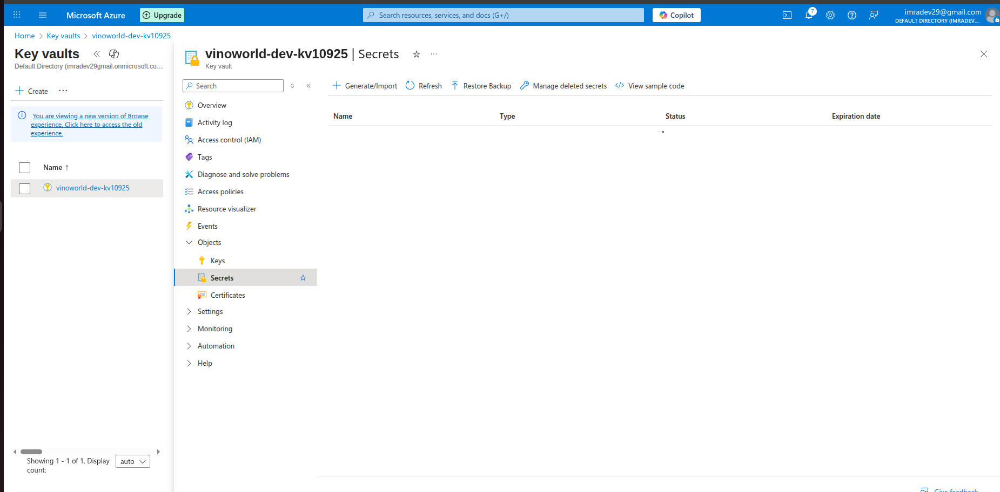
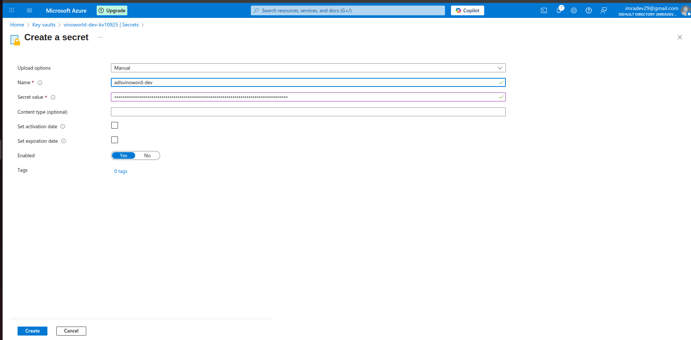
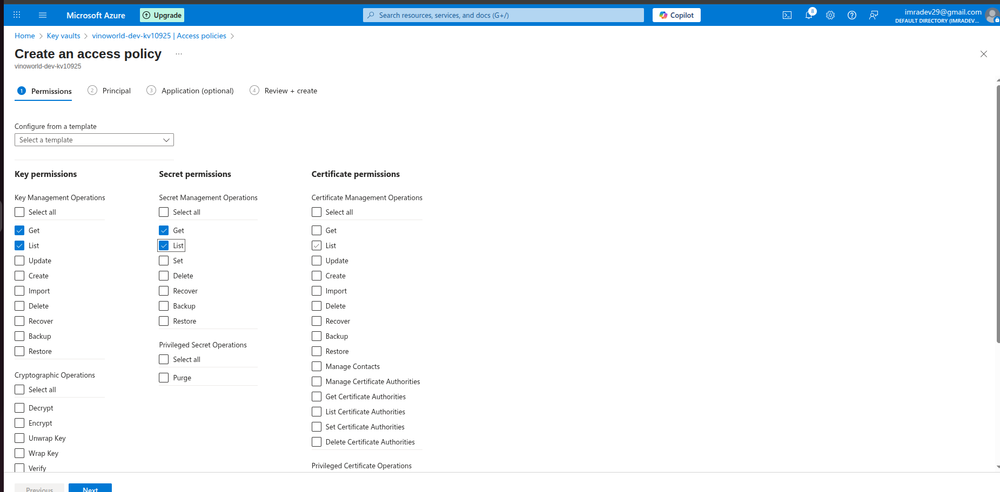
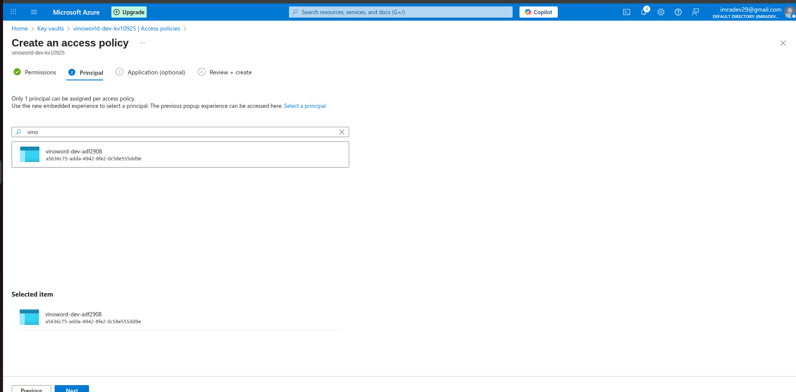
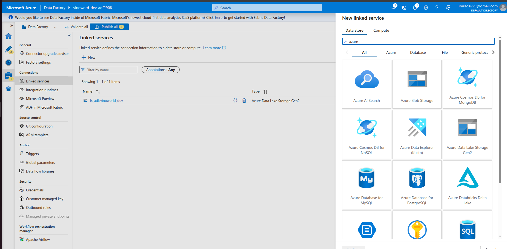
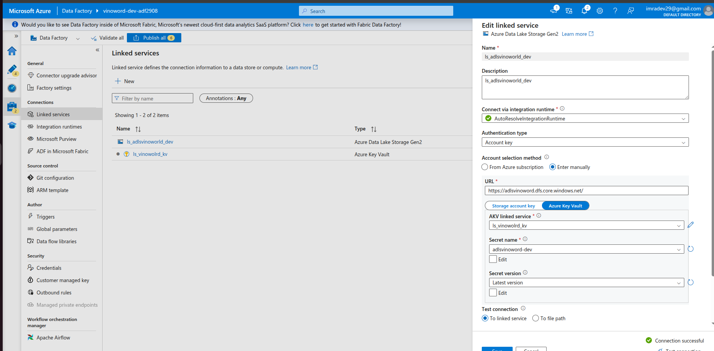

Here we will first add Key Vault to our RG and then we will add secrets into the KeyVault and then we will run DataDactory Access to the key Vault
create an Key Vault in azure

linked to Azure Key Vault

its pintung to the storage account

Go to the storage account under security+networking - Access Key

copy the key to the clipboard and import an key in Key Vault create Secret generate/import

Grant Access to the Access Key Vault

Create Key vault service Linked
we need to create an Linked service 
in ADF left side pannel Manage search for Azure key Vault services

Test Connection and create

