Create a new Pipeline and renamed it

Go to the newly created pipeline and got to General > get Metadata drag and drop
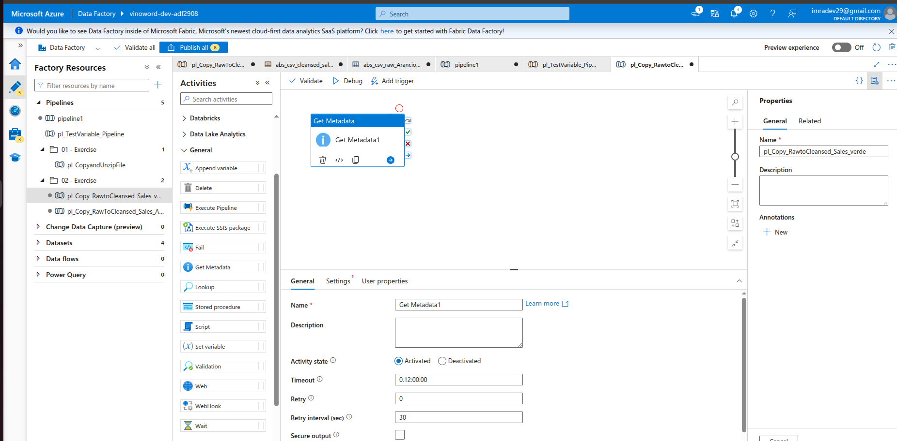

Rename it and under dataset select Azure Data Lake Storage Gend2 and click on continue select JSon rename it
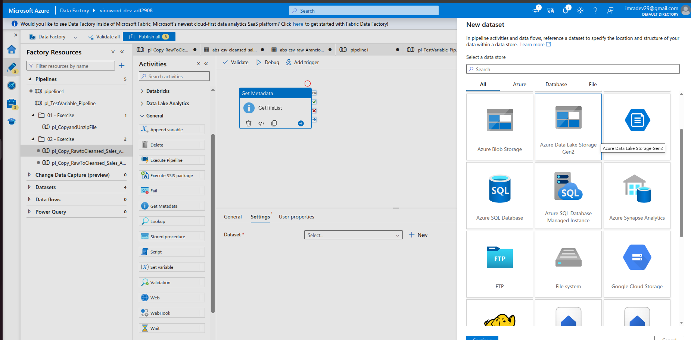

Assured that linked the Azure Key Vault (Test Connection)
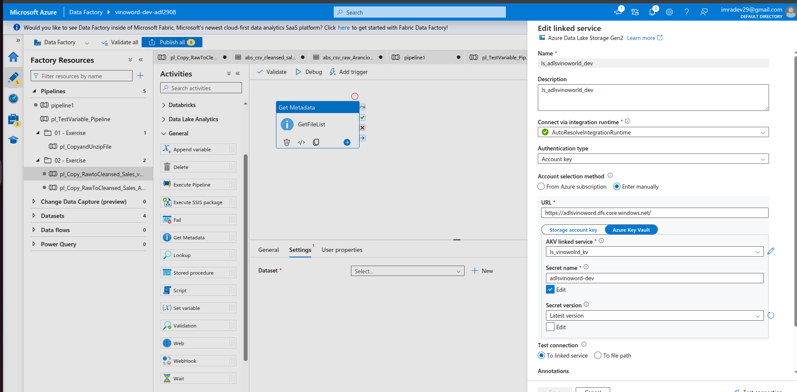

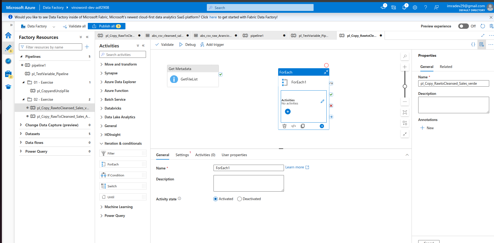

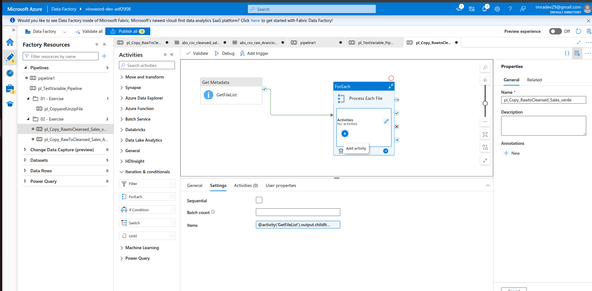

Click on Add Activities and Add COPY DATA1

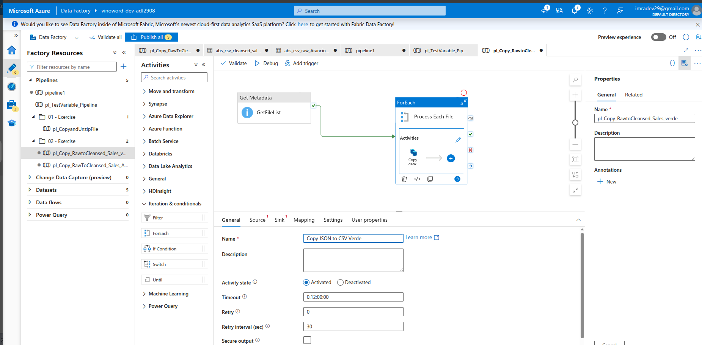

Under source create new and choose Data Lake Storage Gen2 and select JSON
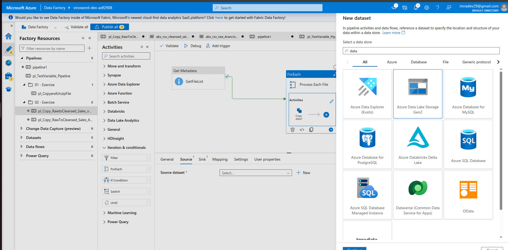
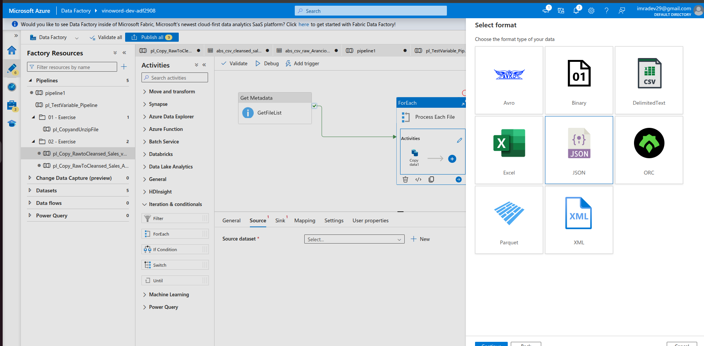

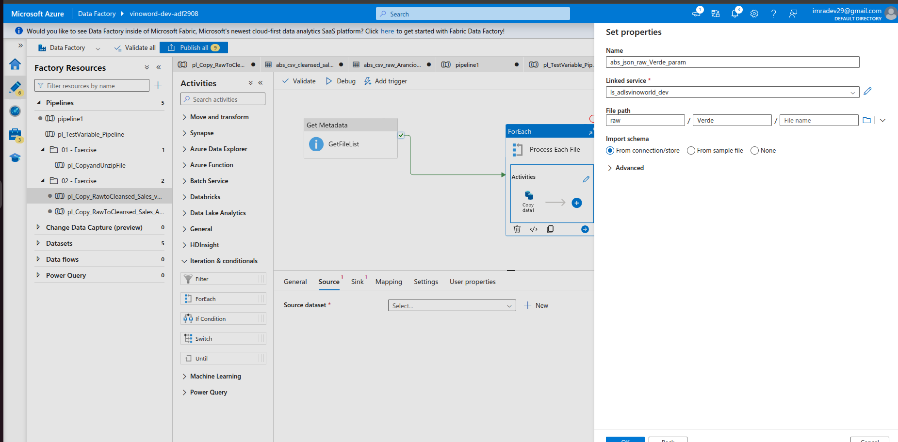

SINK Parameter 
@concat(substring(item().name, 0, sub(length(item().name),5)), '-csv')
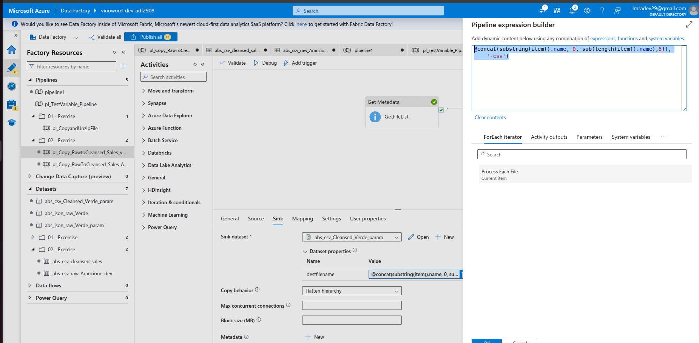

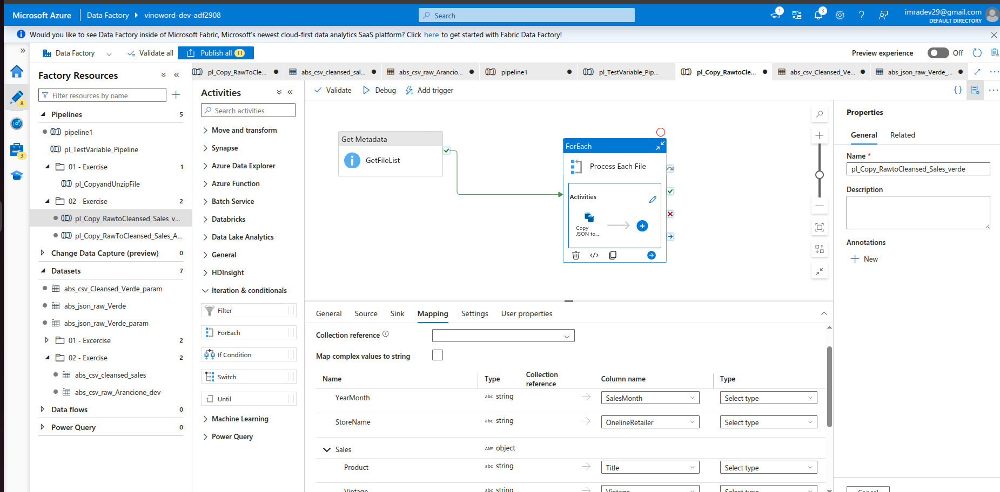

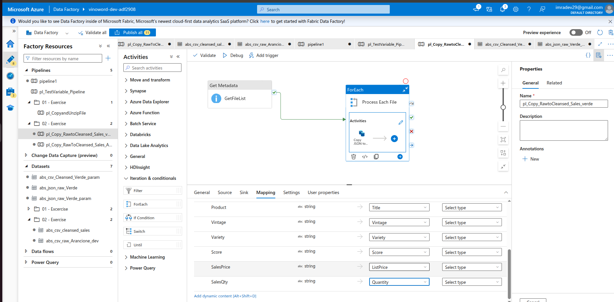

Pipeline got executed
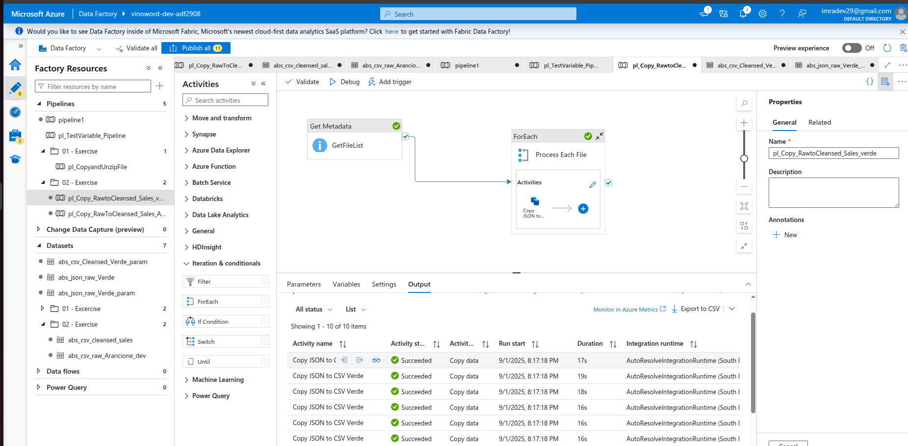

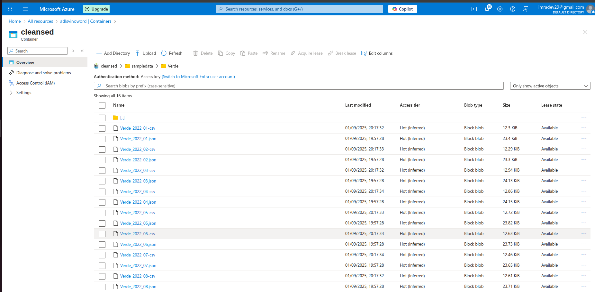