Setup of Environment

Creating Storage account
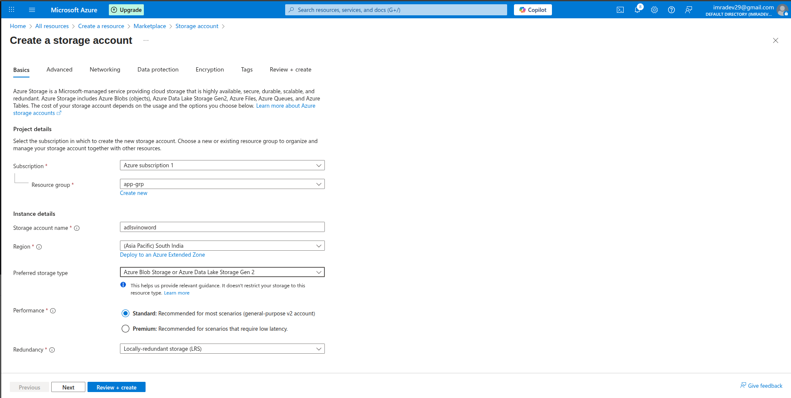

Creating Azure Data Factory
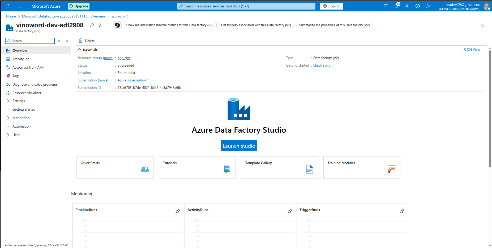
Once created cleck on `Launch Studio`
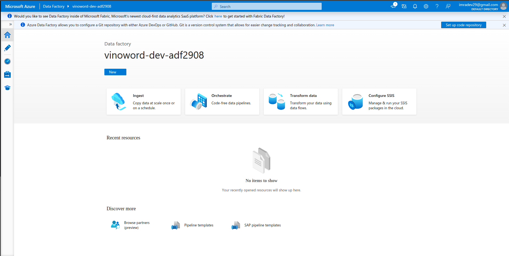

Setup Azure sql DB Resources
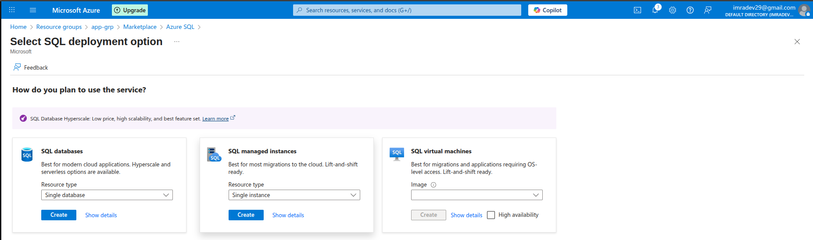
select SQL databases

under that create an sql Database server here selected ((US) East US 2)
sql db server name: vinoworld-dev-sql29
server admin login: vinoworldadmin
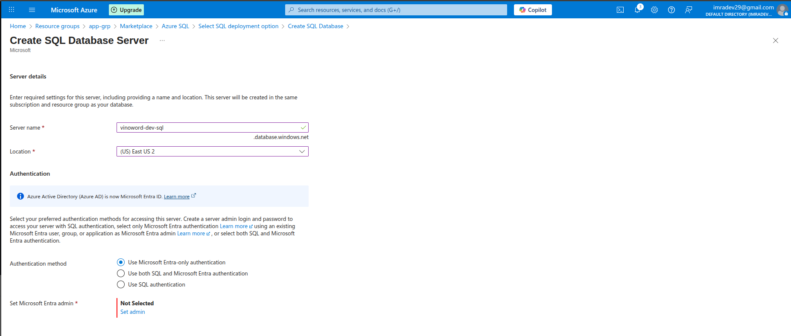 
select: 
Backup storage redudancy as" locally- backup storage
compute+storage: configure
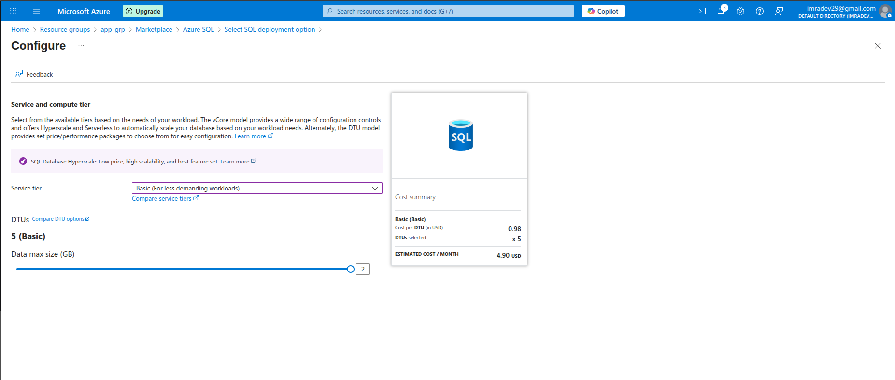
netwroking:
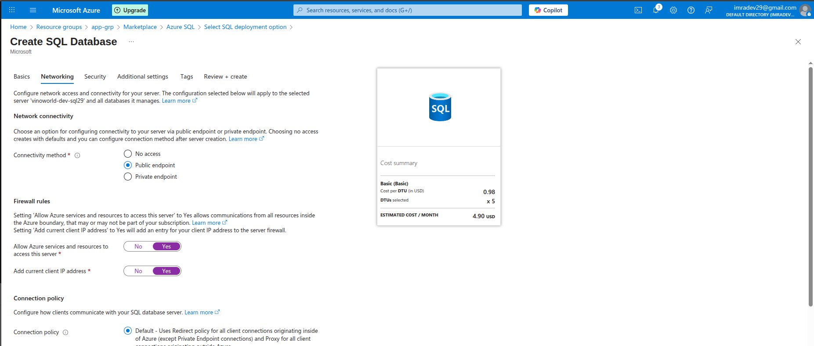

keep other setting as Default and create
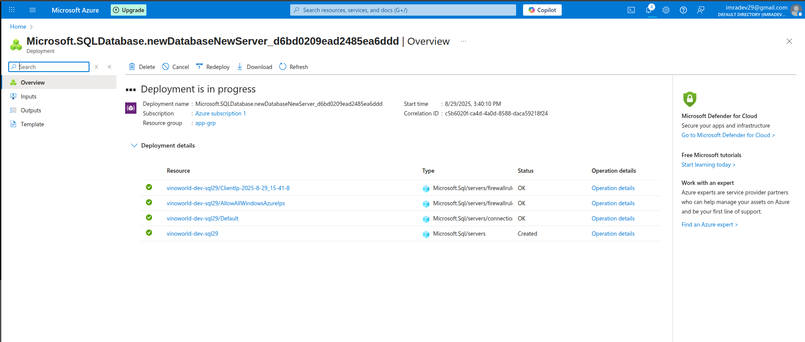

Setup Azure Data Studio
installed packages and 
tar -xvf "...."
cd ~/Downloads/azuredatastudio-linux-x64
./azuredatastudio 
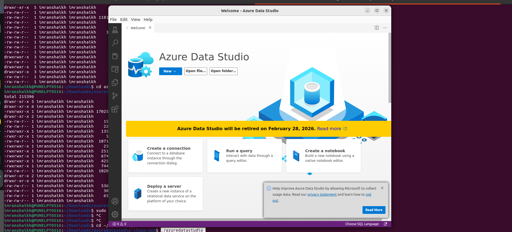

now connect our database server to Azure Data Studio
under Azure Data Studio
server name: vinoworld-dev-sql29.database.windows.net

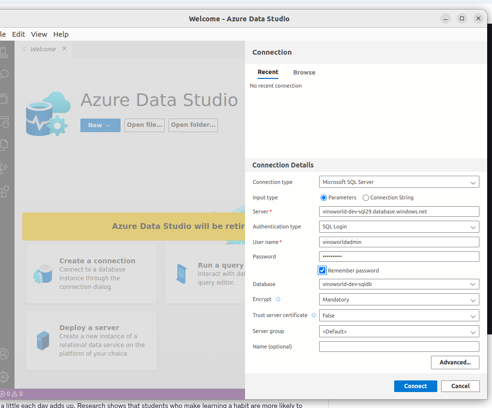
we are now connected to azure sql dv
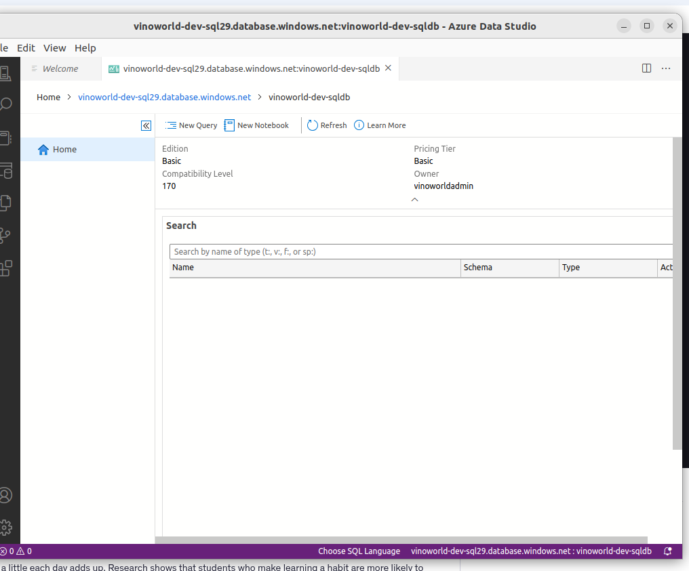