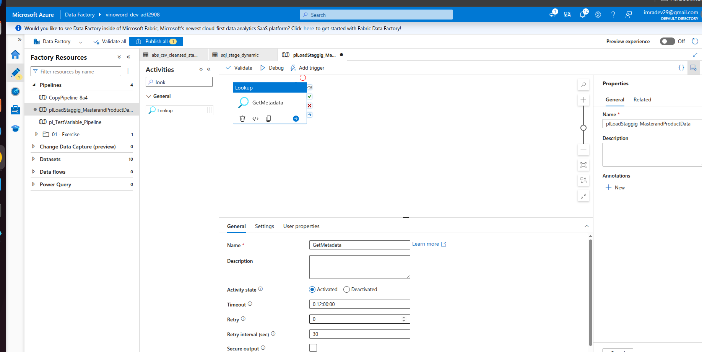
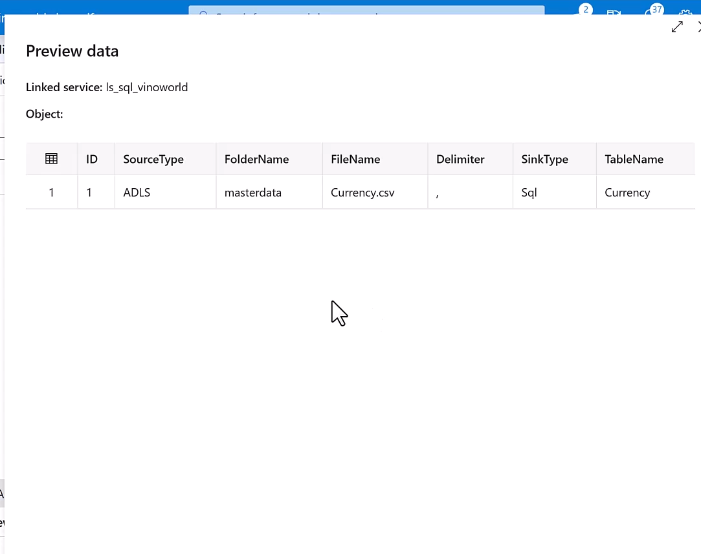
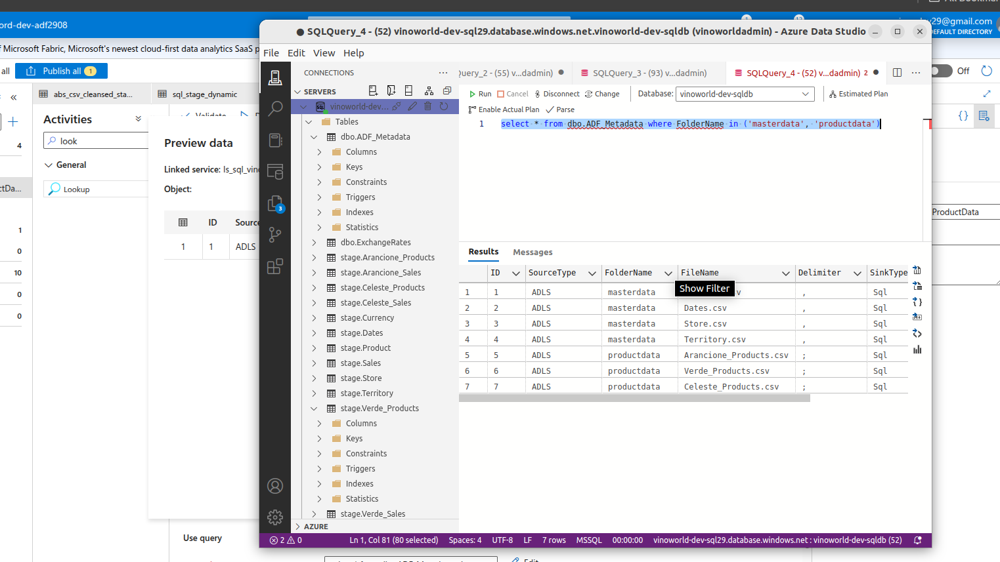
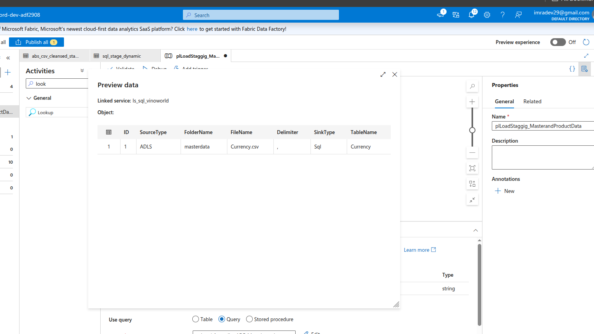
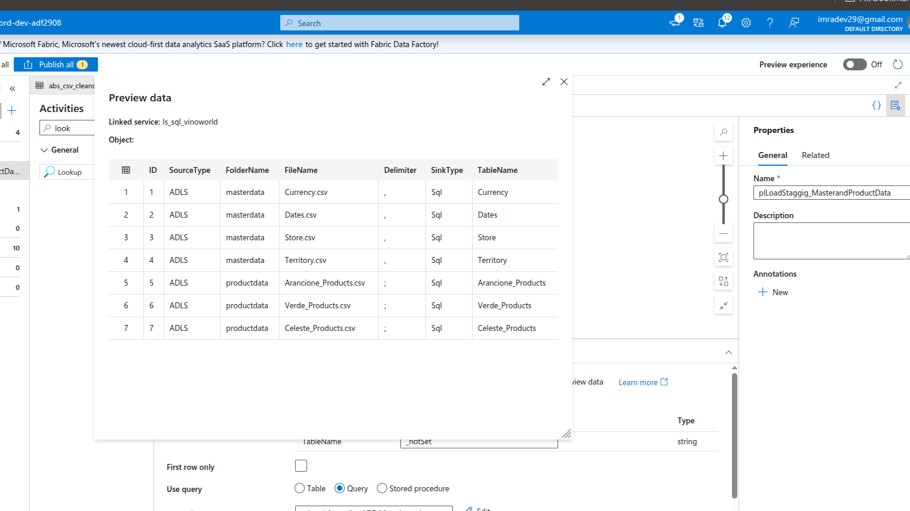
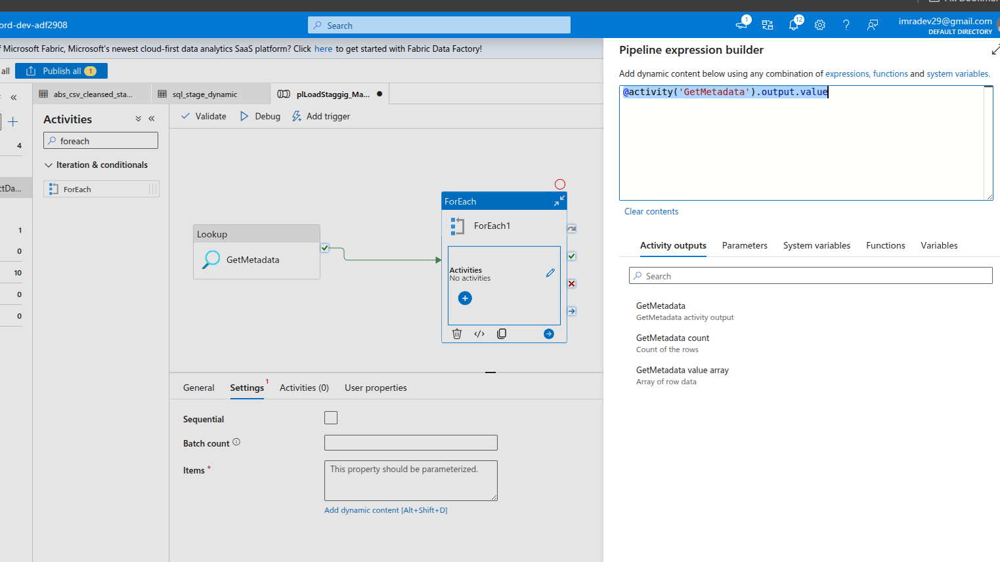
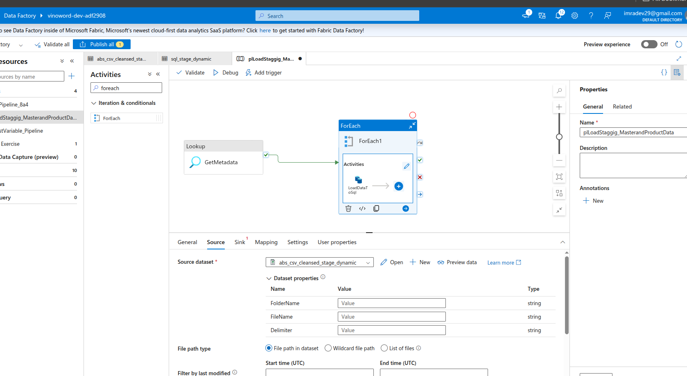
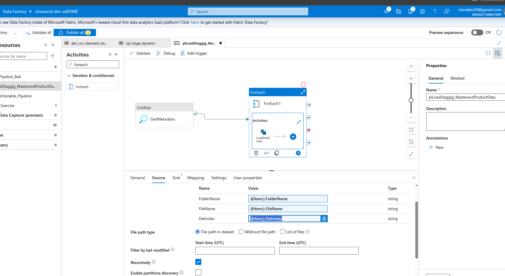
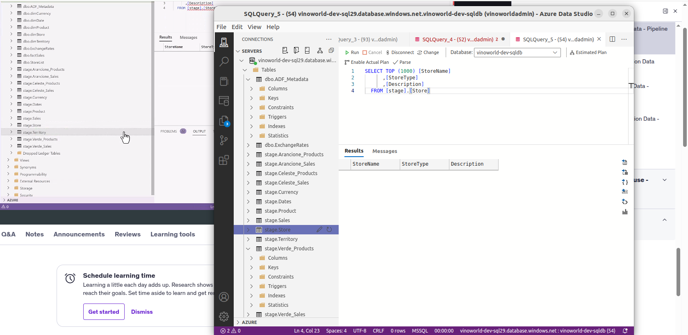
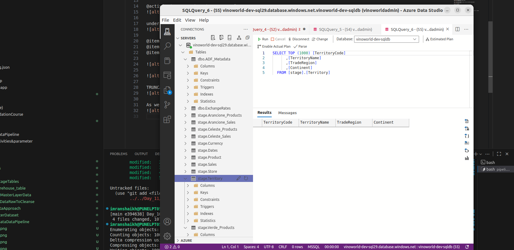

select * from dbo.ADF_Metadata where FolderName in ('masterdata', 'productdata')

under setting untick the First row only box

@activity('GetMetadata').output.value

under "source" drop down and select "abs_csv_cleansed_stage_dynamic"

@item().FolderName
@item().FileName
@item().Delimiter

TRUNCATE TABLE stage.@{item().TableName}

As we can see out sql database server "stage.stor" and "stage.Territory" is Empty

