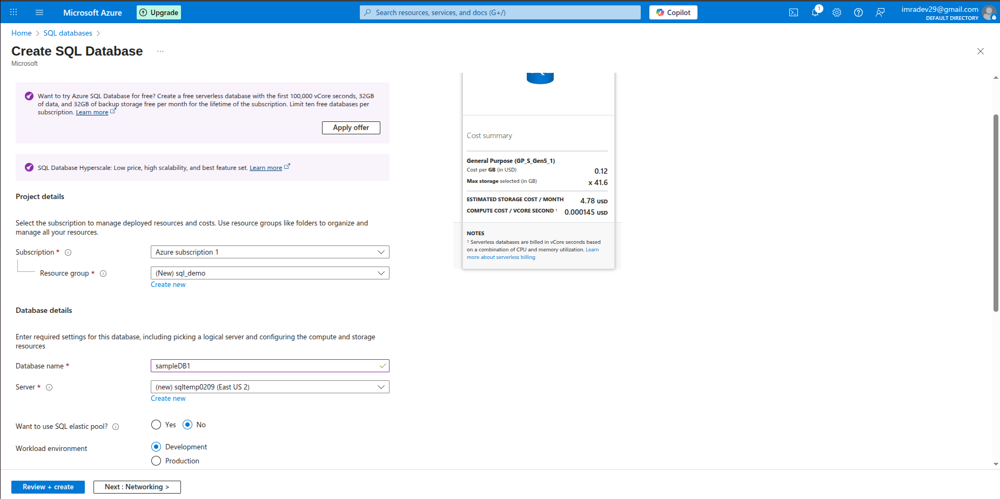
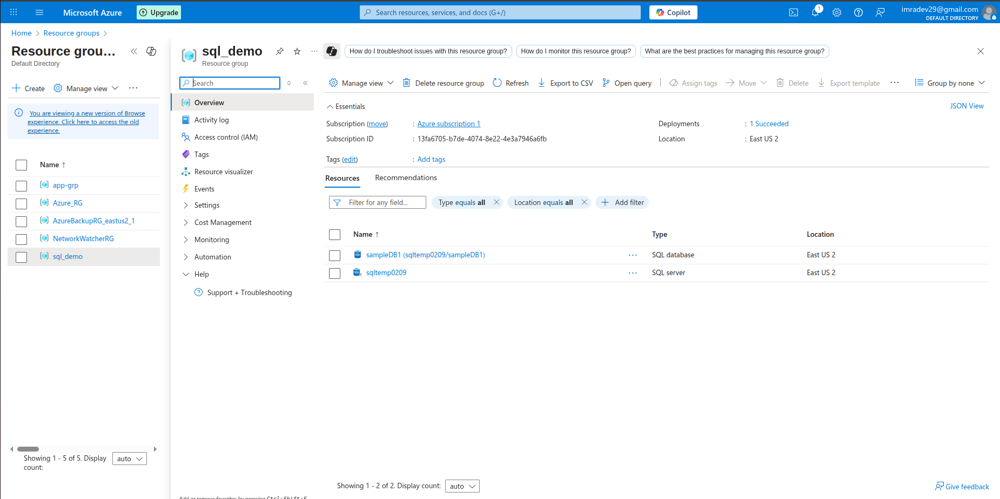
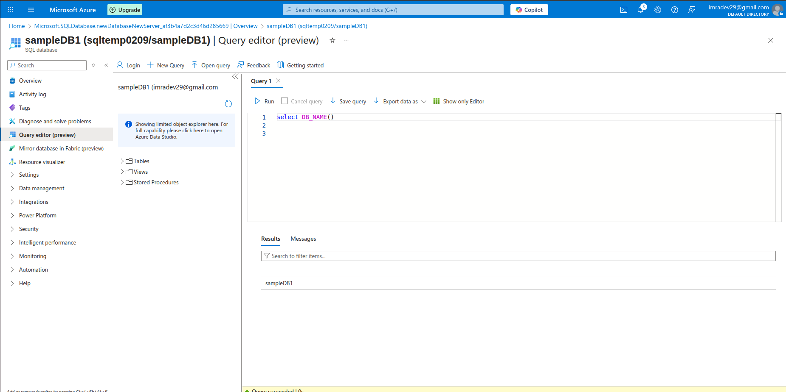
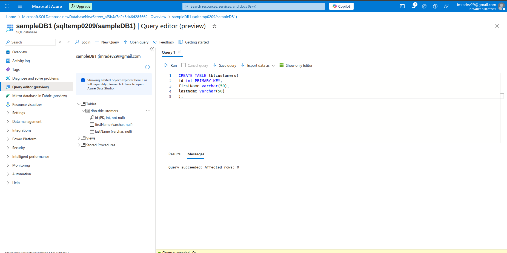
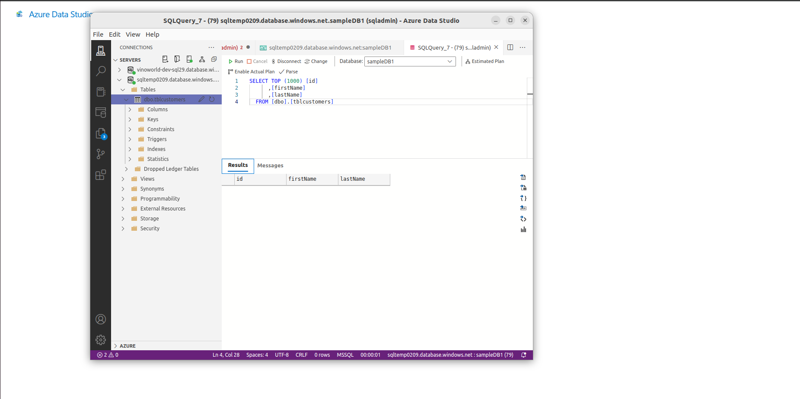
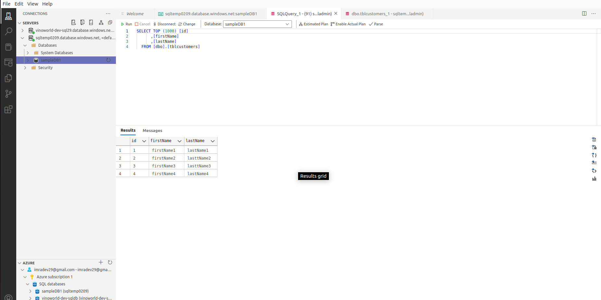
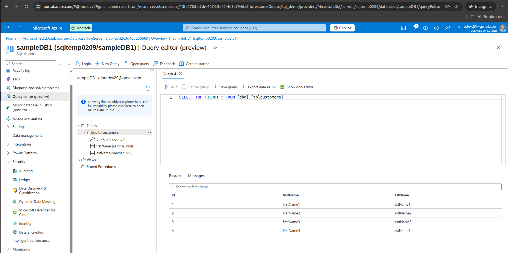
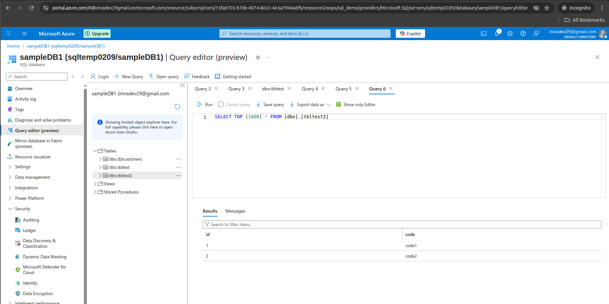

Creating an SQL Database as well as sql Server

Login into sqlDatabase through Azure portal

Run some sample build in query

created an sample table using this
CREATE TABLE tblcustomers(
id int PRIMARY KEY,
firstName varchar(50),
lastName varchar(50)
);

Login through AzureDataStudio

