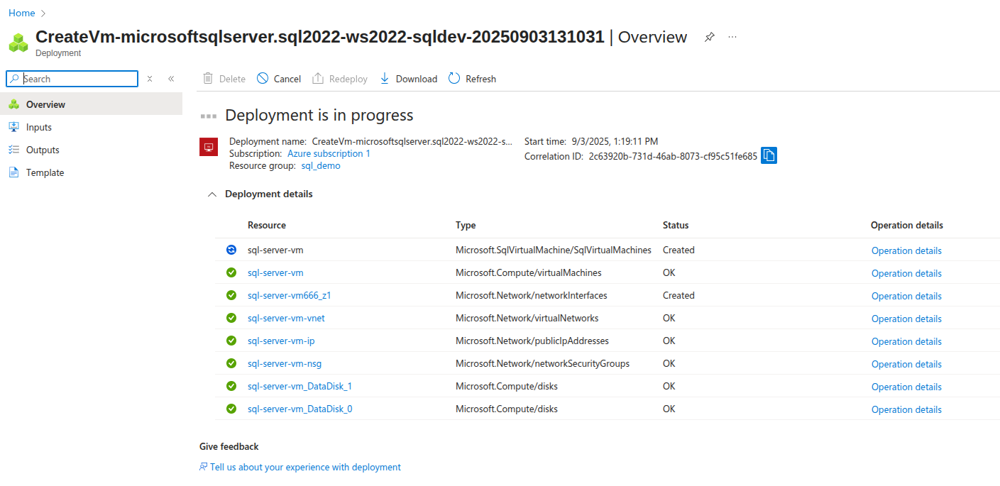
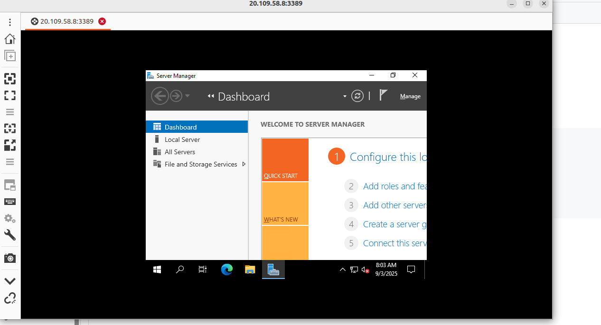
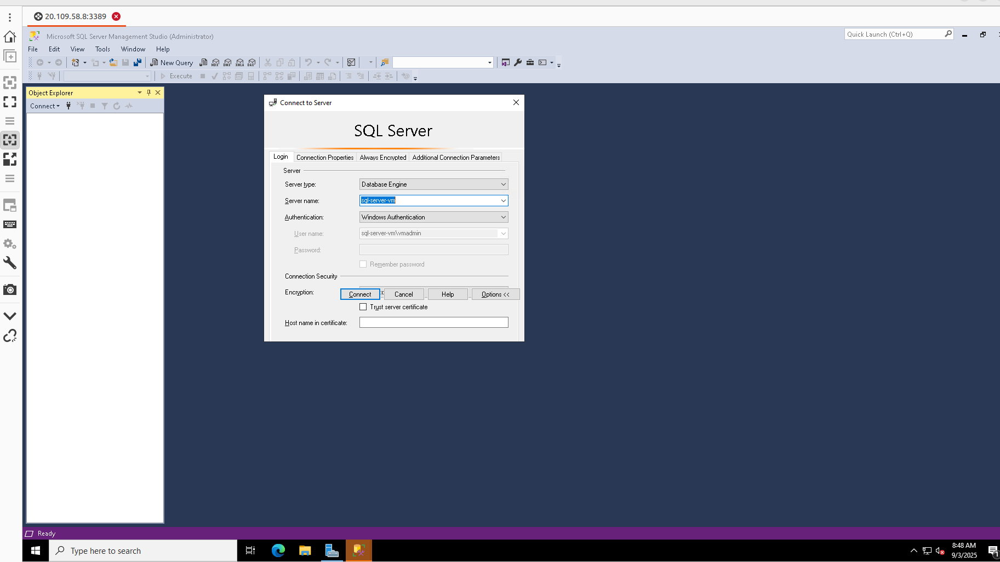

# Creating Azure SQL Server VM with Windows - Firewall Configuration and Remmina Access

## Overview

This guide covers creating an Azure SQL Server VM using Windows, configuring firewall rules for both VM and SQL Server, and accessing the VM through RDP using Remmina on Linux.

## Step 1: Create Azure SQL Server VM (Windows)

### Using Azure Portal

1. **Navigate to Azure Portal**
   - Go to [portal.azure.com](https://portal.azure.com)
   - Click "Create a resource"
   - Search for "SQL Server"

2. **Select SQL Server Image**
   - Choose "SQL Server 2022 on Windows Server 2022"
   - Click "Create"

3. **Configure Basic Settings**
   - **Subscription**: Select your subscription
   - **Resource group**: Create new `sql_demo`
   - **Virtual machine name**: `sql-server-vm`
   - **Region**: East US 2
   - **Image**: SQL Server 2022 Developer on Windows Server 2022
   - **Size**: Standard_D4s_v3 (4 vcpus, 16 GB RAM)

4. **Administrator Account**
   - **Username**: `vmadmin`
   - **Password**: `VmAdmin@1234`
   - **Confirm password**: `VmAdmin@1234`

5. **Inbound Port Rules**
   - **Public inbound ports**: Allow selected ports
   - **Select inbound ports**: RDP (3389)

6. **SQL Server Settings**
   - **SQL connectivity**: Public (Internet)
   - **Port**: 1433
   - **SQL Authentication**: Enable
   - **Login name**: `vmadmin`
   - **Password**: `VmAdmin@1234`
   - **Storage configuration**: Premium SSD

7. **Review and Create**
   - Click "Review + create"
   - Click "Create"
   - Wait for deployment (10-15 minutes)




### Using Azure CLI

```bash
# Create resource group
az group create --name rg-sql-vm-demo --location eastus

# Create SQL Server VM
az sql vm create \
  --resource-group sql_demo \
  --name sql-server-vm \
  --location eastus2 \
  --image "MicrosoftSQLServer:sql2022-ws2022:sqldev-gen2:latest" \
  --size Standard_D4s_v3 \
  --admin-username vmadmin \
  --admin-password "VmAdmin123!" \
  --sql-mgmt-type Full \
  --sql-connectivity-type PUBLIC \
  --sql-port 1433 \
  --sql-auth-update-username sqladmin \
  --sql-auth-update-password "SqlAdmin123!"
```

## Step 2: Configure Network Security Group (NSG) Rules

### Get VM Public IP Address

```bash
# Get public IP address
az vm show -d -g sql_demo -n sql-server-vm --query publicIps -o tsv
```

### Configure Firewall Rules

#### Allow RDP Access (Port 3389)

```bash
# Allow RDP from your IP (replace with your actual IP)
az network nsg rule create \
  --resource-group sql_demo \
  --nsg-name sql-server-vmNSG \
  --name AllowRDP \
  --protocol tcp \
  --priority 1000 \
  --destination-port-range 3389 \
  --source-address-prefixes [YOUR_IP_ADDRESS] \
  --access allow
```

#### Allow SQL Server Access (Port 1433)

```bash
# Allow SQL Server from your IP
az network nsg rule create \
  --resource-group sql_demo \
  --nsg-name sql-server-vmNSG \
  --name AllowSQLServer \
  --protocol tcp \
  --priority 1001 \
  --destination-port-range 1433 \
  --source-address-prefixes [YOUR_IP_ADDRESS] \
  --access allow
```

#### Allow SQL Server from Specific Network Range

```bash
# Allow SQL Server from office network (example)
az network nsg rule create \
  --resource-group sql_demo \
  --nsg-name sql-server-vmNSG \
  --name AllowSQLFromOffice \
  --protocol tcp \
  --priority 1002 \
  --destination-port-range 1433 \
  --source-address-prefixes "203.0.113.0/24" \
  --access allow
```

### View Current NSG Rules

```bash
# List all NSG rules
az network nsg rule list \
  --resource-group sql_demo \
  --nsg-name sql-server-vmNSG \
  --output table
```

## Step 3: Configure Windows Firewall on VM

### Connect to VM and Configure Firewall

Once connected via RDP, run these PowerShell commands:

```powershell
# Enable SQL Server through Windows Firewall
New-NetFirewallRule -DisplayName "SQL Server" -Direction Inbound -Protocol TCP -LocalPort 1433 -Action Allow

# Enable SQL Browser (optional)
New-NetFirewallRule -DisplayName "SQL Browser" -Direction Inbound -Protocol UDP -LocalPort 1434 -Action Allow

# Enable Remote Desktop (should already be enabled)
Enable-NetFirewallRule -DisplayGroup "Remote Desktop"

# Check firewall rules
Get-NetFirewallRule | Where-Object {$_.DisplayName -like "*SQL*" -or $_.DisplayName -like "*Remote Desktop*"}
```

### Alternative: Using Windows Firewall GUI

1. **Open Windows Firewall with Advanced Security**
   - Press `Win + R`, type `wf.msc`, press Enter

2. **Create Inbound Rule for SQL Server**
   - Right-click "Inbound Rules" → "New Rule"
   - Rule Type: Port
   - Protocol: TCP
   - Specific Local Ports: 1433
   - Action: Allow the connection
   - Profile: All profiles
   - Name: SQL Server

### Access SQL from VM
   

## Step 4: Install and Configure Remmina

### Install Remmina on Linux

#### Ubuntu/Debian
```bash
sudo apt update
sudo apt install remmina remmina-plugin-rdp
```

#### CentOS/RHEL/Fedora
```bash
# CentOS/RHEL
sudo yum install remmina remmina-plugins-rdp

# Fedora
sudo dnf install remmina remmina-plugins-rdp
```

#### Arch Linux
```bash
sudo pacman -S remmina freerdp
```

## Step 5: Connect to VM using Remmina

### Launch Remmina

```bash
# Start Remmina
remmina
```

### Create New RDP Connection

1. **Click "+" to create new connection**

2. **Configure Connection Settings**
   - **Name**: `SQL Server VM`
   - **Protocol**: `RDP - Remote Desktop Protocol`
   - **Server**: `[VM_PUBLIC_IP]:3389`
   - **Username**: `vmadmin`
   - **Password**: `VmAdmin123!`
   - **Domain**: Leave empty
   - **Resolution**: `Use client resolution` or custom
   - **Color depth**: `True color (32 bpp)`

3. **Advanced Settings (Optional)**
   - **Security**: `Auto-negotiate`
   - **Ignore certificate**: `Yes` (for self-signed certificates)
   - **Disable clipboard sync**: `No`
   - **Share folder**: Specify local folder to share (optional)

4. **Save and Connect**
   - Click "Save and Connect"

### Remmina Connection Profile Example

Create a `.remmina` file manually:

```ini
[remmina]
password=VmAdmin123!
gateway_server=
notes_text=
vc=
scale=1
ssh_tunnel_certfile=
websockets=0
ssh_tunnel_enabled=0
ssh_tunnel_password=
drive=
console=0
colordepth=32
security=
precommand=
disable_fastpath=0
left-handed=0
postcommand=
multitransport=0
server=[VM_PUBLIC_IP]:3389
ssh_tunnel_username=
glyph-cache=0
ssh_tunnel_passphrase=
name=SQL Server VM
disableclipboard=0
domain=
username=vmadmin
window_maximize=1
viewmode=1
ssh_tunnel_server=
protocol=RDP
group=
window_height=768
ssh_tunnel_privatekey=
window_width=1024
```

## Step 6: Test SQL Server Connection

### From Within the VM (via RDP)

1. **Open SQL Server Management Studio (SSMS)**
   - Should be pre-installed on SQL Server VM

2. **Connect to SQL Server**
   - **Server name**: `localhost` or `sql-server-vm`
   - **Authentication**: SQL Server Authentication
   - **Login**: `sqladmin`
   - **Password**: `SqlAdmin123!`

### From External Machine

#### Using Azure Data Studio

1. **Install Azure Data Studio**
   ```bash
   # Download and install Azure Data Studio for Linux
   wget https://go.microsoft.com/fwlink/?linkid=2204670 -O azuredatastudio-linux.deb
   sudo dpkg -i azuredatastudio-linux.deb
   ```

2. **Connect to SQL Server**
   - **Server**: `[VM_PUBLIC_IP],1433`
   - **Authentication type**: SQL Login
   - **User name**: `sqladmin`
   - **Password**: `SqlAdmin123!`

#### Using sqlcmd (if available on Linux)

```bash
# Install sqlcmd for Linux
curl https://packages.microsoft.com/keys/microsoft.asc | sudo apt-key add -
curl https://packages.microsoft.com/config/ubuntu/20.04/prod.list | sudo tee /etc/apt/sources.list.d/msprod.list
sudo apt-get update
sudo apt-get install mssql-tools unixodbc-dev

# Connect to SQL Server
/opt/mssql-tools/bin/sqlcmd -S [VM_PUBLIC_IP],1433 -U sqladmin -P SqlAdmin123!
```

## Step 7: Verify Connections

### Test RDP Connection

```bash
# Test RDP port connectivity
nc -zv [VM_PUBLIC_IP] 3389

# Or using telnet
telnet [VM_PUBLIC_IP] 3389
```

### Test SQL Server Connection

```bash
# Test SQL Server port connectivity
nc -zv [VM_PUBLIC_IP] 1433

# Or using telnet
telnet [VM_PUBLIC_IP] 1433
```

### Check VM Status

```bash
# Check VM status
az vm get-instance-view \
  --resource-group rg-sql-vm-demo \
  --name sql-server-vm \
  --query instanceView.statuses[1] \
  --output table
```

## Troubleshooting

### RDP Connection Issues

1. **Check NSG Rules**
   ```bash
   az network nsg rule list \
     --resource-group rg-sql-vm-demo \
     --nsg-name sql-server-vmNSG \
     --query "[?destinationPortRange=='3389']" \
     --output table
   ```

2. **Verify VM is Running**
   ```bash
   az vm list -d \
     --resource-group rg-sql-vm-demo \
     --output table
   ```

3. **Check Public IP**
   ```bash
   az vm list-ip-addresses \
     --resource-group rg-sql-vm-demo \
     --name sql-server-vm \
     --output table
   ```

### SQL Server Connection Issues

1. **Check SQL Server Service Status** (from within VM)
   ```powershell
   Get-Service -Name "MSSQLSERVER"
   ```

2. **Check SQL Server Network Configuration**
   ```sql
   -- Run in SSMS
   SELECT 
       local_net_address,
       local_tcp_port,
       state_desc
   FROM sys.dm_exec_connections
   WHERE session_id = @@SPID;
   ```

3. **Verify SQL Server Authentication**
   ```sql
   -- Check authentication mode
   SELECT CASE SERVERPROPERTY('IsIntegratedSecurityOnly')
       WHEN 1 THEN 'Windows Authentication'
       WHEN 0 THEN 'Mixed Mode'
   END AS AuthenticationMode;
   ```

### Remmina Troubleshooting

1. **Enable Remmina Debug Mode**
   ```bash
   remmina --debug
   ```

2. **Check Remmina Logs**
   ```bash
   journalctl --user -u remmina
   ```

3. **Test RDP Protocol**
   ```bash
   # Test with xfreerdp directly
   xfreerdp /v:[VM_PUBLIC_IP]:3389 /u:vmadmin /p:VmAdmin123!
   ```

## Security Best Practices

### Network Security
- **Restrict IP Access**: Only allow specific IP addresses in NSG rules
- **Use VPN**: Consider VPN connection instead of public IP access
- **Regular Updates**: Keep NSG rules updated with current IP addresses

### VM Security
- **Strong Passwords**: Use complex passwords for VM and SQL Server
- **Windows Updates**: Keep Windows Server updated
- **Antivirus**: Enable Windows Defender or install antivirus

### SQL Server Security
- **SQL Authentication**: Use strong passwords for SQL logins
- **Firewall Rules**: Configure SQL Server firewall appropriately
- **Encryption**: Enable SSL/TLS for SQL connections

## Cleanup Resources

```bash
# Delete entire resource group (removes all resources)
az group delete --name rg-sql-vm-demo --yes --no-wait

# Or stop VM to save costs
az vm stop --resource-group rg-sql-vm-demo --name sql-server-vm
az vm deallocate --resource-group rg-sql-vm-demo --name sql-server-vm
```

## Conclusion

This guide provides a complete setup for Azure SQL Server VM with Windows, proper firewall configuration, and access via Remmina. The configuration ensures secure access while maintaining functionality for both RDP and SQL Server connections from Linux environments using Remmina as the RDP client.

This guide provides a complete setup for Azure SQL Server VM with Windows, proper firewall configuration, and access via Remmina. The configuration ensures secure access while maintaining functionality for both RDP and SQL Server connections from Linux environments using Remmina as the RDP client.