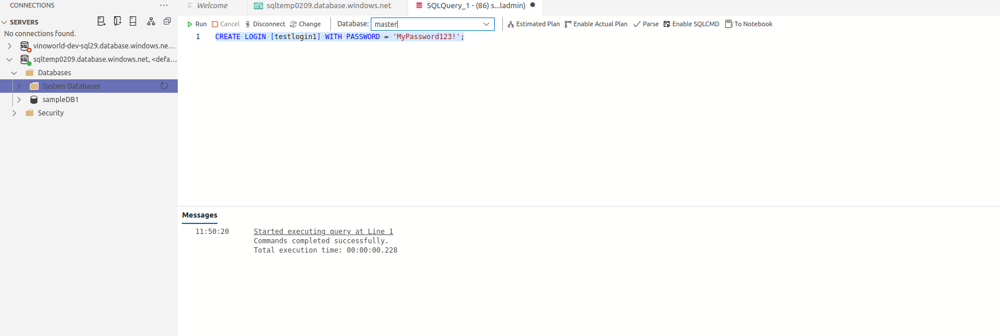
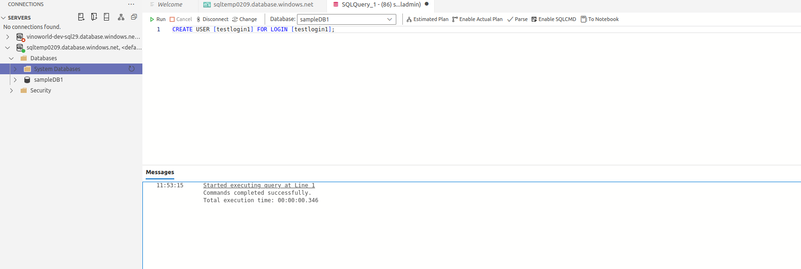
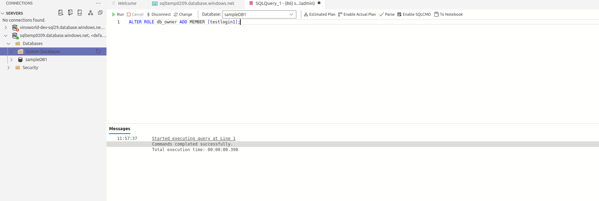
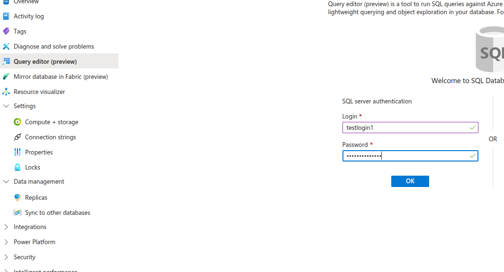

# Creating SQL User in Azure SQL Database

## Quick Start Guide

### Method 1: SQL Authentication User

#### Step 1: Create Login (in master database)
```sql
-- Connect to master database
USE master;
CREATE LOGIN [testlogin1] WITH PASSWORD = 'MyPassword123!';
```


#### Step 2: Create User (in target database)
```sql
-- Connect to sampleDB1 database
USE [sampleDB1];
CREATE USER [testlogin1] FOR LOGIN [testlogin1];
```


#### Step 3: Grant Permissions
```sql
-- Grant read/write access
ALTER ROLE db_datareader ADD MEMBER [testlogin1];
ALTER ROLE db_datawriter ADD MEMBER [testlogin1];
ALTER ROLE db_owner ADD MEMBER [testlogin1];
```


### Method 2: Entra ID User

#### Step 1: Create Entra ID User
```sql
-- Connect to sampleDB1 database as Entra ID admin
USE [sampleDB1];
CREATE USER [testlogin1@domain.com] FROM EXTERNAL PROVIDER;
```

#### Step 2: Grant Permissions
```sql
ALTER ROLE db_owner ADD MEMBER [testlogin1@domain.com];
```

### Method 3: Contained Database User

#### Create User Directly in Database
```sql
-- Connect to sampleDB1 database
USE [sampleDB1];
CREATE USER [testlogin1] WITH PASSWORD = 'MyPassword123!';
ALTER ROLE db_datareader ADD MEMBER [testlogin1];
```

## Common Database Roles

```sql
-- Read only
ALTER ROLE db_datareader ADD MEMBER [username];

-- Read and write
ALTER ROLE db_datareader ADD MEMBER [username];
ALTER ROLE db_datawriter ADD MEMBER [username];

-- Execute stored procedures
ALTER ROLE db_executor ADD MEMBER [username];

-- Full database access
ALTER ROLE db_owner ADD MEMBER [username];
```

## Connection Strings

### SQL Authentication
```
Server=tcp:myserver.database.windows.net,1433;Database=sampleDB1;User ID=testlogin1;Password=MyPassword123!;Encrypt=True;
```

### Entra ID Authentication
```
Server=tcp:myserver.database.windows.net,1433;Database=sampleDB1;Authentication=Active Directory Default;Encrypt=True;
```

## Verify User Creation

```sql
-- Check if user exists
SELECT name, type_desc, authentication_type_desc 
FROM sys.database_principals 
WHERE name = 'testlogin1';

-- Check user permissions
SELECT 
    r.name AS RoleName,
    m.name AS MemberName
FROM sys.database_role_members rm
JOIN sys.database_principals r ON rm.role_principal_id = r.principal_id
JOIN sys.database_principals m ON rm.member_principal_id = m.principal_id
WHERE m.name = 'testlogin1';
```

## Remove User

```sql
-- Remove from roles first
ALTER ROLE db_datareader DROP MEMBER [testlogin1];
ALTER ROLE db_datawriter DROP MEMBER [testlogin1];

-- Drop user
DROP USER [testlogin1];

-- Drop login (if SQL authentication)
USE master;
DROP LOGIN [testlogin1];
```

## Best Practices

1. **Use Entra ID authentication** when possible
2. **Apply least privilege** - grant minimum required permissions
3. **Use strong passwords** for SQL authentication
4. **Regular review** of user permissions
5. **Remove unused accounts** promptly

#### Login from a new user
