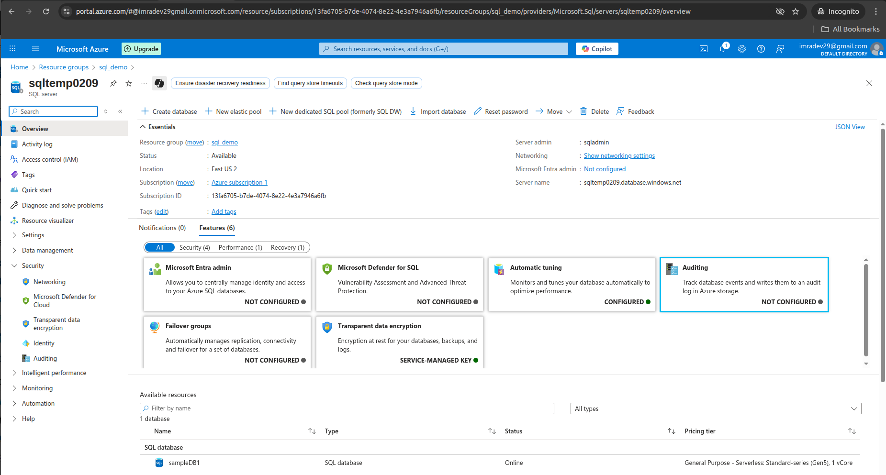
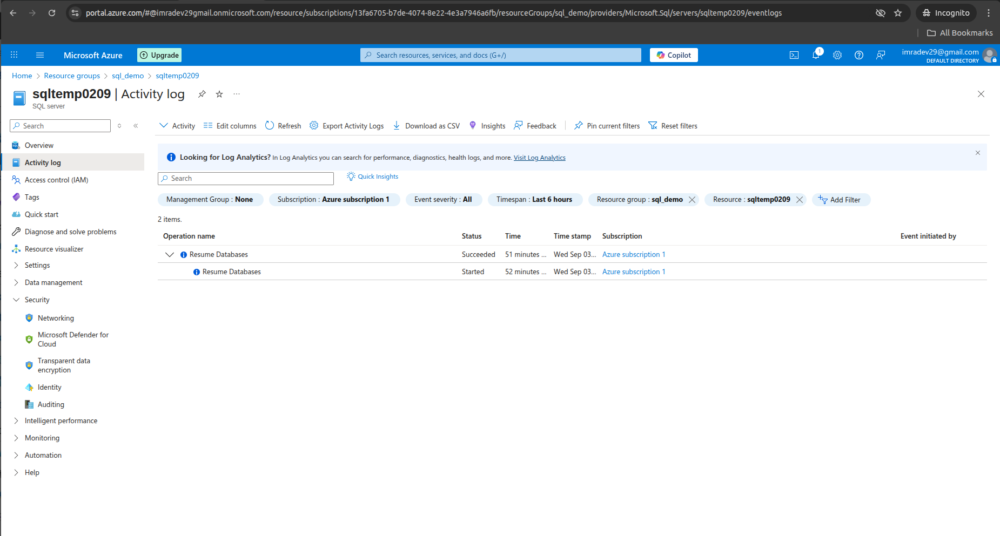
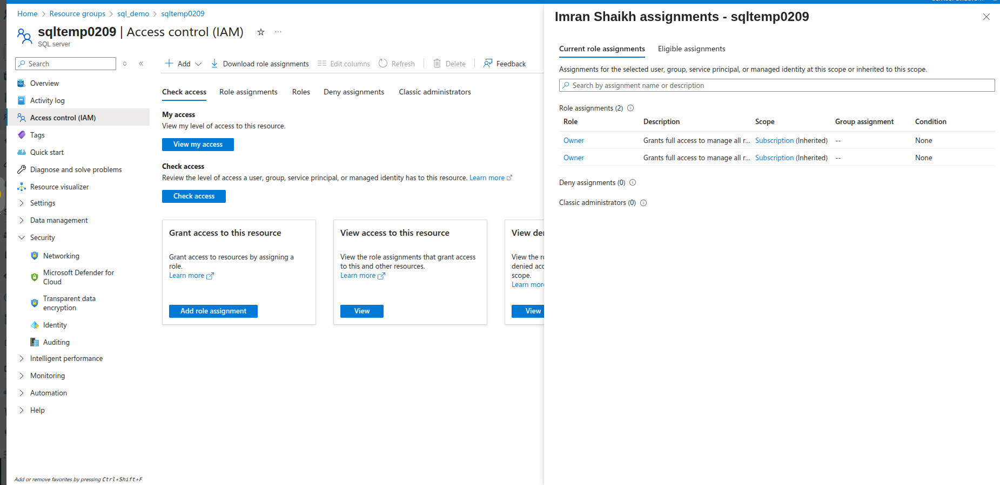
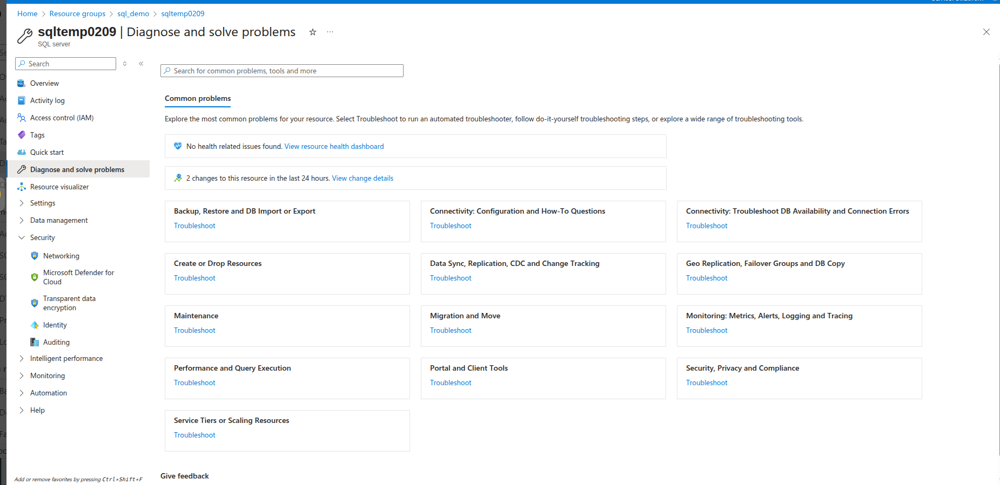
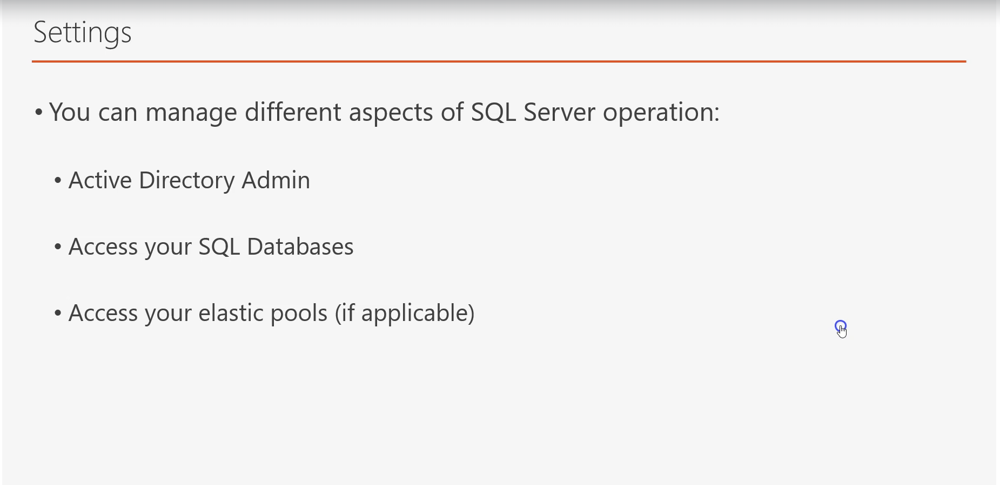
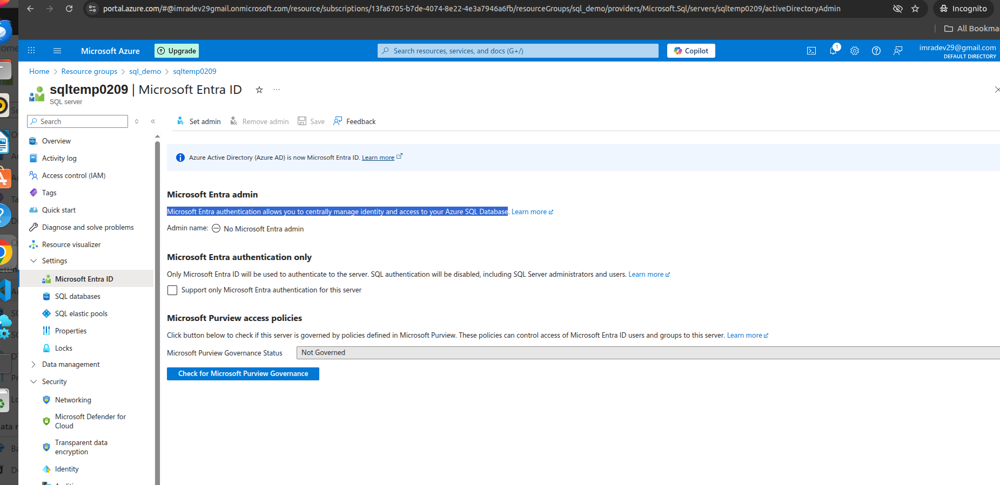
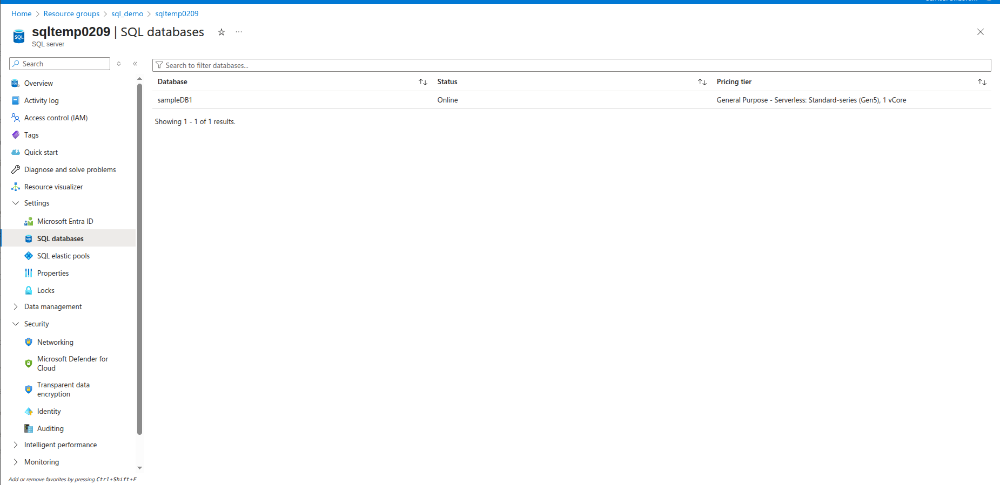

# Managing Azure SQL Database Server

## Overview

Managing Azure SQL Database Server involves configuring, monitoring, and maintaining the logical server that hosts your Azure SQL databases. This comprehensive guide covers all aspects of SQL Database Server management including security, monitoring, access control, and administrative tasks.

## Azure SQL Database Server Overview

Azure SQL Database Server is a logical construct that acts as a central administrative point for multiple databases. It provides:

- **Centralized Management**: Single point for managing multiple databases
- **Security Configuration**: Server-level security settings and policies
- **Resource Management**: Compute and storage resource allocation
- **Monitoring and Diagnostics**: Performance monitoring and troubleshooting tools
- **Backup and Recovery**: Automated backup and point-in-time restore capabilities

### Key Components:
- **Server Name**: Unique identifier for your SQL server
- **Resource Group**: Logical container for related resources
- **Location**: Azure region where server is deployed
- **Server Admin**: Administrative login for server management
- **Databases**: Collection of databases hosted on the server

## Activity Log Management

The Activity Log provides a comprehensive audit trail of all operations performed on your SQL Database Server.

### Activity Log Features:
- **Operation Tracking**: Monitor all administrative operations
- **User Attribution**: See who performed each operation
- **Timestamp Information**: When operations occurred
- **Status Monitoring**: Success/failure status of operations
- **Resource Changes**: Track configuration and resource modifications

### Common Activities Logged:
- Database creation and deletion
- Server configuration changes
- Firewall rule modifications
- Security policy updates
- Backup and restore operations
- Performance tier changes

### Using Activity Logs:
1. **Compliance Auditing**: Meet regulatory requirements
2. **Troubleshooting**: Identify when issues started
3. **Security Monitoring**: Track unauthorized access attempts
4. **Change Management**: Document configuration changes

## Access Control (IAM)

Access Control manages who can perform operations on your SQL Database Server through Azure Role-Based Access Control (RBAC).

### Key RBAC Roles for SQL Database:

#### Built-in Roles:
- **SQL DB Contributor**: Can manage SQL databases but not access them
- **SQL Server Contributor**: Can manage SQL servers and databases
- **Reader**: Can view SQL server and database properties
- **Owner**: Full access including access management

#### Custom Roles:
- Create specific roles for your organization's needs
- Define granular permissions for specific operations
- Implement principle of least privilege

### Access Control Best Practices:
1. **Principle of Least Privilege**: Grant minimum required permissions
2. **Role Assignment**: Use groups instead of individual users
3. **Regular Reviews**: Periodically review and update access
4. **Separation of Duties**: Separate administrative and operational roles

### Managing Access:
- **Add Role Assignment**: Grant permissions to users/groups
- **Remove Access**: Revoke permissions when no longer needed
- **Check Access**: Verify effective permissions for users
- **Deny Assignments**: Explicitly block certain operations

## Diagnose and Solve Problems

Azure provides built-in diagnostic tools to help identify and resolve common issues with your SQL Database Server.

### Diagnostic Categories:

#### Performance Issues:
- **Slow Query Performance**: Identify and optimize slow-running queries
- **High CPU Usage**: Analyze CPU consumption patterns
- **Memory Pressure**: Monitor memory utilization
- **I/O Bottlenecks**: Identify storage performance issues

#### Connectivity Problems:
- **Connection Failures**: Troubleshoot connection issues
- **Firewall Configuration**: Verify firewall rules
- **Authentication Issues**: Resolve login problems
- **Network Connectivity**: Check network configuration

#### Availability Concerns:
- **Service Interruptions**: Investigate downtime events
- **Failover Events**: Analyze high availability events
- **Backup Failures**: Troubleshoot backup issues
- **Maintenance Windows**: Plan for scheduled maintenance

### Diagnostic Tools:
1. **Intelligent Insights**: AI-powered performance analysis
2. **Query Performance Insight**: Query-level performance metrics
3. **Database Advisor**: Automated tuning recommendations
4. **Resource Health**: Service availability status

## SQL Server Settings

Server-level settings control the behavior and configuration of your Azure SQL Database Server.

### Key Server Settings:

#### Security Settings:
- **Firewall Rules**: Control network access to the server
- **Virtual Network Rules**: Allow access from specific VNets
- **Advanced Data Security**: Enable threat detection and vulnerability assessment
- **Transparent Data Encryption**: Encrypt data at rest

#### Authentication Settings:
- **SQL Authentication**: Traditional username/password authentication
- **Azure AD Authentication**: Integrated identity management
- **Multi-Factor Authentication**: Additional security layer

#### Backup Settings:
- **Automated Backups**: Configure backup retention policies
- **Geo-Redundant Backup**: Cross-region backup replication
- **Point-in-Time Restore**: Granular recovery options

#### Monitoring Settings:
- **Diagnostic Logs**: Enable detailed logging
- **Metrics Collection**: Performance data gathering
- **Alert Rules**: Proactive monitoring notifications

### Configuration Best Practices:
1. **Security First**: Enable all available security features
2. **Monitoring**: Configure comprehensive monitoring
3. **Backup Strategy**: Implement robust backup policies
4. **Performance**: Optimize settings for your workload

## Microsoft Entra ID Integration

Microsoft Entra ID (formerly Azure AD) authentication provides centralized identity and access management for your Azure SQL Database.

### Benefits of Entra ID Integration:
- **Centralized Identity Management**: Single identity source
- **Multi-Factor Authentication**: Enhanced security
- **Conditional Access**: Policy-based access control
- **Single Sign-On**: Seamless user experience
- **Group-Based Access**: Simplified permission management

### Entra ID Authentication Features:

#### Authentication Methods:
- **Integrated Authentication**: Windows Authentication equivalent
- **Password Authentication**: Username/password with Entra ID
- **Universal Authentication**: MFA-enabled authentication
- **Service Principal**: Application-based authentication

#### Administrative Roles:
- **Entra ID Admin**: Manage Entra ID users and groups
- **SQL Admin**: Traditional SQL Server administrator
- **Dual Administration**: Both Entra ID and SQL authentication

### Configuration Steps:
1. **Enable Entra ID Admin**: Assign Entra ID administrator
2. **Configure Users**: Add Entra ID users to database
3. **Set Permissions**: Grant appropriate database roles
4. **Test Access**: Verify authentication works correctly

### Security Benefits:
- **No Password Storage**: Passwords managed by Entra ID
- **Audit Trail**: Comprehensive authentication logging
- **Policy Enforcement**: Conditional access policies
- **Token-Based**: Modern authentication protocols

## SQL Databases Management

The SQL Databases section provides an overview and management interface for all databases hosted on your server.

### Database Management Features:

#### Database Operations:
- **Create Database**: Add new databases to the server
- **Delete Database**: Remove databases (with safeguards)
- **Scale Database**: Modify performance tiers and resources
- **Pause/Resume**: Control database availability (serverless tier)

#### Monitoring and Metrics:
- **Performance Metrics**: CPU, memory, I/O utilization
- **Storage Usage**: Database size and growth trends
- **Connection Statistics**: Active connections and usage patterns
- **Query Performance**: Top resource-consuming queries

#### Database Properties:
- **Service Tier**: Basic, Standard, Premium, or vCore-based
- **Compute Size**: DTUs or vCores allocated
- **Storage Size**: Maximum database size
- **Backup Retention**: Backup policy settings

### Database Management Tasks:

#### Regular Maintenance:
1. **Performance Monitoring**: Track database performance metrics
2. **Index Maintenance**: Optimize database indexes
3. **Statistics Updates**: Keep query optimizer statistics current
4. **Backup Verification**: Ensure backups are successful

#### Scaling Operations:
1. **Vertical Scaling**: Increase/decrease compute resources
2. **Storage Scaling**: Expand database storage capacity
3. **Service Tier Changes**: Move between performance tiers
4. **Elastic Pool Migration**: Move databases to/from elastic pools

## Advanced Management Features

### Automated Tuning
- **Automatic Plan Correction**: Fix performance regressions
- **Index Management**: Create and drop indexes automatically
- **Force Last Good Plan**: Revert to better execution plans

### Intelligent Performance
- **Query Performance Insight**: Identify top resource consumers
- **Performance Recommendations**: AI-generated optimization suggestions
- **Automatic Tuning**: Implement performance improvements automatically

### Security Management
- **Advanced Threat Protection**: Detect suspicious activities
- **Vulnerability Assessment**: Identify security weaknesses
- **Data Discovery & Classification**: Classify sensitive data
- **Dynamic Data Masking**: Hide sensitive data from non-privileged users

## Monitoring and Alerting

### Key Metrics to Monitor:
- **CPU Percentage**: Compute resource utilization
- **Data I/O Percentage**: Storage performance metrics
- **Log I/O Percentage**: Transaction log performance
- **DTU/vCore Percentage**: Overall resource consumption
- **Connection Count**: Active database connections
- **Deadlocks**: Database locking issues

### Alert Configuration:
1. **Metric Alerts**: Threshold-based notifications
2. **Activity Log Alerts**: Administrative operation notifications
3. **Service Health Alerts**: Azure service status updates
4. **Resource Health Alerts**: Resource-specific health notifications

## Best Practices for SQL Database Server Management

### Security Best Practices:
1. **Enable Entra ID Authentication**: Use modern authentication
2. **Configure Firewall Rules**: Restrict network access
3. **Enable Advanced Threat Protection**: Detect security threats
4. **Use Transparent Data Encryption**: Encrypt data at rest
5. **Implement Row-Level Security**: Control data access

### Performance Best Practices:
1. **Monitor Performance Metrics**: Track key performance indicators
2. **Enable Automatic Tuning**: Let AI optimize performance
3. **Use Query Performance Insight**: Identify problematic queries
4. **Implement Connection Pooling**: Optimize connection usage
5. **Regular Index Maintenance**: Keep indexes optimized

### Operational Best Practices:
1. **Implement Backup Strategy**: Ensure data protection
2. **Test Disaster Recovery**: Verify recovery procedures
3. **Monitor Resource Usage**: Track consumption patterns
4. **Plan for Scaling**: Anticipate growth requirements
5. **Document Configurations**: Maintain configuration records

### Cost Optimization:
1. **Right-Size Resources**: Match resources to workload
2. **Use Elastic Pools**: Optimize costs for multiple databases
3. **Consider Serverless**: For intermittent workloads
4. **Monitor Usage Patterns**: Identify optimization opportunities
5. **Reserved Capacity**: Purchase reserved instances for predictable workloads

## Troubleshooting Common Issues

### Connection Issues:
- **Firewall Configuration**: Verify IP addresses are allowed
- **Authentication Problems**: Check credentials and permissions
- **Network Connectivity**: Test network path to Azure
- **Connection Limits**: Monitor concurrent connection usage

### Performance Issues:
- **Slow Queries**: Use Query Performance Insight
- **High Resource Usage**: Monitor CPU, memory, and I/O
- **Blocking and Deadlocks**: Analyze locking patterns
- **Index Fragmentation**: Rebuild or reorganize indexes

### Availability Issues:
- **Service Interruptions**: Check Azure Service Health
- **Backup Failures**: Verify backup configuration
- **Failover Events**: Review high availability settings
- **Maintenance Windows**: Plan for scheduled maintenance

## Conclusion

Effective management of Azure SQL Database Server requires understanding of security, performance, monitoring, and operational aspects. By following best practices and utilizing Azure's built-in management tools, you can ensure optimal performance, security, and availability of your database workloads.

Regular monitoring, proactive maintenance, and proper security configuration are essential for successful database server management in Azure. The integrated tools and features provide comprehensive capabilities for managing enterprise-grade database solutions in the cloud.