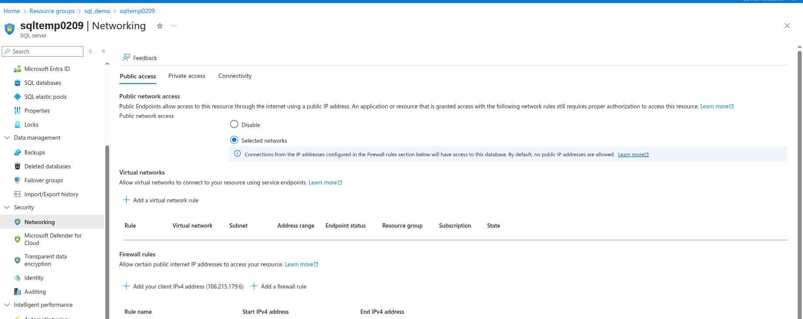
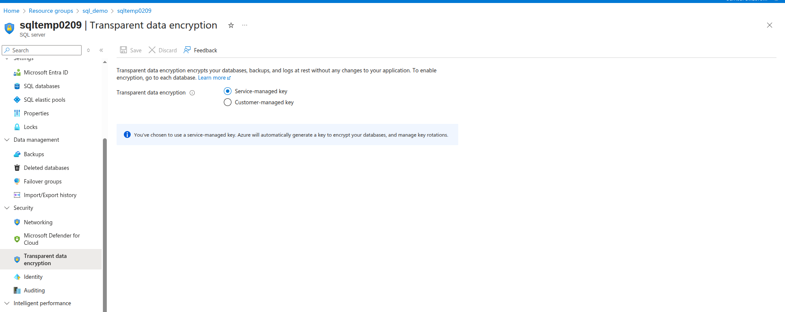
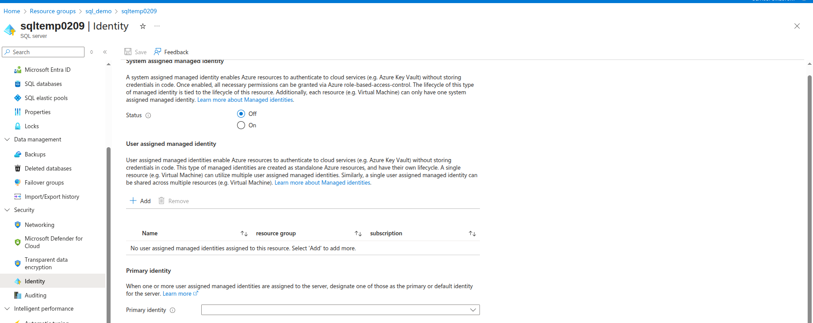
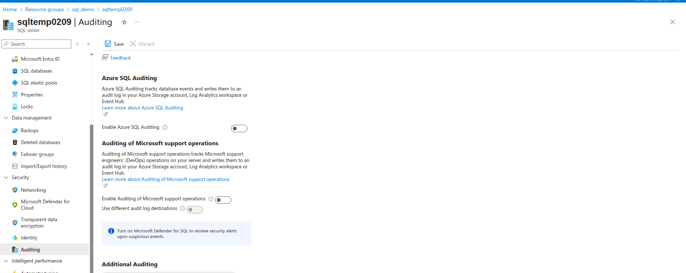
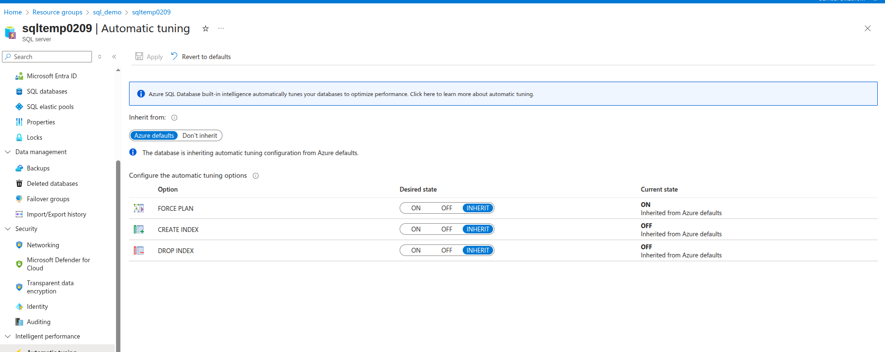
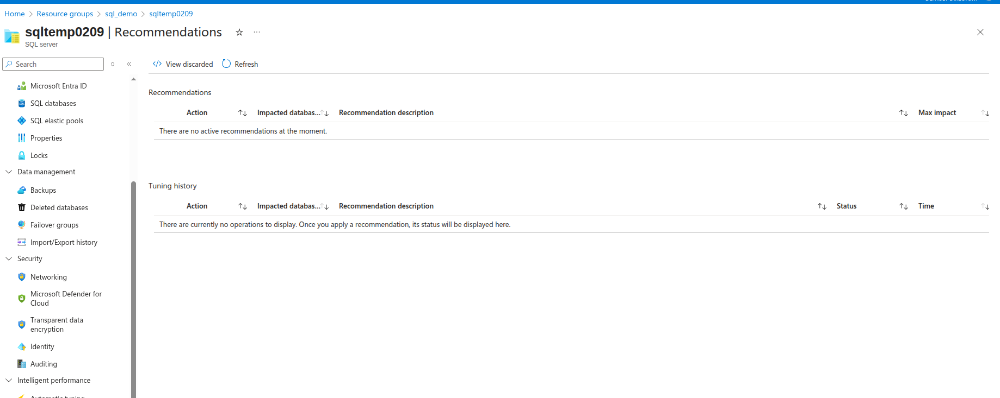
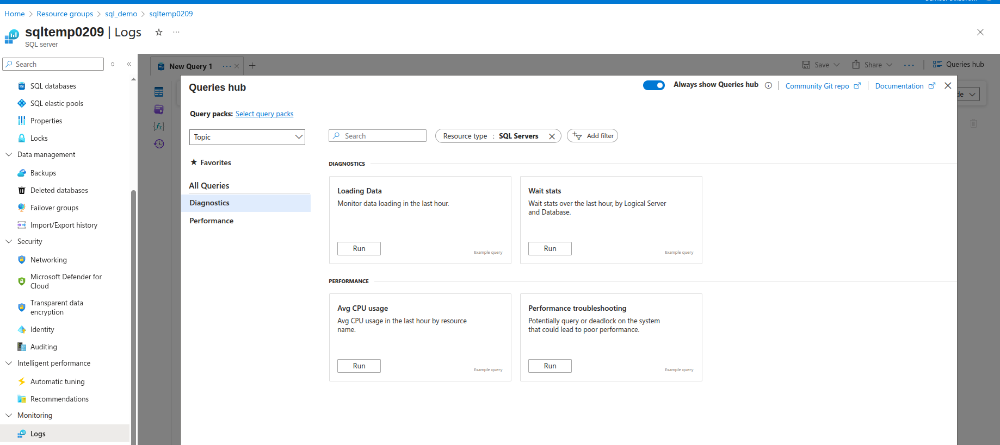
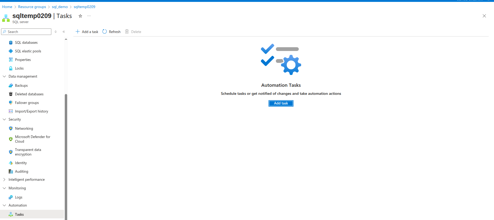
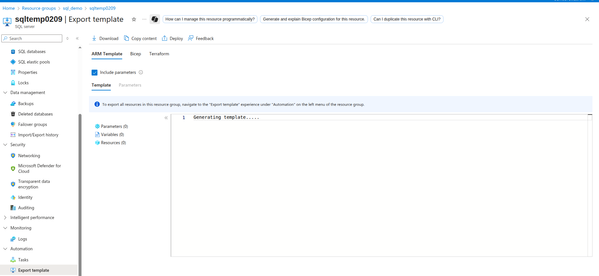

# Azure SQL Database Server Components

## Overview

Azure SQL Database Server provides a comprehensive set of components and features that enable secure, high-performance, and manageable database operations. This guide covers the key server components including security, performance optimization, monitoring, and automation features.

## Security Components

### Firewall Rules

Azure SQL Database Server firewall provides the first line of defense by controlling network access to your database server. It operates at the server level and determines which IP addresses are allowed to connect.

#### Key Features:
- **Server-level Rules**: Apply to all databases on the server
- **Database-level Rules**: Specific to individual databases
- **IP Address Filtering**: Allow or deny specific IP addresses or ranges
- **Azure Services Access**: Control access from other Azure services

#### Firewall Rule Types:
1. **Allow Azure Services**: Enables access from Azure services (0.0.0.0 - 0.0.0.0)
2. **Client IP Rules**: Specific IP addresses or ranges
3. **Virtual Network Rules**: Access from specific VNet subnets

#### Best Practices:
- Use specific IP ranges instead of broad access
- Regularly review and update firewall rules
- Remove unused or outdated rules
- Document business justification for each rule
- Monitor firewall logs for blocked connection attempts

### Private Endpoint

Private Endpoint provides secure connectivity to Azure SQL Database using a private IP address from your Virtual Network, eliminating exposure to the public internet.

#### Benefits:
- **Private IP Access**: Database accessible via private IP address
- **Network Isolation**: Traffic remains within Azure backbone
- **Enhanced Security**: No public internet exposure
- **DNS Integration**: Automatic private DNS zone configuration
- **Compliance**: Meet regulatory requirements for network isolation

#### Configuration Components:
- **Private Endpoint Resource**: The network interface in your VNet
- **Private DNS Zone**: Automatic DNS resolution for private access
- **Network Interface**: Provides private IP connectivity
- **Connection Approval**: Manual or automatic approval process

#### Use Cases:
- **Hybrid Connectivity**: Secure access from on-premises networks
- **Multi-tier Applications**: Secure database access from application tiers
- **Compliance Requirements**: Meet data residency and network isolation requirements
- **Zero Trust Architecture**: Implement network-level security controls

### Transparent Data Encryption (TDE)

Transparent Data Encryption provides automatic encryption of data at rest, protecting against threats of malicious offline access to raw files or backups.

#### Key Features:
- **Automatic Encryption**: Encrypts entire database, backups, and transaction logs
- **Transparent Operation**: No application changes required
- **Key Management**: Azure-managed or customer-managed keys
- **Performance**: Minimal impact on database performance

#### Encryption Process:
1. **Database Encryption Key (DEK)**: Encrypts the actual data
2. **TDE Protector**: Encrypts the DEK (can be service-managed or customer-managed)
3. **Key Vault Integration**: Store customer-managed keys in Azure Key Vault
4. **Automatic Rotation**: Regular key rotation for enhanced security

#### Benefits:
- **Data Protection**: Protects data files, log files, and backups
- **Compliance**: Meets regulatory requirements for data encryption
- **Transparent**: No changes required to existing applications
- **Key Control**: Option for customer-managed encryption keys

### Identity Management

Identity management in Azure SQL Database provides centralized authentication and authorization through integration with Microsoft Entra ID (formerly Azure AD).

#### Authentication Methods:
- **SQL Server Authentication**: Traditional username/password
- **Microsoft Entra ID Authentication**: Modern identity management
- **Multi-Factor Authentication**: Enhanced security layer
- **Conditional Access**: Policy-based access control

#### Entra ID Benefits:
- **Centralized Identity**: Single identity source across Azure services
- **Group-Based Access**: Simplified permission management through groups
- **Single Sign-On**: Seamless authentication experience
- **Token-Based Authentication**: Modern authentication protocols
- **Audit Trail**: Comprehensive authentication logging

#### Administrative Roles:
- **Entra ID Administrator**: Manages directory-level access
- **SQL Server Administrator**: Traditional SQL Server admin rights
- **Database Roles**: Granular database-level permissions

### Auditing

Azure SQL Database Auditing tracks database events and writes them to audit logs, providing comprehensive monitoring and compliance capabilities.

#### Audit Capabilities:
- **Database Events**: Track all database operations (SELECT, INSERT, UPDATE, DELETE)
- **Schema Changes**: Monitor DDL operations (CREATE, ALTER, DROP)
- **Security Events**: Authentication and authorization activities
- **Administrative Actions**: Server and database configuration changes

#### Audit Destinations:
- **Azure Storage Account**: Store audit logs in blob storage
- **Log Analytics Workspace**: Integration with Azure Monitor
- **Event Hub**: Real-time streaming to external systems

#### Compliance Benefits:
- **Regulatory Requirements**: Meet SOX, HIPAA, GDPR compliance
- **Security Monitoring**: Detect suspicious activities and threats
- **Forensic Analysis**: Investigate security incidents
- **Change Tracking**: Monitor configuration and data changes

#### Audit Policy Configuration:
- **Server-level Auditing**: Applies to all databases on the server
- **Database-level Auditing**: Specific to individual databases
- **Action Groups**: Predefined sets of actions to audit
- **Custom Actions**: Specific operations to monitor

## Intelligent Performance

### 1. Automatic Tuning

Automatic Tuning uses artificial intelligence to continuously monitor and optimize database performance without manual intervention.

#### Tuning Options:
- **CREATE INDEX**: Automatically creates missing indexes
- **DROP INDEX**: Removes unused or duplicate indexes
- **FORCE LAST GOOD PLAN**: Reverts to better execution plans when performance regression is detected

#### Key Features:
- **AI-Powered Analysis**: Machine learning algorithms analyze query patterns
- **Continuous Monitoring**: 24/7 performance monitoring and optimization
- **Automatic Implementation**: Applies optimizations automatically (when enabled)
- **Rollback Capability**: Automatically reverts changes if performance degrades
- **Performance Validation**: Validates improvements before permanent implementation

#### Benefits:
- **Improved Performance**: Automatic query and index optimization
- **Reduced Administration**: Minimal DBA intervention required
- **Cost Optimization**: Better resource utilization and performance
- **Proactive Optimization**: Prevents performance issues before they impact users

#### Configuration Options:
- **Force Last Good Plan**: Enable automatic plan regression correction
- **Create Index**: Allow automatic index creation
- **Drop Index**: Enable automatic removal of unused indexes

### 2. Recommendations

The Recommendations engine provides intelligent suggestions for improving database performance, security, and cost optimization.

#### Recommendation Categories:

#### Performance Recommendations:
- **Index Recommendations**: Suggestions for creating or dropping indexes
- **Query Optimization**: Recommendations for improving query performance
- **Resource Scaling**: Suggestions for adjusting compute resources
- **Parameterization**: Recommendations for query parameterization

#### Security Recommendations:
- **Transparent Data Encryption**: Enable TDE for data protection
- **Advanced Threat Protection**: Enable threat detection capabilities
- **Vulnerability Assessment**: Address identified security vulnerabilities
- **Auditing Configuration**: Improve audit coverage and settings

#### Cost Optimization:
- **Service Tier Recommendations**: Optimize performance tier selection
- **Reserved Capacity**: Suggestions for reserved instance purchases
- **Elastic Pool**: Recommendations for elastic pool usage
- **Serverless Configuration**: Optimize serverless compute settings

#### Implementation Process:
1. **Analysis**: AI analyzes database usage patterns and performance
2. **Recommendation Generation**: System generates specific improvement suggestions
3. **Impact Assessment**: Estimates potential performance and cost benefits
4. **Implementation**: Apply recommendations manually or automatically
5. **Monitoring**: Track results and validate improvements

## Monitoring

### Logs

Comprehensive logging provides detailed insights into database operations, performance, and security events for monitoring and troubleshooting.

#### Log Categories:

#### Diagnostic Logs:
- **SQLInsights**: Query performance and execution statistics
- **AutomaticTuning**: Automatic tuning operations and results
- **QueryStoreRuntimeStatistics**: Query execution statistics
- **QueryStoreWaitStatistics**: Query wait statistics
- **Errors**: Database errors and exceptions

#### Security Logs:
- **SQLSecurityAuditEvents**: Security audit events
- **DevOpsOperationsAudit**: Administrative operations
- **Authentication**: Login and authentication events

#### Performance Logs:
- **Blocks**: Blocking and deadlock information
- **DatabaseWaitStatistics**: Database wait statistics
- **Timeouts**: Query timeout events

#### Log Destinations:
- **Azure Monitor Logs**: Centralized logging and analytics
- **Storage Account**: Long-term log retention
- **Event Hub**: Real-time log streaming
- **Partner Solutions**: Third-party SIEM integration

#### Monitoring Capabilities:
- **Real-time Monitoring**: Live performance and activity monitoring
- **Historical Analysis**: Trend analysis and capacity planning
- **Alerting**: Proactive notifications based on log events
- **Custom Queries**: KQL queries for specific monitoring needs

## Automation

### 1. Tasks

Automation Tasks provide scheduled execution of administrative operations, maintenance activities, and custom scripts.

#### Task Categories:

#### Maintenance Tasks:
- **Index Maintenance**: Automated index rebuilding and reorganization
- **Statistics Updates**: Keep query optimizer statistics current
- **Backup Verification**: Validate backup integrity
- **Database Consistency Checks**: Automated DBCC operations

#### Administrative Tasks:
- **User Management**: Automated user provisioning and deprovisioning
- **Permission Management**: Role-based access control automation
- **Configuration Management**: Automated setting updates
- **Monitoring Tasks**: Automated health checks and reporting

#### Custom Tasks:
- **SQL Scripts**: Execute custom T-SQL scripts on schedule
- **PowerShell Scripts**: Run PowerShell automation scripts
- **Azure Functions**: Trigger serverless functions
- **Logic Apps**: Complex workflow automation

#### Scheduling Options:
- **Recurring Schedules**: Daily, weekly, monthly execution
- **Event-Driven**: Trigger based on specific events
- **Conditional Execution**: Execute based on specific conditions
- **Dependency Management**: Task execution dependencies

### 2. Export Template

Export Template functionality allows you to capture and reuse Azure SQL Database server configurations for consistent deployments.

#### Template Components:

#### Infrastructure as Code:
- **ARM Templates**: Azure Resource Manager template format
- **Bicep Templates**: Modern declarative syntax
- **Terraform**: Multi-cloud infrastructure automation
- **PowerShell Scripts**: Automated deployment scripts

#### Configuration Elements:
- **Server Settings**: Server-level configuration parameters
- **Security Settings**: Firewall rules, authentication, and encryption
- **Database Configurations**: Database-specific settings
- **Monitoring Configuration**: Diagnostic and monitoring settings

#### Use Cases:
- **Environment Consistency**: Ensure consistent configurations across environments
- **Disaster Recovery**: Rapid environment recreation
- **DevOps Integration**: Infrastructure as Code practices
- **Compliance**: Standardized security and configuration baselines

#### Template Benefits:
- **Repeatability**: Consistent deployments across environments
- **Version Control**: Track configuration changes over time
- **Automation**: Integrate with CI/CD pipelines
- **Documentation**: Self-documenting infrastructure configurations

#### Export Options:
- **Complete Configuration**: Export entire server and database configuration
- **Selective Export**: Export specific components or settings
- **Parameterization**: Create reusable templates with parameters
- **Validation**: Template validation before deployment

## Best Practices

### Security Best Practices:
1. **Enable All Security Features**: Use TDE, auditing, and threat protection
2. **Implement Network Security**: Configure firewall rules and private endpoints
3. **Use Modern Authentication**: Leverage Entra ID integration
4. **Regular Security Reviews**: Periodic assessment of security configurations
5. **Monitor Security Events**: Continuous monitoring of audit logs

### Performance Best Practices:
1. **Enable Automatic Tuning**: Let AI optimize performance continuously
2. **Monitor Recommendations**: Regularly review and implement suggestions
3. **Use Query Performance Insight**: Identify and optimize problematic queries
4. **Implement Proper Indexing**: Create appropriate indexes for workload
5. **Monitor Resource Utilization**: Track CPU, memory, and I/O usage

### Monitoring Best Practices:
1. **Enable Comprehensive Logging**: Capture all relevant diagnostic information
2. **Set Up Alerting**: Proactive notifications for critical events
3. **Use Azure Monitor**: Centralized monitoring and analytics
4. **Regular Log Review**: Periodic analysis of logs and metrics
5. **Capacity Planning**: Use historical data for future planning

### Automation Best Practices:
1. **Automate Routine Tasks**: Reduce manual administrative overhead
2. **Use Infrastructure as Code**: Template-based deployments
3. **Implement CI/CD**: Automated deployment pipelines
4. **Test Automation**: Validate automated processes in non-production
5. **Document Processes**: Maintain clear documentation of automated workflows

## Conclusion

Azure SQL Database Server Components provide a comprehensive platform for secure, high-performance, and manageable database operations. By leveraging these components effectively - from security features like TDE and private endpoints to intelligent performance optimization and comprehensive monitoring - organizations can build robust, scalable, and secure database solutions.

The integration of automation capabilities and infrastructure-as-code practices enables consistent, repeatable deployments while reducing administrative overhead. Regular monitoring, proactive optimization, and adherence to best practices ensure optimal performance, security, and reliability of your Azure SQL Database environment.