# DataDog Setup - VM Monitoring

## Overview

This guide demonstrates setting up DataDog monitoring on Azure VMs with agent installation and configuration.

## VM Setup

### 1. Linux VM (Ubuntu)
**Hostname**: LinuxVM

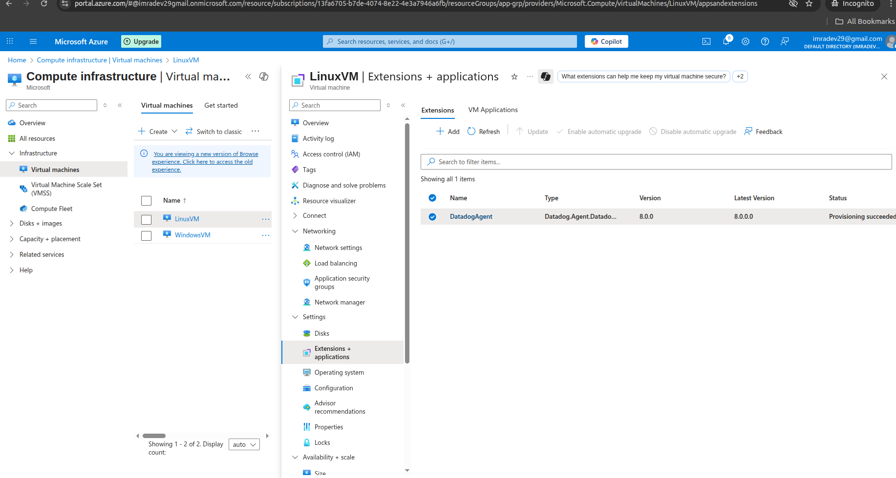

### 2. Windows VM
**Hostname**: WindowsVM

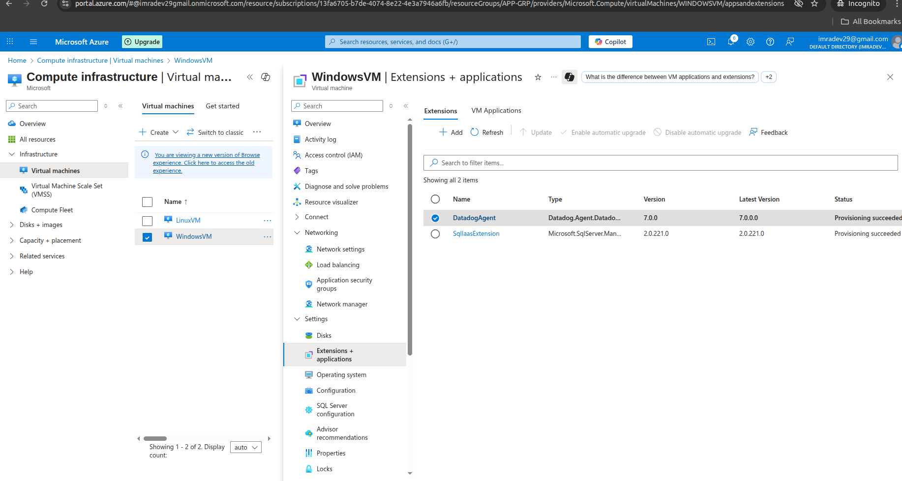
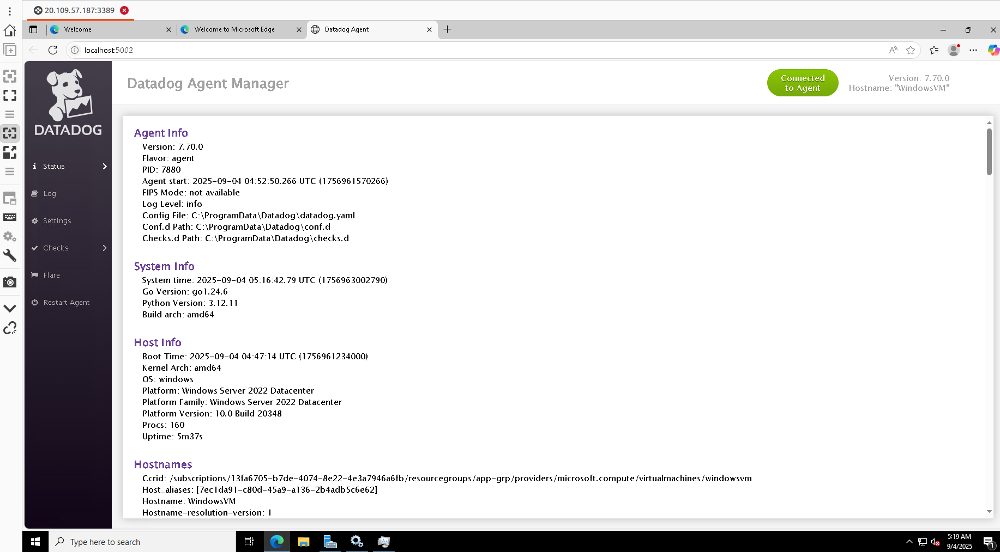

## DataDog Agent Installation

Both VMs have DataDog Agent installed via VM Extensions:

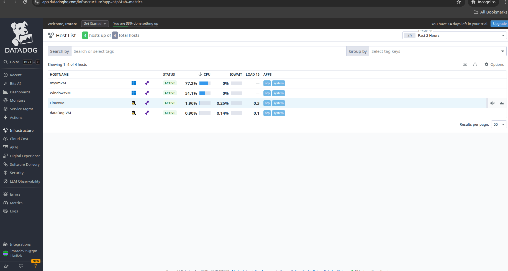

## DataDog Prerequisites

Required setup and API key configuration:

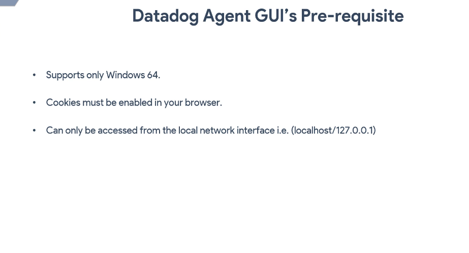

## DataDog Dashboard

### Host Map View

The Host Map provides a visual overview of all monitored hosts:

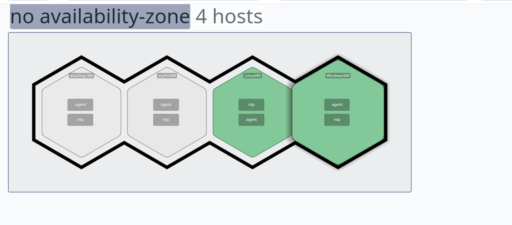

### CPU Usage Monitoring

- **Green**: CPU usage below 50%
- **Orange**: CPU usage approaching 100%

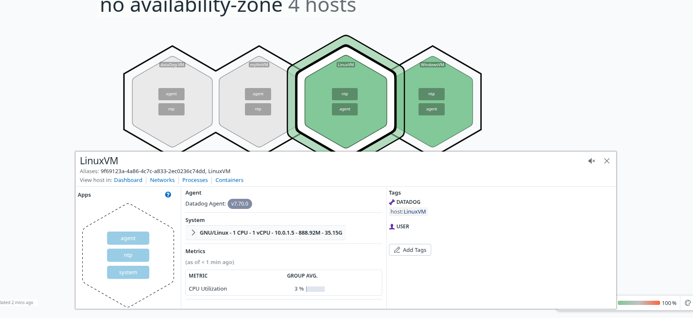

### System Dashboard

Detailed system metrics for LinuxVM:

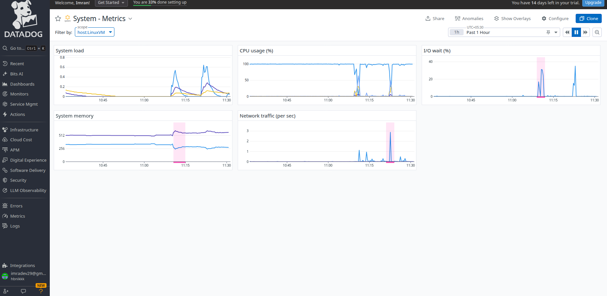

## Tags Configuration

Tags are used to filter and identify resources based on custom labels.

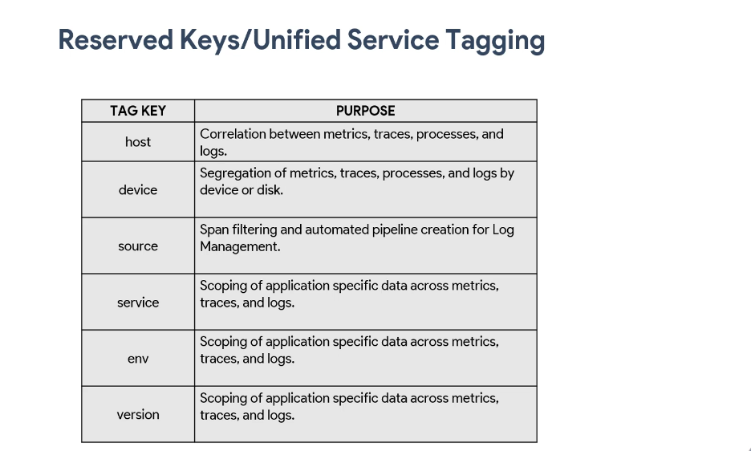

### Linux VM Tags

1. **Add tags to LinuxVM configuration**:

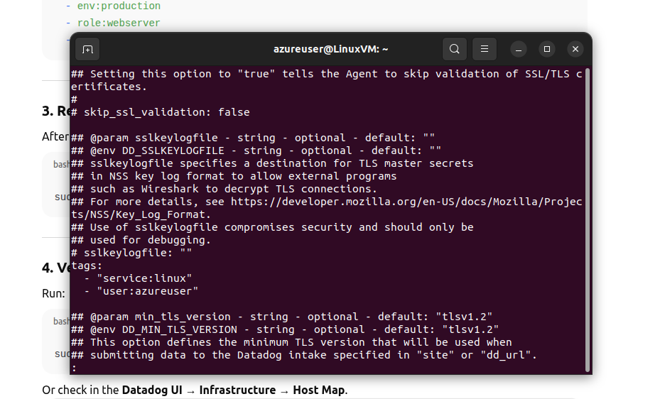

2. **Restart DataDog agent**:
```bash
sudo systemctl restart datadog-agent
```

3. **Updated tags in DataDog UI**:

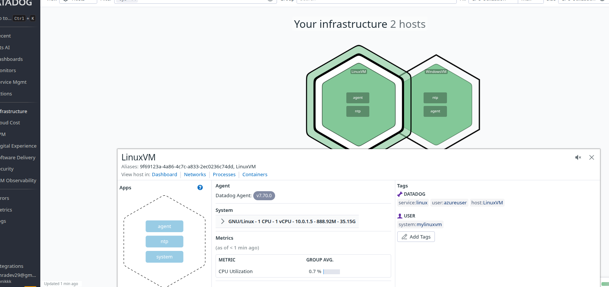

### Windows VM Tags

1. **Add tags to WindowsVM and restart agent**:

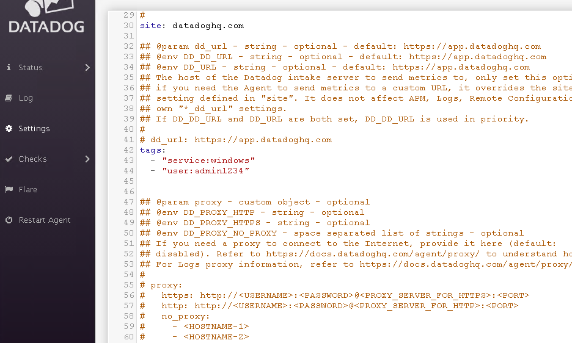

2. **Updated tags in DataDog UI**:

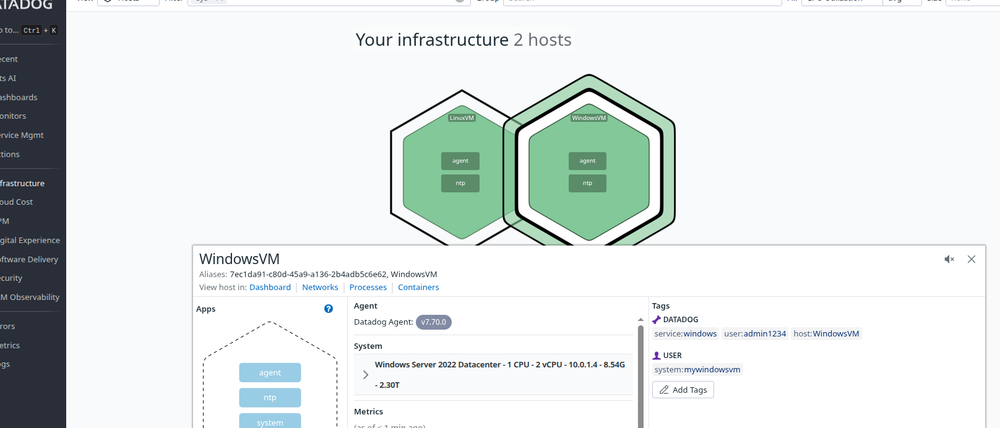

## Key Features Demonstrated

- **Multi-platform Monitoring**: Both Linux and Windows VMs
- **Real-time Metrics**: CPU, memory, and system performance
- **Visual Host Map**: Easy identification of system health
- **Custom Tagging**: Resource organization and filtering
- **Automated Agent Installation**: VM extensions for easy deployment

## Benefits

- **Centralized Monitoring**: Single dashboard for all VMs
- **Performance Insights**: Real-time system metrics
- **Resource Organization**: Tag-based filtering and grouping
- **Proactive Monitoring**: Visual indicators for system health