# Infrastructure Monitoring Process

## Overview

This guide demonstrates how to enable and configure process monitoring in DataDog for comprehensive infrastructure visibility.

## Process Monitoring Setup

### Default State
Process monitoring is **disabled by default** and needs to be enabled in the DataDog agent configuration file (datadog.yaml).

### Configuration Required
Add the following entry to enable process monitoring:

```yaml
process_config:
  enabled: "true"
```

## Before Enabling Process Monitoring

### Windows VM Status
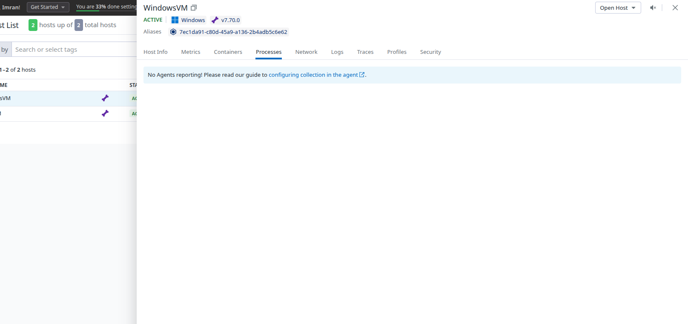

### Linux VM Status
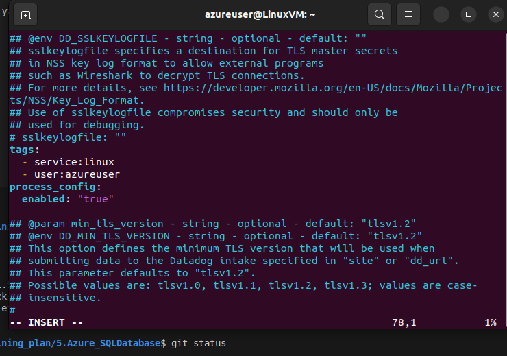
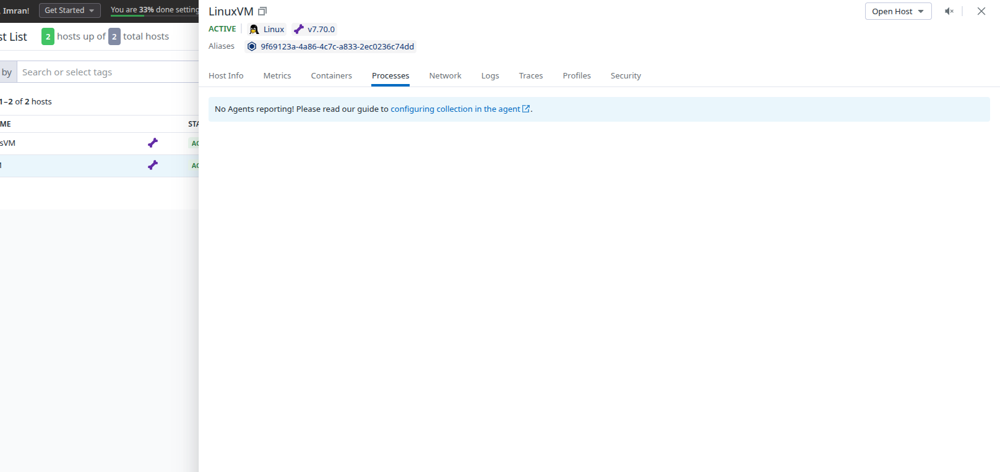

## Enabling Process Monitoring

### Windows VM Configuration
Modified the YAML file and restarted the DataDog agent:

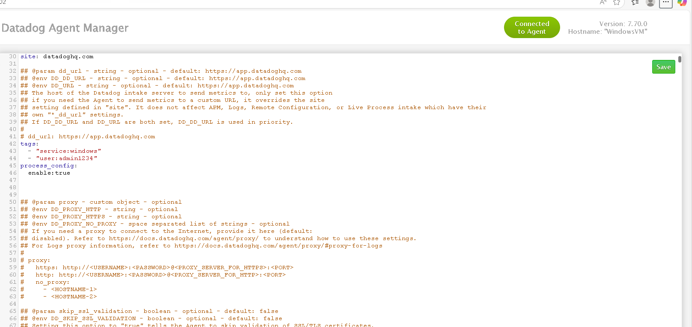

### After Enabling - Results
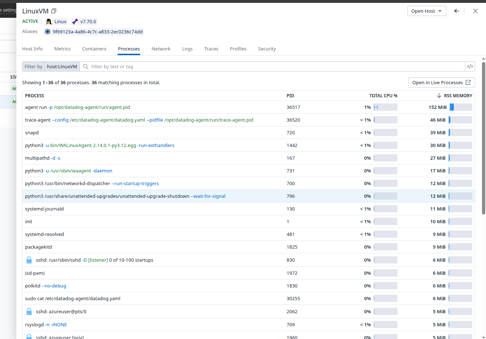
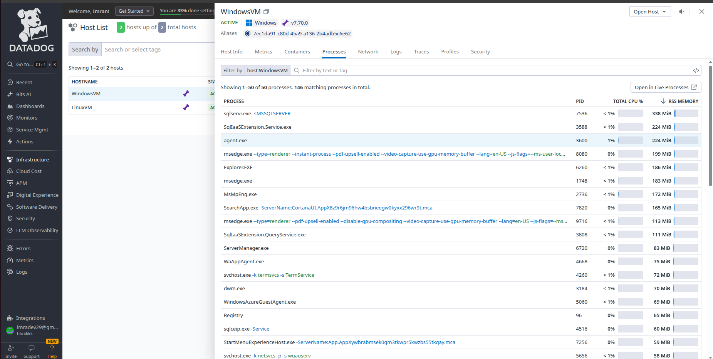

## Process Explorer Interface

### Accessing Processes
Under **Infrastructure → Processes**, you can view all running processes:

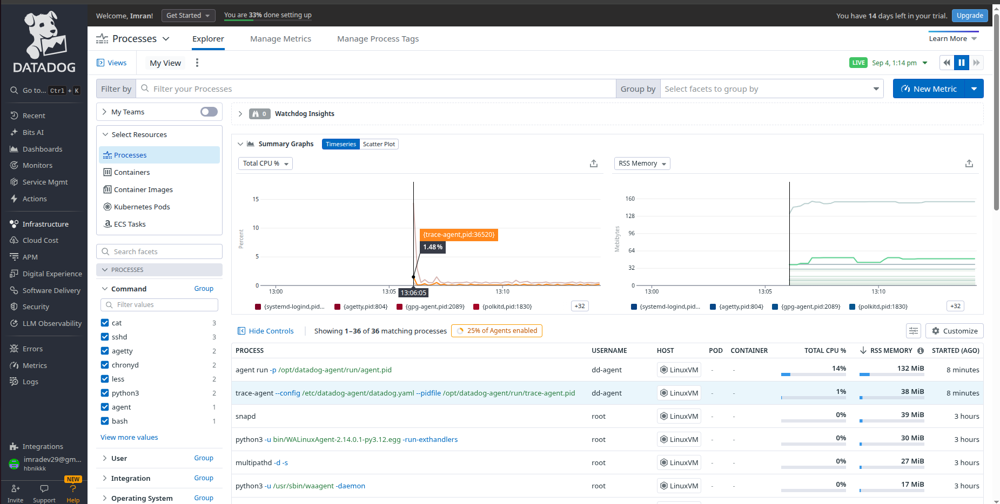

### Visualization Options

#### 1. Time Series Graph
Shows process metrics over time:

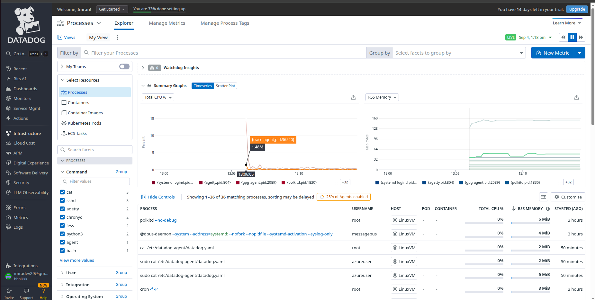

#### 2. Scatter Plot
Displays process distribution and relationships:

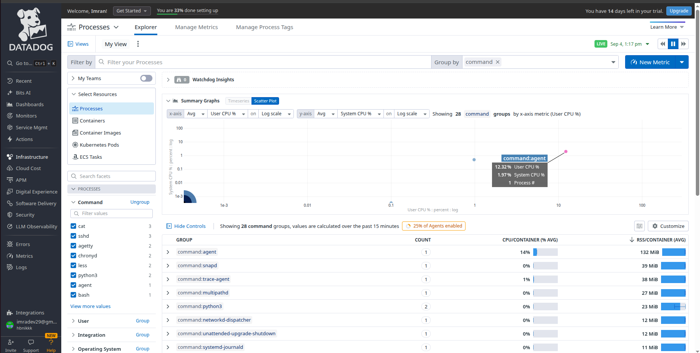

## Process Management Features

### Process List Customization

**Default Process View:**
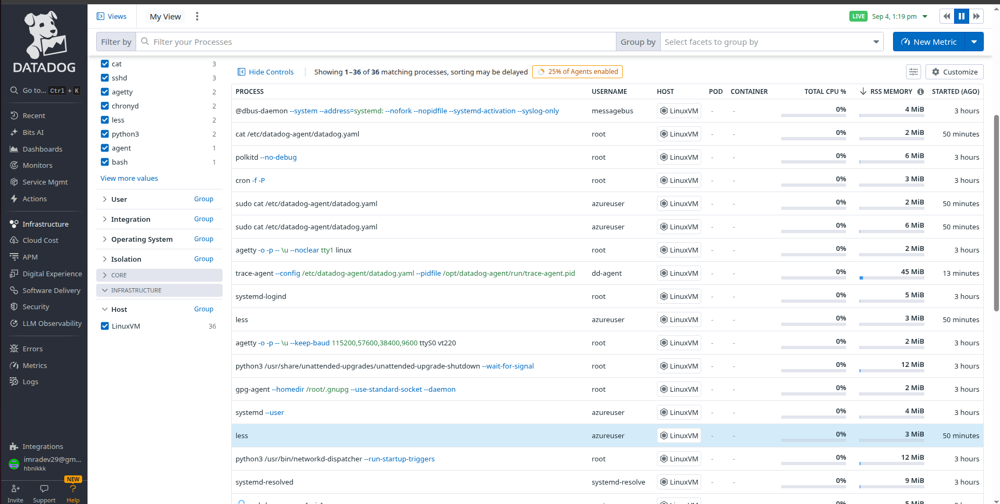

**After Customization** - Added PID and PPID columns:
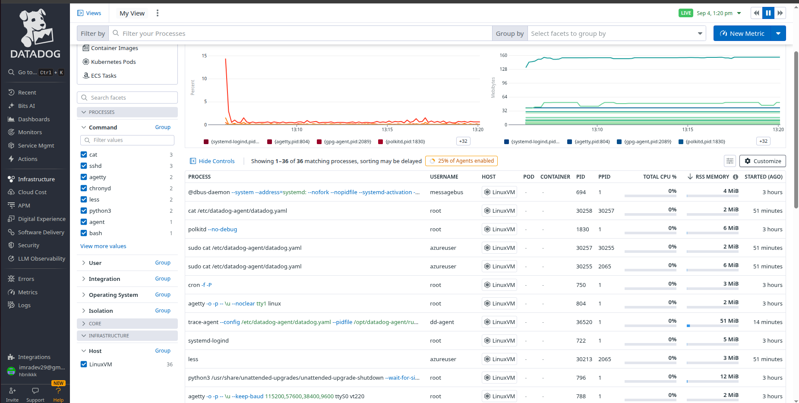

### Process Details
Click on any process to get detailed information:

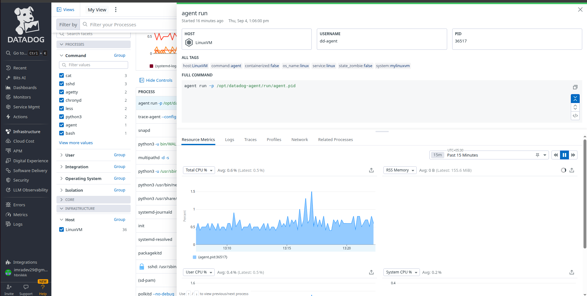

### Filtering Capabilities
Filter processes based on various criteria:

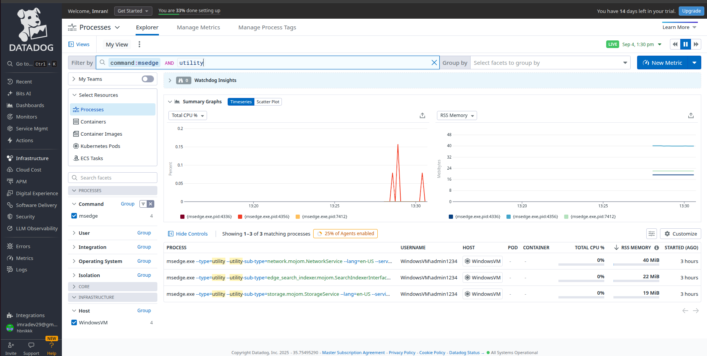

## Security Features

### Data Scrubbing Configuration
Protect sensitive information in process command-line arguments:

```yaml
scrub_args: true
custom_sensitive_words: ['type', 'user*']
```

**Configuration Options:**
- `scrub_args: true` → Automatically scrubs command-line arguments
- `custom_sensitive_words` → Define custom words/keys to redact

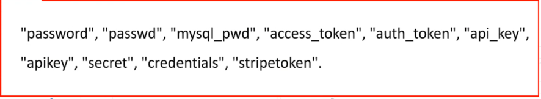

### Wildcard Usage Guidelines


## Process Metrics

### Available Metrics
DataDog provides comprehensive process metrics:

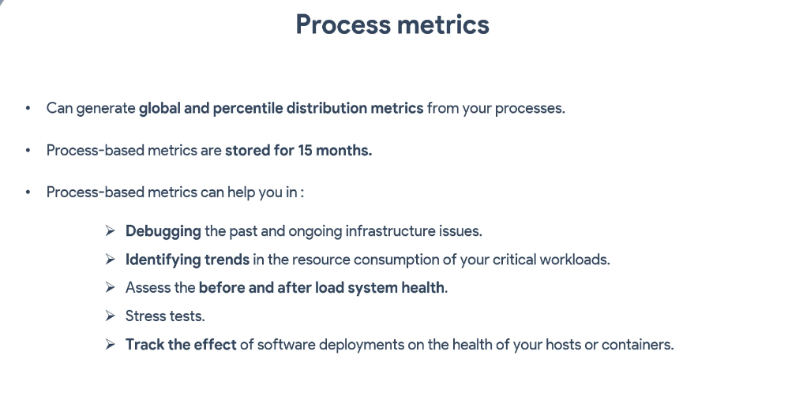

### Custom Metric Creation
Create custom metric tags for specific monitoring needs:

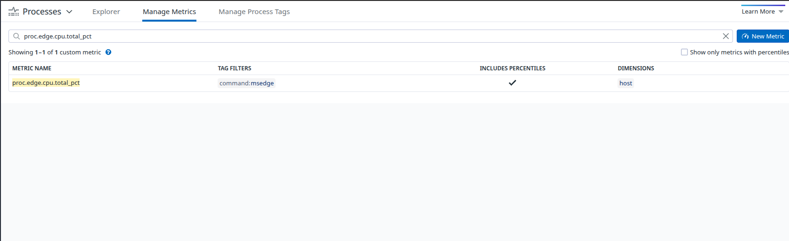

### Metric Explorer Integration
View newly created metrics in the Metric Explorer:

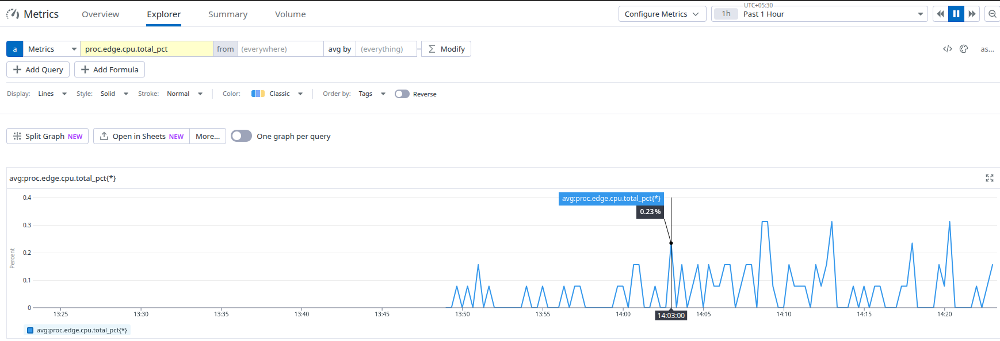

## Key Benefits

- **Complete Process Visibility**: Monitor all running processes across infrastructure
- **Resource Usage Tracking**: CPU, memory, and I/O metrics per process
- **Security**: Scrub sensitive data from process arguments
- **Customization**: Tailor views and metrics to specific needs
- **Historical Analysis**: Time-series data for trend analysis
- **Real-time Monitoring**: Live process status and performance

## Configuration Summary

1. **Enable Process Monitoring**: Add `process_config: enabled: "true"` to datadog.yaml
2. **Restart Agent**: Apply configuration changes
3. **Access Interface**: Navigate to Infrastructure → Processes
4. **Customize Views**: Add relevant columns (PID, PPID, etc.)
5. **Configure Security**: Enable data scrubbing for sensitive information
6. **Create Metrics**: Define custom metrics for specific monitoring requirements