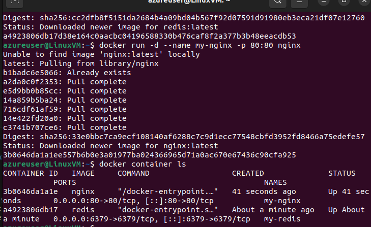
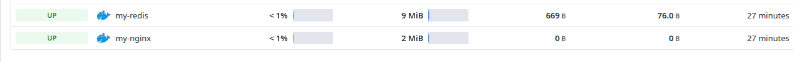
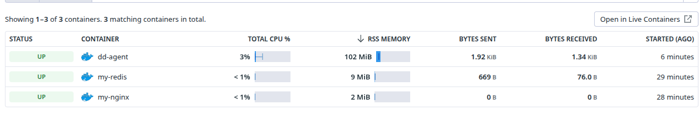
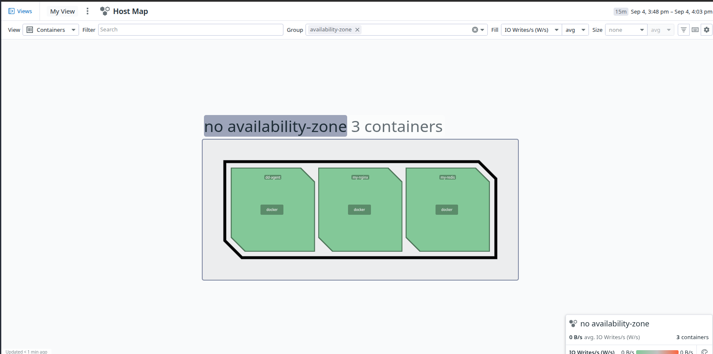
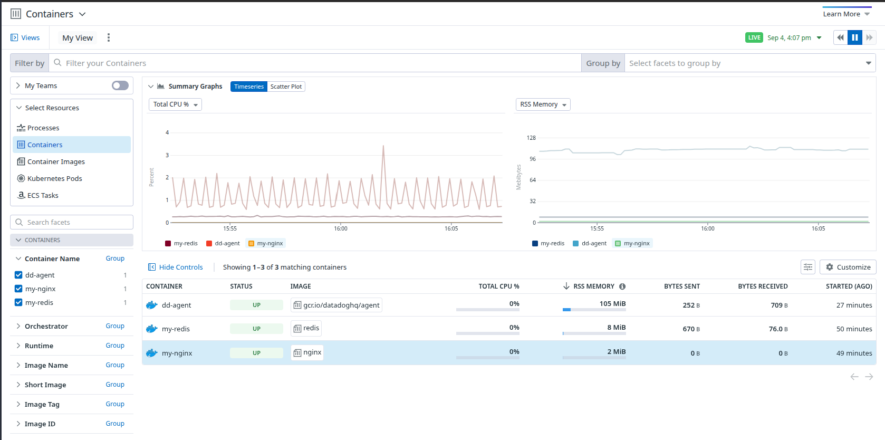
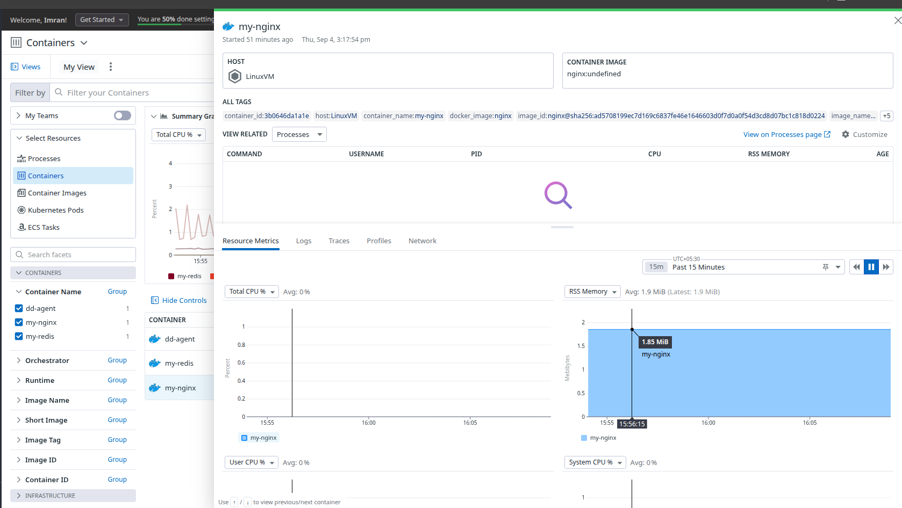

# Infrastructure Monitoring - Container Setup

## Overview

This guide demonstrates how to set up DataDog container monitoring using Docker on a Linux VM, including deployment of sample applications and the DataDog agent.

## Prerequisites

- Linux VM with Docker installed
- DataDog API key
- Basic understanding of Docker containers

## Step 1: Docker Installation and Container Setup

### Install Docker and Run Sample Containers
Installed Docker on Linux VM and deployed Nginx and Redis containers:



### Container Images and Deployment
Pulled Docker images and created containers for Nginx and Redis:



## Step 2: DataDog Agent Container Deployment

### Official Documentation Reference
**DataDog Docker Documentation**: https://docs.datadoghq.com/containers/docker/?tab=standard

### DataDog Agent Installation Command
```bash
docker run -d --cgroupns host --pid host --name dd-agent \
  -v /var/run/docker.sock:/var/run/docker.sock:ro \
  -v /proc/:/host/proc/:ro \
  -v /sys/fs/cgroup/:/host/sys/fs/cgroup:ro \
  -e DD_API_KEY={YOUR_API_KEY} \
  gcr.io/datadoghq/agent:7
```

### Agent Container Deployment
Pulled DataDog Agent image and created the monitoring container:



## Step 3: Container Monitoring Interface

### Switching to Container View
After agent deployment, switch to container monitoring view in DataDog:



## DataDog Container Monitoring Features

### Tag Extraction
**Docker Tag Extraction Documentation**: 
https://docs.datadoghq.com/containers/docker/tag/?tab=containerizedagent#out-of-the-box-tagging

### Data Collection
**Docker Data Collection Documentation**: 
https://docs.datadoghq.com/containers/docker/data_collected/

### Live Container Infrastructure
Similar to process monitoring, container monitoring provides real-time infrastructure visibility:



### Individual Container Details
Detailed view of specific containers (example: my-nginx container):



## Key Container Monitoring Capabilities

### Automatic Discovery
- **Container Detection**: Automatically discovers running containers
- **Image Tracking**: Monitors container images and versions
- **Service Mapping**: Maps containers to services and applications

### Performance Metrics
- **Resource Usage**: CPU, memory, network, and disk I/O
- **Container Health**: Status, restarts, and uptime
- **Application Metrics**: Custom metrics from containerized applications

### Security and Compliance
- **Image Vulnerability Scanning**: Security assessment of container images
- **Runtime Security**: Monitor container behavior and anomalies
- **Compliance Monitoring**: Track compliance with security policies

## Docker Compose Configuration

### Alternative Deployment Method
For more complex setups, use Docker Compose with environment variables:

```yaml
version: '3'
services:
  datadog:
    image: 'datadog/agent:7.31.1'
    environment:
      - DD_API_KEY=${DD_API_KEY}
      - DD_ENV=${DD_ENV}
      - DD_VERSION=${DD_VERSION}
      - DD_HOSTNAME=demo-host
      - DD_PROCESS_AGENT_ENABLED=true
      - DD_TAGS='dd-agent1:value1' 'dd-agent2:value2'
      - DD_DOCKER_LABELS_AS_TAGS={"my.custom.label.team":"alpha_team"}
    volumes:
      - /var/run/docker.sock:/var/run/docker.sock:ro
      - /proc/:/host/proc/:ro
      - /sys/fs/cgroup/:/host/sys/fs/cgroup:ro
  redis:
    image: 'redis:latest'
```

## Best Practices

### Agent Configuration
- **Host Networking**: Use `--pid host` and `--cgroupns host` for complete visibility
- **Volume Mounts**: Mount Docker socket and system directories for monitoring
- **Environment Variables**: Configure agent behavior through environment variables

### Container Tagging
- **Consistent Tagging**: Use consistent tag naming conventions
- **Environment Tags**: Tag containers by environment (dev, staging, prod)
- **Service Tags**: Group containers by service or application

### Security Considerations
- **Read-Only Mounts**: Use read-only volume mounts where possible
- **Minimal Permissions**: Grant only necessary permissions to the agent
- **Network Isolation**: Consider network policies for container communication

## Troubleshooting

### Common Issues
- **Permission Errors**: Ensure Docker socket has proper permissions
- **Network Connectivity**: Verify agent can reach DataDog endpoints
- **Resource Constraints**: Monitor agent resource usage

### Verification Steps
1. Check agent container status: `docker ps`
2. View agent logs: `docker logs dd-agent`
3. Verify DataDog connectivity in the web interface
4. Confirm container metrics are appearing in DataDog

## Benefits of Container Monitoring

- **Real-time Visibility**: Live monitoring of container performance
- **Resource Optimization**: Identify resource bottlenecks and optimization opportunities
- **Automated Discovery**: No manual configuration for new containers
- **Integrated Monitoring**: Unified view of infrastructure and applications
- **Scalability**: Monitors containers across multiple hosts and orchestrators

Environment Variables Link
https://docs.datadoghq.com/containers/docker/?tab=standard#environment-variables

