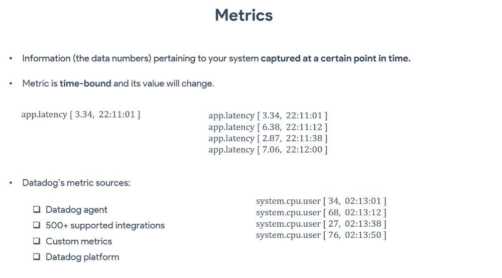
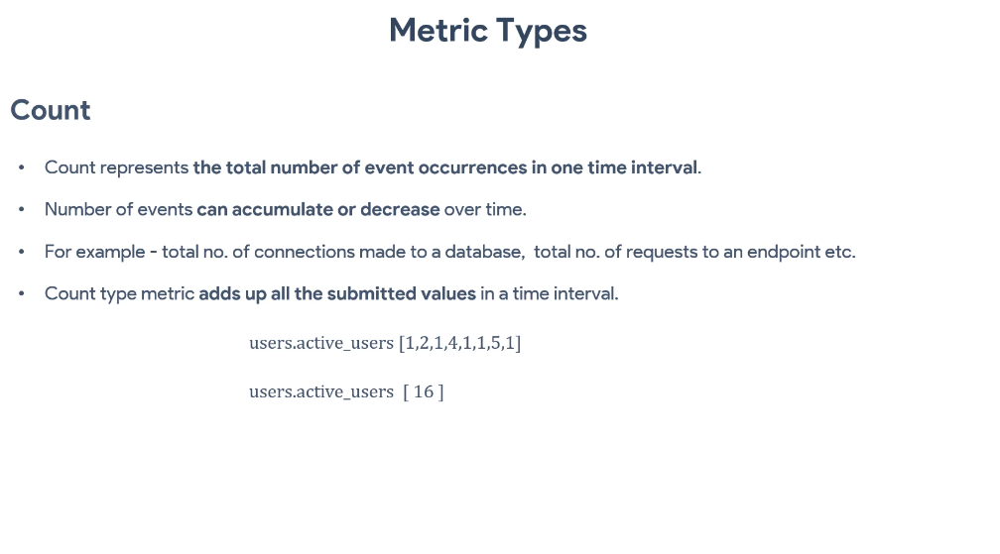
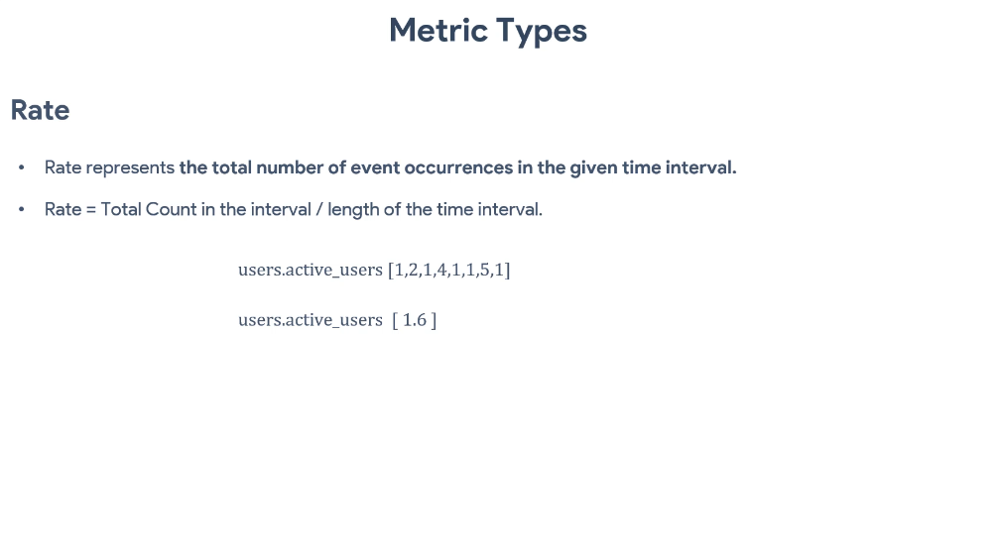
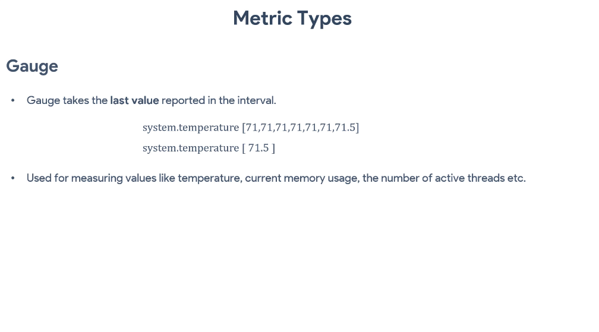
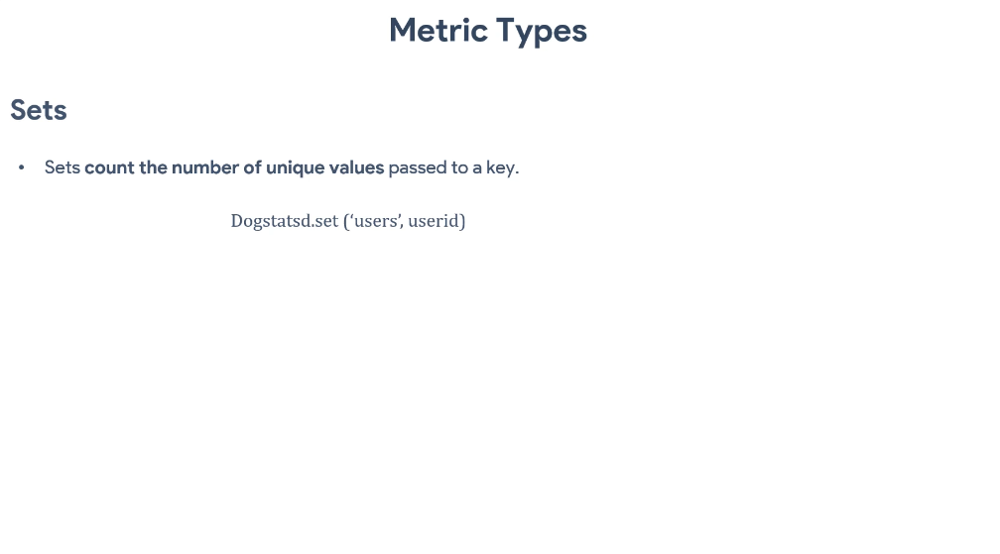
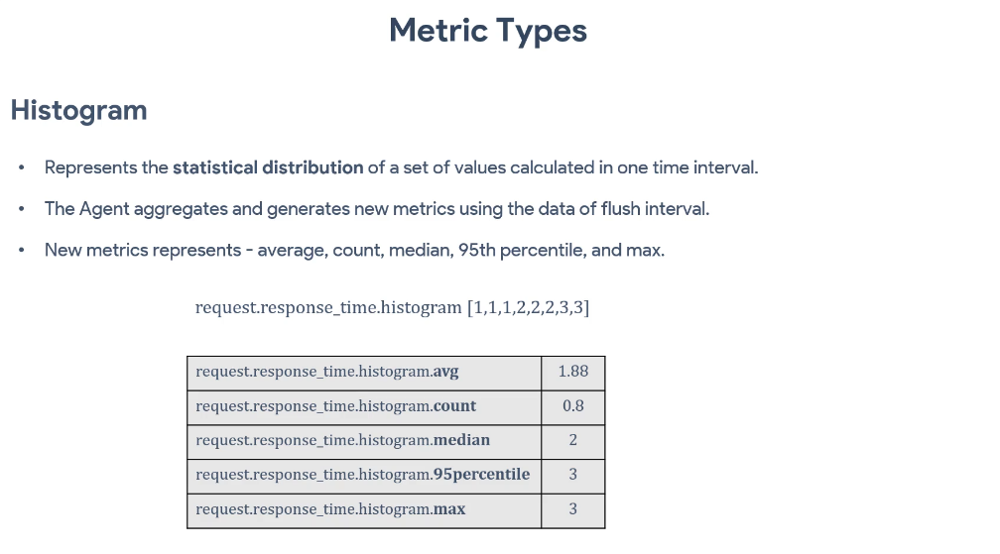

# DataDog Infrastructure Monitoring - Container Metrics

## Overview
DataDog provides comprehensive container monitoring capabilities through metrics collection, visualization, and alerting. This guide covers metric types, container-specific monitoring, and implementation best practices.

## What are Metrics?

Metrics are numerical data points collected over time that represent the state and performance of your infrastructure, applications, and services. In DataDog, metrics provide insights into system behavior, resource utilization, and application performance.



### Key Characteristics of Metrics:
- **Time-series data**: Collected at regular intervals
- **Numerical values**: Quantifiable measurements
- **Tagged data**: Enriched with metadata for filtering and grouping
- **Aggregatable**: Can be combined and analyzed across dimensions

## Metric Types

DataDog supports 6 primary metric types, each designed for specific use cases:

### 1. **Count**
- Represents the number of events in a time interval
- Examples: HTTP requests, database queries, error occurrences
- Aggregation: Sum over time intervals
- Use case: Tracking discrete events

### 2. **Gauge**
- Represents a value at a specific point in time
- Examples: CPU usage, memory utilization, queue size
- Aggregation: Last value, average, min, max
- Use case: Current state measurements

### 3. **Rate**
- Represents the rate of change per second
- Examples: Requests per second, bytes per second
- Aggregation: Average rate over time intervals
- Use case: Throughput and velocity measurements

### 4. **Set**
- Counts unique elements in a group
- Examples: Unique users, unique IP addresses
- Aggregation: Count of unique values
- Use case: Cardinality measurements

### 5. **Histogram**
- Statistical distribution of values
- Examples: Response times, request sizes
- Aggregation: Percentiles, averages, counts
- Use case: Performance distribution analysis

### 6. **Distribution**
- Global statistical distribution across hosts
- Examples: Application latency across regions
- Aggregation: Global percentiles and statistics
- Use case: Cross-infrastructure performance analysis



## Container Monitoring Metrics

### Core Container Metrics:
- **CPU Usage**: `docker.cpu.usage`, `docker.cpu.throttled`
- **Memory**: `docker.mem.usage`, `docker.mem.limit`
- **Network**: `docker.net.bytes_rcvd`, `docker.net.bytes_sent`
- **Disk I/O**: `docker.io.read_bytes`, `docker.io.write_bytes`

### Kubernetes Metrics:
- **Pod metrics**: `kubernetes.pods.running`, `kubernetes.pods.pending`
- **Node metrics**: `kubernetes.nodes.allocatable`, `kubernetes.nodes.capacity`
- **Resource metrics**: `kubernetes.cpu.requests`, `kubernetes.memory.limits`



## Metric Collection Configuration

### DataDog Agent Configuration
```yaml
# datadog.yaml
api_key: <YOUR_API_KEY>
site: datadoghq.com

# Enable container monitoring
container_collect_all: true
container_exclude_logs: "name:datadog-agent"

# Enable Kubernetes monitoring
kubernetes_kubelet_host: ${DD_KUBERNETES_KUBELET_HOST}
kubernetes_http_kubelet_port: 10255
kubernetes_https_kubelet_port: 10250
```

### Docker Compose Integration
```yaml
version: '3.8'
services:
  datadog-agent:
    image: gcr.io/datadoghq/agent:latest
    environment:
      - DD_API_KEY=${DD_API_KEY}
      - DD_SITE=datadoghq.com
      - DD_CONTAINER_EXCLUDE_LOGS="name:datadog-agent"
    volumes:
      - /var/run/docker.sock:/var/run/docker.sock:ro
      - /proc/:/host/proc/:ro
      - /sys/fs/cgroup/:/host/sys/fs/cgroup:ro
```



## Custom Metrics Implementation

### Application Metrics
```python
# Python example
from datadog import initialize, statsd

# Initialize DataDog
options = {
    'api_key': 'your_api_key',
    'app_key': 'your_app_key'
}
initialize(**options)

# Send custom metrics
statsd.increment('web.requests', tags=['environment:prod'])
statsd.gauge('queue.size', 25, tags=['queue:processing'])
statsd.histogram('request.duration', 0.45, tags=['endpoint:/api/users'])
```

### Container Health Metrics
```bash
# Custom health check script
#!/bin/bash
HEALTH_STATUS=$(curl -s -o /dev/null -w "%{http_code}" http://localhost:8080/health)
echo "custom.health.status:${HEALTH_STATUS}|g|#service:myapp" | nc -u -w1 localhost 8125
```



## Metric Visualization and Dashboards

### Dashboard Components:
1. **Timeseries graphs**: Trend analysis over time
2. **Query value widgets**: Current state display
3. **Top lists**: Ranking and comparison
4. **Heat maps**: Distribution visualization
5. **Scatter plots**: Correlation analysis

### Query Examples:
```
# Average CPU usage by container
avg:docker.cpu.usage{*} by {container_name}

# Memory utilization percentage
(avg:docker.mem.usage{*} / avg:docker.mem.limit{*}) * 100

# Request rate with error overlay
sum:web.requests{*}.as_rate(), sum:web.errors{*}.as_rate()
```



## Alerting on Metrics

### Alert Configuration:
```json
{
  "name": "High Container CPU Usage",
  "query": "avg(last_5m):avg:docker.cpu.usage{*} by {container_name} > 80",
  "message": "Container {{container_name.name}} CPU usage is above 80%",
  "tags": ["team:infrastructure", "severity:warning"],
  "options": {
    "thresholds": {
      "critical": 90,
      "warning": 80
    },
    "notify_no_data": true,
    "no_data_timeframe": 10
  }
}
```

## Best Practices

### Metric Naming Conventions:
- Use consistent prefixes: `app.`, `infra.`, `business.`
- Include units: `response_time_ms`, `memory_bytes`
- Use descriptive names: `user_login_attempts` vs `count1`

### Tagging Strategy:
- **Environment**: `env:prod`, `env:staging`
- **Service**: `service:web-api`, `service:database`
- **Version**: `version:1.2.3`
- **Region**: `region:us-east-1`

### Performance Optimization:
- Limit tag cardinality (< 1000 unique combinations)
- Use metric aggregation for high-frequency data
- Implement metric sampling for non-critical data
- Regular cleanup of unused metrics

## Troubleshooting

### Common Issues:
1. **Missing metrics**: Check agent configuration and permissions
2. **High cardinality**: Review tagging strategy
3. **Delayed metrics**: Verify network connectivity and API limits
4. **Incorrect aggregation**: Understand metric type behavior

### Debugging Commands:
```bash
# Check agent status
docker exec datadog-agent agent status

# Validate metric submission
docker exec datadog-agent agent check docker

# View agent logs
docker logs datadog-agent
```

## Integration Examples

### Prometheus Integration:
```yaml
# prometheus.yml
scrape_configs:
  - job_name: 'datadog-openmetrics'
    static_configs:
      - targets: ['localhost:8080']
    metrics_path: /metrics
    scrape_interval: 15s
```

### AWS CloudWatch Integration:
```yaml
# Enable CloudWatch integration
init_config:
instances:
  - host_type: ec2
    region_name: us-east-1
    collect_custom_metrics: true
```

## Conclusion

DataDog's metric system provides comprehensive monitoring capabilities for containerized environments. By understanding metric types, implementing proper collection strategies, and following best practices, you can build robust monitoring solutions that provide actionable insights into your infrastructure and applications.