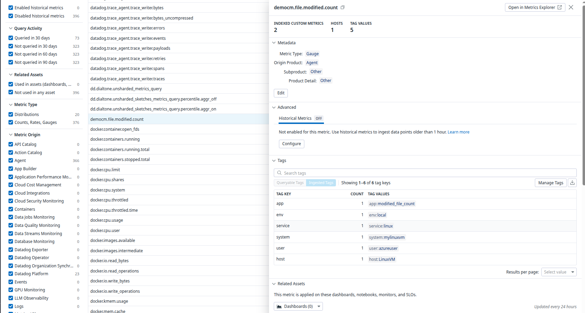
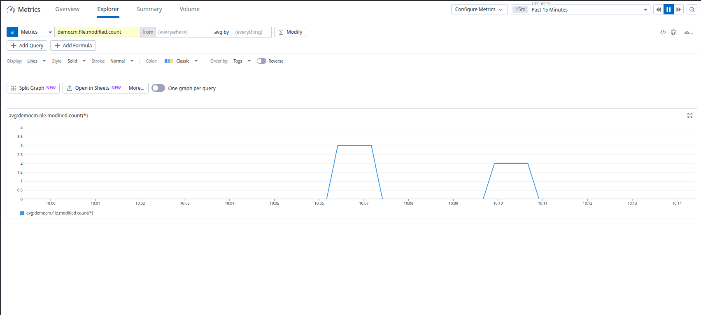
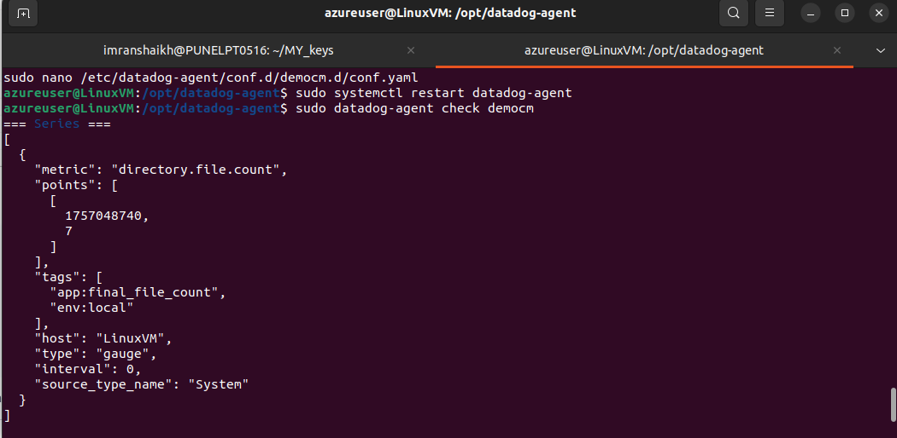
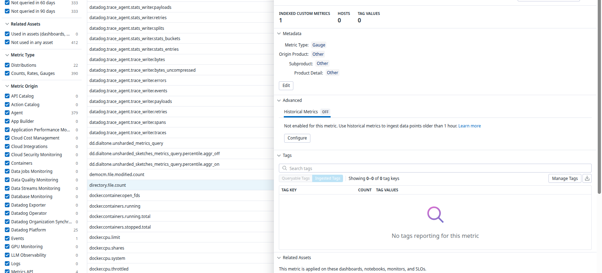
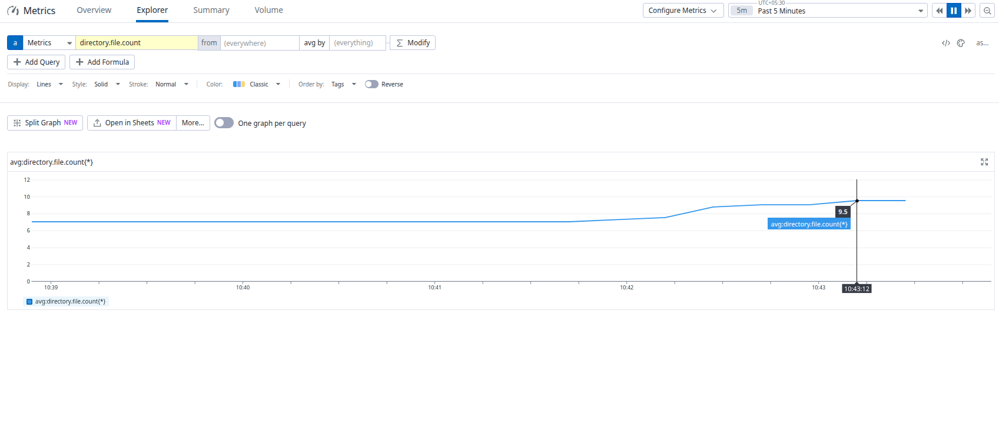
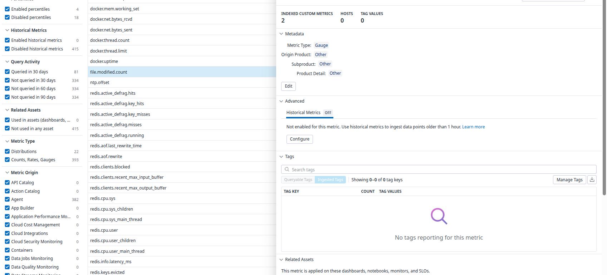
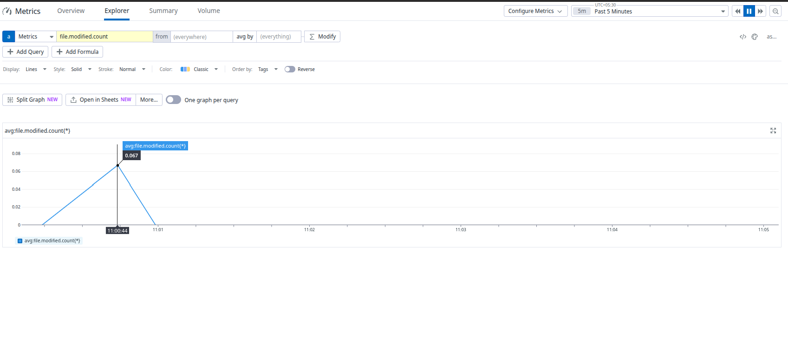
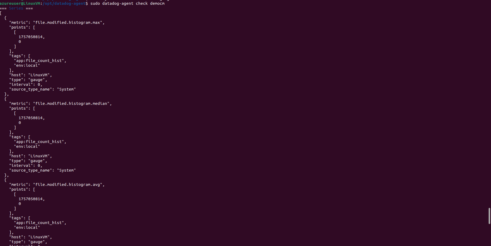
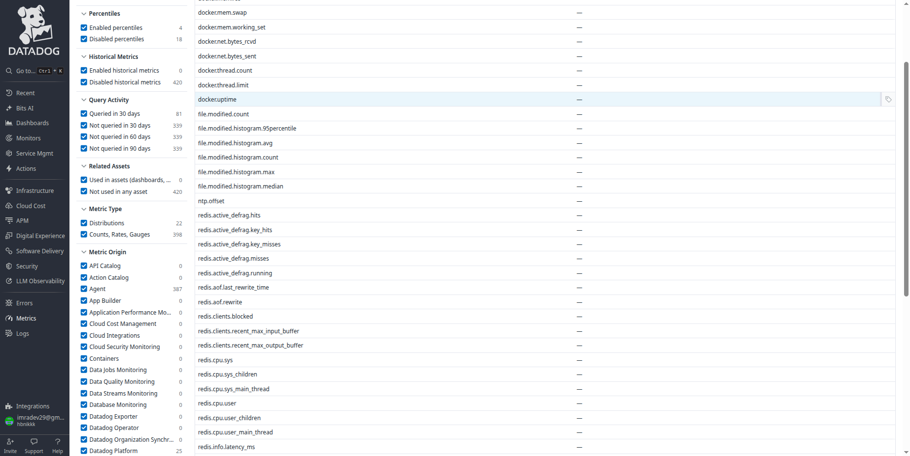

# DataDog Custom Metrics and Agent Checks

## Overview
DataDog Agent Checks allow you to create custom monitoring solutions by writing Python scripts that collect and submit metrics to DataDog. This guide covers implementing custom checks for different metric types including Gauge, Rate, and Histogram.

## Prerequisites
- DataDog Agent installed and configured
- Python knowledge for writing custom checks
- Understanding of DataDog metric types
- Appropriate file system permissions

## Directory Setup

First, create the test directory for our custom checks:

```bash
sudo mkdir -p /opt/datadog/test
sudo chown dd-agent:dd-agent /opt/datadog/test
sudo chmod 755 /opt/datadog/test
```

**Tip**: The Agent runs as user `dd-agent`. Group-read/execute permissions allow the check to list/read metadata.

## Custom Check Implementation

### 1. Gauge Metric Type - File Count Check

#### Write your custom check (Python)

Create the custom check file:

```bash
sudo tee /etc/datadog-agent/checks.d/democm.py >/dev/null <<'PY'
from datadog_checks.base import AgentCheck
import os
import time

__version__ = "1.0.0"

class DEMOCM(AgentCheck):
    def check(self, instance):
        # Read config from YAML
        dir_path = instance.get("directory", "/opt/datadog/test")
        lookback = int(instance.get("lookback_seconds", 60))
        tags = instance.get("tags", [])

        try:
            now = int(time.time())
            count = 0

            # Use mtime on Linux (true "last modified" time)
            for name in os.listdir(dir_path):
                full = os.path.join(dir_path, name)
                try:
                    if os.path.isfile(full):
                        if (now - int(os.path.getmtime(full))) < lookback:
                            count += 1
                except Exception:
                    # Log and skip any file we can't stat
                    self.log.exception("Failed to stat file: %s", full)

            # Report as a gauge (snapshot of current count)
            self.gauge("democm.file.modified.count", count, tags=tags)

        except FileNotFoundError:
            self.log.error("Directory not found: %s", dir_path)
            # Optional: emit a service check for visibility in UI
            self.service_check(
                "democm.directory.exists",
                self.CRITICAL,
                tags=tags + [f"directory:{dir_path}"],
                message=f"Directory not found: {dir_path}",
            )
        except Exception as e:
            self.log.exception("Unexpected error in DEMOCM check: %s", e)
PY
```

#### Set proper permissions:

```bash
sudo chown root:root /etc/datadog-agent/checks.d/democm.py
sudo chmod 644 /etc/datadog-agent/checks.d/democm.py
```

#### Add the check configuration (YAML)

Create the configuration directory and file:

```bash
sudo mkdir -p /etc/datadog-agent/conf.d/democm.d
sudo tee /etc/datadog-agent/conf.d/democm.d/conf.yaml >/dev/null <<'YAML'
init_config:

instances:
  - directory: "/opt/datadog/test"
    lookback_seconds: 60
    tags:
      - env:local
      - app:modified_file_count
    # Optional: reduce/increase run frequency (default ~15s)
    # min_collection_interval: 15
YAML
```

#### Set configuration permissions:

```bash
sudo chown -R root:root /etc/datadog-agent/conf.d/democm.d
sudo chmod 644 /etc/datadog-agent/conf.d/democm.d/conf.yaml
```

#### Reload & verify the check

```bash
sudo systemctl restart datadog-agent
# Run the check in the foreground to see output/errors
sudo datadog-agent check democm
```

You should see no errors, and the metric submitted.

#### Generate some test activity

Create/modify files and watch the metric change:

```bash
# Create two files "recently" modified
sudo bash -c 'echo hi > /opt/datadog/test/a.txt'
sudo bash -c 'echo hi > /opt/datadog/test/b.txt'

# Touch a file to update its mtime
sudo touch /opt/datadog/test/c.txt

# Re-run the check to see count reflect recent files
sudo datadog-agent check democm
```

#### Validate in Datadog

1. Go to **Metrics Explorer**
2. Search for metric: `democm.file.modified.count`
3. Group by your tags (e.g., env, app) if desired
4. Within a couple minutes, you'll see data points arrive

**Optional**: Service check for directory health
- The code emits a service check `democm.directory.exists` (CRITICAL if missing)
- Create a Monitor → Service Check on `democm.directory.exists` to alert when the directory disappears or permissions break



We can check in Metric Explorer the custom check:



## 2. Gauge Metric Type - Simple File Count

### Custom Check for GAUGE Metric Type

```python
from datadog_checks.base import AgentCheck
import os
import time

__version__ = "1.0.0"

class DEMOCM(AgentCheck):
    def check(self, instance):
        # Directory from YAML config, fallback to default
        dir_path = instance.get("directory", "/opt/datadog/test")
        tags = instance.get("tags", ["env:local", "app:final_file_count"])

        count = 0

        # Iterate directory
        try:
            for path in os.listdir(dir_path):
                full_path = os.path.join(dir_path, path)
                if os.path.isfile(full_path):
                    count += 1
        except FileNotFoundError:
            self.log.error("Directory not found: %s", dir_path)
        except Exception as e:
            self.log.exception("Error reading directory: %s", e)

        # Submit metric as a gauge (snapshot)
        self.gauge("directory.file.count", count, tags=tags)
```

### Configuration (YAML)

Create configuration file:

```bash
sudo tee /etc/datadog-agent/conf.d/democm.d/conf.yaml >/dev/null <<'YAML'
init_config:

instances:
  - directory: "/opt/datadog/test"
    tags:
      - env:local
      - app:final_file_count
    min_collection_interval: 15
YAML
```

This configuration tells the Agent to run every 15 seconds, count files, and submit as `directory.file.count`.

### Deploy Steps

1. **Place Python file**:
```bash
sudo nano /etc/datadog-agent/checks.d/democm.py
# paste the Python code above
```

2. **Place YAML config**:
```bash
sudo mkdir -p /etc/datadog-agent/conf.d/democm.d
sudo nano /etc/datadog-agent/conf.d/democm.d/conf.yaml
# paste the YAML configuration
```

3. **Restart the Agent**:
```bash
sudo systemctl restart datadog-agent
```

4. **Test run manually**:
```bash
sudo datadog-agent check democm
```

Expected output:
```json
"metric": "directory.file.count",
"points": [[<timestamp>, <count>]],
"type": "gauge"
```



### Testing the Gauge Metric

Create test files to verify the metric:

```bash
echo "file1" | sudo tee /opt/datadog/test/file1.txt
echo "file2" | sudo tee /opt/datadog/test/file2.txt
echo "file3" | sudo tee /opt/datadog/test/file3.txt
```



Directory file count in Metric Explorer:



## 3. Rate Metric Type - File Modification Rate

### Custom check for RATE Metric type

```python
from datadog_checks.base import AgentCheck
import os
import time

__version__ = "1.0.0"

class DEMOCM(AgentCheck):
    def check(self, instance):
        count = 0
        dir_path = instance.get("directory", "/opt/datadog/test")

        # Count files modified in the last 60 seconds
        try:
            for path in os.listdir(dir_path):
                full_path = os.path.join(dir_path, path)
                if os.path.isfile(full_path):
                    if int(time.time()) - int(os.path.getctime(full_path)) < 60:
                        count += 1
        except FileNotFoundError:
            self.log.error("Directory not found: %s", dir_path)
        except Exception as e:
            self.log.exception("Error scanning directory: %s", e)

        # Submit as a rate metric
        self.rate(
            "file.modified.count",
            count,
            tags=["env:local", "app:modified_file_rate"],
        )
```

### Configuration YAML

Create configuration file:

```bash
sudo tee /etc/datadog-agent/conf.d/democm.d/conf.yaml >/dev/null <<'YAML'
init_config:

instances:
  - directory: "/opt/datadog/test"
    min_collection_interval: 15
    tags:
      - env:local
      - app:modified_file_rate
YAML
```

### Deployment Steps

1. **Restart Agent**:
```bash
sudo systemctl restart datadog-agent
```

2. **Manually test**:
```bash
sudo datadog-agent check democm
```

Expected output:
```json
"metric": "file.modified.count",
"type": "rate",
"points": [[timestamp, value]]
```

3. **Verify in Datadog UI**: Navigate to Metrics → Summary → search `file.modified.count`

### Testing the Rate Metric

Add files to test the rate calculation:

```bash
echo "newfile1" | sudo tee /opt/datadog/test/filenew1.txt
echo "newfile2" | sudo tee /opt/datadog/test/filenew2.txt
echo "newfile3" | sudo tee /opt/datadog/test/filenew3.txt
```

Since files are "modified within last 60s", the metric will increase. DataDog calculates the rate per second of file creation/modification.





## 4. Histogram Metric Type - File Count Distribution

### Custom Check for Histogram Metric Type

```python
from datadog_checks.base import AgentCheck
import os
import time

__version__ = "1.0.0"

class DEMOCM(AgentCheck):
    def check(self, instance):
        count = 0
        dir_path = instance.get("directory", "/opt/datadog/test")

        try:
            for path in os.listdir(dir_path):
                full_path = os.path.join(dir_path, path)
                if os.path.isfile(full_path):
                    if int(time.time()) - int(os.path.getctime(full_path)) < 60:
                        count += 1
        except Exception as e:
            self.log.error("Error scanning directory: %s", e)

        # Submit histogram metric
        self.histogram(
            "file.modified.histogram",
            count,
            tags=["env:local", "app:file_count_hist"],
        )
```

### Configuration

Create configuration file:

```bash
sudo tee /etc/datadog-agent/conf.d/democm.d/conf.yaml >/dev/null <<'YAML'
init_config:

instances:
  - directory: "/opt/datadog/test"
    min_collection_interval: 15
    tags:
      - env:local
      - app:file_count_hist
YAML
```

### Testing Histogram

1. **Restart agent**:
```bash
sudo systemctl restart datadog-agent
```

2. **Manually run check**:
```bash
sudo datadog-agent check democm
```





## Best Practices

### Error Handling
- Always wrap file operations in try-catch blocks
- Log errors appropriately for debugging
- Implement graceful degradation when directories are missing

### Performance Considerations
- Use appropriate collection intervals to avoid overwhelming the system
- Limit directory scanning for large filesystems
- Consider using file system events instead of polling for real-time monitoring

### Security
- Run checks with minimal required permissions
- Validate input parameters from configuration
- Avoid exposing sensitive information in logs

### Monitoring
- Implement service checks for health monitoring
- Use appropriate metric types for different use cases
- Tag metrics consistently for better organization

## Troubleshooting

### Common Issues
1. **Permission denied**: Ensure dd-agent user has read access to monitored directories
2. **Import errors**: Verify DataDog agent installation and Python environment
3. **Configuration not loaded**: Check YAML syntax and file permissions
4. **Metrics not appearing**: Verify API key and network connectivity

### Debugging Commands
```bash
# Check agent status
sudo datadog-agent status

# Run specific check with verbose output
sudo datadog-agent check democm -v

# View agent logs
sudo tail -f /var/log/datadog/agent.log

# Validate configuration
sudo datadog-agent configcheck
```

## Conclusion

Custom DataDog agent checks provide powerful capabilities for monitoring specific application metrics and business KPIs. By understanding the different metric types and implementing proper error handling, you can create robust monitoring solutions tailored to your specific requirements.