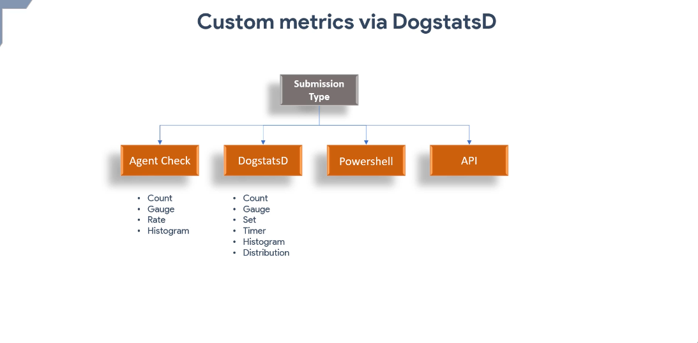
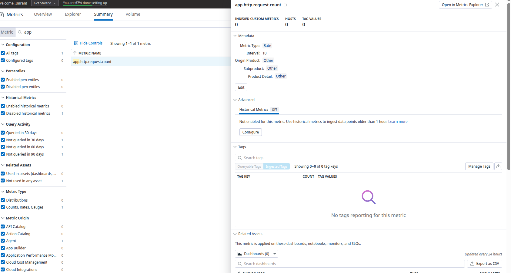
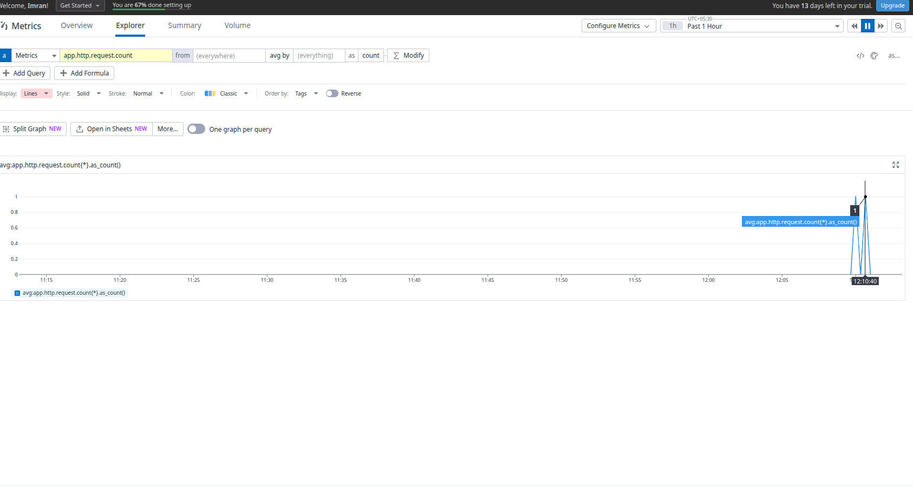
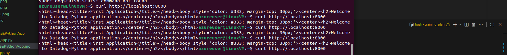
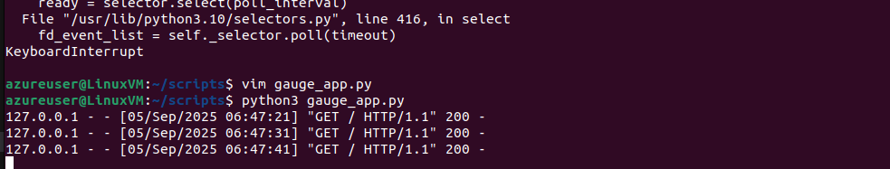
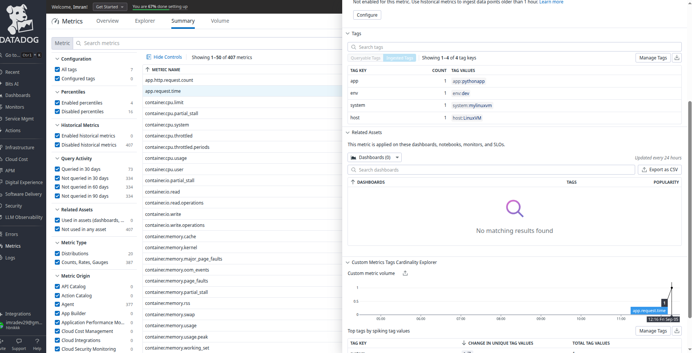
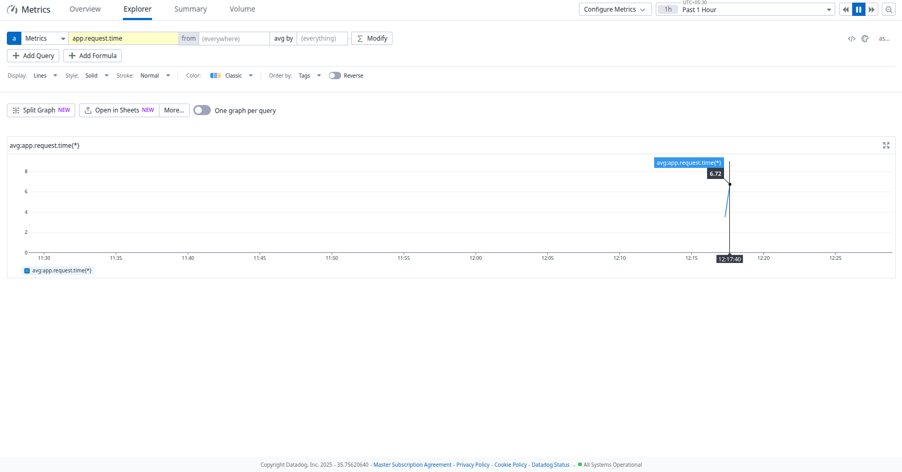

# DataDog Custom Metrics - DogStatsD & Python Application

## Overview
DogStatsD is a metrics aggregation service that comes bundled with the DataDog Agent. It implements the StatsD protocol and allows applications to send custom metrics to DataDog via UDP. This guide demonstrates how to instrument Python applications to send custom metrics using DogStatsD.



## Prerequisites and Setup

### Install Required Dependencies

Install pip utility and DataDog library:

```bash
sudo apt install python3-pip
pip3 install datadog
```

The DataDog library provides both StatsD client functionality and direct API access for sending metrics to DataDog.

## Implementation Examples

### 1. Count Metric Type - HTTP Request Counter

#### Instrument Python App for Count Metric

```python
import http.server
from datadog import initialize, statsd

APP_PORT = 8000

options = {'statsd_host':'localhost',
           'statsd_port':8125}

class HandleRequests(http.server.BaseHTTPRequestHandler):

    def do_GET(self):
        statsd.increment('app.http.request.count', sample_rate=1, tags =["env:dev" ,"app:pythonapp"])
        self.send_response(200)
        self.send_header("Content-type", "text/html")
        self.end_headers()
        self.wfile.write(bytes("<html><head><title>First Application</title></head><body style='color: #333; margin-top: 30px;'><center><h2>Welcome to Datadog-Python application.</center></h2></body></html>", "utf-8"))

if __name__ == "__main__":
    initialize(**options)
    server = http.server.HTTPServer(('localhost', APP_PORT), HandleRequests)
    server.serve_forever()
```

This creates an HTTP server with DataDog custom metrics via DogStatsD. Each GET request increments the `app.http.request.count` metric.

#### Testing the Count Metric

1. **Run your application**:
```bash
python3 boilerplate.py
```

2. **Send test requests**:
```bash
curl http://localhost:8000
curl http://localhost:8000
curl http://localhost:8000
```

3. **Verify metric collection locally**:
```bash
# Check DogStatsD metrics
sudo datadog-agent check dogstatsd

# Monitor agent logs
sudo tail -f /var/log/datadog/agent.log
```

You should see your metric being collected and forwarded to DataDog.

#### Additional Language Templates
For implementation in other programming languages, refer to: [DataDog DogStatsD Documentation](https://docs.datadoghq.com/metrics/custom_metrics/dogstatsd_metrics_submission/?code-lang=ruby&tab=python)

### 2. Gauge Metric Type - Application Response Time

#### Instrument Python App for Gauge Metric

```python
import http.server
from datadog import initialize, statsd
import time
import random

APP_PORT = 8000

options = {'statsd_host':'localhost',
           'statsd_port':8125}

class HandleRequests(http.server.BaseHTTPRequestHandler):

    def do_GET(self):
        start_time = time.time()
        wait_time = random.random() * 10
        time.sleep(wait_time)
        
        self.send_response(200)
        self.send_header("Content-type", "text/html")
        self.end_headers()
        self.wfile.write(bytes("<html><head><title>First Application</title></head><body style='color: #333; margin-top: 30px;'><center><h2>Welcome to Datadog-Python application.</center></h2></body></html>", "utf-8"))
        
        end_time = time.time()
        response_time = end_time - start_time
        statsd.gauge('app.request.time', response_time, sample_rate=1, tags =["env:dev" ,"app:pythonapp"])
        
if __name__ == "__main__":
    initialize(**options)
    server = http.server.HTTPServer(('localhost', APP_PORT), HandleRequests)
    server.serve_forever()
```

This implementation measures the actual response time of each request and sends it as a gauge metric to track current response time performance.

#### Viewing Metrics in DataDog UI

1. Navigate to **Metrics Explorer** in DataDog UI
2. Search for `app.http.request.count` or `app.request.time`
3. Group by tags (env, app) for better organization
4. Choose visualization type: Timeseries or Counter





#### Testing the Gauge Metric

Run the application and send requests to see response time variations:

```bash
python3 gauge_app.py
```

Send multiple requests to observe different response times:

```bash
for i in {1..10}; do curl http://localhost:8000; done
```









## Advanced Implementation Patterns

### 3. Enhanced Metrics with Error Tracking

```python
import http.server
from datadog import initialize, statsd
import time
import random
import json

APP_PORT = 8000

options = {'statsd_host':'localhost',
           'statsd_port':8125}

class HandleRequests(http.server.BaseHTTPRequestHandler):

    def do_GET(self):
        start_time = time.time()
        
        try:
            # Simulate random errors
            if random.random() < 0.1:  # 10% error rate
                statsd.increment('app.http.error.count', tags=["env:dev", "app:pythonapp", "error_type:random"])
                self.send_response(500)
                self.send_header("Content-type", "application/json")
                self.end_headers()
                self.wfile.write(bytes(json.dumps({"error": "Internal server error"}), "utf-8"))
            else:
                statsd.increment('app.http.success.count', tags=["env:dev", "app:pythonapp"])
                wait_time = random.random() * 2
                time.sleep(wait_time)
                
                self.send_response(200)
                self.send_header("Content-type", "text/html")
                self.end_headers()
                self.wfile.write(bytes("<html><head><title>Enhanced Application</title></head><body style='color: #333; margin-top: 30px;'><center><h2>Welcome to Enhanced Datadog-Python application.</center></h2></body></html>", "utf-8"))
                
        except Exception as e:
            statsd.increment('app.http.exception.count', tags=["env:dev", "app:pythonapp", "exception_type:unexpected"])
            self.send_response(500)
            
        finally:
            end_time = time.time()
            response_time = end_time - start_time
            statsd.gauge('app.request.duration', response_time, tags=["env:dev", "app:pythonapp"])
            statsd.histogram('app.request.duration.hist', response_time, tags=["env:dev", "app:pythonapp"])

if __name__ == "__main__":
    initialize(**options)
    server = http.server.HTTPServer(('localhost', APP_PORT), HandleRequests)
    print(f"Server running on http://localhost:{APP_PORT}")
    server.serve_forever()
```

### 4. Business Metrics Integration

```python
import http.server
from datadog import initialize, statsd
import time
import json
import uuid

APP_PORT = 8000

options = {'statsd_host':'localhost',
           'statsd_port':8125}

# Simulate user sessions
active_sessions = set()

class HandleRequests(http.server.BaseHTTPRequestHandler):

    def do_GET(self):
        # Track active users
        session_id = str(uuid.uuid4())
        active_sessions.add(session_id)
        
        # Business metrics
        statsd.gauge('app.active_sessions', len(active_sessions), tags=["env:dev", "app:pythonapp"])
        statsd.increment('app.page_views', tags=["env:dev", "app:pythonapp", "page:home"])
        
        # Performance metrics
        start_time = time.time()
        
        self.send_response(200)
        self.send_header("Content-type", "text/html")
        self.end_headers()
        
        response_html = f"""
        <html>
        <head><title>Business Metrics App</title></head>
        <body style='color: #333; margin-top: 30px;'>
            <center>
                <h2>Welcome to Business Metrics Application</h2>
                <p>Session ID: {session_id}</p>
                <p>Active Sessions: {len(active_sessions)}</p>
            </center>
        </body>
        </html>
        """
        
        self.wfile.write(bytes(response_html, "utf-8"))
        
        # Cleanup old sessions (simulate session timeout)
        if len(active_sessions) > 10:
            active_sessions.pop()
            
        end_time = time.time()
        response_time = end_time - start_time
        statsd.timing('app.response_time', response_time * 1000, tags=["env:dev", "app:pythonapp"])  # Convert to milliseconds

if __name__ == "__main__":
    initialize(**options)
    server = http.server.HTTPServer(('localhost', APP_PORT), HandleRequests)
    print(f"Business metrics server running on http://localhost:{APP_PORT}")
    server.serve_forever()
```

## Best Practices

### Metric Naming Conventions
- Use consistent prefixes: `app.`, `business.`, `infra.`
- Include units in names: `response_time_ms`, `memory_bytes`
- Use descriptive names: `user_login_attempts` vs `count1`

### Tagging Strategy
- **Environment**: `env:prod`, `env:staging`, `env:dev`
- **Service**: `service:web-api`, `service:database`
- **Version**: `version:1.2.3`
- **Feature**: `feature:checkout`, `feature:search`

### Performance Considerations
- Use appropriate sample rates for high-frequency metrics
- Batch metrics when possible to reduce network overhead
- Consider using buffering for high-throughput applications
- Monitor DogStatsD buffer sizes and adjust if needed

### Error Handling
```python
try:
    statsd.increment('app.operation.success')
    # Your application logic here
except Exception as e:
    statsd.increment('app.operation.error', tags=[f"error_type:{type(e).__name__}"])
    raise
```

## Monitoring and Alerting

### Creating Dashboards
1. Navigate to **Dashboards** in DataDog UI
2. Create widgets for your custom metrics
3. Use template variables for dynamic filtering
4. Set up appropriate time ranges and aggregations

### Setting Up Alerts
```json
{
  "name": "High Error Rate Alert",
  "query": "sum(last_5m):sum:app.http.error.count{*}.as_rate() > 0.1",
  "message": "Error rate is above 10% for the last 5 minutes",
  "tags": ["team:backend", "severity:high"],
  "options": {
    "thresholds": {
      "critical": 0.1,
      "warning": 0.05
    }
  }
}
```

## Troubleshooting

### Common Issues
1. **Metrics not appearing**: Check DogStatsD configuration and network connectivity
2. **High latency**: Verify UDP buffer sizes and network configuration
3. **Missing tags**: Ensure tags are properly formatted and not exceeding limits
4. **Incorrect aggregation**: Understand metric type behavior and choose appropriate aggregation

### Debugging Commands
```bash
# Check DogStatsD status
sudo datadog-agent status

# Monitor DogStatsD metrics
sudo datadog-agent check dogstatsd

# View detailed logs
sudo tail -f /var/log/datadog/dogstatsd.log

# Test UDP connectivity
echo "custom.metric:1|c" | nc -u -w1 localhost 8125
```

## Conclusion

DogStatsD provides a powerful and efficient way to send custom metrics from Python applications to DataDog. By implementing proper metric collection, following naming conventions, and using appropriate tagging strategies, you can build comprehensive monitoring solutions that provide valuable insights into application performance and business metrics.