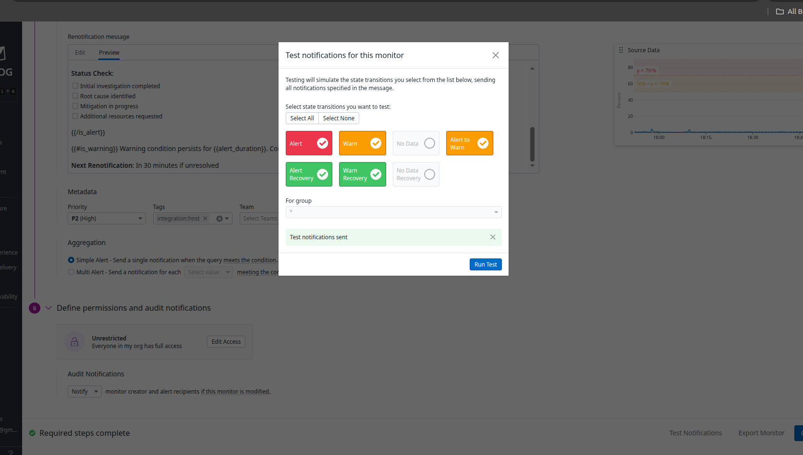
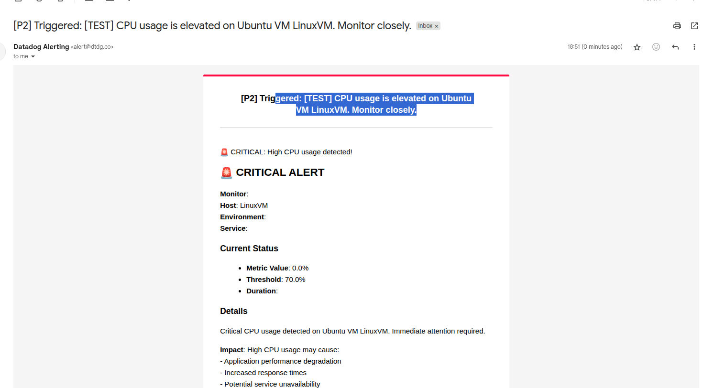
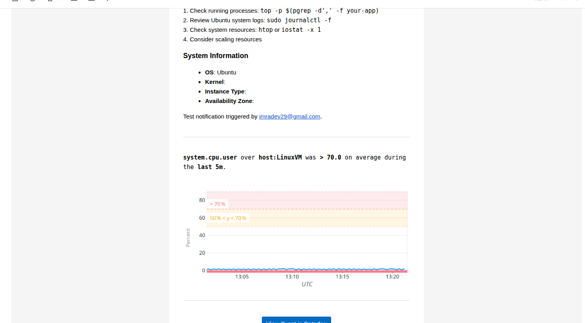
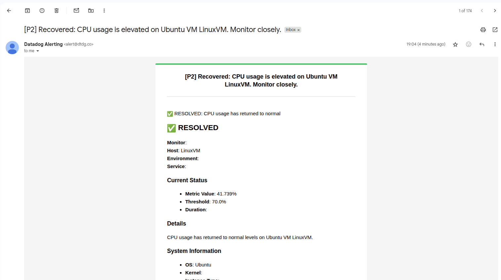

# DataDog Monitor and Alerts - Complete Guide

## Overview
This guide provides step-by-step instructions for creating and testing DataDog monitors and alerts for an Ubuntu VM with containers. We'll cover host monitoring, container monitoring, and comprehensive alerting scenarios.

**Reference**: [DataDog Monitor Types Documentation](https://docs.datadoghq.com/monitors/types/)

## Prerequisites
- DataDog Agent installed on Ubuntu VM
- Container runtime (Docker) with DataDog container monitoring enabled
- DataDog account with appropriate permissions

## 1. Create Host Monitor

### Host CPU Usage Monitor

**Step 1: Navigate to Monitors**
1. Go to DataDog UI → Monitors → New Monitor
2. Select "Metric" monitor type

**Step 2: Define the Metric**
```
Query: avg(last_5m):avg:system.cpu.user{host:ubuntu-vm} by {host}
```

**Step 3: Set Alert Conditions**
- **Alert threshold**: > 80
- **Warning threshold**: > 60
- **No data**: 10 minutes
- **Auto resolve**: Yes

**Step 4: Configure Evaluation**
```json
{
  "evaluation_delay": 60,
  "new_host_delay": 300,
  "require_full_window": false
}
```

### Host Memory Usage Monitor

```
Query: avg(last_5m):(avg:system.mem.used{host:ubuntu-vm} / avg:system.mem.total{host:ubuntu-vm}) * 100 by {host}
```

**Alert Conditions:**
- **Critical**: > 90%
- **Warning**: > 75%

### Host Disk Usage Monitor

```
Query: avg(last_5m):avg:system.disk.used_pct{host:ubuntu-vm,device:/dev/sda1} by {host,device}
```

**Alert Conditions:**
- **Critical**: > 85%
- **Warning**: > 70%

## 2. Tags, Template Variables, and Conditional Variables

### Tagging Strategy

**Host Tags:**
```bash
# Add tags to DataDog agent configuration on Ubuntu
# /etc/datadog-agent/datadog.yaml
tags:
  - env:production
  - team:infrastructure
  - service:web-server
  - region:us-east-1
  - criticality:high
  - os:ubuntu
  - platform:linux
```

**Container Tags:**
```bash
# Docker container with labels
docker run -d \
  --label com.datadoghq.ad.tags='["env:prod","service:webapp","version:1.2.3"]' \
  --name webapp \
  nginx:latest
```

### Template Variables in Monitors

**Multi-Alert Monitor with Template Variables:**
```
Query: avg(last_5m):avg:system.cpu.user{env:production} by {host,env}
```

**Template Variables Usage:**
- `{{host.name}}` - Host name
- `{{env}}` - Environment tag
- `{{service}}` - Service tag
- `{{value}}` - Current metric value
- `{{threshold}}` - Alert threshold

### Conditional Variables

**Conditional Logic in Notifications:**
```
{{#is_alert}}
🚨 CRITICAL: High CPU usage detected!
{{/is_alert}}

{{#is_warning}}
⚠️ WARNING: CPU usage is elevated
{{/is_warning}}

{{#is_recovery}}
✅ RESOLVED: CPU usage has returned to normal
{{/is_recovery}}
```

## 3. Draft Notification Message

### Primary Notification Template

```markdown
## {{#is_alert}}🚨 CRITICAL ALERT{{/is_alert}}{{#is_warning}}⚠️ WARNING{{/is_warning}}{{#is_recovery}}✅ RESOLVED{{/is_recovery}}

**Monitor**: {{monitor_name}}
**Host**: {{host.name}}
**Environment**: {{env}}
**Service**: {{service}}

### Current Status
- **Metric Value**: {{value}}%
- **Threshold**: {{threshold}}%
- **Duration**: {{last_triggered_ts_ago}}

### Details
{{#is_alert}}
Critical CPU usage detected on Ubuntu VM {{host.name}}. Immediate attention required.

**Impact**: High CPU usage may cause:
- Application performance degradation
- Increased response times
- Potential service unavailability

**Immediate Actions**:
1. Check running processes: `top -p $(pgrep -d',' -f your-app)`
2. Review Ubuntu system logs: `sudo journalctl -f`
3. Check system resources: `htop` or `iostat -x 1`
4. Consider scaling resources
{{/is_alert}}

{{#is_warning}}
CPU usage is elevated on Ubuntu VM {{host.name}}. Monitor closely.

**Recommended Actions**:
1. Monitor system performance: `vmstat 1`
2. Check for resource-intensive processes: `ps aux --sort=-%cpu | head -10`
3. Review Ubuntu system status: `systemctl status`
4. Prepare for potential scaling
{{/is_warning}}

{{#is_recovery}}
CPU usage has returned to normal levels on Ubuntu VM {{host.name}}.
{{/is_recovery}}

### System Information
- **OS**: Ubuntu {{host.os}}
- **Kernel**: {{host.kernel}}
- **Instance Type**: {{host.instance-type}}
- **Availability Zone**: {{host.availability-zone}}

**Runbook**: https://wiki.company.com/runbooks/high-cpu-usage
**Dashboard**: https://app.datadoghq.com/dashboard/abc-123

@slack-alerts-channel @pagerduty-infrastructure
```

## 4. Draft Renotification Message

### Renotification Template

```markdown
## 🔄 REMINDER: {{monitor_name}} - Still {{monitor_state}}

**Duration**: This alert has been active for {{alert_duration}}

### Current Status
- **Host**: {{host.name}}
- **Current Value**: {{value}}%
- **Threshold**: {{threshold}}%
- **First Triggered**: {{first_triggered_ts}}

### Escalation Required
{{#is_alert}}
This critical alert requires immediate attention. The issue persists after {{alert_duration}}.

**Escalation Actions**:
1. Page on-call engineer: @pagerduty-escalation
2. Notify team lead: @team-lead
3. Consider emergency scaling procedures

**Status Check**:
- [ ] Initial investigation completed
- [ ] Root cause identified
- [ ] Mitigation in progress
- [ ] Additional resources requested
{{/is_alert}}

{{#is_warning}}
Warning condition persists for {{alert_duration}}. Consider proactive measures.
{{/is_warning}}

**Next Renotification**: In 30 minutes if unresolved

@slack-alerts-channel @on-call-engineer
```
Test Notification Tested



Recivered Alert


## 5. EVAL Function Examples

### Complex Evaluation Functions

**CPU and Memory Combined Alert:**
```
Query: avg(last_5m):avg:system.cpu.user{host:ubuntu-vm} by {host} > 80 AND avg(last_5m):(avg:system.mem.used{host:ubuntu-vm} / avg:system.mem.total{host:ubuntu-vm}) * 100 by {host} > 85
```

**Rate of Change Detection:**
```
Query: avg(last_10m):rate(avg:system.cpu.user{host:ubuntu-vm}) > 0.1
```

**Anomaly Detection:**
```
Query: avg(last_4h):anomalies(avg:system.cpu.user{host:ubuntu-vm} by {host}, 'basic', 2, direction='above', alert_window='last_15m', interval=60, count_default_zero='true') >= 1
```

**Forecast Alert:**
```
Query: avg(last_4h):forecast(avg:system.disk.used_pct{host:ubuntu-vm}, 'linear', 1, interval=3600, history='1w', model='default', seasonality='weekly') > 90
```

### Container-Specific EVAL Functions

**Container CPU Throttling:**
```
Query: avg(last_5m):avg:docker.cpu.throttled{container_name:webapp} by {container_name} > 0.1
```

**Container Memory Usage:**
```
Query: avg(last_5m):(avg:docker.mem.usage{container_name:webapp} / avg:docker.mem.limit{container_name:webapp}) * 100 by {container_name} > 80
```

**Container Restart Detection:**
```
Query: sum(last_5m):diff(max:docker.containers.running{image_name:nginx} by {container_name}) < 0
```

## 6. Trigger Monitor and Test Notification

### Testing Host Monitors

**Test CPU Alert:**
```bash
# Install stress tool on Ubuntu
sudo apt update && sudo apt install -y stress

# Generate CPU load to trigger alert
stress --cpu 4 --timeout 300s

# Monitor CPU usage on Ubuntu
watch -n 1 'cat /proc/loadavg'
# Alternative: htop (install with: sudo apt install htop)
```

**Test Memory Alert:**
```bash
# Generate memory pressure on Ubuntu
stress --vm 2 --vm-bytes 1G --timeout 300s

# Monitor memory usage on Ubuntu
watch -n 1 'free -h'
# Alternative: cat /proc/meminfo | grep -E 'MemTotal|MemFree|MemAvailable'
```

**Test Disk Alert:**
```bash
# Create large file to fill disk on Ubuntu
dd if=/dev/zero of=/tmp/largefile bs=1M count=1000

# Monitor disk usage on Ubuntu
watch -n 1 'df -h'
# Check specific partition: df -h /
# Check inode usage: df -i
```

### Testing Container Monitors

**Test Container CPU Alert:**
```bash
# Run CPU-intensive container
docker run --name cpu-test --rm -d alpine sh -c "while true; do :; done"

# Monitor container stats
docker stats cpu-test
```

**Test Container Memory Alert:**
```bash
# Run memory-intensive container
docker run --name mem-test --memory=100m --rm -d alpine sh -c "
  dd if=/dev/zero of=/dev/shm/fill bs=1M count=150
"
```

**Test Container Restart:**
```bash
# Force container restart
docker restart webapp

# Monitor container events
docker events --filter container=webapp
```

### Notification Testing

**Test Notification Channels:**
```bash
# Test webhook notification
curl -X POST https://hooks.slack.com/services/YOUR/SLACK/WEBHOOK \
  -H 'Content-type: application/json' \
  --data '{"text":"Test DataDog alert notification"}'

# Test email notification on Ubuntu (install mailutils first)
sudo apt install mailutils
echo "Test alert email" | mail -s "DataDog Test Alert" admin@company.com
```

## 7. Manage Monitor View

### Monitor Management Dashboard

**Monitor States:**
- **OK**: All conditions are met
- **Alert**: Critical threshold breached
- **Warning**: Warning threshold breached
- **No Data**: No data received within specified timeframe

**Monitor Actions:**
```bash
# Using DataDog API to manage monitors
# Get all monitors
curl -X GET "https://api.datadoghq.com/api/v1/monitor" \
  -H "DD-API-KEY: ${DD_API_KEY}" \
  -H "DD-APPLICATION-KEY: ${DD_APP_KEY}"

# Mute monitor
curl -X POST "https://api.datadoghq.com/api/v1/monitor/12345/mute" \
  -H "DD-API-KEY: ${DD_API_KEY}" \
  -H "DD-APPLICATION-KEY: ${DD_APP_KEY}"

# Unmute monitor
curl -X POST "https://api.datadoghq.com/api/v1/monitor/12345/unmute" \
  -H "DD-API-KEY: ${DD_API_KEY}" \
  -H "DD-APPLICATION-KEY: ${DD_APP_KEY}"
```

### Monitor Organization

**Monitor Tags for Organization:**
```json
{
  "tags": [
    "team:infrastructure",
    "service:web-server",
    "priority:high",
    "type:host-monitor",
    "environment:production",
    "os:ubuntu"
  ]
}
```

**Monitor Groups:**
- **Critical Infrastructure**: CPU, Memory, Disk
- **Application Performance**: Response time, Error rate
- **Container Health**: Container restarts, Resource usage
- **Business Metrics**: User sessions, Transaction volume

## 8. Downtime Management

### Scheduled Downtime

**Create Maintenance Downtime:**
```json
{
  "message": "Scheduled maintenance for Ubuntu server upgrades",
  "start": 1640995200,
  "end": 1641002400,
  "timezone": "UTC",
  "scope": ["host:ubuntu-vm"],
  "monitor_tags": ["service:web-server"],
  "recurrence": {
    "type": "weeks",
    "period": 1,
    "week_days": ["Sat"],
    "until_date": 1672531200
  }
}
```

**Emergency Downtime:**
```bash
# Create immediate downtime via API
curl -X POST "https://api.datadoghq.com/api/v1/downtime" \
  -H "Content-Type: application/json" \
  -H "DD-API-KEY: ${DD_API_KEY}" \
  -H "DD-APPLICATION-KEY: ${DD_APP_KEY}" \
  -d '{
    "message": "Emergency maintenance - investigating high CPU on Ubuntu VM",
    "start": '$(date +%s)',
    "end": '$(date -d "+2 hours" +%s)',
    "scope": ["host:ubuntu-vm"]
  }'
```

### Downtime Scenarios

**Deployment Downtime:**
```json
{
  "message": "Application deployment in progress on Ubuntu VM",
  "start": 1640995200,
  "end": 1640998800,
  "scope": ["service:webapp"],
  "monitor_tags": ["type:application"]
}
```

**Infrastructure Maintenance:**
```json
{
  "message": "Ubuntu system updates and maintenance window",
  "start": 1641002400,
  "end": 1641006000,
  "scope": ["service:database"],
  "monitor_tags": ["team:database"]
}
```

### Downtime Management Commands

```bash
# List active downtimes
curl -X GET "https://api.datadoghq.com/api/v1/downtime" \
  -H "DD-API-KEY: ${DD_API_KEY}" \
  -H "DD-APPLICATION-KEY: ${DD_APP_KEY}"

# Cancel downtime
curl -X DELETE "https://api.datadoghq.com/api/v1/downtime/12345" \
  -H "DD-API-KEY: ${DD_API_KEY}" \
  -H "DD-APPLICATION-KEY: ${DD_APP_KEY}"

# Update downtime
curl -X PUT "https://api.datadoghq.com/api/v1/downtime/12345" \
  -H "Content-Type: application/json" \
  -H "DD-API-KEY: ${DD_API_KEY}" \
  -H "DD-APPLICATION-KEY: ${DD_APP_KEY}" \
  -d '{
    "message": "Extended maintenance window for Ubuntu VM",
    "end": '$(date -d "+4 hours" +%s)'
  }'
```

## Complete Testing Workflow

### End-to-End Testing Procedure

1. **Setup Phase:**
```bash
# Ensure DataDog agent is running on Ubuntu
sudo systemctl status datadog-agent

# Verify container monitoring
docker ps
sudo datadog-agent check docker
```

2. **Create Monitors:**
```bash
# Create monitors via UI or API
# Test each monitor type systematically
```

3. **Generate Test Conditions:**
```bash
# CPU stress test on Ubuntu
stress --cpu $(nproc) --timeout 300s &

# Memory stress test on Ubuntu
stress --vm 2 --vm-bytes 512M --timeout 300s &

# Container stress test
docker run --rm -d --name stress-test alpine sh -c "while true; do :; done"
```

4. **Verify Notifications:**
```bash
# Check notification channels
# Verify message formatting
# Test escalation procedures
```

5. **Test Recovery:**
```bash
# Stop stress tests
pkill stress
docker stop stress-test

# Verify recovery notifications
```

6. **Downtime Testing:**
```bash
# Create test downtime
# Verify alerts are suppressed
# Test downtime cancellation
```

## Best Practices

### Monitor Configuration
- Use appropriate evaluation windows
- Set realistic thresholds based on baseline metrics
- Include context in notification messages
- Test monitors regularly

### Notification Management
- Use template variables for dynamic content
- Include runbook links and troubleshooting steps
- Set up proper escalation chains
- Avoid notification fatigue

### Downtime Planning
- Schedule maintenance windows during low-traffic periods
- Communicate downtime schedules to stakeholders
- Use recurring downtimes for regular maintenance
- Monitor downtime effectiveness

This comprehensive guide provides all the necessary components for implementing robust monitoring and alerting in DataDog for your Ubuntu VM and container environment.