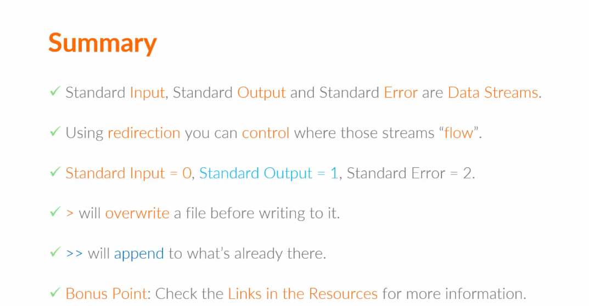

cal
sudo apt install ncal -y\

echo Hello
Hello

echo echoooooooo
echoooooooo
cal 2017
cal -y
date
echo "blablabla"
history
!1753
exit

understanding Command Structure:
commondNAme options inputs
echo $PATH
which cal >> /usr/bin/cal
which echo >> /usr/bin/echo
which which /usr/bin/echo
date  >> Thu Aug 14 03:51:03 PM IST 2025
cal 12 2017
cal 2017
echo "Hello"
hello

date
Thu Aug 14 03:53:13 PM IST 2025
date -u
Thu Aug 14 10:22:41 AM UTC 2025

date -abcde
date: invalid option -- 'a'
Try 'date --help' for more information.

 Date
Command 'Date' not found, did you mean:
  command 'gate' from snap gate (9.3)
  command 'kate' from snap kate (25.04.3)
  command 'kate' from deb kate (4:21.12.3-0ubuntu1)
  command 'late' from deb late (0.1.0-14)
  command 'date' from deb coreutils (8.32-4.1ubuntu1.2)
See 'snap info <snapname>' for additional versions.
imranshaikh@PUNELPT0516:~/Training_plan$ dAte
Command 'dAte' not found, did you mean:
  command 'dte' from deb dte (1.10-1)
  command 'date' from deb coreutils (8.32-4.1ubuntu1.2)
Try: sudo apt install <deb name>

 cal -A 1 12 2017
   December 2017          January 2018      
Su Mo Tu We Th Fr Sa  Su Mo Tu We Th Fr Sa  
                1  2      1  2  3  4  5  6  
 3  4  5  6  7  8  9   7  8  9 10 11 12 13  
10 11 12 13 14 15 16  14 15 16 17 18 19 20  
17 18 19 20 21 22 23  21 22 23 24 25 26 27  
24 25 26 27 28 29 30  28 29 30 31           
31       

Using LINUX Manual Part1
Using LINUX Manual Part2

man -k which

imranshaikh@PUNELPT0516:~/Training_plan$ man -k which
cpupower-frequency-set (1) - A small tool which allows to modify cpufreq settings.
git-sparse-checkout (1) - Initialize and modify the sparse-checkout configuration, which reduces the checkout to a set of pa...
ifcfg (8)            - simplistic script which replaces ifconfig IP management
IO::AtomicFile (3pm) - write a file which is updated atomically
lcf (1)              - Determine which of the historical versions of a config is installed
pam_exec (8)         - PAM module which calls an external command
pam_warn (8)         - PAM module which logs all PAM items if called
securetty (5)        - list of terminals on which root is allowed to login
sol (6)              - a collection of card games which are easy to play with the aid of a mouse.
URI::WithBase (3pm)  - URIs which remember their base
which (1)            - locate a command
which.debianutils (1) - locate a command

man 1 whcih
man 6 sol

 which date cal
/usr/bin/date
/usr/bin/cal

man which
which [-a] <SOMETHING>
which [-a | -f] fileneame ...

Linux Manual Part3

man -k "list directory contents"
dir (1)              - list directory contents
ls (1)               - list directory contents
ntfsls (8)           - list directory contents on an NTFS filesystem
vdir (1)             - list directory contents

man ls
 ls -l --human-readable 
total 4.0K
drwxrwxr-x 4 imranshaikh imranshaikh 4.0K Aug 14 14:59 Linux

cd 
man cd
help cd

COMMOND Input and Output

date

redirection Part1 standard output

cat 1> output.txt
Linux is Amazing
^C
imranshaikh@PUNELPT0516:~/Training_plan/Linux/Day_1/Commands$ cat output.txt 
Linux is Amazing
imranshaikh@PUNELPT0516:~/Training_plan/Linux/Day_1/Commands$ 

cat 1>> output.txt
Meow
Hie
^C
imranshaikh@PUNELPT0516:~/Training_plan/Linux/Day_1/Commands$ cat output.txt 
wow!!
Meow
Hie

cat -k bla
cat: invalid option -- 'k'
Try 'cat --help' for more information.
imranshaikh@PUNELPT0516:~/Training_plan/Linux/Day_1/Commands$ cat -k bla 2> error.txt
imranshaikh@PUNELPT0516:~/Training_plan/Linux/Day_1/Commands$ cat error.txt 
cat: invalid option -- 'k'
Try 'cat --help' for more information.

cat -k bla 2>> error.txt
imranshaikh@PUNELPT0516:~/Training_plan/Linux/Day_1/Commands$ cat -k bla 2>> error.txt
imranshaikh@PUNELPT0516:~/Training_plan/Linux/Day_1/Commands$ cat -k bla 2>> error.txt
imranshaikh@PUNELPT0516:~/Training_plan/Linux/Day_1/Commands$ cat -k bla 2>> error.txt
imranshaikh@PUNELPT0516:~/Training_plan/Linux/Day_1/Commands$ cat error.txt 
cat: invalid option -- 'k'
Try 'cat --help' for more information.
cat: invalid option -- 'k'
Try 'cat --help' for more information.
cat: invalid option -- 'k'
Try 'cat --help' for more information.
cat: invalid option -- 'k'
Try 'cat --help' for more information.
cat: invalid option -- 'k'
Try 'cat --help' for more information.

cat > input.txt
Hello World!!
^C
^C
imranshaikh@PUNELPT0516:~/Training_plan/Linux/Day_1/Commands$ cat < input.txt
Hello World!!

cat 0< input.txt 1> hello.txt
imranshaikh@PUNELPT0516:~/Training_plan/Linux/Day_1/Commands$ cat hello.txt 
Hello World!!

